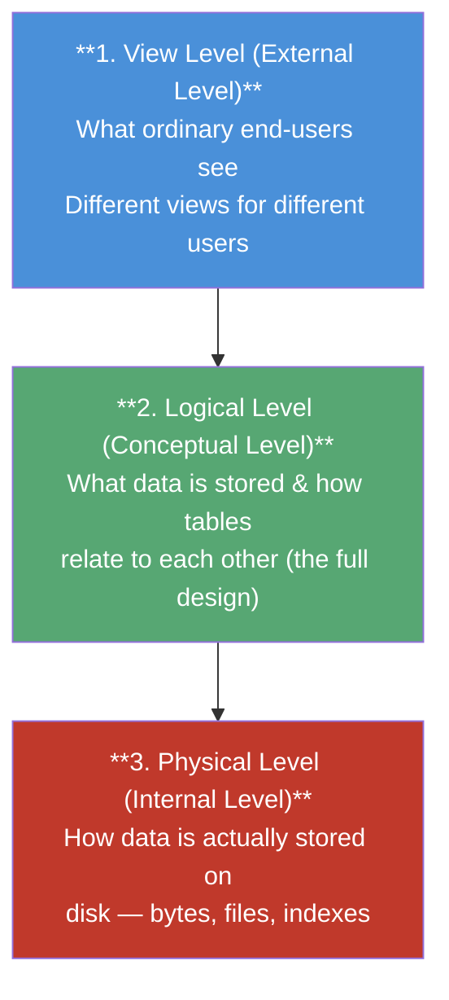
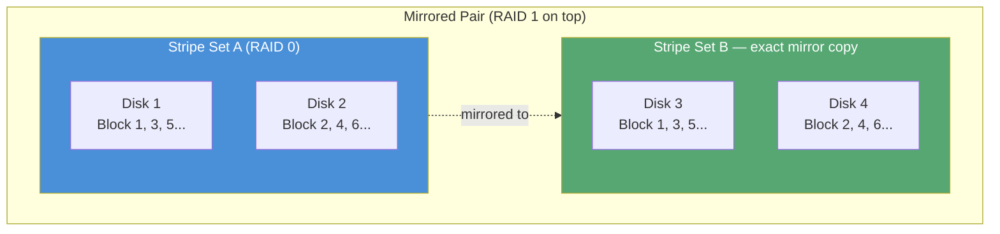
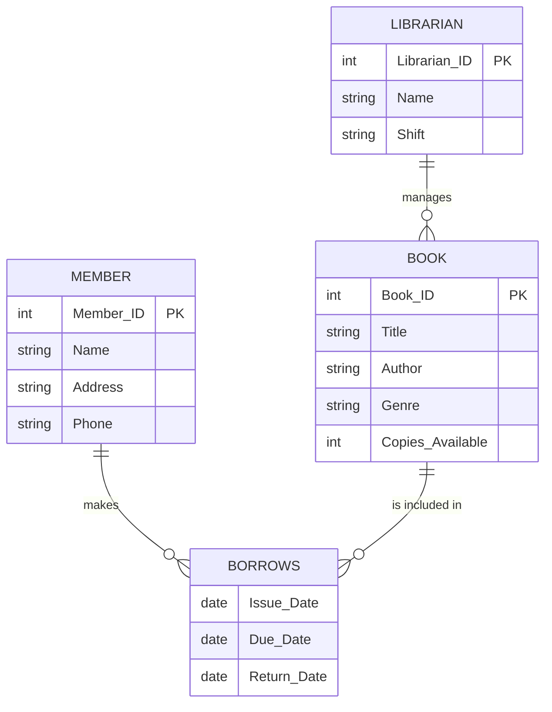
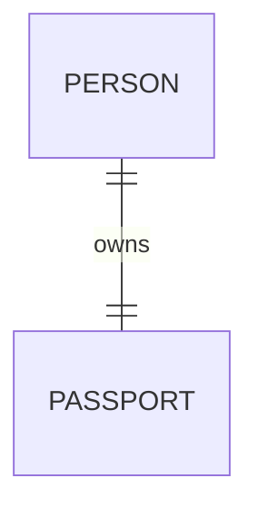
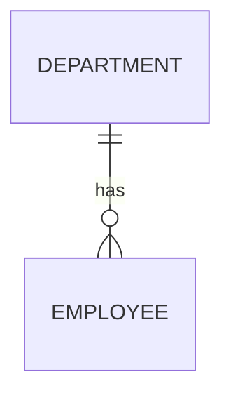
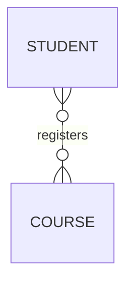
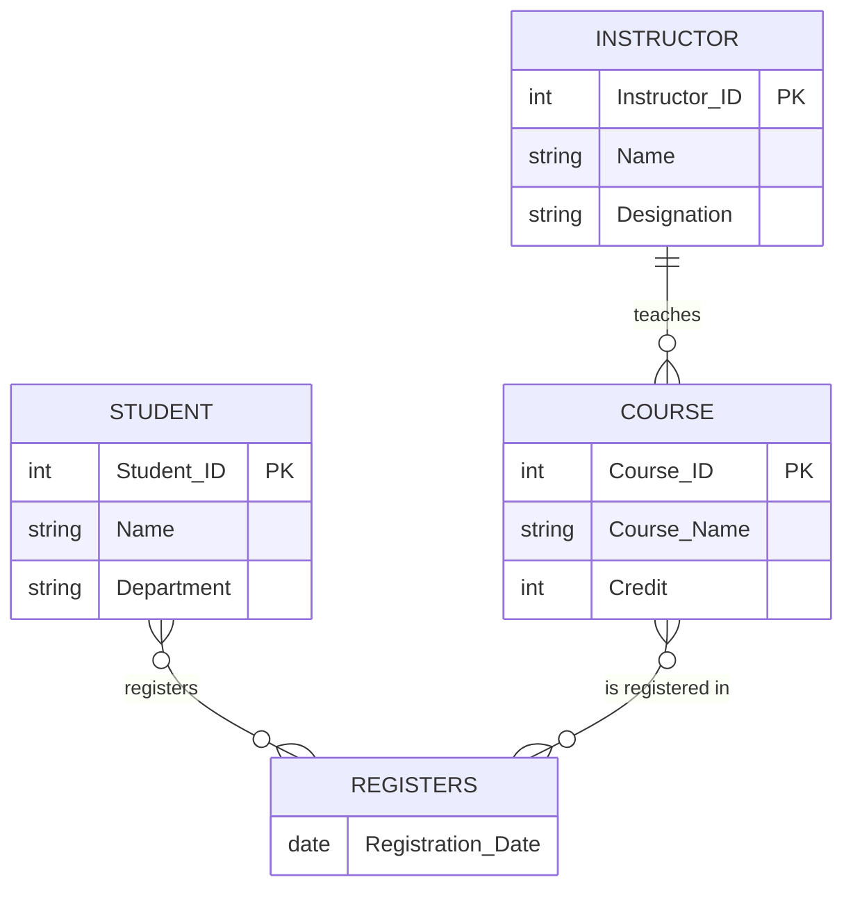
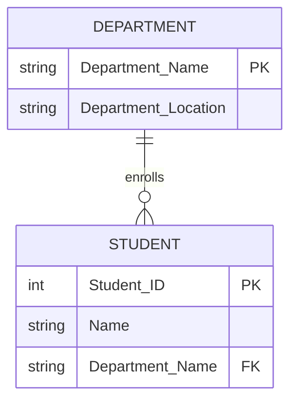
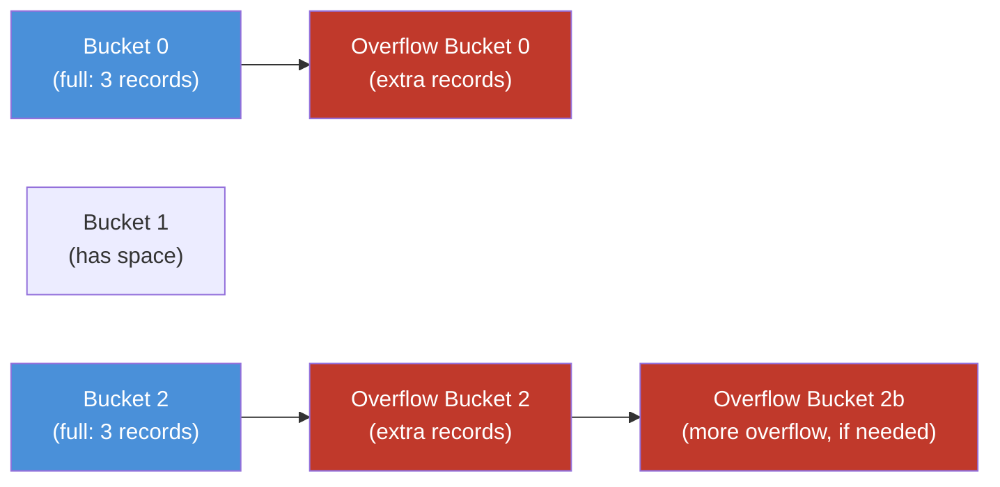
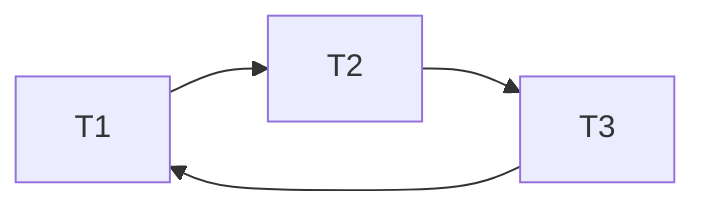

# Theory (CSE 2203) — 1st Batch

**Section:** [Theory](../README.md) · **Part:** [Part 0 — Final Year Question and Answer](../../README.md)

**Chandpur Science and Technology University (CSTU)**
Department of Computer Science and Engineering
B.Sc. Engineering 2nd Year 2nd Semester Final Examination, 2023
**Course Code:** CSE 2203 · **Course Title:** Database Management System
**Time:** 3 Hours · **Full Marks:** 210

> **Instructions on the paper:** (i) Figures in the right margin indicate full marks allotted to each question. (ii) Symbols and abbreviations bear their standard meaning. (iii) Use a separate answer script for each SECTION.

> ✅ **Progress note:** All eight questions (Section A: Q1–Q4, Section B: Q5–Q8) are now fully solved below in the simplest possible language.

---

## SECTION – A (Marks: 105)
*(Answer any three (03) questions from this section)*

---

## Question 1

### 1(a) Define data, database system, and database management system. `[06]`

**Answer (in the simplest words):**

Think of these three terms as three steps going from "raw" to "organized" to "the tool that manages it":

1. **Data** — Data is just a **raw fact or number by itself**, with no meaning attached yet. For example: `21`, `"Dhaka"`, `"Sibli"` are all data. Alone, they don't tell you a full story.
2. **Database** — A database is a **collection of related data, stored together in an organized way** on a computer, so that it can be easily used, searched, and updated later. Example: a file that keeps every student's ID, Name, Address, and Phone number together in one organized table is a database.
3. **Database System** — A database system is the **complete package**: the database (the actual stored data) + the software that manages it (DBMS) + the users + the hardware — all working together so people can safely store and use data.
4. **DBMS (Database Management System)** — A DBMS is the **software** that sits between the user and the raw data files. It lets users **create, insert, search, update, delete, and protect** data, without needing to know how the data is physically stored on disk.

> 💡 **Easy analogy:** If a *database* is a library full of books (organized data), the *DBMS* is the librarian (software) who manages, finds, and protects the books for you, and the whole *database system* is the entire library building — shelves, librarian, catalog computer, and visitors — working together.

---

### 1(b) "All primary keys are candidate keys, whereas all candidate keys are not primary keys." Justify this statement with a suitable example. `[09]`

**Answer:**

First, let's understand the two words simply:

- **Candidate Key** — Any column (or smallest group of columns) in a table that can **uniquely identify every row** all by itself, with no unnecessary extra column. A table can have **more than one** candidate key.
- **Primary Key** — Out of all the candidate keys available, the database designer **picks exactly ONE** to officially be the main identifier of the table. That chosen one is called the primary key.

**Why the statement is TRUE, explained in two halves:**

1. **"All primary keys are candidate keys"** → True, because before a column can even be *considered* for becoming the primary key, it must first pass the test of uniquely identifying each row — which is exactly the definition of a candidate key. So the primary key is always picked *from* the pool of candidate keys. It never comes from outside that pool.
2. **"All candidate keys are not primary keys"** → Also True, because a table is allowed to have *multiple* candidate keys, but only **one of them gets the job title "Primary Key."** The remaining candidate key(s) don't disappear — they still uniquely identify rows, but they are now simply called **Alternate Keys**.

**Example — a Student table:**

| Student_ID | Email | Roll_No | Name |
|---|---|---|---|
| 101 | rahim@stu.edu | CSE-01 | Rahim |
| 102 | karim@stu.edu | CSE-02 | Karim |
| 103 | salma@stu.edu | CSE-03 | Salma |

Here, look at three columns: `Student_ID`, `Email`, and `Roll_No`. Every single one of them has **no repeated value** — each one, alone, can uniquely point to exactly one row. So all three qualify as **candidate keys**.

Now the designer picks **`Student_ID`** to be the **Primary Key** (maybe because it's short and auto-generated). `Email` and `Roll_No` are still perfectly capable of identifying rows uniquely, but since they were **not chosen**, they are now called **Alternate Keys** — proving that a candidate key does not have to be a primary key.

> 💡 **One-line memory trick:** *Primary Key ⊂ Candidate Keys.* Primary key is always a candidate key, but a candidate key becomes "primary" only when it is chosen.

---

### 1(c) Explain the levels of abstraction in the database management system. `[10]`

**Answer:**

"Abstraction" simply means **hiding the complicated details and only showing what is necessary** for each type of user. A DBMS is built in **3 levels**, like 3 floors of a building, each hiding more detail than the one above it:



1. **Physical Level (lowest level)** — This describes **how the data is really stored** on the hard disk: as bytes, blocks, files, and index structures. This is the most detailed and most complicated level. Only database engineers/administrators deal with this.
2. **Logical Level (middle level)** — This describes **what data is stored in the database and what relationships exist** among that data — for example: "there is a Student table with columns ID, Name, Department" and "Students are linked to Courses." Database designers and administrators work at this level. Users at this level don't need to know how data is stored on disk.
3. **View Level (highest level, closest to the user)** — This is **what ordinary end-users actually see** on their screen — often only a small part of the whole database, and it can be different for different types of users. For example, a student login only sees their own grades, while an admin sees everyone's grades.

> 💡 **Easy analogy:** Think of driving a car.
> - **View level** = the steering wheel, pedals, and dashboard — the only things a driver needs to see and use.
> - **Logical level** = knowing the car has an engine, four wheels, a fuel tank, and how they are connected — this is what a mechanic understands.
> - **Physical level** = the actual metal parts, wiring, and bolts inside the engine — the deepest detail, only an engine designer deals with this.
>
> Each level **hides** the complexity of the level below it — that's exactly what "levels of data abstraction" means.

---

### 1(d) Find the super key, primary key, candidate key, composite key, and alternate key in the following table. `[10]`

**Given Table:**

| ID | Name | Address | Phone |
|---|---|---|---|
| 1 | Sibli | Khulna | 01842 |
| 2 | Naim | Dhaka | 09832 |
| 3 | Saon | Khulna | 09811 |
| 4 | Mim | Chandpur | 01533 |
| 5 | Sibli | Dhaka | 01735 |

**Step 1 — Check which single column(s) have NO repeated values (this decides candidate keys):**

- `ID` → 1, 2, 3, 4, 5 → all different → ✅ unique
- `Name` → Sibli, Naim, Saon, Mim, **Sibli** → "Sibli" repeats (row 1 and row 5) → ❌ NOT unique alone
- `Address` → Khulna, Dhaka, **Khulna**, Chandpur, **Dhaka** → repeats → ❌ NOT unique alone
- `Phone` → 01842, 09832, 09811, 01533, 01735 → all different → ✅ unique

**Step 2 — Answer for each type of key:**

| Key Type | Meaning (in one line) | Answer for this table |
|---|---|---|
| **Candidate Key** | Any minimal column(set) that uniquely identifies every row | `{ID}` and `{Phone}` — both are unique alone, so both qualify |
| **Primary Key** | The ONE candidate key chosen as the main identifier | `{ID}` (chosen because it's the simplest, standard identifier) |
| **Alternate Key** | Candidate key(s) that were NOT chosen as primary | `{Phone}` (it could have been primary, but wasn't picked) |
| **Composite Key** | A key made of **two or more columns together** (not one column alone) that becomes unique only when combined | `{Name, Address}` — Name alone repeats, Address alone repeats, but the *pair* (Sibli, Khulna), (Naim, Dhaka), (Saon, Khulna), (Mim, Chandpur), (Sibli, Dhaka) are all different combinations, so together they uniquely identify each row |
| **Super Key** | Any column or set of columns that uniquely identifies rows — **even with extra, unnecessary columns added** | Every set that *contains* `ID` or `Phone`, e.g., `{ID}`, `{Phone}`, `{ID, Name}`, `{ID, Address}`, `{Phone, Name}`, `{ID, Name, Address, Phone}`, etc. (there are many super keys, but only `{ID}` and `{Phone}` are the *minimal* ones — i.e., the candidate keys) |

> 💡 **Easy way to remember the relationship between all 5 terms:**
>
> **Super Key** (any unique combo, even with junk columns) → shrink it down to the smallest possible unique combo → that's a **Candidate Key** → pick ONE candidate key to be official → that's the **Primary Key** → the leftover, unpicked candidate key(s) → **Alternate Key(s)** → and if a candidate key needed *more than one column* to become unique → that's called a **Composite Key**.

---

## Question 2

### 2(a) Distinguish between prime and non-prime attribute. `[04]`

**Answer:**

| | Prime Attribute | Non-Prime Attribute |
|---|---|---|
| **Meaning** | An attribute (column) that is part of **at least one candidate key** | An attribute that is **not part of any** candidate key |
| **Example** | In `Student(Student_ID, Email, Name, Address)` — if `Student_ID` and `Email` are both candidate keys, then both are **prime** | `Name` and `Address` are **non-prime** — they just describe the row but don't identify it |
| **Why it matters** | Used to check higher normal forms (2NF, 3NF) — normal forms are about how non-prime attributes depend on keys | Non-prime attributes must depend on the **whole** candidate key, not just part of it (this is what 2NF checks) |

> 💡 **One-line memory trick:** Prime = "part of a key." Non-prime = "just extra descriptive info."

---

### 2(b) Different RAID levels offer various combinations of redundancy and performance benefits. Explain RAID-01 with an appropriate figure. `[08]`

**Answer:**

**RAID** (Redundant Array of Independent Disks) means using **multiple physical disks together** so that data is either faster to access, safer from disk failure, or both.

**RAID-01** (also written RAID 0+1) combines two techniques in layers:

1. **Striping (RAID 0)** — data is split into small chunks and spread across several disks, so reads/writes happen in parallel → **faster performance**.
2. **Mirroring (RAID 1)** — every disk (or in this case, every striped set) has an exact duplicate copy on another set of disks → **safety/redundancy**.

In RAID-01, we **first stripe, then mirror the whole striped set**. So it is a "mirror of stripes."



**Simple explanation:** Data is first broken into pieces and spread (striped) across Disk 1 and Disk 2 for speed. Then that **entire striped set** is copied (mirrored) onto Disk 3 and Disk 4 for safety.

- **Advantage:** Very fast (because of striping) and safe (because of mirroring).
- **Disadvantage:** Very expensive — you need **double** the disks just to store one copy of usable data (only 50% storage efficiency), and if one disk fails in a stripe set, that whole stripe set becomes unusable until rebuilt from the mirror.

---

### 2(c) Design an ER Diagram for a library management system. Identify entities, attributes, relationships, and cardinality. `[10]`

**Answer:**

**Step 1 — Identify the Entities (the "things" we track):**

- **Book** — attributes: `Book_ID (PK)`, `Title`, `Author`, `Genre`, `Copies_Available`
- **Member** — attributes: `Member_ID (PK)`, `Name`, `Address`, `Phone`
- **Librarian** — attributes: `Librarian_ID (PK)`, `Name`, `Shift`

**Step 2 — Identify the Relationships and their Cardinality:**

- **Member "Borrows" Book** → **Many-to-Many (M:N)** — one member can borrow many books over time, and one book (title) can be borrowed by many different members over time. This relationship carries its own attributes: `Issue_Date`, `Due_Date`, `Return_Date`.
- **Librarian "Manages" Book** → **One-to-Many (1:N)** — one librarian can manage/handle many books, but (in this simple design) each book record is managed under one librarian at a time.

**Step 3 — Diagram:**



> 💡 **Easy explanation:** A `Member` and a `Book` are connected through the `Borrows` relationship — since one member can borrow many books, and one book can be borrowed by many members (at different times), this is a **Many-to-Many** relationship. A `Librarian` manages many `Book` records, which is a **One-to-Many** relationship.

---

### 2(d) Consider the relation scheme R(E, F, G, H, I, J, K, L, M, N) and the set of functional dependencies: {E,F}→{G}, {F}→{I,J}, {E,H}→{K,L}, {K}→{M}, and {L}→{N}. Find the candidate key. `[13]`

**Answer:**

**Step 1 — Find attributes that never appear on the right-hand side of any FD.** These attributes **must** be part of every candidate key, because there is no other way to ever "produce" them from other attributes.

- Right-hand-side attributes across all FDs: `{G, I, J, K, L, M, N}`
- So attributes **E, F, H** never appear on the right side → **E, F, H must be in every candidate key.**

**Step 2 — Test if `{E, F, H}` is already a super key** (i.e., does its closure cover *all* 10 attributes?)

$$\{E,F,H\}^+ \text{ calculation, step by step:}$$

| Step | Apply FD | New attributes added | Closure so far |
|---|---|---|---|
| Start | — | — | `{E, F, H}` |
| 1 | `{E,F} → {G}` | `G` | `{E, F, H, G}` |
| 2 | `{F} → {I, J}` | `I, J` | `{E, F, H, G, I, J}` |
| 3 | `{E,H} → {K, L}` | `K, L` | `{E, F, H, G, I, J, K, L}` |
| 4 | `{K} → {M}` | `M` | `{E, F, H, G, I, J, K, L, M}` |
| 5 | `{L} → {N}` | `N` | `{E, F, G, H, I, J, K, L, M, N}` ✅ all 10 attributes! |

Since `{E,F,H}⁺` = every attribute of R, **`{E, F, H}` is a super key.**

**Step 3 — Check minimality** (removing any one attribute must break the closure, or else it's not a *candidate* key):

- Without `E`: `{F,H}⁺` = `{F, H, I, J}` → does **not** reach all attributes → `E` is necessary.
- Without `F`: `{E,H}⁺` = `{E, H, K, L, M, N}` → does **not** reach all attributes → `F` is necessary.
- Without `H`: `{E,F}⁺` = `{E, F, G, I, J}` → does **not** reach all attributes → `H` is necessary.

Since removing any single attribute breaks it, `{E, F, H}` is **minimal**.

**✅ Final Answer:** The only **Candidate Key** of R is **`{E, F, H}`**.

---

## Question 3

### 3(a) Distinguish between natural join and inner join. `[04]`

**Answer:**

| | Natural Join | Inner Join |
|---|---|---|
| **How columns are matched** | Automatically matches columns with the **same name** in both tables | You must **explicitly specify** the matching condition (`ON` clause) |
| **Duplicate columns** | The common column appears **only once** in the result | Common columns can appear **twice** (once from each table) unless you select specific columns |
| **Control** | Less control — you can't choose which column to match on if names differ | Full control — you decide exactly which columns/condition to join on |
| **SQL Example** | `SELECT * FROM Employee NATURAL JOIN Department;` | `SELECT * FROM Employee INNER JOIN Department ON Employee.Dept_ID = Department.Dept_ID;` |

> 💡 **Simple rule:** Natural Join = "automatic matching by same column name." Inner Join = "you tell it exactly how to match."

---

### 3(b) Discuss insert and update anomaly with appropriate examples. `[10]`

**Answer:**

Anomalies are **problems that happen because of bad table design** (usually when data is not properly normalized and the same fact is repeated in many rows).

**1. Insert Anomaly** — You are **unable to insert** a piece of data because some *other*, unrelated piece of data is not yet available.

*Example:* Table `Course_Instructor(Course_ID, Course_Name, Instructor_ID, Instructor_Name)`.
If a **new course** is created but **no instructor has been assigned yet**, we cannot insert the course's row at all — because `Instructor_ID`/`Instructor_Name` would have to be left blank, even though they have nothing to do with the course details themselves. The design *forces* unrelated facts to travel together.

**2. Update Anomaly** — The same fact is **stored in multiple rows**, so updating it means you must change it **everywhere it appears** — if you miss even one row, the data becomes inconsistent.

*Example:* Same table `Course_Instructor`. If Instructor "Dr. Karim" teaches 5 different courses, his name appears in 5 rows. If Dr. Karim's name is corrected (say, spelling fix), someone must update **all 5 rows**. If even one row is missed, the table now shows two different names for the same instructor — an inconsistency.

> 💡 **Root cause:** Both anomalies happen because of **redundancy** — the same fact stored in more than one place. This is exactly why we **normalize** tables (split them into smaller, well-designed tables) — the topic covered in Part 3 of this repository.

---

### 3(c) Consider the relation scheme R(A, B, C, D, E, H) and the set of functional dependencies: A→B, C→D, AD→E, E→H. Determine the normal form. `[12]`

**Answer:**

**Step 1 — Find the Candidate Key.**

RHS attributes across all FDs = `{B, D, E, H}`. Attributes never on the right side: **A, C** → both must be part of every candidate key.

Check closure of `{A, C}`:

| Step | Apply FD | New attributes | Closure so far |
|---|---|---|---|
| Start | — | — | `{A, C}` |
| 1 | `A → B` | `B` | `{A, B, C}` |
| 2 | `C → D` | `D` | `{A, B, C, D}` |
| 3 | `AD → E` (both A, D present) | `E` | `{A, B, C, D, E}` |
| 4 | `E → H` | `H` | `{A, B, C, D, E, H}` ✅ all 6 attributes! |

`{A, C}` covers all attributes and is minimal (removing `A` gives `{C}⁺={C,D}` only; removing `C` gives `{A}⁺={A,B}` only) → **Candidate Key = `{A, C}`.**

**Step 2 — Check Normal Forms one by one:**

- **1NF:** Assuming all attribute values are atomic (single, indivisible values) → ✅ satisfies 1NF.
- **2NF check (no partial dependency allowed):** A partial dependency means a **non-prime attribute depends on only PART of a composite candidate key.** Our candidate key is `{A, C}` (composite — two columns). Now look at `A → B`: here `B` (non-prime) depends on just `A`, which is only **part** of the key `{A,C}` — this is a **partial dependency**! Similarly, `C → D`: `D` depends on just `C`, again only part of the key. **❌ 2NF is violated.**

**✅ Final Answer:** Since 2NF itself is already violated (because of the partial dependencies `A → B` and `C → D`), the relation **R is only in 1NF** (it does not reach 2NF, 3NF, or BCNF).

> 💡 **Why this matters:** To fix this, we would split R into smaller tables — e.g., `R1(A, B)`, `R2(C, D)`, `R3(A, D, E, H)` — so that every non-key attribute depends on the *whole* key of its own table. This process is called **normalization**.

---

### 3(d) Consider the following SQL schema: `Employee(E_ID, Name, Department)`, `EmpSalary(S_ID, EmpPosition, Salary, E_ID)`. Write a relational algebra query for the following. `[09]`

**Answer:**

**i. Find the employee's information who works in the CSE department:**

$$\sigma_{\text{Department = 'CSE'}}(Employee)$$

*In simple words:* From the `Employee` table, **select (σ)** only the rows where `Department` equals `'CSE'`.

**ii. Find the employee's information who holds the position of assistant professor:**

$$\pi_{\,E\_ID,\ Name,\ Department}\Big(\sigma_{\text{EmpPosition = 'Assistant Professor'}}\big(Employee \Join EmpSalary\big)\Big)$$

*In simple words:* First **join (⋈)** `Employee` and `EmpSalary` on `E_ID` (to connect each employee to their position), then **select (σ)** only rows where `EmpPosition = 'Assistant Professor'`, then **project (π)** just the employee's info columns.

**iii. Find all employees whose salary is between 50000 and 60000:**

$$\pi_{\,E\_ID,\ Name,\ Department}\Big(\sigma_{\text{Salary} \geq 50000 \ \text{AND} \ \text{Salary} \leq 60000}\big(Employee \Join EmpSalary\big)\Big)$$

*In simple words:* Join the two tables on `E_ID`, **select (σ)** rows where `Salary` is between 50000 and 60000 (inclusive), then **project (π)** the employee's info.

> 💡 **Symbol reminder:** σ (sigma) = "select rows that match a condition." π (pi) = "project/keep only certain columns." ⋈ (join) = "combine two tables using a common column."

---

## Question 4

### 4(a) "Functional dependency is the generalization of the super key." Justify the statement. `[08]`

**Answer:**

- A **super key** is a special case: it says *"this whole set of columns → all other columns of the table."* In other words, a super key is really just a **functional dependency where the left-hand side is a set of columns and the right-hand side is literally every other attribute in the relation.**
- A **functional dependency (FD)**, in general, is a much broader idea: `X → Y` simply means *"knowing the value of X tells you the value of Y"* — and `X` and `Y` can be **any** subset of attributes, not necessarily "all remaining attributes."

So every super key relationship (`Key → all other attributes`) is really just **one specific example** of a functional dependency. This is why we say **FD is the generalization (the bigger, broader concept)**, and a super key is a **special/particular case** of an FD.

**Example:** In `Student(Student_ID, Name, Department)`:
- `Student_ID → Name, Department` is a functional dependency where the LHS (`Student_ID`) determines **all** other attributes → so this FD also makes `Student_ID` a **super key**.
- But an FD like `Name → Department` (if it held) would just be a regular FD — it does not need to determine *all* attributes, so it wouldn't necessarily make `Name` a super key.

> 💡 **One-line memory trick:** All super keys are functional dependencies (of a special "determines everything" kind), but not all functional dependencies are super keys. This is exactly why FD is called the **generalization** of the super key concept.

---

### 4(b) Given Employee and Department tables, write an SQL query using a JOIN to retrieve the names of all employees and their department names. Explain how the join works. `[09]`

**Given Tables:**

**Employee:** `(Emp_ID, Name, Dept_ID)` → rows: `(1, Alice, 10)`, `(2, Bob, 20)`
**Department:** `(Dept_ID, Dept_Name)` → rows: `(10, HR)`, `(20, Engineering)`

**SQL Query:**

```sql
SELECT Employee.Name, Department.Dept_Name
FROM Employee
INNER JOIN Department
  ON Employee.Dept_ID = Department.Dept_ID;
```

**Expected Result:**

| Name | Dept_Name |
|---|---|
| Alice | HR |
| Bob | Engineering |

**How the join works, step by step (in simple words):**

1. SQL looks at **every row in `Employee`** and tries to find a matching row in `Department`.
2. A "match" happens **only when** `Employee.Dept_ID` equals `Department.Dept_ID` (the condition after `ON`).
3. For Alice, `Dept_ID = 10` → matches Department row `(10, HR)` → combined row shows Alice + HR.
4. For Bob, `Dept_ID = 20` → matches Department row `(20, Engineering)` → combined row shows Bob + Engineering.
5. Finally, the `SELECT` clause picks out only the two columns we want to see: `Name` and `Dept_Name`.

> 💡 **Easy analogy:** Think of it like matching students to their classrooms using a "Room Number" tag — the JOIN walks through each student, finds the classroom with the same Room Number, and pairs them together in the result.

---

### 4(c) What is a view in SQL? Write the syntax to create a view and mention two use cases. `[08]`

**Answer:**

A **view** is like a **saved, virtual table** — it does not store data of its own; instead, it stores a **SQL query**, and every time you use the view, that query runs "behind the scenes" and shows you the result as if it were a table.

**Syntax to create a view:**

```sql
CREATE VIEW view_name AS
SELECT column1, column2, ...
FROM table_name
WHERE condition;
```

**Example:**

```sql
CREATE VIEW CSE_Employees AS
SELECT E_ID, Name
FROM Employee
WHERE Department = 'CSE';
```

Now anyone can simply run `SELECT * FROM CSE_Employees;` instead of typing the full query every time.

**Two use cases of views:**

1. **Security / Hiding sensitive columns** — A view can show only certain columns (e.g., `Name`, `Department`) while hiding sensitive ones (e.g., `Salary`), so different users only see what they're allowed to see.
2. **Simplifying complex queries** — If a report always needs a complicated join across 3–4 tables, you can save that join as a view once, and afterward everyone just queries the view with a simple `SELECT`, instead of retyping the complex join every time.

> 💡 **Easy analogy:** A view is like a "saved search" — it doesn't store new data, it just remembers *how* to fetch and shape the data you asked for.

---

### 4(d) Write a trigger that automatically sets the Status column in an Orders table to 'Pending' whenever a new order is inserted. `[10]`

**Answer:**

A **trigger** is a small piece of code that the database **runs automatically** whenever a certain event happens (like an `INSERT`, `UPDATE`, or `DELETE`) — no one has to call it manually.

**SQL Trigger:**

```sql
CREATE TRIGGER set_order_status
BEFORE INSERT ON Orders
FOR EACH ROW
BEGIN
    SET NEW.Status = 'Pending';
END;
```

**How it works, in simple words:**

1. `BEFORE INSERT ON Orders` — means this trigger fires **right before** a new row is actually saved into the `Orders` table.
2. `FOR EACH ROW` — means it applies to **every single new row** being inserted (not just once for the whole batch).
3. `SET NEW.Status = 'Pending'` — `NEW` refers to the **incoming new row**. This line forces its `Status` column to always be `'Pending'`, **overriding** whatever value (or no value) the user tried to insert.
4. Result: every time someone inserts a new order — even if they forget to set a status, or try to set a wrong one — the database will always save it as `'Pending'` automatically.

> 💡 **Easy analogy:** A trigger is like an automatic stamp machine — every new order that comes in automatically gets stamped "Pending" before it's filed away, with no human needing to do it by hand.

---

## SECTION – B (Marks: 105)
*(Answer any three (03) questions from this section)*

## Question 5

### 5(a) Explain the concept of mapping cardinalities in the E-R model. Illustrate One-to-One, One-to-Many, and Many-to-Many. `[09]`

**Answer:**

**Mapping cardinality** simply describes **"how many" instances of one entity can be connected to "how many" instances of another entity** through a relationship.

**i. One-to-One (1:1)** — One record in Entity A is connected to **at most one** record in Entity B, and vice versa.

*Example:* One `Person` has exactly one `Passport`, and one `Passport` belongs to exactly one `Person`.



**ii. One-to-Many (1:N)** — One record in Entity A can be connected to **many** records in Entity B, but each record in B connects back to only **one** record in A.

*Example:* One `Department` has many `Employees`, but each `Employee` belongs to only one `Department`.



**iii. Many-to-Many (M:N)** — Many records in Entity A can connect to many records in Entity B, and vice versa.

*Example:* One `Student` can register for many `Courses`, and one `Course` can have many `Students` registered.



> 💡 **Easy way to remember:** Look at *both* directions of the arrow: "how many B's can one A have?" and "how many A's can one B have?" If both answers are "only 1" → it's 1:1. If one side is "many" and the other is "1" → it's 1:N. If both sides are "many" → it's M:N.

---

### 5(b) Design an E-R diagram for a university system with entities Student, Course, Instructor, and relationships "Student registers for Course" and "Instructor teaches Course." Include primary keys and cardinalities. `[10]`

**Answer:**

**Entities and Primary Keys:**

- `Student(Student_ID [PK], Name, Department)`
- `Course(Course_ID [PK], Course_Name, Credit)`
- `Instructor(Instructor_ID [PK], Name, Designation)`

**Relationships and Cardinalities:**

- **Student "Registers for" Course** → **Many-to-Many (M:N)** — a student can register for many courses, and a course can have many students registered.
- **Instructor "Teaches" Course** → **One-to-Many (1:N)** — one instructor can teach many courses, but (typically) each course section is taught by one instructor.



> 💡 **Simple explanation:** Since a student can take many courses and a course can have many students, "Registers for" is **M:N**. Since one instructor usually teaches multiple courses, but each course (section) has one instructor, "Teaches" is **1:N**.

---

### 5(c) Analyse the given E-R diagram fragment. Identify redundancy and suggest normalization by removing unnecessary attributes. `[16]`

**Given:**
- **Entity: Student** — Attributes: `Student_ID`, `Name`, `Department_Name`, `Department_Location`
- **Entity: Department** — Attributes: `Department_Name [PK]`, `Department_Location`

**Answer:**

**Step 1 — Identify the redundancy:**

Look closely: `Department_Name` and `Department_Location` appear **twice** — once correctly as attributes of the `Department` entity, and again **incorrectly copied into** the `Student` entity. This is a classic case of **redundant (repeated) data**: the same department information is stored once per student, even though it really belongs to the `Department` entity alone.

**Why this is a problem:**

- **Update anomaly:** If a department's location changes (e.g., it moves to a new building), you would have to update it in **every single student's row** that belongs to that department — miss one, and now the data disagrees with itself.
- **Wasted storage:** The same department name/location is repeated for every student in that department, instead of being stored just once.
- **Insert anomaly:** You can't record a new department's location until at least one student is enrolled in it, since the location is only stored via student rows.

**Step 2 — Suggested Fix (Normalization):**

Remove `Department_Name` and `Department_Location` as *direct attributes* of `Student`. Instead, keep only a **foreign key reference** (`Department_Name`) in `Student` that **points to** the `Department` entity, where the full department details (including `Department_Location`) are stored **only once**.

**Corrected Design:**

- **Student** `(Student_ID [PK], Name, Department_Name [FK → Department])`
- **Department** `(Department_Name [PK], Department_Location)`



> 💡 **Easy rule to remember:** If a fact (like a department's location) **describes the department itself and not the student**, it should live **only** in the `Department` entity, and the `Student` entity should just **reference** it using the department's key (foreign key) — never copy the whole fact again.

---

## Question 6

### 6(a) Discuss clustering index and non-clustering index. Provide one example scenario where a clustering index is beneficial. `[10]`

**Answer:**

An **index** is like the index/table-of-contents at the back of a book — it helps the database **find rows faster** without scanning the entire table.

**Clustering Index:**
- The **actual data rows** of the table are **physically sorted and stored** on disk in the same order as the index key.
- Because the data itself is arranged in this order, a table can have **only ONE** clustering index (you can't physically sort the same data in two different orders at once).

**Non-Clustering Index (Secondary Index):**
- A **separate structure** that stores the index key **plus a pointer** to where the actual row is stored — the real data rows are **not** re-arranged or sorted.
- A table can have **MANY** non-clustering indexes, since each one is just a separate lookup structure pointing back to the real data.

| | Clustering Index | Non-Clustering Index |
|---|---|---|
| Data order on disk | Physically sorted to match the index | Data stays in its original order |
| How many per table | Only 1 | Many |
| Speed for range queries | Very fast (data is already sorted) | Slower (needs to jump around using pointers) |

**Example scenario where a clustering index is beneficial:**

Imagine an `Orders` table, and a very common query is: *"show me all orders placed between January and March, sorted by Order_Date."* If we create a **clustering index on `Order_Date`**, the database physically stores all rows sorted by date — so this range query can read the rows in one smooth sequential sweep on disk, instead of jumping all around. This makes **range queries** (queries with `BETWEEN`, `>`, `<`) much faster.

---

### 6(b) Explain B+ tree indexing with an insertion example. Show the structure of the B+ tree after inserting the keys: 10, 20, 5, 6, 12, 30, 7. `[12]`

**Answer:**

A **B+ tree** is a balanced, sorted tree structure used for indexing, with two special properties:

- **Only leaf nodes hold the actual data pointers** — internal nodes just hold "signpost" keys to guide the search.
- **All leaf nodes are linked together** in a chain (like a linked list), so range queries (e.g., "get everything between 10 and 30") can be answered fast by just walking along the leaves.

**Assume a B+ tree of order 3** (a common exam convention): each node can hold a **maximum of 2 keys**. When a node would need to hold a 3rd key, it **splits**.

**Step-by-step insertion of: 10, 20, 5, 6, 12, 30, 7**

1. **Insert 10, 20** → single leaf: `[10, 20]` (fits, no split needed).
2. **Insert 5** → leaf becomes `[5, 10, 20]` → **overflow!** Split into left `[5, 10]` and right `[20]`, and copy up `20` as the separator key into a new root.
   ```
           [20]
          /    \
      [5,10]  [20]
   ```
3. **Insert 6** → goes to leaf `[5, 10]` → becomes `[5, 6, 10]` → **overflow!** Split into left `[5, 6]` and right `[10]`, copy up `10` into the parent. Parent `[20]` now gets `10` added → `[10, 20]` (fits, no further split).
   ```
                [10, 20]
               /   |    \
           [5,6] [10]  [20]
   ```
4. **Insert 12** → goes to middle leaf `[10]` → becomes `[10, 12]` (fits, no split).
   ```
                [10, 20]
               /   |    \
           [5,6] [10,12] [20]
   ```
5. **Insert 30** → goes to rightmost leaf `[20]` → becomes `[20, 30]` (fits, no split).
   ```
                [10, 20]
               /   |    \
           [5,6] [10,12] [20,30]
   ```
6. **Insert 7** → goes to leftmost leaf `[5, 6]` → becomes `[5, 6, 7]` → **overflow!** Split into left `[5, 6]` and right `[7]`, copy up `7` into the parent. Parent `[10, 20]` needs a 3rd key `7` added → becomes `[7, 10, 20]` → **overflow at parent too!** Split the parent: middle key `10` moves up to a brand-new root; left part keeps `[7]`, right part keeps `[20]`.

**✅ Final B+ Tree structure:**

```
                          [10]
                        /       \
                    [7]           [20]
                   /   \         /    \
              [5,6]   [7]   [10,12]  [20,30]
```

*(Leaf chain, left to right: 5, 6 → 7 → 10, 12 → 20, 30 — all 7 inserted keys present, sorted, and linked.)*

---

### 6(c) Compare static hashing vs. dynamic hashing in file organization. Draw diagrams to illustrate overflow handling in static hashing. `[13]`

**Answer:**

**Hashing** means using a **hash function** to convert a key (like an ID) directly into a **bucket address**, so we can jump straight to the right bucket instead of searching.

| | Static Hashing | Dynamic Hashing |
|---|---|---|
| **Number of buckets** | **Fixed** — decided in advance and does not change | **Grows or shrinks** automatically as data increases/decreases |
| **Problem when data grows a lot** | Buckets overflow badly since the count never changes → performance degrades | Handles growth gracefully by adding new buckets as needed |
| **Problem when data shrinks a lot** | Wastes space — too many buckets are empty | Buckets can be merged back, saving space |
| **Example technique** | Simple hash function `h(key) = key mod N` | Extendible hashing / linear hashing |

**Overflow handling in Static Hashing (Overflow Chaining):**

Since the number of buckets in static hashing is fixed, what happens when a bucket becomes full but more records still hash to it? The extra records are stored in an **overflow bucket**, chained (linked) to the original bucket.



*In simple words:* Bucket 0 and Bucket 2 got full, so extra records that still hash into them get placed into a **chained overflow bucket** attached to the original one. If that overflow bucket also fills up, another overflow bucket is chained again — creating a long chain that **slows down search** over time. This is exactly the weakness that dynamic hashing solves, by growing the number of buckets instead of piling up long overflow chains.

---

## Question 7

### 7(a) Define the ACID properties of a transaction. Why are they important in database systems? `[05]`

**Answer:**

**ACID** is a set of 4 guarantees a database transaction must follow to keep data correct and safe:

- **A — Atomicity:** A transaction is "all or nothing." Either **all** its steps complete successfully, or **none** of them are applied at all (like an on/off switch, no in-between).
- **C — Consistency:** A transaction must move the database from **one valid state to another valid state**, never breaking any rules (like a bank's "total money in = total money out" rule).
- **I — Isolation:** Transactions running **at the same time** should not interfere with each other — each one should behave as if it were running **alone**.
- **D — Durability:** Once a transaction is committed (confirmed successful), its changes are **permanently saved**, even if the system crashes right after.

**Why important:** Without ACID, a system crash or two people editing data at once could leave the database in a **half-updated, incorrect, or lost** state — for example, money could vanish from a bank transfer, or two people booking the last seat on a flight could both "succeed" by mistake. ACID guarantees protect against exactly these kinds of costly errors.

---

### 7(b) Explain with an example how isolation prevents the lost update problem in concurrent transactions. `[07]`

**Answer:**

**Lost update problem:** This happens when **two transactions read the same data at the same time**, and both later write back their own update — the **second write overwrites the first one**, so one update is silently "lost."

**Example without proper isolation:**

| Time | Transaction T1 | Transaction T2 | Balance |
|---|---|---|---|
| t1 | Reads Balance = 1000 | | 1000 |
| t2 | | Reads Balance = 1000 | 1000 |
| t3 | Adds 500, writes Balance = 1500 | | 1500 |
| t4 | | Adds 300 to its own read value (1000), writes Balance = 1300 | **1300 (WRONG!)** |

T1's update (+500) is completely **lost** — the final balance should have been 1000+500+300 = **1800**, but it became 1300.

**How isolation fixes this:**

With proper isolation (implemented using **locks**, for example), T2 would **not be allowed to read** the Balance until T1 has fully finished its transaction (committed). So the correct sequence becomes: T1 reads 1000 → updates to 1500 → commits → **only then** T2 is allowed to read the *updated* value 1500 → adds 300 → final balance = **1800 (correct)**.

> 💡 **Easy analogy:** Isolation is like making sure only one person edits a shared Google Doc paragraph at a time — so the second editor always builds on top of the first editor's saved changes, instead of accidentally overwriting them.

---

### 7(c) Write an SQL transaction that transfers $500 from Account A to Account B. Ensure atomicity using BEGIN, COMMIT, and ROLLBACK. `[08]`

**Answer:**

```sql
BEGIN TRANSACTION;

UPDATE Account
SET Balance = Balance - 500
WHERE Account_ID = 'A';

UPDATE Account
SET Balance = Balance + 500
WHERE Account_ID = 'B';

-- If both updates succeeded, make the changes permanent:
COMMIT;

-- If anything went wrong (e.g., Account A doesn't have enough balance),
-- undo everything done since BEGIN:
-- ROLLBACK;
```

**How this ensures atomicity, in simple words:**

1. `BEGIN TRANSACTION` marks the **start** of a group of steps that must all succeed together.
2. The **first UPDATE** removes $500 from Account A.
3. The **second UPDATE** adds $500 to Account B.
4. If **both** steps run without any error, `COMMIT` makes both changes **permanent** at once.
5. If **anything fails in between** (e.g., a crash, or Account A's balance would go negative), we call `ROLLBACK` instead — this **cancels both updates entirely**, as if nothing ever happened.

This way, we never end up in a broken half-state where money is removed from A but never added to B.

---

### 7(d) Transaction T1 reads data item A, and later transaction T2 attempts to write A. Explain, using the Two-Phase Locking Protocol (2PL), how serializability is maintained. `[15]`

**Answer:**

**Types of locks used in 2PL:**

- **Shared Lock (S-lock):** Used when a transaction only wants to **read** a data item. Multiple transactions can hold a shared lock on the same item at the same time (reading together is safe).
- **Exclusive Lock (X-lock):** Used when a transaction wants to **write/modify** a data item. Only **one** transaction can hold an exclusive lock on an item at a time, and no other transaction (read or write) can access it while this lock is held.

**The Two Phases of 2PL:**

1. **Growing Phase:** The transaction can only **acquire (request) locks** — it is not allowed to release any lock yet.
2. **Shrinking Phase:** Once the transaction **releases its very first lock**, it enters this phase, where it can only **release locks** — it is no longer allowed to acquire any new lock.

*(Once a transaction starts releasing locks, it can never go back to acquiring more — this rule is what guarantees serializability.)*

**Applying this to T1 (reads A) and T2 (writes A):**

1. **T1** requests a **Shared Lock (S)** on `A` to read it → granted (no one else is holding a conflicting lock).
2. **T2** wants to **write** `A`, so it requests an **Exclusive Lock (X)** on `A` → but since T1 already holds a Shared Lock on `A`, **T2 must wait** — a shared lock and an exclusive lock conflict with each other.
3. **T1 finishes using `A`** and releases its lock (entering its shrinking phase).
4. **Only now** is T2 granted the Exclusive Lock on `A`, and it proceeds to write.

Because T2's write was forced to **wait** until T1 fully released its lock, the two transactions cannot interleave their operations on `A` in a way that produces an incorrect result — the final effect is guaranteed to be the same as running T1 completely, then T2 completely (or vice versa) — which is exactly what **serializability** means.

**Potential for Deadlock:**

If, at the same time, T2 was already holding a lock on some data item `B` that T1 also needs, then: T1 waits for T2 (to release B), and T2 waits for T1 (to release A) — neither can proceed → this circular waiting is a **deadlock**.

**Potential for Cascading Rollback:**

If T1 **writes** a new value to `A` (not just reads) and T2 reads that **uncommitted** value before T1 commits, and then **T1 fails and rolls back**, T2 must also be rolled back, since it worked with a value that turned out to be invalid. This chain reaction of forced rollbacks is called **cascading rollback** — a known drawback of allowing transactions to read uncommitted, locked data too early. (This specific danger is why many systems use "Strict 2PL," where all locks — including exclusive ones — are held until the transaction fully commits.)

---

## Question 8

### 8(a) Compare conflict serializability and view serializability. Why is conflict serializability more commonly used? `[10]`

**Answer:**

Both are ways to check whether a schedule (the order in which multiple transactions' operations run) gives the **same correct result** as running the transactions one at a time, in some order (serially).

| | Conflict Serializability | View Serializability |
|---|---|---|
| **Based on** | Swapping only **non-conflicting** operations (two operations conflict if they act on the same data item and at least one is a write) | Comparing whether the **overall read/write "view"** matches some serial schedule (what each transaction reads, and who does the final write) |
| **How to check** | Build a **precedence graph** and check for cycles — no cycle means conflict serializable | Directly compare read-from relationships and final writes with a possible serial order |
| **Strictness** | **Stricter** — every conflict-serializable schedule is also view-serializable, but not the other way around | **More flexible/broader** — accepts some schedules that conflict serializability would reject |
| **Ease of testing** | **Easy** — simple graph/cycle check, efficient algorithm | **Hard** — computationally expensive to test in general |

**Why conflict serializability is used more commonly:**

Even though view serializability accepts more valid schedules, it is **very expensive to test** (no simple, efficient algorithm exists in general). Conflict serializability, on the other hand, can be checked **quickly and simply** using a precedence graph, making it far more **practical** for real database systems to enforce, even though it is a bit stricter than necessary.

---

### 8(b) Explain how the wait-for graph is used to detect deadlocks. `[10]`

**Answer:**

A **wait-for graph** is a simple diagram used by the database to detect deadlocks:

- Each **transaction** is drawn as a **node** (a small circle).
- We draw an **arrow (edge) from Transaction Ti → Transaction Tj`** whenever `Ti` is **waiting** for a lock that `Tj` is currently holding.

**How cycles relate to deadlock:**

If we follow the arrows and **end up back where we started** — a **cycle** — it means every transaction in that cycle is waiting for another one in the same cycle, and **none of them can ever proceed**. This circular waiting is exactly what a **deadlock** is.

**Example:**

- T1 is waiting for a lock held by T2 → draw edge `T1 → T2`
- T2 is waiting for a lock held by T3 → draw edge `T2 → T3`
- T3 is waiting for a lock held by T1 → draw edge `T3 → T1`



This forms a **cycle** (`T1 → T2 → T3 → T1`) → **deadlock confirmed.**

**Steps taken once a deadlock is detected:**

1. The database periodically checks the wait-for graph for cycles (this is called **deadlock detection**).
2. If a cycle is found, the system picks one transaction in the cycle as the **"victim."** (usually the one that has done the least work, or is cheapest to restart)
3. The victim transaction is **rolled back (aborted)** — all its changes are undone and its locks are released.
4. This **breaks the cycle**, freeing up the other transactions to continue normally.
5. The aborted transaction can be **restarted later** from the beginning.

---

### 8(c) Demonstrate insertion and deletion operations in a B+ tree index with appropriate node splitting and merging, and discuss why B+ trees are preferred over binary trees in disk-based indexing. `[15]`

**Answer:**

**Insertion (splitting)** — already fully demonstrated step by step in **[Question 6(b)](#6b-explain-b-tree-indexing-with-an-insertion-example-show-the-structure-of-the-b-tree-after-inserting-the-keys-10-20-5-6-12-30-7-12)** above, which builds this final tree (order 3, max 2 keys per node):

```
                          [10]
                        /       \
                    [7]           [20]
                   /   \         /    \
              [5,6]   [7]   [10,12]  [20,30]
```

**Deletion (with merging) — demonstrating on this same tree:**

Let's **delete key `12`** from the leaf `[10, 12]`.

1. Remove `12` from the leaf → leaf becomes `[10]` — this still has 1 key, which meets the **minimum requirement** (min = 1 key for order-3 leaves) → **no merge needed here.** Deletion is simple in this case.

Now let's try a harder case — **delete key `20`** from the leaf `[20, 30]`.

1. Remove `20` → leaf becomes `[30]` — still has 1 key (meets minimum) → **no merge needed.** But the separator key `20` in the parent `[10]` (wait, parent here is the right sub-tree's internal node `[20]`) needs to be checked/updated, since `20` is no longer the smallest key of that leaf. The system updates the separator in the parent to reflect the new smallest key, `30`.

Now let's demonstrate an actual **merge** — suppose instead we delete `30` **and** `20` is already gone, so leaf `[30]` becomes **empty** after deleting `30`:

1. Leaf underflows (0 keys, below minimum of 1) → it must **borrow** a key from its sibling leaf `[10]` (under the same parent), **or merge** with it if the sibling has no extra key to spare.
2. Sibling leaf `[10]` only has exactly 1 key (the minimum) — it has **nothing spare to lend**. So instead of borrowing, we **merge**: combine the empty leaf with sibling `[10]` into a single leaf `[10]`, and **remove** the now-unnecessary separator key from the parent internal node.
3. If this causes the **parent** internal node to underflow too (fewer than the minimum number of keys), the same borrow-or-merge logic is applied **one level up**, and so on, all the way up if needed — this is how merging can **ripple upward** and even shrink the tree's height by one level.

> 💡 **General deletion rule:** After removing a key, if a node has **too few keys** (below minimum), first try to **borrow** a key from a sibling (redistribute). Only if the sibling also has no spare key do we **merge** the two nodes together, and remove the separator from the parent (repeating the check upward if necessary).

**Why B+ trees are preferred over binary trees for disk-based indexing:**

| Reason | Explanation |
|---|---|
| **Fewer disk reads (I/Os)** | A B+ tree node holds **many keys** (not just 1 like a binary tree node), so the tree is much **shorter/wider** — reaching any record takes far fewer disk block reads. |
| **Matches disk block size** | Each B+ tree node is designed to be the size of **one disk block**, so reading one node = one disk I/O — very efficient. A binary tree node (just 1 key) would waste most of a disk block's space. |
| **Fast range queries** | All data lives in the **linked leaf nodes**, so range searches (e.g., "get all IDs between 100–200") just walk sideways along the leaves — no need to jump around like in a binary tree. |
| **Always balanced** | B+ trees automatically stay balanced through splitting/merging, keeping search time predictable. A plain binary search tree can become **skewed/unbalanced** (e.g., turning into a long chain), making searches slow. |

> 💡 **Easy analogy:** A binary tree is like a very tall, narrow filing cabinet — you open many drawers (disk reads) one by one to find a file. A B+ tree is like a short, wide filing cabinet with many folders per drawer — you only need to open a few drawers to reach any file, and disk drives are much happier reading a few "wide" blocks than many "narrow" ones.

***END***
