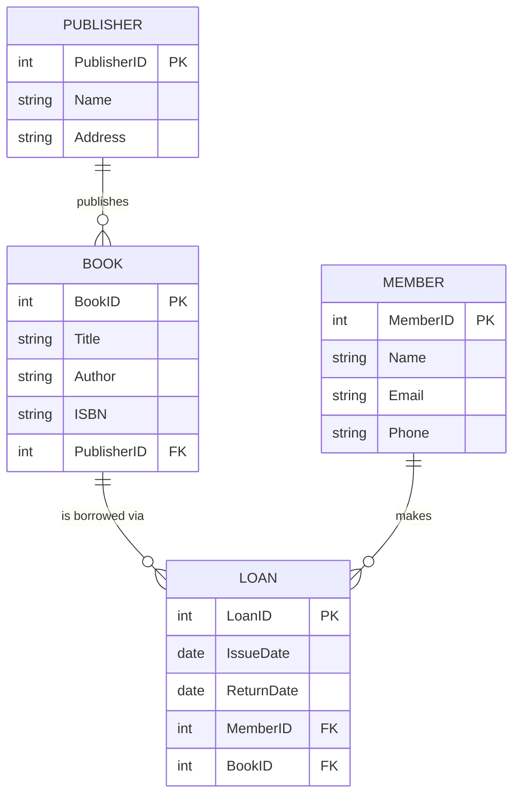
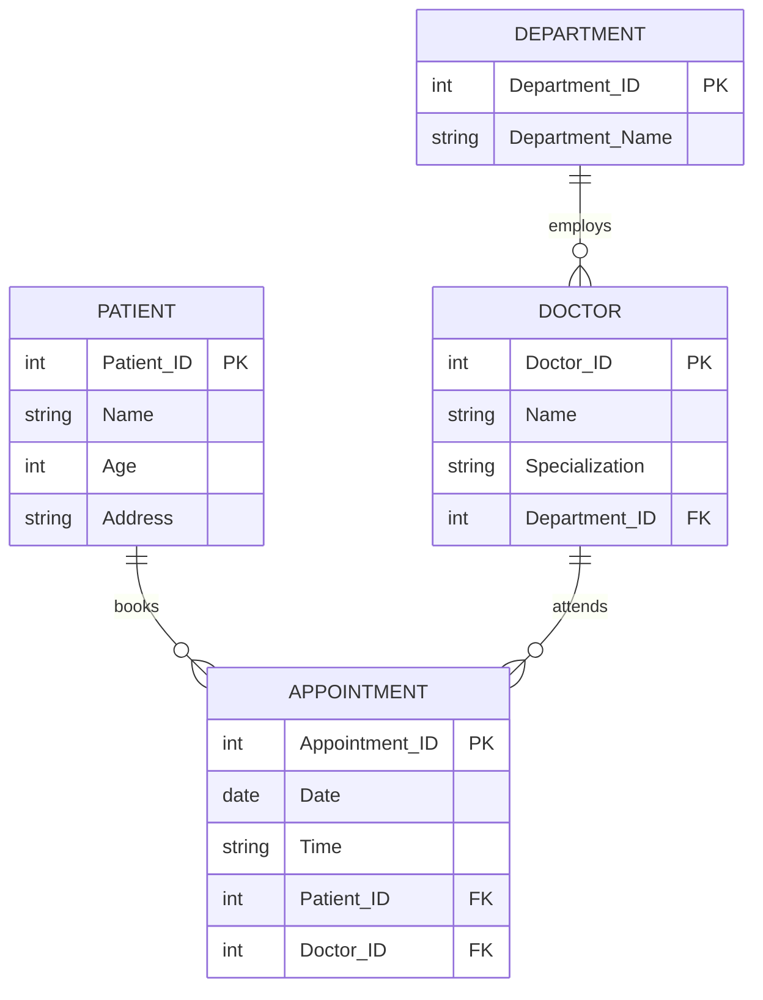
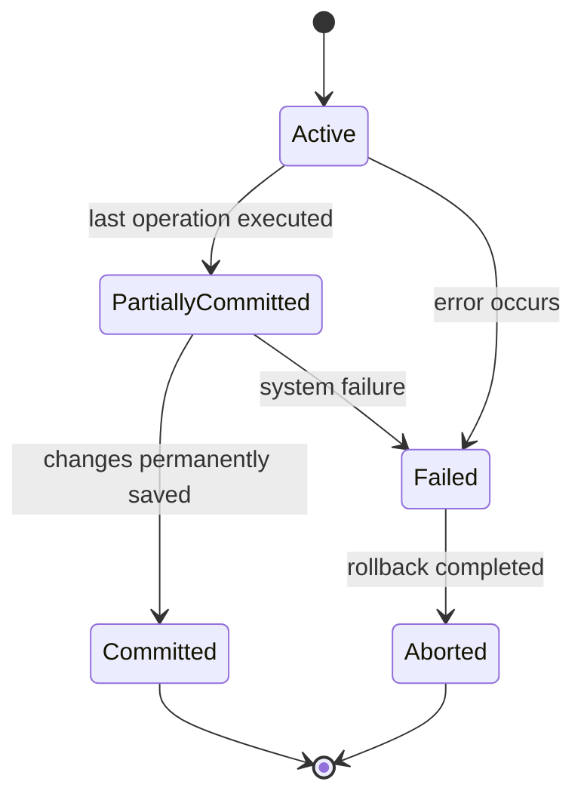
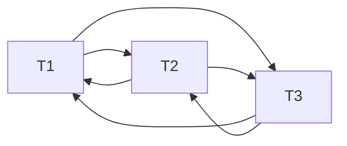
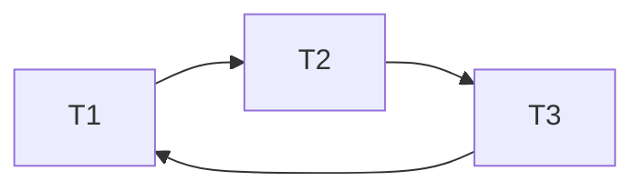

# Theory (CSE 2203) — 2nd Batch

**Section:** [Theory](../README.md) · **Part:** [Part 0 — Final Year Question and Answer](../../README.md)

**Chandpur Science and Technology University (CSTU)**
Department of Computer Science and Engineering
B.Sc. Engineering 2nd Year 2nd Semester Final Examination, 2024
**Course Code:** CSE 2203 · **Course Title:** Database Management System
**Time:** 3 Hours · **Full Marks:** 210

> **Instructions on the paper:** (i) Figures in the right margin indicate full marks allotted to each question. (ii) Symbols and abbreviations bear their standard meaning. (iii) Use a separate answer script for each SECTION.

> ✅ **Progress note:** All eight questions (Section A: Q1–Q4, Section B: Q5–Q8) are fully solved below in the simplest possible language.

---

## SECTION – A (Marks: 105)
*(Answer any three (03) questions from this section)*

---

## Question 1

### 1(a) What is a DBMS? List three advantages of using a DBMS over file-based systems. `[05]`

**Answer:**

A **DBMS (Database Management System)** is software that lets you **store, organize, search, update, and protect** data, sitting between the user and the raw data files so the user never has to deal with the messy technical details of how data is physically saved.

**Three advantages of a DBMS over a plain file-based system:**

1. **Reduces data redundancy and inconsistency** — In file systems, the same data is often copied into multiple files; a DBMS keeps it in one central place, so there's no risk of two copies disagreeing with each other.
2. **Provides data security** — A DBMS lets the administrator give different users different permissions (e.g., a student can only see their own grades), which is very hard to control safely with plain files.
3. **Supports concurrent access safely** — A DBMS allows **many users to use the data at the same time** without corrupting it (using transactions and concurrency control), while file systems easily break when two programs write to the same file at once.

---

### 1(b) Define and differentiate: data, information, and database. `[06]`

**Answer:**

- **Data** — A **raw fact by itself**, with no context or meaning yet. Example: `21`, `"Dhaka"`.
- **Information** — Data that has been **processed, organized, and given meaning**, so it becomes useful for decision-making. Example: "the average student age is 21."
- **Database** — An **organized collection of related data**, stored together so it can be turned into information whenever it's needed. Example: a table storing every student's ID, name, and age together.

| | Data | Information | Database |
|---|---|---|---|
| **Nature** | Raw, unprocessed | Processed, meaningful | Organized storage |
| **Usefulness alone** | Little/no direct use | Directly useful for decisions | Useful as a source to generate information |
| **Example** | `21` | "Average age is 21" | A `Students` table holding IDs, names, ages |

> 💡 **Easy analogy:** Data = ingredients. Information = the cooked meal made from those ingredients. Database = the organized fridge/pantry where all the ingredients are stored, ready to be turned into a meal.

---

### 1(c) What is a data model? Compare the hierarchical, network, and relational data models. `[12]`

**Answer:**

A **data model** is a **set of concepts and rules** used to describe the structure of a database — basically, a blueprint for how data is organized, connected, and manipulated.

**Comparison of the three classic data models:**

| | Hierarchical Model | Network Model | Relational Model |
|---|---|---|---|
| **Structure** | Tree-like — records arranged in **parent-child** levels | Graph-like — records connected using **pointers**, more flexible than a tree | Data stored in **tables (relations)** made of rows and columns |
| **Relationship rule** | Each child has **only ONE parent** | A child (child record) can have **multiple parents** | Relationships are shown using **common column values (keys)**, not physical pointers |
| **Flexibility** | Rigid — hard to represent many-to-many relationships directly | More flexible than hierarchical, but still uses complex pointer structures | Very flexible — easy to add, remove, or restructure tables and relationships |
| **Ease of use** | Complex navigation, must follow the tree path | Complex — requires understanding pointer chains | Simple and intuitive — uses declarative query languages like SQL |
| **Example** | IBM's IMS (organization charts, file directories) | CODASYL DBTG systems (older airline/banking systems) | MySQL, PostgreSQL, Oracle, SQL Server (most modern databases) |

> 💡 **Easy analogy:** Hierarchical model = a family tree (one parent per child only). Network model = a friends/social network (a person can have many connections, not just one "parent"). Relational model = a set of clearly labeled spreadsheets that are linked together using shared ID columns — the simplest and most popular approach today.

---

### 1(d) Draw an ER diagram for a library management system with Book, Member, Loan, and Publisher entities. Identify and illustrate the relationships. `[12]`

**Given Entities:**
- `Book(BookID [PK], Title, Author, ISBN)`
- `Member(MemberID [PK], Name, Email, Phone)`
- `Loan(LoanID [PK], IssueDate, ReturnDate)`
- `Publisher(PublisherID [PK], Name, Address)`

**Answer:**

**Step 1 — Identify the relationships:**

- **Publisher "Publishes" Book** → **One-to-Many (1:N)** — one publisher publishes many books, but each book has only one publisher.
- **Member "Makes" Loan** → **One-to-Many (1:N)** — one member can make many loan records over time, but each loan record belongs to only one member.
- **Book "Appears in" Loan** → **One-to-Many (1:N)** — one book (copy) can be loaned out many times over its life, but each loan record refers to only one book.

*(Together, `Loan` acts as a "bridge/junction" entity that connects `Member` and `Book` — this is how the real-world Many-to-Many relationship "Member borrows Book" gets modeled cleanly, since a `Loan` record simply stores which member borrowed which book, and when.)*



> 💡 **Simple explanation:** Think of `Loan` as the "receipt" every time a member borrows a book — each receipt (Loan) points to exactly one Member and exactly one Book, but a Member/Book can appear on many different receipts over time.

---

## Question 2

### 2(a) Distinguish between drop and truncate. `[04]`

**Answer:**

| | DROP | TRUNCATE |
|---|---|---|
| **What it removes** | Removes the **entire table structure** (columns, constraints, indexes) **and** all its data | Removes only the **data (rows)**, keeps the table structure intact |
| **Can you undo it?** | Table is gone completely — must recreate it from scratch to use it again | Table still exists — you can insert new data right away |
| **Speed** | Slower (removes structure + data + related objects) | Faster (just empties out data, minimal logging) |
| **SQL Example** | `DROP TABLE Employee;` | `TRUNCATE TABLE Employee;` |

> 💡 **Easy analogy:** TRUNCATE is like emptying a box but keeping the box. DROP is like throwing away the box entirely.

---

### 2(b) Classify functional dependency with appropriate examples. `[08]`

**Answer:**

A **functional dependency (FD)** `X → Y` means "the value of X determines the value of Y." FDs can be classified as follows:

1. **Trivial FD** — `Y` is already a **subset of** `X`. It's always true, and doesn't tell us anything new.
   *Example:* `{Student_ID, Name} → Student_ID` (obviously true, since `Student_ID` is part of the left side).

2. **Non-Trivial FD** — `Y` is **not** a subset of `X`. This is the useful, meaningful kind of dependency.
   *Example:* `Student_ID → Name` (knowing the ID tells you the name, and `Name` is not part of the left side).

3. **Full Functional Dependency** — `Y` depends on the **entire** composite key `X`, not just part of it.
   *Example:* In `R(Student_ID, Course_ID, Grade)`, `{Student_ID, Course_ID} → Grade` is a full dependency, because you truly need **both** columns together to know the grade.

4. **Partial Functional Dependency** — `Y` depends on only **part** of a composite key `X`.
   *Example:* In the same table, if `Student_ID → Student_Name` also held, that would be a **partial** dependency, since `Student_Name` only needs `Student_ID`, not the full `{Student_ID, Course_ID}` key.

5. **Transitive Functional Dependency** — `X → Y` and `Y → Z`, so indirectly `X → Z`, but through a **non-key** attribute `Y`.
   *Example:* `Student_ID → Department_ID` and `Department_ID → Department_Head` means `Student_ID → Department_Head` **transitively**, through the non-key attribute `Department_ID`.

> 💡 **Why this matters:** Partial and transitive dependencies are exactly what 2NF and 3NF are designed to remove — this classification is the foundation of normalization (see Part 3 of this repository).

---

### 2(c) "All candidate keys are super keys, whereas all super keys are not candidate keys." Justify this statement with a suitable example. `[08]`

**Answer:**

- **Super Key** — **any** set of columns that can uniquely identify every row, **even if it contains extra, unnecessary columns.**
- **Candidate Key** — a super key that is also **minimal** — meaning if you remove even one column from it, it stops being unique. No "extra baggage" allowed.

**Why the statement is true:**

1. **"All candidate keys are super keys"** → True, because to even be *considered* a candidate key, a column set must first pass the basic test of uniquely identifying rows — which is exactly the definition of a super key. A candidate key is simply a super key with the *extra condition* of being minimal.
2. **"All super keys are not candidate keys"** → True, because a super key is allowed to have **extra, redundant columns** added to it and still remain a valid super key (it's still unique, just not minimal anymore). Once it has that extra baggage, it fails the "minimal" test and is no longer a candidate key.

**Example — a Student table `(Student_ID, Name, Department)`, where `Student_ID` is unique:**

- `{Student_ID}` → uniquely identifies every row, and removing anything from it is impossible (it's just 1 column) → **Candidate Key** (and also a Super Key).
- `{Student_ID, Name}` → still uniquely identifies every row (because `Student_ID` alone already guarantees uniqueness) → it **is** a Super Key, but **NOT** a Candidate Key, because the extra column `Name` is unnecessary — removing it still keeps the set unique.

> 💡 **One-line memory trick:** *Candidate Key ⊂ Super Keys.* Every candidate key is a super key, but a super key only becomes "candidate" once it has zero unnecessary extra columns.

---

### 2(d) Find the super key, primary key, candidate key, alternate key, and composite key in the following table. `[15]`

**Given Table:**

| ID | Name | Phone | Age |
|---|---|---|---|
| 1 | Sakib | 9876723452 | 17 |
| 2 | Sakib | 9991165674 | 19 |
| 3 | Mujahid | 7898756543 | 18 |
| 4 | Sabbir | 8987867898 | 19 |
| 5 | Jahid | 9990080080 | 17 |

**Step 1 — Check which single column(s) have NO repeated values:**

- `ID` → 1, 2, 3, 4, 5 → all different → ✅ unique
- `Name` → Sakib, **Sakib**, Mujahid, Sabbir, Jahid → "Sakib" repeats (row 1 & row 2) → ❌ NOT unique alone
- `Phone` → all 5 numbers are different → ✅ unique
- `Age` → 17, 19, 18, 19, **17** → both "17" and "19" repeat → ❌ NOT unique alone

**Step 2 — Answer for each type of key:**

| Key Type | Meaning | Answer for this table |
|---|---|---|
| **Candidate Key** | Minimal column(set) that uniquely identifies every row | `{ID}` and `{Phone}` |
| **Primary Key** | The ONE candidate key chosen as the main identifier | `{ID}` |
| **Alternate Key** | Candidate key(s) NOT chosen as primary | `{Phone}` |
| **Composite Key** | Two or more columns that become unique only when **combined** | `{Name, Age}` — check: (Sakib,17), (Sakib,19), (Mujahid,18), (Sabbir,19), (Jahid,17) → every pair is different, even though `Name` alone and `Age` alone both repeat |
| **Super Key** | Any set (with or without extra columns) that uniquely identifies rows | Every set containing `ID` or `Phone`, e.g., `{ID}`, `{Phone}`, `{ID, Name}`, `{ID, Age}`, `{Phone, Name}`, `{ID, Name, Phone, Age}`, etc. |

> 💡 **Notice the pattern:** Even though `Name` alone repeats and `Age` alone repeats, the **combination** `{Name, Age}` happens to be unique here — this is a good real example of how a composite key can be built from two "non-unique-alone" columns.

---

## Question 3

### 3(a) Distinguish between instance and schema. `[04]`

**Answer:**

| | Schema | Instance |
|---|---|---|
| **Meaning** | The overall **design/blueprint** of the database — table names, columns, data types, and constraints | The **actual data** stored in the database at one particular moment in time |
| **How often it changes** | Rarely changes (only when the design is updated) | Changes constantly (every insert/update/delete changes it) |
| **Example** | `Student(Student_ID, Name, Department)` — this structure definition | The actual rows: `(101, Rahim, CSE)`, `(102, Karim, EEE)` right now |

> 💡 **Easy analogy:** Schema = the blueprint of a house (walls, rooms, doors — rarely changes). Instance = the furniture and people inside the house **right now** (changes all the time as people move things around).

---

### 3(b) Briefly describe data manipulation language (DML) and transaction control language (TCL) with appropriate examples. `[08]`

**Answer:**

**DML (Data Manipulation Language)** — the set of SQL commands used to **work with the actual data** stored inside tables (insert, read, change, remove data).

| Command | Purpose | Example |
|---|---|---|
| `INSERT` | Add new rows | `INSERT INTO Student VALUES (101, 'Rahim', 'CSE');` |
| `UPDATE` | Modify existing rows | `UPDATE Student SET Department='EEE' WHERE Student_ID=101;` |
| `DELETE` | Remove rows | `DELETE FROM Student WHERE Student_ID=101;` |
| `SELECT` | Read/retrieve rows | `SELECT * FROM Student;` |

**TCL (Transaction Control Language)** — the set of SQL commands used to **manage transactions** (groups of DML statements that must succeed or fail together).

| Command | Purpose | Example |
|---|---|---|
| `COMMIT` | Permanently save all changes made in the current transaction | `COMMIT;` |
| `ROLLBACK` | Undo all changes made in the current transaction | `ROLLBACK;` |
| `SAVEPOINT` | Mark a point inside a transaction to which you can roll back partially | `SAVEPOINT sp1;` |

> 💡 **Easy way to remember:** DML changes the **data itself**. TCL controls whether those DML changes become **permanent or get cancelled**.

---

### 3(c) Design an E-R diagram for hospital management system. Identify entities, attributes, relationships, and cardinality. `[10]`

**Answer:**

**Entities and Attributes:**

- `Patient(Patient_ID [PK], Name, Age, Address)`
- `Doctor(Doctor_ID [PK], Name, Specialization)`
- `Department(Department_ID [PK], Department_Name)`
- `Appointment(Appointment_ID [PK], Date, Time)` — acts as the bridge entity between Patient and Doctor

**Relationships and Cardinality:**

- **Patient "Books" Appointment / Doctor "Attends" Appointment** → this models the real **Many-to-Many** relationship *"Patient sees Doctor"*: one patient can book many appointments (with different doctors), and one doctor can have many appointments (with different patients).
- **Department "Employs" Doctor** → **One-to-Many (1:N)** — one department has many doctors, but each doctor belongs to one department.



> 💡 **Simple explanation:** `Appointment` is the "meeting slip" connecting one Patient and one Doctor at a specific date/time — since a patient can have many appointments and a doctor can have many appointments, this bridge entity cleanly represents their Many-to-Many relationship.

---

### 3(d) Consider the relation scheme R(A, B, C, D, E, H) and the set of functional dependencies: A→B, C→D, AD→E, E→H. Find the Candidate key. `[13]`

**Answer:**

**Step 1 — Find attributes that never appear on the right-hand side of any FD.**

RHS attributes across all FDs = `{B, D, E, H}`. Attributes never on the right side: **A, C** → both must be part of every candidate key.

**Step 2 — Compute the closure of `{A, C}`:**

| Step | Apply FD | New attributes added | Closure so far |
|---|---|---|---|
| Start | — | — | `{A, C}` |
| 1 | `A → B` | `B` | `{A, B, C}` |
| 2 | `C → D` | `D` | `{A, B, C, D}` |
| 3 | `AD → E` (both A, D present) | `E` | `{A, B, C, D, E}` |
| 4 | `E → H` | `H` | `{A, B, C, D, E, H}` ✅ all 6 attributes! |

`{A, C}⁺` covers all attributes → `{A, C}` is a **super key**.

**Step 3 — Check minimality:**

- Without `A`: `{C}⁺ = {C, D}` only → does not reach all attributes → `A` is necessary.
- Without `C`: `{A}⁺ = {A, B}` only → does not reach all attributes → `C` is necessary.

Since removing either attribute breaks the closure, `{A, C}` is **minimal**.

**✅ Final Answer:** The only **Candidate Key** of R is **`{A, C}`**.

---

## Question 4

### 4(a) Justify whether BCNF is always preferable to 3NF. Support your answer with real-world scenarios. `[04]`

**Answer:**

**No, BCNF is not always preferable to 3NF.**

- **BCNF (Boyce-Codd Normal Form)** is **stricter** than 3NF — it removes *even more* redundancy by requiring that **every** determinant (left-hand side of an FD) must be a super key.
- However, decomposing a relation into BCNF **can sometimes fail to preserve all the original functional dependencies** — meaning some business rules can no longer be checked just by looking at one table; you'd need an expensive join across multiple tables to verify them.
- **3NF**, on the other hand, **always guarantees** both **lossless-join** decomposition **and** **dependency preservation** — so all business rules stay easily checkable.

**Real-world scenario:** Consider a table `Enrollment(Student, Course, Instructor)` where the rule is "each course is taught by only one instructor" (`Course → Instructor`), but a student can take a course from possibly more than one instructor's section (`{Student, Course} → Instructor`, not exactly — a classic textbook example). Decomposing this into strict BCNF can force us to split the table in a way that **loses** the ability to directly enforce "a course has only one instructor" without extra joins. In such a case, database designers often accept the **mild redundancy of 3NF** in exchange for keeping business rules easy and cheap to enforce.

> 💡 **Simple rule of thumb:** Use **BCNF** when eliminating redundancy is the top priority and dependency loss is acceptable. Use **3NF** when you need to guarantee that all functional dependencies (business rules) remain easily enforceable.

---

### 4(b) Explain ACID properties of transactions with real-world examples. `[10]`

**Answer:**

| Property | Meaning | Real-World Example |
|---|---|---|
| **Atomicity** | A transaction is "all or nothing" | Booking a flight seat + charging payment must **both** happen, or **neither** — you should never be charged without getting a seat. |
| **Consistency** | The database must move from one valid state to another, respecting all rules | If a rule says "total seats booked ≤ total seats available," a transaction can never leave the database with more bookings than seats. |
| **Isolation** | Concurrent transactions should not interfere with each other | If two people try to book the **last** seat on a flight at the same time, isolation ensures only one of them actually succeeds — they don't both "see" the seat as available and double-book it. |
| **Durability** | Once committed, changes are permanent, even after a crash | Once your flight booking payment is confirmed, even if the server crashes 1 second later, your booking must still be there when the system comes back up. |

> 💡 **Easy analogy:** ACID is like a well-run bank counter — either your whole transaction goes through (Atomicity), the books always balance (Consistency), no one else's transaction messes with yours mid-way (Isolation), and once the receipt is printed, it's final and never disappears (Durability).

---

### 4(c) Consider the relation scheme R(A, B, C, D, E, H) and the set of functional dependencies: A→BC, C→D, D→E, B→H. Determine the normal form. `[12]`

**Answer:**

**Step 1 — Find the Candidate Key.**

RHS attributes across all FDs = `{B, C, D, E, H}`. Attribute never on the right side: **A** only → `A` must be part of every candidate key.

Check closure of `{A}`:

| Step | Apply FD | New attributes | Closure so far |
|---|---|---|---|
| Start | — | — | `{A}` |
| 1 | `A → BC` | `B, C` | `{A, B, C}` |
| 2 | `C → D` | `D` | `{A, B, C, D}` |
| 3 | `D → E` | `E` | `{A, B, C, D, E}` |
| 4 | `B → H` | `H` | `{A, B, C, D, E, H}` ✅ all 6 attributes! |

`{A}⁺` covers all attributes, and since it's already just a single attribute, it can't be made any smaller → **Candidate Key = `{A}`** (a single, non-composite key).

**Step 2 — Check Normal Forms one by one:**

- **1NF:** Assuming atomic values → ✅ satisfied.
- **2NF:** A partial dependency can only exist when the candidate key is **composite** (made of 2+ columns). Since our candidate key `{A}` is a **single column**, there is **no way** a partial dependency can happen here → ✅ **2NF is automatically satisfied.**
- **3NF:** Checks for **transitive dependencies** — a non-prime attribute depending on another non-prime attribute instead of directly on the key. Let's trace: `A → C` (C is non-prime), and then `C → D` — so `D` depends on `A` **transitively, through C** → ❌ **violates 3NF.** Similarly, `D → E` means `E` is transitively dependent on `A` through `D`, and `B → H` means `H` is transitively dependent on `A` through `B`.

**✅ Final Answer:** The relation satisfies 1NF and 2NF, but **fails 3NF** because of the transitive dependencies `C → D`, `D → E`, and `B → H`. So **R is in 2NF** (highest normal form satisfied).

---

### 4(d) Consider the SQL schema `Employee(E_ID, Name, Department, City)` and `EmpSalary(S_ID, Position, Salary, Joining_Date, E_ID)`. Write relational algebra queries. `[09]`

**Answer:**

**i. Find employee information who works in ME department and holds the position of Assistant Professor:**

$$\pi_{\,E\_ID,\ Name,\ Department,\ City}\Big(\sigma_{\text{Department = 'ME' AND Position = 'Assistant Professor'}}\big(Employee \Join EmpSalary\big)\Big)$$

*In simple words:* Join `Employee` and `EmpSalary` on `E_ID`, keep only rows where `Department = 'ME'` **and** `Position = 'Assistant Professor'`, then show the employee's info columns.

**ii. Find employees who joined before 2018 and earn between 40000 and 70000:**

$$\pi_{\,E\_ID,\ Name,\ Department,\ City}\Big(\sigma_{\text{Joining\_Date < '2018-01-01' AND Salary} \geq 40000 \text{ AND Salary} \leq 70000}\big(Employee \Join EmpSalary\big)\Big)$$

*In simple words:* Join the two tables, filter for `Joining_Date` before 2018 **and** `Salary` between 40000–70000, then project the employee's info.

**iii. Find employees whose salary is greater than the average salary:**

Plain relational algebra doesn't have a built-in "average" operator, so we use the **extended relational algebra aggregate operator** ℑ (script F):

$$AvgSal \leftarrow \mathcal{F}_{\,AVG(Salary) \rightarrow avg\_sal}(EmpSalary)$$

$$Result \leftarrow \pi_{\,E\_ID,\ Name,\ Department,\ City}\Big(\big(\sigma_{\text{Salary > avg\_sal}}(EmpSalary \times AvgSal)\big) \Join Employee\Big)$$

*In simple words:* First calculate the **average salary** across all of `EmpSalary` (this produces a tiny one-row, one-column result called `avg_sal`). Then compare every employee's `Salary` against that average, keep only the ones **greater than** it, and finally project the employee's info.

> 💡 **Symbol reminder:** σ = select rows, π = project columns, ⋈ = join tables, ℑ (script F) = aggregate function (like AVG, SUM, COUNT) in extended relational algebra.

---

## SECTION – B (Marks: 105)
*(Answer any three (03) questions from this section)*

## Question 5

### 5(a) Explain database constraints and their role in maintaining data integrity. Describe PRIMARY KEY, FOREIGN KEY, UNIQUE, CHECK, NOT NULL. `[10]`

**Answer:**

A **database constraint** is a **rule enforced by the DBMS itself** on the data in a table, so that **invalid or incorrect data can never be saved** in the first place — this is exactly how a database maintains **data integrity** (correctness and reliability of data) automatically, without depending on every application program to check it manually.

| Constraint | Role | Example |
|---|---|---|
| **PRIMARY KEY** | Uniquely identifies each row; automatically disallows `NULL` and duplicate values | `Student_ID INT PRIMARY KEY` |
| **FOREIGN KEY** | Ensures a column's value must **match an existing value** in another (parent) table — keeps relationships valid | `Dept_ID INT REFERENCES Department(Dept_ID)` — you can't insert an employee with a department that doesn't exist |
| **UNIQUE** | Ensures all values in a column are **different** from each other (unlike PRIMARY KEY, it *does* allow one `NULL`) | `Email VARCHAR(50) UNIQUE` |
| **CHECK** | Ensures a column's value satisfies a **custom condition** | `CHECK (Salary >= 0)` — prevents negative salaries |
| **NOT NULL** | Ensures a column can **never be left empty** | `Name VARCHAR(50) NOT NULL` |

> 💡 **Easy analogy:** Constraints are like the "rules" printed on a form — they stop someone from submitting a form with a blank name field, a duplicate ID, or an invalid department code, **before** the form is even accepted.

---

### 5(b) What is a trigger in DBMS? Explain its types (BEFORE, AFTER, INSTEAD OF) and write a trigger that prevents inserting a record into an Employee table if the salary is less than 10,000. `[10]`

**Answer:**

A **trigger** is a piece of code that the database **automatically runs** whenever a specific event (`INSERT`, `UPDATE`, `DELETE`) happens on a table — no manual call needed.

**Types of triggers:**

1. **BEFORE trigger** — runs **before** the actual data change happens. Commonly used to **validate or modify** data before it's saved (e.g., blocking an invalid insert).
2. **AFTER trigger** — runs **after** the data change has already happened. Commonly used for **logging, auditing, or updating related tables** (e.g., writing a history record after an update).
3. **INSTEAD OF trigger** — **replaces** the original action entirely with custom logic instead (commonly used on **views**, where a direct insert/update isn't normally possible).

**Trigger to prevent inserting an Employee record with salary < 10,000:**

```sql
CREATE TRIGGER prevent_low_salary
BEFORE INSERT ON Employee
FOR EACH ROW
BEGIN
    IF NEW.Salary < 10000 THEN
        SIGNAL SQLSTATE '45000'
        SET MESSAGE_TEXT = 'Insert failed: Salary cannot be less than 10,000';
    END IF;
END;
```

**How it works:** Before any new row is actually inserted into `Employee`, this trigger checks the incoming row's `Salary` (`NEW.Salary`). If it's below `10000`, the trigger **raises an error** and the insert is **blocked** entirely — the row never gets saved.

---

### 5(c) Define a view in DBMS, explain its types. `[05]`

**Answer:**

A **view** is a **virtual table** — it stores a saved SQL query, not actual data. Every time the view is used, its underlying query runs and shows the result as if it were a real table.

**Types of Views:**

1. **Simple View** — built from a **single** table, with no joins, grouping, or functions. Usually **updatable** (you can `INSERT`/`UPDATE` through it).
2. **Complex View** — built from **multiple tables** (joins), or uses `GROUP BY`, aggregate functions, etc. Usually **not directly updatable** because the database can't always tell which underlying table a change should apply to.

> 💡 **Easy analogy:** A simple view is like looking at one drawer of a cabinet through a small window. A complex view is like a summary report combining information from many drawers at once — you can look at it, but you can't just "write into" the summary itself.

---

### 5(d) Define data organization in DBMS and explain its objectives and types with suitable examples. `[10]`

**Answer:**

**Data organization** refers to the **way records are physically arranged and stored** on disk, so that they can be accessed efficiently.

**Objectives of data organization:**
- Minimize the time needed to **search/retrieve** records.
- Minimize wasted storage space.
- Support efficient **insertion, deletion, and updating** of records.

**Types of Data Organization:**

1. **Sequential File Organization** — Records are stored **one after another**, usually sorted by a key field. *Example:* a phone directory sorted alphabetically by name — great for reading everything in order, but slow for finding one specific record (may need to scan many records).
2. **Indexed Sequential (ISAM) Organization** — Records are stored sequentially, **plus** a separate index is kept to jump directly close to the needed record. *Example:* a textbook's index page — instead of flipping page by page, you jump straight to the right page using the index.
3. **Direct/Hashed File Organization** — A **hash function** converts the key directly into the storage address, allowing near-instant access without any searching. *Example:* Employee ID `1042` might hash directly to "slot 42" in storage.
4. **Clustered File Organization** — Related records from **different tables** are stored physically close together on disk, to speed up queries that frequently join them. *Example:* storing a `Customer`'s row physically next to their related `Orders` rows.

---

## Question 6

### 6(a) Explain data storage in a DBMS and describe how a DBMS manages data storage efficiently. `[05]`

**Answer:**

A DBMS stores data across a **storage hierarchy**, from fastest/smallest to slowest/largest: **CPU cache → main memory (RAM) → magnetic/SSD disk → offline storage (tape/backup)**. Since disk access is far slower than memory access, the DBMS's **Storage Manager** works hard to minimize slow disk operations.

**How the DBMS manages storage efficiently:**

1. **Buffer management** — Keeps recently used disk blocks cached in memory (the "buffer pool"), so repeated requests for the same data don't need a fresh disk read every time.
2. **Indexing** — Maintains index structures (like B+ trees) so the system can jump directly to needed data instead of scanning the whole table.
3. **File organization** — Chooses smart physical layouts (sequential, hashed, clustered) matching how the data is typically accessed.
4. **Data compression & efficient block sizing** — Stores data in disk-block-sized chunks to make the most of every disk read/write.

---

### 6(b) Define indexing in DBMS and explain the working of sparse index and dense index, comparing structure, storage overhead, and search efficiency. `[10]`

**Answer:**

**Indexing** means creating an extra, smaller data structure that lets the DBMS **find rows quickly** without scanning the entire table — similar to a book's index page.

**Dense Index:**
- Has **one index entry for EVERY single record** in the data file, regardless of whether the data file is sorted or not.

**Sparse Index:**
- Has an index entry for **only SOME records** (typically one entry per data block/page, not per row) — it relies on the data file being **sorted**, so the DBMS can jump to the nearest indexed block and then scan a little further to find the exact record.

| | Dense Index | Sparse Index |
|---|---|---|
| **Structure** | One entry per record | One entry per block/page of records |
| **Storage overhead** | **Higher** — index itself can get almost as large as the data | **Lower** — much smaller index size |
| **Search efficiency** | **Faster** direct lookup (exact entry always exists) | Slightly **slower** (may need a short scan within a block after jumping to it) |
| **Requirement** | Works on sorted or unsorted files | Requires the data file to be **sorted** on the index key |

> 💡 **Easy analogy:** A dense index is like a index card for every single page of a book. A sparse index is like an index card only for the first page of every chapter — you jump to the chapter's start, then flip a few pages to find exactly what you need.

---

### 6(c) Explain what a B+ tree is, describe its structure and properties, and insert the key values 6, 16, 26, 36, and 46 into a B+ tree of order 3, showing all steps. `[10]`

**Answer:**

A **B+ tree** is a **balanced, sorted tree** used for indexing, where:

- **Only leaf nodes hold actual data pointers**; internal nodes only hold "signpost" keys for guiding the search.
- **All leaf nodes are linked together** in order, making range queries fast.
- The tree is **always balanced** — every leaf is at the same depth, guaranteeing predictable search speed.

**Order 3 means:** each node can hold a **maximum of 2 keys**; inserting a 3rd key causes a **split**.

**Step-by-step insertion of: 6, 16, 26, 36, 46**

1. **Insert 6** → leaf: `[6]`
2. **Insert 16** → leaf: `[6, 16]` (fits, no split)
3. **Insert 26** → leaf becomes `[6, 16, 26]` → **overflow!** Split into left `[6, 16]` and right `[26]`, copy up `26` as the separator into a new root.
   ```
           [26]
          /    \
      [6,16]  [26]
   ```
4. **Insert 36** → goes to right leaf `[26]` → becomes `[26, 36]` (fits, no split).
   ```
           [26]
          /    \
      [6,16]  [26,36]
   ```
5. **Insert 46** → goes to right leaf `[26, 36]` → becomes `[26, 36, 46]` → **overflow!** Split into left `[26, 36]` and right `[46]`, copy up `46` into the parent. Parent `[26]` gains key `46` → becomes `[26, 46]` (fits, no further split).

**✅ Final B+ Tree structure:**

```
                [26, 46]
              /    |     \
         [6,16] [26,36]  [46]
```

*(Leaf chain, left to right: 6, 16 → 26, 36 → 46 — all 5 inserted keys present, sorted, and linked.)*

---

### 6(d) Explain what a hash function is, illustrate it with an example of a hash table implementation, and demonstrate how collisions are handled. `[10]`

**Answer:**

A **hash function** takes an input key (like an Employee ID) and converts it into a **fixed-size number**, which is used directly as the **storage address (bucket index)** — allowing near-instant lookup without searching.

**Example hash table implementation:**

Suppose we have **5 buckets** (0–4), and the hash function is: `h(key) = key mod 5`.

| Key | h(key) = key mod 5 | Stored in Bucket |
|---|---|---|
| 12 | 12 mod 5 = 2 | Bucket 2 |
| 23 | 23 mod 5 = 3 | Bucket 3 |
| 7 | 7 mod 5 = 2 | Bucket 2 (⚠️ collision with `12`) |
| 15 | 15 mod 5 = 0 | Bucket 0 |

**Collision:** Notice keys `12` and `7` both hash to **Bucket 2** — this is called a **collision**, when two different keys map to the same bucket address.

**Handling collisions — two common techniques:**

1. **Chaining (Open Hashing)** — each bucket stores a **linked list**; when a collision happens, the new key is simply **appended to the list** at that bucket.
   ```
   Bucket 2 → [12] → [7]
   ```
2. **Open Addressing (Closed Hashing)** — if the target bucket is already full, the system **probes** (searches) for the next available bucket, following a set rule (e.g., linear probing: try bucket+1, bucket+2, ...) until an empty one is found.
   ```
   Bucket 2 = 12 (already occupied)
   Key 7 wants Bucket 2 → try Bucket 3 → if free, place 7 there instead
   ```

> 💡 **Easy analogy:** A hash function is like assigning each guest a locker number using a simple formula. If two guests are accidentally given the same locker number (collision), you either let them **share the locker with a divider** (chaining) or **move the second guest to the next open locker** (open addressing).

---

## Question 7

### 7(a) Explain the concept of a transaction in DBMS, describe its different states with an example, and illustrate a state transition diagram. `[07]`

**Answer:**

A **transaction** is a **single logical unit of work** made up of one or more database operations (reads/writes), which must be executed as an **all-or-nothing** unit.

**States of a Transaction:**

1. **Active** — the transaction has started and is currently executing its operations.
2. **Partially Committed** — the transaction has finished executing its last operation, but the changes are not yet permanently saved to disk.
3. **Committed** — the transaction has successfully finished, and all its changes are now **permanently** saved.
4. **Failed** — the transaction cannot continue normally, due to an error (e.g., a rule violation or system issue).
5. **Aborted** — the transaction has been **rolled back**, and the database is restored to the state it was in before the transaction began.

**Example:** A bank transfer transaction: it becomes *Active* while deducting from Account A and adding to Account B, moves to *Partially Committed* right after the last step, then to *Committed* once everything is confirmed saved. If, say, Account A doesn't have enough balance, it moves to *Failed*, and then gets *Aborted* (rolled back).

**State Transition Diagram:**



---

### 7(b) Explain the ACID properties of a transaction in DBMS and provide examples for each property. `[08]`

**Answer:**

| Property | Meaning | Example |
|---|---|---|
| **Atomicity** | All steps succeed, or none do | A $500 fund transfer: both the debit from A and credit to B must happen together, or neither happens. |
| **Consistency** | The database always moves between valid states, respecting all rules | After the transfer, total money across both accounts must remain the same as before. |
| **Isolation** | Concurrent transactions don't interfere with each other | Two people withdrawing from the same account at the same time won't both read the same stale balance and cause a lost update. |
| **Durability** | Committed changes survive crashes | Once the transfer is confirmed (`COMMIT`), it stays recorded even if the server restarts immediately after. |

---

### 7(c) Define serializability. Determine whether the given schedule of T1, T2, T3 is conflict serializable. `[10]`

**Given Schedule:**

| Step | T1 | T2 | T3 |
|---|---|---|---|
| 1 | R(A) | | |
| 2 | | R(B) | |
| 3 | | | R(B) |
| 4 | | | R(A) |
| 5 | W(B) | | |
| 6 | W(A) | | |
| 7 | | W(A) | |
| 8 | | | W(A) |

**Answer:**

**Serializability** means a schedule of concurrently-running transactions produces the **same result** as if those transactions had run **one at a time, in some serial order**. A schedule with this guarantee is considered "correct."

**Step 1 — List all conflicting operation pairs** (same data item, different transactions, at least one is a write):

**On data item A:**
- `R1(A)` [step 1] before `W2(A)` [step 7] → **T1 → T2**
- `R1(A)` [step 1] before `W3(A)` [step 8] → **T1 → T3**
- `R3(A)` [step 4] before `W1(A)` [step 6] → **T3 → T1**
- `R3(A)` [step 4] before `W2(A)` [step 7] → **T3 → T2**
- `W1(A)` [step 6] before `W2(A)` [step 7] → **T1 → T2**
- `W1(A)` [step 6] before `W3(A)` [step 8] → **T1 → T3**
- `W2(A)` [step 7] before `W3(A)` [step 8] → **T2 → T3**

**On data item B:**
- `R2(B)` [step 2] before `W1(B)` [step 5] → **T2 → T1**
- `R3(B)` [step 3] before `W1(B)` [step 5] → **T3 → T1**

**Step 2 — Draw the Precedence Graph:**



**Step 3 — Check for cycles:**

Notice we have **both** `T1 → T2` **and** `T2 → T1` — that alone is already a **cycle** (`T1 → T2 → T1`). (There are additional cycles too, e.g., `T1 → T3 → T1` and `T2 → T3 → T2`, but just one cycle is enough to decide the answer.)

**✅ Final Answer:** Since the precedence graph **contains a cycle**, this schedule is **NOT conflict serializable**. There is no possible way to reorder T1, T2, and T3 into a serial order that would produce the same result as this interleaved execution.

---

### 7(d) Describe lock-based concurrency control protocols: Lock-Based (Shared/Exclusive), Timestamp-Based, and Optimistic Concurrency Control. `[10]`

**Answer:**

**(i) Lock-Based Protocols (Shared and Exclusive Locks):**

- **Shared Lock (S)** — allows a transaction to only **read** a data item. Multiple transactions can hold shared locks on the same item simultaneously.
- **Exclusive Lock (X)** — allows a transaction to **read and write** a data item. Only one transaction can hold this lock at a time, blocking all others.

*Example:* Before reading `Balance`, a transaction requests an S-lock. Before updating `Balance`, it requests an X-lock, which forces any other transaction wanting to touch `Balance` to wait until the lock is released.

**(ii) Timestamp-Based Protocols:**

- Every transaction is given a **unique timestamp** when it starts (based on when it began). The system uses these timestamps to decide the **order** in which conflicting operations should be allowed to happen, ensuring the result is equivalent to running transactions in **timestamp order**.
- If a transaction tries to access data "out of proper timestamp order" (e.g., an older transaction tries to write over data already read by a newer one), it is **rolled back and restarted** with a new timestamp.

*Example:* T1 (timestamp 100) and T2 (timestamp 105) both want to write to `A`. Since T1 is "older," the system ensures T1's write is treated as happening before T2's — if T2 already wrote to `A` and T1 tries to write with an older timestamp afterward, T1 gets rejected and restarted.

**(iii) Optimistic Concurrency Control:**

- Assumes conflicts are **rare**, so transactions are allowed to execute **freely without any locking** during a "read and compute" phase. Only at the very end (the "validation phase"), the system **checks** whether any conflict actually happened with other transactions.
- If no conflict is found, the transaction's changes are written (**write phase**) and committed. If a conflict **is** found, the transaction is **aborted and restarted** from scratch.

*Example:* Two users editing different fields of the same customer record simultaneously — since conflicts are rare, both are allowed to proceed without locking; the system only double-checks for actual overlap right before saving.

> 💡 **Easy comparison:** Lock-based = "ask permission before touching data." Timestamp-based = "resolve conflicts by who started first." Optimistic = "just go ahead, and only check for trouble at the very end."

---

## Question 8

### 8(a) What is a cascadeless schedule? Give an example of a schedule which is recoverable but not cascadeless. `[08]`

**Answer:**

A **cascadeless schedule** is a schedule where **every transaction only reads data that was written by transactions which have already COMMITTED** — it never reads "uncommitted" (dirty) data from another still-running transaction. This avoids the **cascading rollback** problem, where one transaction's failure would force many other transactions to roll back too.

A **recoverable schedule** is a slightly weaker guarantee — it only requires that if `Tj` reads data written by `Ti`, then `Ti` must **commit before** `Tj` commits (but `Tj` is still allowed to read `Ti`'s data even *before* `Ti` commits, as long as `Ti` commits first eventually).

**Example — recoverable, but NOT cascadeless:**

| Step | T1 | T2 |
|---|---|---|
| 1 | W(A) | |
| 2 | | R(A) *(reads T1's uncommitted value!)* |
| 3 | Commit | |
| 4 | | Commit |

- This schedule **is recoverable**, because T1 commits (step 3) **before** T2 commits (step 4) — satisfying the recoverable rule.
- But it is **NOT cascadeless**, because at step 2, T2 read the value of `A` that T1 had written **before T1 had committed yet** (T1 only commits at step 3, after T2 already read it at step 2). If T1 had **failed and rolled back** instead of committing, T2 would have been forced to roll back too — a cascading rollback. The schedule only "got lucky" that T1 eventually committed.

---

### 8(b) Explain XQuery with an example. How does it differ from XPath in querying XML documents? `[08]`

**Answer:**

**XQuery** is a full **query language** designed specifically to search, extract, and transform data from XML documents — similar in purpose to how SQL queries relational databases.

**Example XML:**

```xml
<library>
  <book><title>Database Systems</title><price>50</price></book>
  <book><title>Operating Systems</title><price>40</price></book>
</library>
```

**Example XQuery:**

```xquery
for $b in doc("library.xml")/library/book
where $b/price > 45
return $b/title
```

*In simple words:* This goes through every `<book>` element, keeps only the ones where `<price>` is greater than 45, and returns just their `<title>`. Result: `Database Systems`.

**XQuery vs. XPath:**

| | XPath | XQuery |
|---|---|---|
| **Purpose** | A simple **path-based** language to **navigate/locate** parts of an XML document | A **full query language** — can navigate, filter, transform, join, and even build new XML output |
| **Complexity** | Simple expressions, like folder paths (e.g., `/library/book/title`) | Supports full programming constructs: `for`, `where`, `return`, conditionals, functions |
| **Output** | Returns a set of matching nodes | Can return newly **constructed** XML, computed values, or reshaped results |

> 💡 **Easy analogy:** XPath is like giving directions to a specific shelf in a library ("go to aisle 3, shelf 2"). XQuery is like asking a librarian a full question ("find me all books under 50 dollars and list just their titles") — XPath is often used **inside** XQuery as the "navigation" part of a bigger query.

---

### 8(c) Discuss discretionary access control (DAC) and role-based access control (RBAC). How do these differ in authorization management? `[09]`

**Answer:**

**DAC (Discretionary Access Control):**
- Access permissions are granted **directly to individual users** by the data **owner**, at the owner's discretion.
- The owner of an object (like a table) decides exactly who else can read/write it, and can even let those users **pass on** their permissions to others.

**RBAC (Role-Based Access Control):**
- Permissions are **not given directly to users**; instead, they are assigned to **roles** (e.g., "Manager," "Clerk," "Admin"), and users are simply **assigned to one or more roles**.
- If a person's job changes, the administrator just changes their **role assignment**, instead of manually re-granting/revoking dozens of individual permissions.

| | DAC | RBAC |
|---|---|---|
| **Who grants access** | The individual data **owner** | A central administrator, via **roles** |
| **Granularity** | Per-user, per-object | Per-role, applied to many users at once |
| **Ease of management at scale** | Becomes messy with many users (each needs individual grants) | Much easier to manage — just reassign roles |
| **Example** | "Alice grants Bob read access to her `Sales` table." | "Bob is assigned the `Sales_Analyst` role, which already has read access to the `Sales` table." |

> 💡 **Easy analogy:** DAC is like a person personally handing out spare keys to their own house, one friend at a time. RBAC is like an office building where access badges are tied to **job titles** ("Security," "HR," "Manager") — when someone changes departments, they just get a new badge type instead of re-issuing every single door's key.

---

### 8(d) Describe deadlock detection and recovery in DBMS. Illustrate a wait-for graph (WFG) scenario where deadlock is detected. `[10]`

**Answer:**

A **deadlock** happens when two or more transactions are each **waiting for a lock held by another**, in a circular pattern, so none of them can ever proceed.

**Deadlock Detection:**

The DBMS periodically builds a **wait-for graph (WFG)**:
- Each transaction is a **node**.
- An edge `Ti → Tj` is drawn if `Ti` is waiting for a lock currently held by `Tj`.
- If the graph contains a **cycle**, a deadlock exists.

**Example WFG scenario:**

- T1 is waiting for a lock held by T2 → edge `T1 → T2`
- T2 is waiting for a lock held by T3 → edge `T2 → T3`
- T3 is waiting for a lock held by T1 → edge `T3 → T1`



This forms a **cycle** (`T1 → T2 → T3 → T1`) → **deadlock detected.**

**Deadlock Recovery (steps taken once detected):**

1. **Select a victim** — the system picks one transaction from the cycle to sacrifice (usually the one with the least work done, or the cheapest to restart).
2. **Rollback the victim** — all of the victim's changes are undone, and its held locks are released.
3. **Break the cycle** — with the victim removed, the remaining transactions in the cycle can now get the locks they were waiting for, and continue normally.
4. **Restart the victim** — the aborted transaction can be resubmitted and executed again from the beginning.

> 💡 **Easy analogy:** A wait-for graph is like a group of people each waiting for another person's turn on a single-lane bridge, going in a circle — everyone is stuck forever until someone (the "victim") is asked to step back and let the rest move.

***END***
