# Chapter 1: Introduction

**Part:** [Part 1 — Database System Foundations & Conceptual Design](../README.md)
**Textbook:** *Database System Concepts*, 7th Edition — Silberschatz, Korth, Sudarshan

## Exact Subsections to Read

- **1.1** Database-System Applications
- **1.2** Purpose of Database Systems *(Critical: understand the comparison with file-processing systems)*
- **1.3** View of Data *(Critical: Data Models, Data Abstraction, Instances and Schemas)*
- **1.4** Database Languages (DDL and DML)
- **1.6** Database Engine (Storage Manager, Query Processor, Transaction Manager)
- **1.7** Database and Application Architecture (Two-tier vs. Three-tier architectures)
- **1.8** Database Users and Administrators

> A **database-management system (DBMS)** is software that stores data and gives you simple tools to add, find, change, and remove it. Think of it as a smart digital filing cabinet: it keeps the data safe and correct, and lets many people use it at the same time — quickly and conveniently.

---

### Data, Information, and Databases

In everyday speech we use "data," "information," and "database" as if they're the same thing. In this course they're not, so let's make the difference clear with a simple example first:

> **Data** is just a raw fact by itself — on its own it doesn't tell you much. Example: `72`. **Information** is data that has been put together and explained so it becomes useful. Example: "the average class mark is 72." A **database** is simply the organized place where related data is kept, so it can later be turned into information whenever someone needs it.

Here's an everyday example: a shop's sales receipts are *data* — just numbers and product names. But "T-shirts are our best-selling product this month" is *information* — something a manager can actually act on. Every topic in this chapter — how databases are used, how they hide complexity, how we talk to them, how they work inside, and how they connect to apps — is really about one big idea: turning raw data into useful information, safely and quickly.

---

## 1.1 Database-System Applications

No matter what the application is, one thing stays the same: the **data** is the real treasure, not the program that briefly uses it. Imagine a bank losing all its account records, or a social media app losing all its user connections — the company would lose almost everything that made it valuable. A program is easy to rewrite; the data behind it is not.

Database systems generally deal with data that is:

- **Very valuable** — for many companies, the data *is* the business itself.
- **Very large** — too much to track by hand or keep in a program's temporary memory.
- **Used by many people at once** — lots of users and apps read and write it at the same time.

### Representative Application Domains

| Domain | Example Uses |
|---|---|
| **Enterprise Information** | Sales (customers, products, purchases), Accounting (payments, balances), Human Resources (payroll, benefits) |
| **Manufacturing** | Supply-chain management, production tracking, inventory, orders |
| **Banking & Finance** | Customer accounts and loans, credit-card transactions, stock/bond trading |
| **Universities** | Student records, course registration, grades |
| **Airlines** | Reservations and schedules (early pioneers of geographically distributed databases) |
| **Telecommunication** | Call/text/data usage records, billing, prepaid balances |
| **Web-Based Services** | Social media (users, posts, likes), online retail (orders, browsing history), online ads (click tracking) |
| **Document Databases** | News articles, patents, research papers |
| **Navigation Systems** | Points of interest, road/route networks |

### Two Modes of Database Use

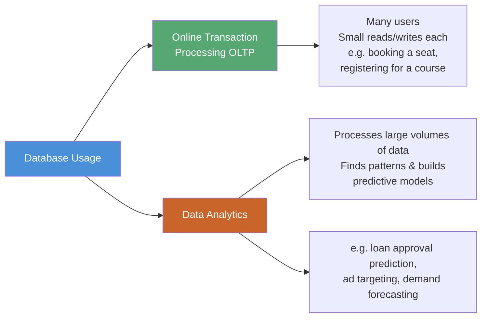

**Key idea:** You don't need to know how a car engine works just to drive the car — you use the steering wheel and pedals. In the same way, a DBMS lets people work with data through simple commands, while hiding all the complicated work happening underneath.

### The Data Behind These Applications: Structured, Semi-Structured, Unstructured

The data used by all these applications doesn't always look the same. It usually comes in one of three shapes:

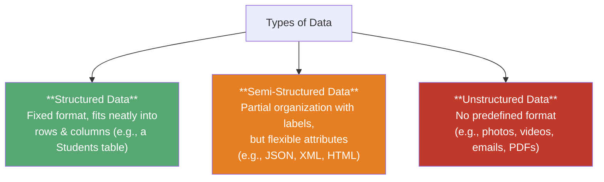

A JSON document is a good example of semi-structured data. It stores information as simple "label: value" pairs, but unlike a table, two documents of the same "type" don't need to have exactly the same fields:

```json
{ "studentId": "220101", "name": "Rahim Ahmed", "age": 21, "department": "Computer Science", "cgpa": 3.82 }
```

Universities, banks, and airlines mostly deal with *structured* data, which fits neatly into tables. Websites and document-heavy services, on the other hand, often deal with a mix of *semi-structured* and *unstructured* data too. This is one reason the semi-structured and NoSQL models (explained in §1.3.1) exist alongside — not instead of — the relational model.

### Popular DBMS Products Running These Applications

Here are some well-known DBMS products and where they're typically used:

| DBMS | Developed By | Common Applications |
|---|---|---|
| MySQL | Oracle Corporation | Web applications |
| PostgreSQL | PostgreSQL Global Development Group | Enterprise systems, research |
| Oracle Database | Oracle Corporation | Banking, finance, large enterprises |
| Microsoft SQL Server | Microsoft | Business applications |
| SQLite | SQLite Development Team | Mobile apps, embedded systems |
| MariaDB | MariaDB Foundation | Web servers, cloud applications |

---

## 1.2 Purpose of Database Systems

> **Important topic** — this comparison shows up very often in exams.

To understand *why* we even need a DBMS, picture a university that keeps all its student, teacher, and course data in plain computer files (like text files or spreadsheets), with separate small programs written to read and update them. This is called a **file-processing system**. The problem: every time something new is needed — a new department, a new kind of report — someone has to write a brand-new program from scratch. Over time, the files and programs pile up messily, with no one really in control of the whole picture.

### Disadvantages of File-Processing Systems

Here is what commonly goes wrong with this approach:

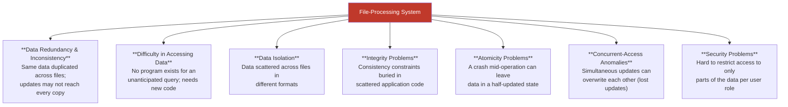

### Illustrative Example — Concurrent-Access Anomaly

Let's make this concrete. An account has $10,000, and two bank clerks both try to withdraw money from it at exactly the same time — Clerk A withdraws $500, Clerk B withdraws $100.

1. Both clerks' programs **read** the balance at the same moment: $10,000.
2. Clerk A subtracts $500 from $10,000, gets $9,500, and saves it.
3. Clerk B subtracts $100 from that *same original* $10,000 (not knowing about Clerk A's change), gets $9,900, and saves it — this **overwrites** Clerk A's update.
4. The final balance ends up being $9,900 or $9,500 — but the correct answer should have been $9,400.

$500 has simply vanished. This is exactly the kind of mistake that **transaction management** and **concurrency control** (topics covered later in this course) are built to prevent.

### Illustrative Example — Redundancy Causing Inconsistency

The first problem in the diagram above (D1) actually combines two related issues. It helps to think of one as causing the other:

1. **Redundancy** (the cause) — the same fact, say a student's home address, gets saved in two different places: the Admissions file *and* the Accounts file.
2. **Inconsistency** (the effect) — the student moves from Dhaka to Chattogram. The Admissions office updates its copy of the address, but the Accounts office forgets to update theirs. Now the two files disagree, and no one can tell which one is actually correct anymore.

This is exactly why a DBMS keeps just **one** master copy of each fact instead of scattering copies across many files.

### DBMS vs. File-Processing System

Putting it all together, here is how the two approaches compare side by side:

| Aspect | File-Processing System | Database System (DBMS) |
|---|---|---|
| Redundancy | High — data duplicated per program | Minimized via centralized schema |
| Data access | Needs new program per new query | Flexible ad-hoc queries (SQL) |
| Consistency | Enforced manually in each program | Enforced centrally via constraints |
| Atomicity | Not guaranteed | Guaranteed by transaction manager |
| Concurrency | Anomalies likely | Controlled via concurrency-control manager |
| Security | Ad-hoc, hard to enforce | Fine-grained authorization support |

### What a Well-Designed Database Achieves

Fixing those seven problems is only worthwhile if it actually leads to a database with these good qualities:

| Characteristic | Meaning |
|---|---|
| **Organized structure** | Similar data grouped into tables/logical structures instead of stored randomly |
| **Related data** | Tables are logically linked (e.g., a shared `dept_name` connects `instructor` and `department`) |
| **Persistence** | Data outlives the application/process that created it — it is still there the next time the app runs |
| **Shared access** | Many users (students, teachers, admins) use the same database concurrently, each for a different purpose |
| **Controlled redundancy** | Duplication is minimized (not necessarily zero) by storing shared facts once and referencing them |
| **Data integrity** | The system enforces rules so invalid data (e.g., CGPA = 5.30) is rejected |
| **Security** | Different users are restricted to different operations/data based on their role |

### Major Functions of a DBMS

To make all of that possible, every DBMS — no matter which company built it — does the same basic jobs:

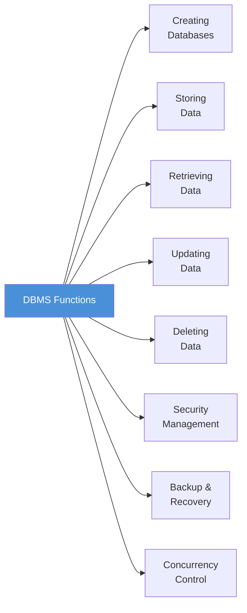

Later in §1.6, you'll see that each of these jobs is actually handled by a specific part inside the DBMS: security is handled by the Authorization & Integrity Manager, backups/recovery by the Recovery Manager, and controlling simultaneous access by the Concurrency-Control Manager.

---

## 1.3 View of Data

> **Important topic** — Data Models, Data Abstraction, and Instances/Schemas are asked about very often in exams.

A database system doesn't show you the messy, real details of how data sits on disk. Instead, it gives you a simplified, easy-to-understand **view** of the data, and hides the complicated storage details behind the scenes.

### 1.3.1 Data Models

A **data model** is simply a way of describing what the data looks like, how different pieces of data relate to each other, and what rules they must follow. There are four broad ways to do this:

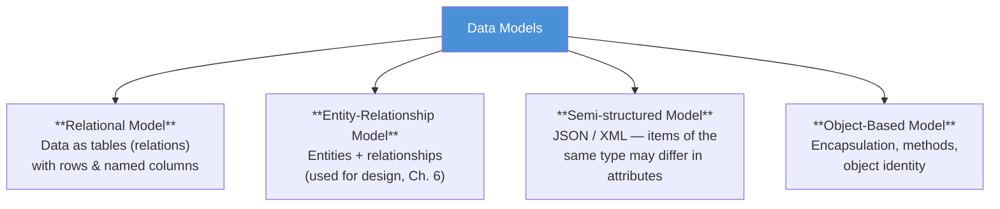

The **relational model** is the one used almost everywhere today. It stores data as **tables**, where each table has fixed **columns** (like "name" or "salary"), and each **row** is one record — for example, one instructor.

**Example — `instructor` and `department` tables:**

| ID | name | dept_name | salary |
|---|---|---|---|
| 22222 | Einstein | Physics | 95000 |
| 12121 | Wu | Finance | 90000 |
| 76766 | Crick | Biology | 72000 |

| dept_name | building | budget |
|---|---|---|
| Physics | Watson | 70000 |
| Biology | Watson | 90000 |
| Finance | Painter | 120000 |

### The Models That Came Before — and After — the Relational Model

The relational model wasn't the first attempt at solving this problem. Two older models came before it, and a newer family of models has grown up next to it. Comparing all of these is a favorite exam question, so let's walk through each one simply:

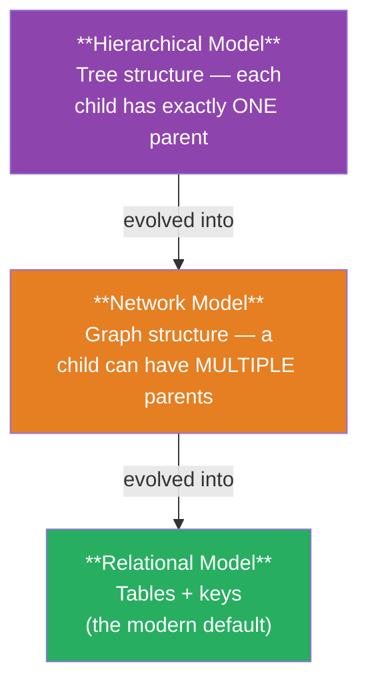

**1. Hierarchical Model** — imagine data arranged like a family tree or a company org chart: every record (except the very top one) has exactly **one** parent. This is easy to represent using a `Parent_ID` column, like this:

| Employee_ID | Employee_Name | Parent_ID | Position |
|---|---|---|---|
| 1 | CEO | NULL | Chief Executive |
| 2 | HR Manager | 1 | Manager |
| 5 | HR Officer 1 | 2 | Officer |

```
CEO
├── HR Manager
│   ├── HR Officer 1
│   └── HR Officer 2
└── Sales Manager
    ├── Sales Rep 1
    └── Sales Rep 2
```

*You see this in real life in:* computer file systems (a folder inside a folder) and company org charts. **The problem:** it can't easily handle a case where something has more than one "parent" — like a file that belongs to two folders, or an employee who reports to two managers.

**2. Network Model** — this fixes the hierarchical model's biggest weakness by letting a record connect to **more than one** parent, forming a graph instead of a strict tree. This makes many-to-many relationships easy to represent.

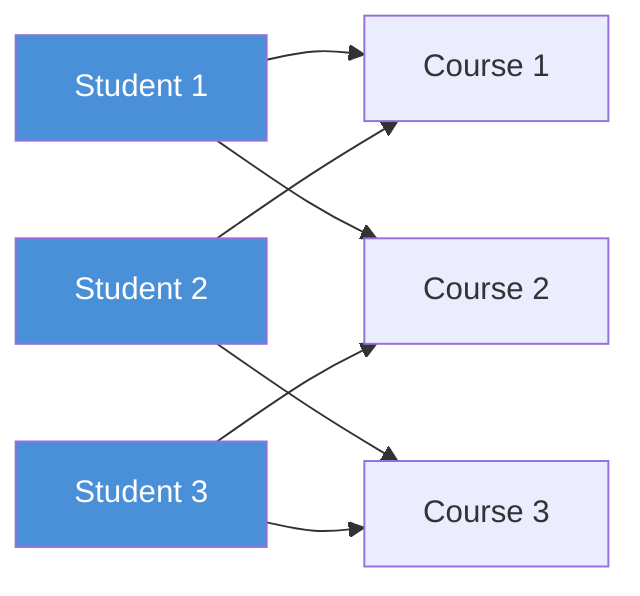

*You see this in real life in:* airline route maps, or complex product/parts inventories. Eventually, the **relational model** replaced both older models. Instead of hard-wiring pointers between records, it simply connects tables using shared key values — for example, linking the `instructor` and `department` tables just by matching a `dept_name` column, with no physical links needed.

**3. Object-Based Model** — this combines ideas from object-oriented programming (classes, inheritance, bundling data with behavior) with the idea of storing that data permanently, as shown below:

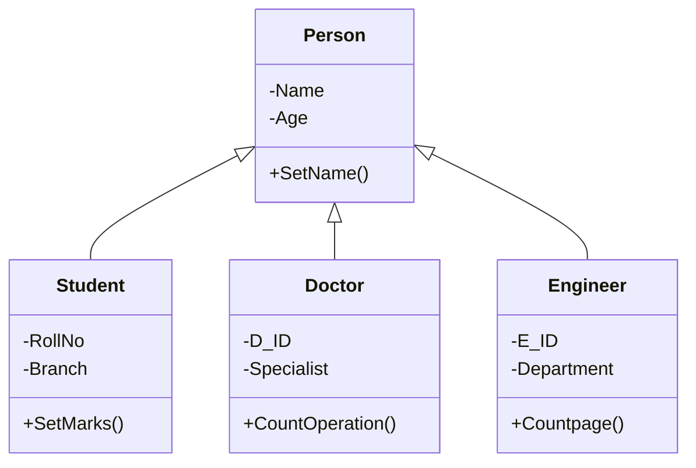

**4. NoSQL Models** — a modern group of database types that don't use tables at all. They were built to handle huge amounts of data and flexible, changing structures, building on the same **semi-structured** idea already mentioned in §1.1:

| NoSQL Type | Example Engine | Data Unit |
|---|---|---|
| **Document Model** | MongoDB | JSON/BSON documents grouped in collections |
| **Key–Value Model** | Redis | Simple key → value pairs |
| **Column-Family Model** | Cassandra | Rows with dynamic, wide sets of columns |
| **Graph Model** | Neo4j | Nodes + edges (relationships as first-class citizens) |

**MongoDB example** — here, all of a student's information, including the courses they're enrolled in, lives inside one single document. Notice how the `courses` list sits right inside the student record, instead of needing a separate `Enrollment` table:

```json
{
  "_id": "S1",
  "name": "Rahim",
  "department": "CSE",
  "courses": [
    { "course_id": "C1", "name": "Database", "semester": "Fall 2025" },
    { "course_id": "C2", "name": "Networking", "semester": "Fall 2025" }
  ]
}
```

### 1.3.2 Data Abstraction

The real way data is stored on disk is complicated and messy. To hide that complexity, a DBMS presents data at **three different levels**, like layers of an onion:

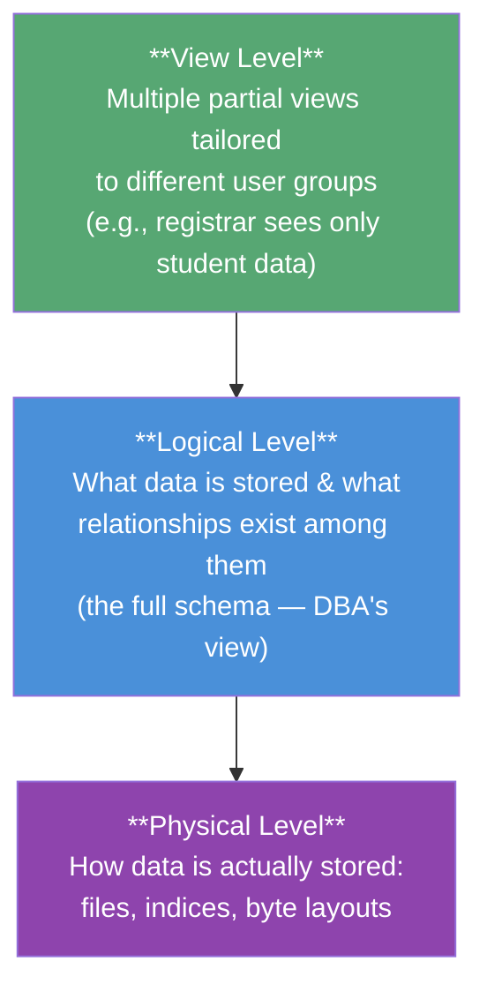

- **Physical level** — the lowest, most detailed level. It describes exactly how data is stored on disk: file layouts, indices, byte-level details. Most people never need to look here.
- **Logical level** — describes *what* data exists and how the pieces relate to each other, without worrying about physical storage. This is the level a database administrator normally works at.
- **View level** — the highest, simplest level. Each type of user only sees the part of the data relevant to them — this also works as a form of **security**, since users can't see data they shouldn't.

**Physical data independence** simply means: you can change *how* data is physically stored on disk without having to change the logical design or rewrite any application programs — because the logical level already hides those physical details from everyone above it.

### 1.3.3 Instances and Schemas

Two more words you'll see constantly in this course:

| Concept | Analogy (Programming Language) | Meaning |
|---|---|---|
| **Schema** | Variable declarations + type definitions | The overall, *time-invariant* **design/blueprint** of the database |
| **Instance** | Values held by variables at one moment | The actual data **stored at a particular point in time** |

- **Physical schema** — database design at the physical level.
- **Logical schema** — database design at the logical level (most important — application programs are built against this).
- **Subschema** — a schema at the view level.

Because instances change constantly (inserts/deletes/updates) while the schema stays comparatively stable, a good design keeps application programs dependent only on the **logical schema**, not on how data is stored physically — this, again, is **physical data independence**.

---

## 1.4 Database Languages

To work with a database, you need two kinds of instructions. A **Data-Definition Language (DDL)** designs and defines the database's structure. A **Data-Manipulation Language (DML)** adds, reads, changes, or removes the actual data. In real life (like in SQL), both are part of the same language — you don't need to learn two separate tools.

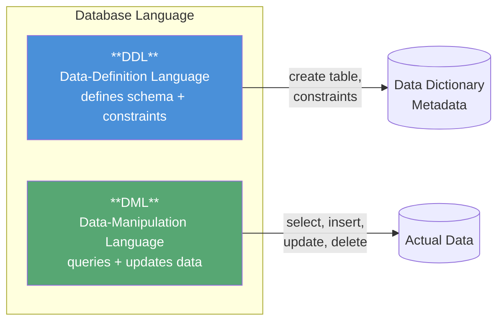

### 1.4.1 Data-Definition Language (DDL)

The DDL doesn't just define the structure — it also sets up **rules (constraints)** that the system automatically checks every time data is added or changed:

- **Domain Constraints** — limits what values a column can hold (for example, it must be a whole number, a valid date, or text of a certain length). This is the simplest and cheapest rule to check.
- **Referential Integrity** — makes sure a value used in one table actually exists in another table it points to. For example, every `dept_name` mentioned in the `course` table must really exist in the `department` table. If it doesn't, the system **rejects** the change.
- **Authorization** — decides who is allowed to do what with the data:
  - **read** — can view the data, but not change it.
  - **insert** — can add new data.
  - **update** — can change existing data, but not delete it.
  - **delete** — can remove data.

When you run a DDL command, the system stores the resulting structure in the **data dictionary** — think of it as the database's own notebook of "data about the data," which it checks every time anyone tries to access anything.

**Example (SQL DDL):**

```sql
create table department
    (dept_name char(20),
     building  char(15),
     budget    numeric(12,2));
```

### 1.4.2 Data-Manipulation Language (DML)

A DML lets you **read**, **add**, **remove**, and **change** data.

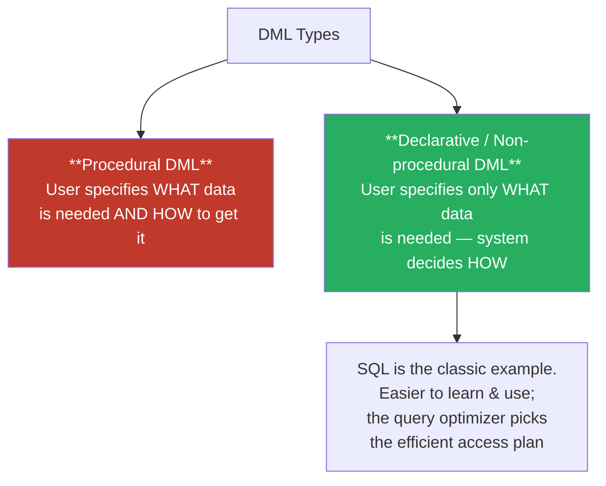

A **query** is simply a DML statement that asks for some data back. In casual conversation, people often use "query language" and "DML" to mean the same thing.

**Example (SQL query)** — find names of all instructors in the History department:

```sql
select instructor.name
from   instructor
where  instructor.dept_name = 'History';
```

**Example (multi-table query)** — instructors in departments with budget > $95,000:

```sql
select instructor.ID, department.dept_name
from   instructor, department
where  instructor.dept_name = department.dept_name
  and  department.budget > 95000;
```

### Completing the Language Set: DCL and TCL

DDL and DML are the two main categories covered by the textbook, but real SQL usage has two more categories that complete the full picture:

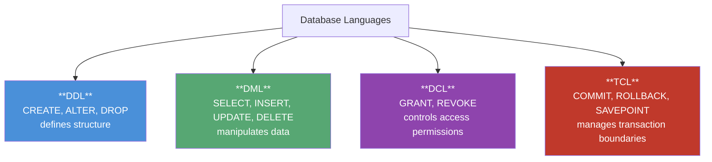

- **DCL (Data Control Language)** — commands like `GRANT` and `REVOKE`, used to actually hand out or take away the read/insert/update/delete permissions described above (covered in more depth in Chapter 4).
- **TCL (Transaction Control Language)** — commands like `COMMIT`, `ROLLBACK`, and `SAVEPOINT`, used to mark where a logical unit of work begins and ends. This connects directly to the Transaction Manager described later in §1.6.3.

### 1.4.3 Database Access from Application Programs

SQL is great at handling data, but it can't do everything a general-purpose programming language can — like showing a screen to a user or handling network requests. So in real applications, SQL commands are **embedded inside** a regular programming language (like Java, Python, or C++), connected through a bridge called an application-program interface:

- **ODBC** (Open Database Connectivity) — for C and other languages.
- **JDBC** (Java Database Connectivity) — for Java.

---

## 1.6 Database Engine

Inside every DBMS, the work is split into three broad parts:

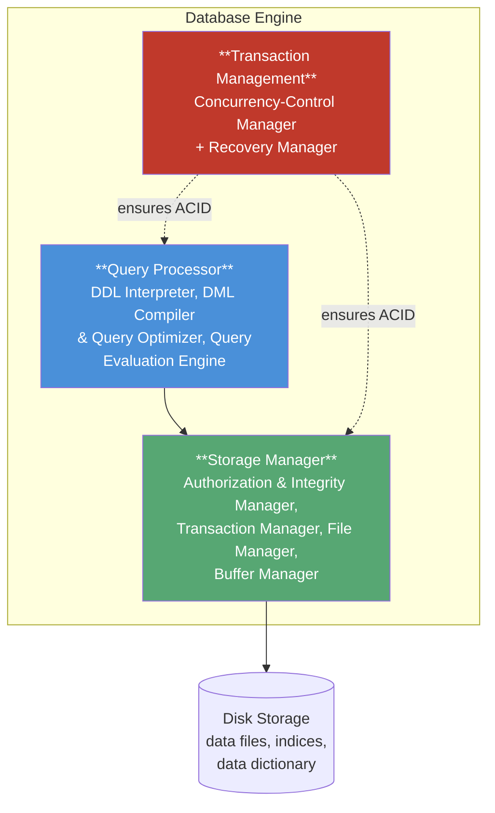

### 1.6.1 Storage Manager

This is the part that connects the raw, low-level stored data to the higher-level query/application layer. It turns DML commands into actual file operations, and is made up of:

- **Authorization & Integrity Manager** — checks that the user is allowed to do this action, and that no rules are being broken.
- **Transaction Manager** — makes sure the database stays correct even if the system crashes or many people are using it at once.
- **File Manager** — decides how data is organized and stored on disk.
- **Buffer Manager** — brings data from disk into fast memory (RAM) when needed, and decides what to keep in memory. This matters a lot because a full database is usually much bigger than the computer's memory.

The physical things it keeps track of are: the actual **data files**, the **data dictionary** (metadata), and **indices** — shortcuts for finding data fast, just like the index at the back of a textbook.

### 1.6.2 Query Processor

This part makes it easy and fast to get data, so users never have to think about how it is physically stored:

- **DDL Interpreter** — reads DDL commands and saves the resulting structure into the data dictionary.
- **DML Compiler** — turns a DML command (like a SQL query) into a step-by-step **execution plan**. It also does **query optimization** — picking the *fastest/cheapest* way to get the same result, out of several possible ways.
- **Query Evaluation Engine** — actually carries out that step-by-step plan and returns the result.

### 1.6.3 Transaction Management

A **transaction** is a group of operations that should all be treated as one single unit — for example, transferring money means both subtracting from one account *and* adding to another; both must happen together. The transaction manager makes sure every transaction follows these four rules, known as **ACID**:

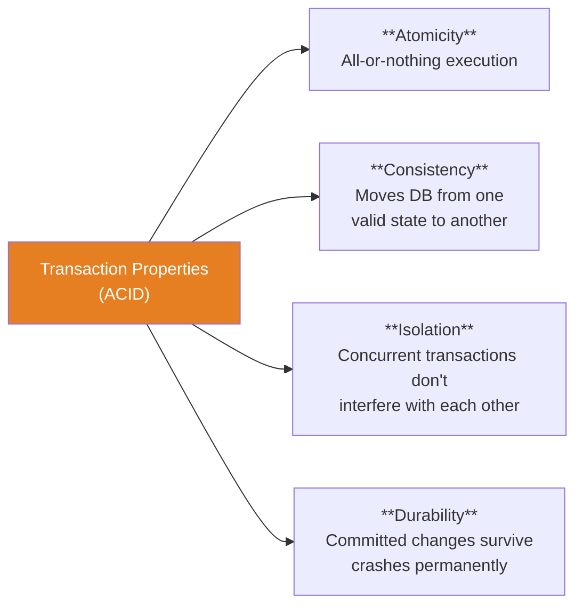

- **Recovery Manager** — makes sure transactions are all-or-nothing (**atomicity**) and that finished work is never lost (**durability**), even after a crash.
- **Concurrency-Control Manager** — carefully manages the order in which multiple transactions run together, so they don't step on each other's toes (**consistency** and **isolation**).

### Putting It All Together: The Full Engine Pipeline

Let's zoom into the **Query Processor** and **Storage Manager** boxes from the diagram above and see the full journey a request takes, from the user all the way down to the disk and back:

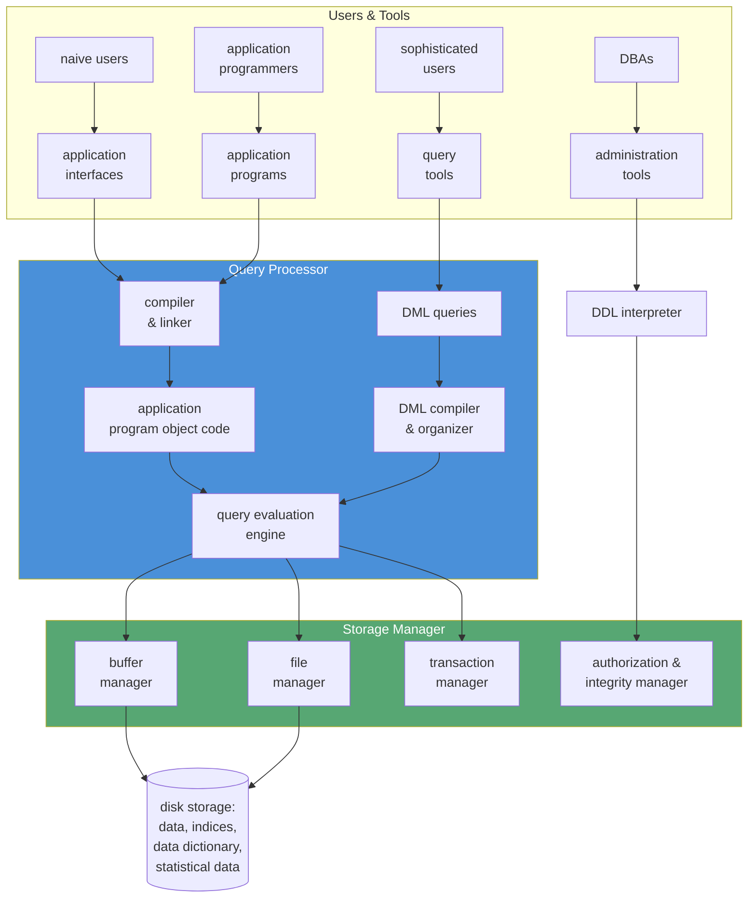

This is really just a more detailed picture of §1.6.1 and §1.6.2, showing how each of the four kinds of users (from §1.8) eventually reaches the disk:

- **DDL Interpreter** — handles `CREATE`/`ALTER`/`DROP` commands (the DDL from §1.4), updating the schema and data dictionary.
- **DML Compiler & Organizer** — turns `SELECT`/`INSERT`/`UPDATE`/`DELETE` commands (the DML from §1.4) into a plan the system can run.
- **Compiler and Linker** — takes application programs with embedded SQL (using ODBC/JDBC from §1.4.3) and turns them into a program the computer can actually run.
- **Query Evaluation Engine** — runs the plan and hands back the results.
- **Buffer Manager** / **File Manager** — the same two components from §1.6.1, now shown actually moving data between disk and memory, and organizing the physical files.
- **Authorization & Integrity Manager** — the checkpoint that enforces DCL permissions and DDL rules.

---

## 1.7 Database and Application Architecture

How a modern computer system is set up has a big effect on how database applications are built. Most applications use one of two basic layouts: **two-tier** or **three-tier**.

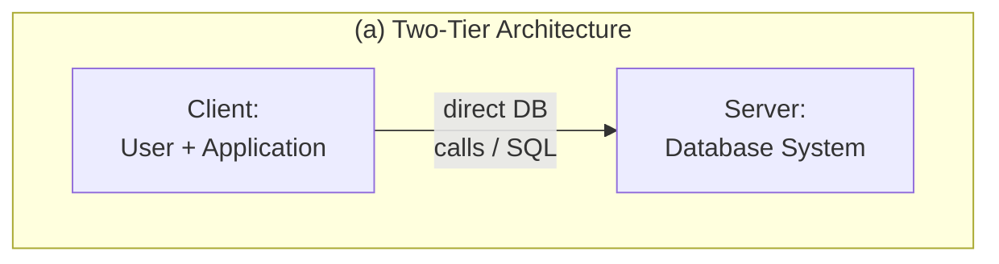

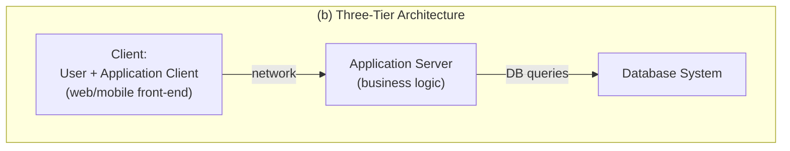


| Feature | Two-Tier | Three-Tier |
|---|---|---|
| Structure | Client ↔ Database Server | Client ↔ Application Server ↔ Database Server |
| Business logic location | Spread across many clients | Centralized in the application server |
| Security | Weaker — clients access DB directly | Stronger — DB hidden behind app server |
| Performance at scale | Degrades with many clients | Scales better for web-scale traffic |
| Typical use today | Legacy / thick-client desktop apps | Web apps, mobile apps (web browser or app is the thin client) |

**Why three-tier is better for the web:** by keeping all the business logic in one central application server, the client (a browser or phone app) can stay simple and lightweight. Security is easier too, since there's just one gate to guard. And this setup can support millions of users at once — something a direct client-to-database connection simply can't handle safely.

### A Concrete Request Walk-Through

Let's trace through exactly what happens, step by step, when a student clicks **"View Results"** on a university website. This kind of step-by-step tracing is a common exam question:

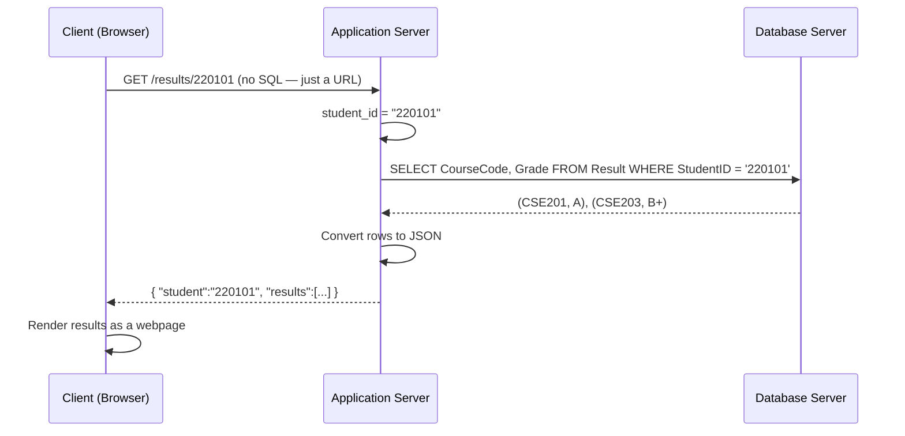

The most important thing to remember: **the client (browser) never sees or writes any SQL.** Only the application server talks directly to the database. This is exactly the separation between layers described in the comparison table above.

---

## 1.8 Database Users and Administrators

### Types of Database Users

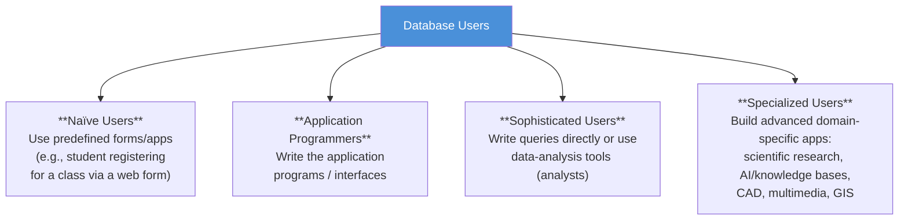

These four types of users match up exactly with the "Users & Tools" box at the top of the pipeline diagram in §1.6: naïve users go through application interfaces, application programmers write the programs compiled in that pipeline, sophisticated users use the query tools directly, and specialized users push every layer of the engine to support unusual data like images, map coordinates, or knowledge graphs.

### Database Administrator (DBA)

The DBA (Database Administrator) is the person in charge of both the data and the programs that use it. Their main jobs are:

| Responsibility | Description |
|---|---|
| **Schema definition** | Designs the original database structure using DDL commands |
| **Storage & access-method definition** | Decides how data is physically stored and indexed |
| **Schema & physical-organization modification** | Updates the design as the organization's needs change over time |
| **Granting authorization** | Decides which users can access which parts of the data |
| **Routine maintenance** | Takes backups, keeps enough free disk space, and checks that queries run fast enough |

---

## Syllabus Connection

Concepts of database systems, schemas, instances, levels of data abstraction, and database architectures.

## Board Exam Pattern Mapping

- **Question 1(a) (2024 Exam):** Differentiating a DBMS from file-based systems and listing three advantages.
- **Question 1(b) (2024 Exam):** Differentiating **Data** (raw, uninterpreted facts), **Information** (processed, context-rich data), and a **Database** (structured, persistent, shared collection of related data).
- **Question 1(c) (2023 & 2024 Exams):** Comparing the **Hierarchical Model** (tree-structured, parent-child), **Network Model** (graph-structured, multiple parents), and **Relational Model** (table-structured using keys).
- **Question 3(a) (2024 Exam):** Distinguishing between a **Database Schema** (the overall design or blueprint of the database) and a **Database Instance** (the actual data stored at a particular moment in time).
- **Question 1(c) (2023 Exam):** Explaining the **Three Levels of Abstraction** (Physical, Logical, and View levels) and how they achieve physical data independence.
- **Question 1.12 & 1.18 (Practice Exercises / Exams):** Explaining why a **Three-Tier Architecture** (with an intermediate Application Server containing business logic) is superior for web-scale applications compared to a **Two-Tier Architecture** (where the client talks directly to the database server).
