# Chapter 1: Introduction

**Part:** [Part 1 — Database System Foundations & Conceptual Design](../README.md)
**Textbook:** *Database System Concepts*, 7th Edition — Silberschatz, Korth, Sudarshan

## Exact Subsections to Read

- **1.1** Database-System Applications
- **1.2** Purpose of Database Systems *(Critical: understand the comparison with file-processing systems)*
- **1.3** View of Data *(Critical: Data Models, Data Abstraction, Instances and Schemas)*
- **1.4** Database Languages (DDL and DML)
- **1.6** Database Engine (Storage Manager, Query Processor, Transaction Manager)
- **1.7** Database and Application Architecture (Two-tier vs. Three-tier architectures)
- **1.8** Database Users and Administrators

> A **database-management system (DBMS)** is a collection of interrelated data (the **database**) plus a set of programs to access, manage, and manipulate that data. Its primary goal is to provide a **convenient** and **efficient** way to store and retrieve information while ensuring the data's safety, consistency, and availability to many simultaneous users.

---

## 1.1 Database-System Applications

All database applications — old and new — share one thing in common: the **data itself** is the central asset, not the program that briefly processes it. A bank without its account data, or a social network without its user connections, would lose nearly all of its value.

Database systems are used to manage collections of data that are:

- **Highly valuable** — the information often *is* the business.
- **Relatively large** — too big to manage manually or in memory alone.
- **Accessed concurrently** — by many users and applications at the same time.

### Representative Application Domains

| Domain | Example Uses |
|---|---|
| **Enterprise Information** | Sales (customers, products, purchases), Accounting (payments, balances), Human Resources (payroll, benefits) |
| **Manufacturing** | Supply-chain management, production tracking, inventory, orders |
| **Banking & Finance** | Customer accounts and loans, credit-card transactions, stock/bond trading |
| **Universities** | Student records, course registration, grades |
| **Airlines** | Reservations and schedules (early pioneers of geographically distributed databases) |
| **Telecommunication** | Call/text/data usage records, billing, prepaid balances |
| **Web-Based Services** | Social media (users, posts, likes), online retail (orders, browsing history), online ads (click tracking) |
| **Document Databases** | News articles, patents, research papers |
| **Navigation Systems** | Points of interest, road/route networks |

### Two Modes of Database Use

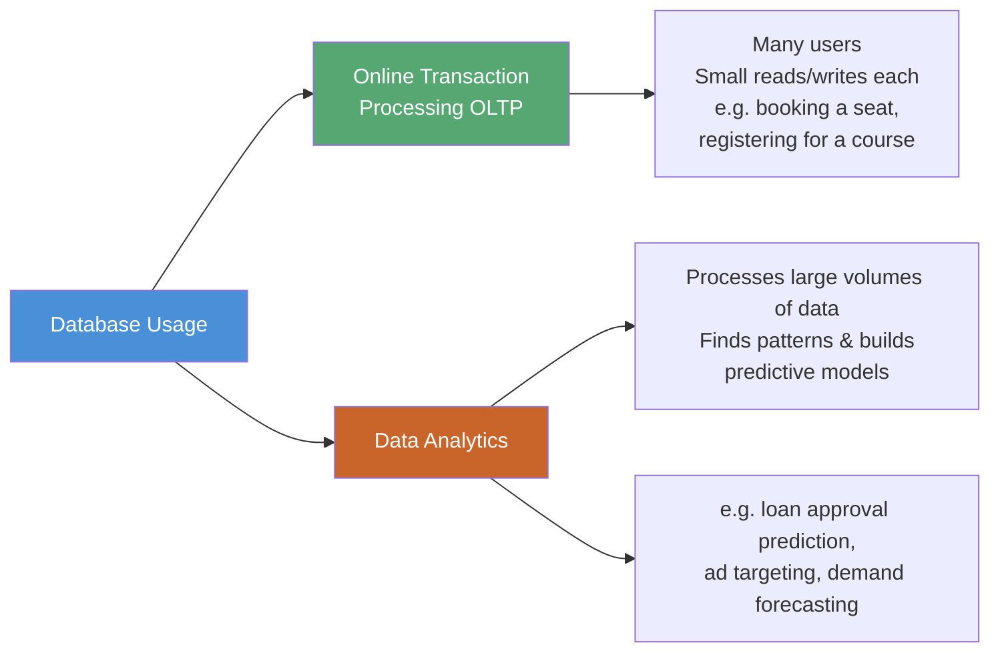

**Key idea:** Abstraction lets a driver operate a car without knowing how the engine works. Likewise, a DBMS gives users and programmers a simple, abstract view of data while hiding the complex machinery underneath.

---

## 1.2 Purpose of Database Systems

> **Critical topic** — this is one of the most frequently examined comparisons in the course.

To see *why* DBMSs exist, imagine a university keeping student, instructor, and course data in plain **operating-system files**, processed by custom-written application programs (a **file-processing system**). Every new requirement (a new major, a new report) means writing a brand-new program, and the pile of files/programs keeps growing in an uncoordinated way.

### Disadvantages of File-Processing Systems

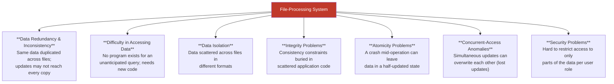

### Illustrative Example — Concurrent-Access Anomaly

Two clerks both withdraw money from an account with a balance of $10,000 (withdrawing $500 and $100 respectively) at the same time:

1. Both programs **read** the old balance: $10,000.
2. Clerk A computes $10,000 − $500 = $9,500 and writes it back.
3. Clerk B computes $10,000 − $100 = $9,900 and writes it back — **overwriting** Clerk A's update.
4. Final balance is incorrectly $9,900 or $9,500, instead of the correct $9,400.

This is exactly why **transaction management** and **concurrency control** (covered later in the course) are essential.

### DBMS vs. File-Processing System

| Aspect | File-Processing System | Database System (DBMS) |
|---|---|---|
| Redundancy | High — data duplicated per program | Minimized via centralized schema |
| Data access | Needs new program per new query | Flexible ad-hoc queries (SQL) |
| Consistency | Enforced manually in each program | Enforced centrally via constraints |
| Atomicity | Not guaranteed | Guaranteed by transaction manager |
| Concurrency | Anomalies likely | Controlled via concurrency-control manager |
| Security | Ad-hoc, hard to enforce | Fine-grained authorization support |

---

## 1.3 View of Data

> **Critical topic** — Data Models, Data Abstraction, and Instances/Schemas are consistently tested.

A database system provides an **abstract view** of data: users interact with a simplified representation while the system hides how data is physically stored.

### 1.3.1 Data Models

A **data model** is a collection of conceptual tools for describing data, relationships, semantics, and consistency constraints. Four broad categories:

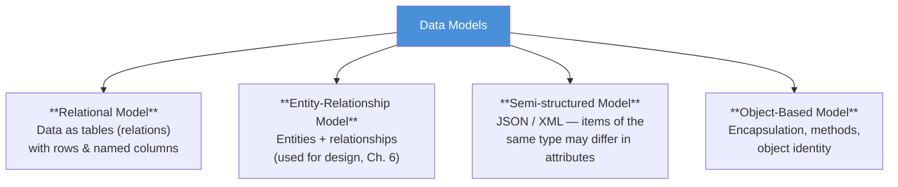

The **relational model** dominates modern practice: data is stored as a set of **tables (relations)**, each with a fixed set of named **columns (attributes)**, and rows represent individual records.

**Example — `instructor` and `department` tables:**

| ID | name | dept_name | salary |
|---|---|---|---|
| 22222 | Einstein | Physics | 95000 |
| 12121 | Wu | Finance | 90000 |
| 76766 | Crick | Biology | 72000 |

| dept_name | building | budget |
|---|---|---|
| Physics | Watson | 70000 |
| Biology | Watson | 90000 |
| Finance | Painter | 120000 |

### 1.3.2 Data Abstraction

Since real storage structures are complex, a DBMS hides this complexity behind **three levels of abstraction**:

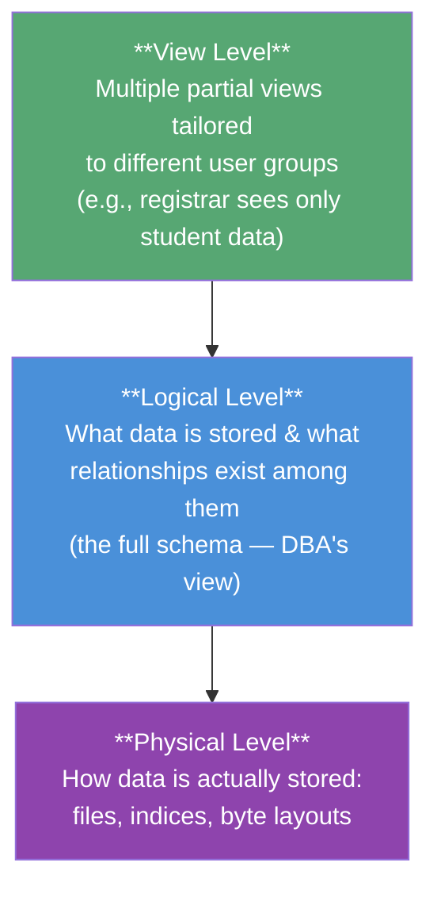

- **Physical level** — lowest level; describes low-level storage structures in detail (block layout, indices).
- **Logical level** — describes *what* data is stored and the relationships among data, using relatively simple structures; this is the level database administrators work at.
- **View level** — highest level; each view exposes only the portion of the database relevant to a particular class of user, also acting as a **security mechanism**.

**Physical data independence:** the ability to modify the physical schema (how data is stored) *without* requiring changes to the logical schema or application programs — because the logical level hides physical details.

### 1.3.3 Instances and Schemas

| Concept | Analogy (Programming Language) | Meaning |
|---|---|---|
| **Schema** | Variable declarations + type definitions | The overall, *time-invariant* **design/blueprint** of the database |
| **Instance** | Values held by variables at one moment | The actual data **stored at a particular point in time** |

- **Physical schema** — database design at the physical level.
- **Logical schema** — database design at the logical level (most important — application programs are built against this).
- **Subschema** — a schema at the view level.

Because instances change constantly (inserts/deletes/updates) while the schema stays comparatively stable, a good design keeps application programs dependent only on the **logical schema**, not on how data is stored physically — this, again, is **physical data independence**.

---

## 1.4 Database Languages

A DBMS provides a **Data-Definition Language (DDL)** to define the schema and a **Data-Manipulation Language (DML)** to query and update data. In practice (e.g., SQL), both are part of one unified language.

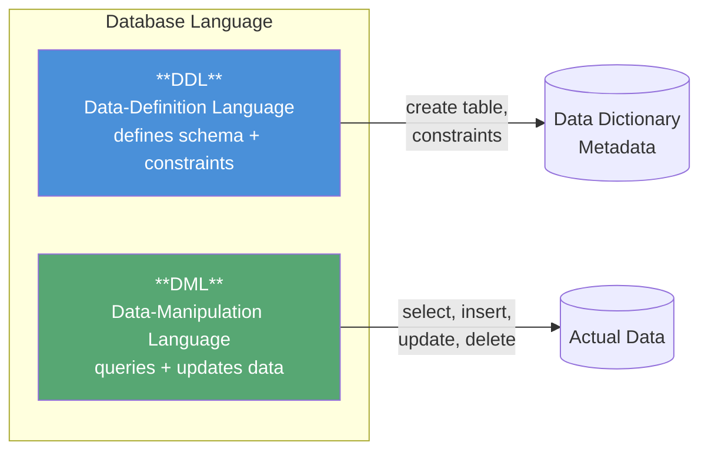

### 1.4.1 Data-Definition Language (DDL)

The DDL defines the schema **and** the integrity constraints that the system enforces on every update:

- **Domain Constraints** — restricts the values an attribute can take (e.g., integer, date, char(20)). Cheapest to check.
- **Referential Integrity** — a value referenced in one relation must actually exist in another (e.g., every `dept_name` in `course` must exist in `department`). Violations are normally **rejected**.
- **Authorization** — controls who may do what:
  - **read** authorization — may read, not modify.
  - **insert** authorization — may add new data.
  - **update** authorization — may modify, not delete.
  - **delete** authorization — may remove data.

DDL statements are compiled and the result is stored in the **data dictionary**, a special table of metadata ("data about data") consulted by the system before every access.

**Example (SQL DDL):**

```sql
create table department
    (dept_name char(20),
     building  char(15),
     budget    numeric(12,2));
```

### 1.4.2 Data-Manipulation Language (DML)

A DML enables **retrieval**, **insertion**, **deletion**, and **modification** of data.

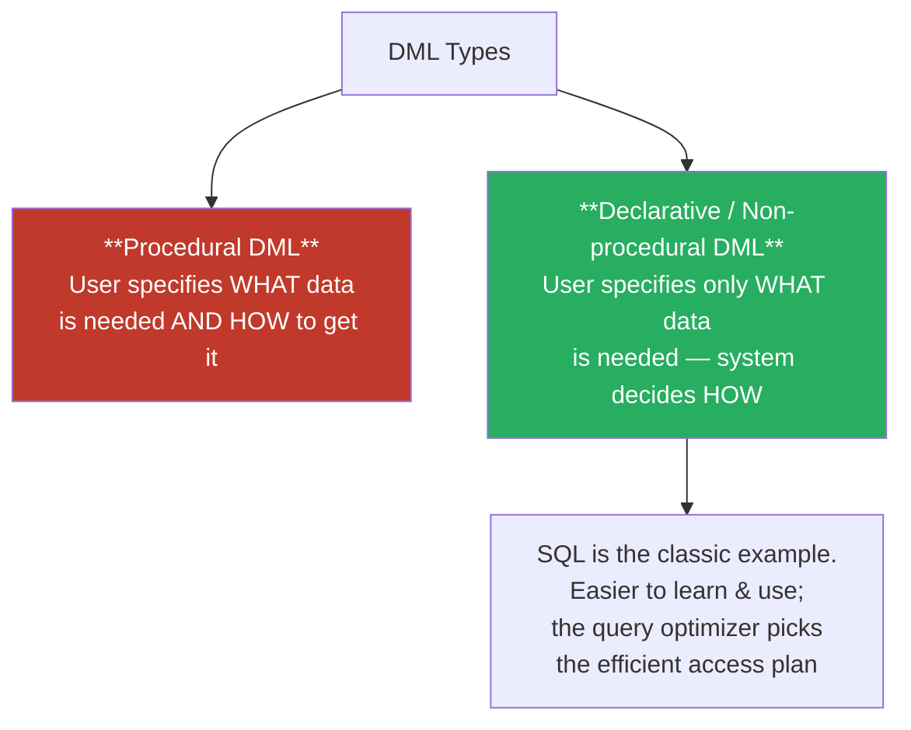

A **query** is a DML statement requesting information retrieval; loosely, "query language" and "DML" are used interchangeably.

**Example (SQL query)** — find names of all instructors in the History department:

```sql
select instructor.name
from   instructor
where  instructor.dept_name = 'History';
```

**Example (multi-table query)** — instructors in departments with budget > $95,000:

```sql
select instructor.ID, department.dept_name
from   instructor, department
where  instructor.dept_name = department.dept_name
  and  department.budget > 95000;
```

### 1.4.3 Database Access from Application Programs

SQL alone cannot do everything a general-purpose language can (e.g., user I/O, network communication) — it is not Turing-complete for such tasks. So SQL statements are **embedded** inside a **host language** (Java, Python, C/C++) via an application-program interface:

- **ODBC** (Open Database Connectivity) — for C and other languages.
- **JDBC** (Java Database Connectivity) — for Java.

---

## 1.6 Database Engine

The internal architecture of a DBMS is divided into three broad functional components:

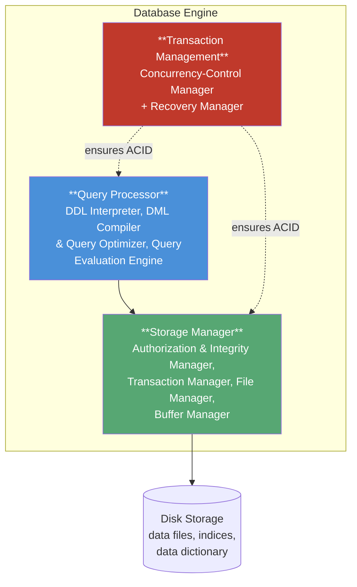

### 1.6.1 Storage Manager

Bridges the gap between low-level stored data and the application/query layer. It translates DML operations into low-level file-system commands and consists of:

- **Authorization & Integrity Manager** — checks user privileges and integrity constraints.
- **Transaction Manager** — keeps the database consistent despite failures and concurrent access.
- **File Manager** — manages disk-space allocation and file data structures.
- **Buffer Manager** — fetches data from disk into main memory and decides what to cache; crucial since databases are far larger than RAM.

Physical structures it maintains: **data files**, the **data dictionary**, and **indices** (fast lookup structures, analogous to a book's index).

### 1.6.2 Query Processor

Simplifies and speeds up access to data so users needn't understand physical-level implementation:

- **DDL Interpreter** — interprets DDL statements, records definitions in the data dictionary.
- **DML Compiler** — translates DML statements into a low-level **evaluation plan**; also performs **query optimization**, i.e., selecting the *lowest-cost* plan among equivalent alternatives.
- **Query Evaluation Engine** — executes the low-level instructions produced by the compiler.

### 1.6.3 Transaction Management

A **transaction** is a collection of operations forming one logical unit of work (e.g., a bank funds transfer = debit + credit). The transaction manager must guarantee:

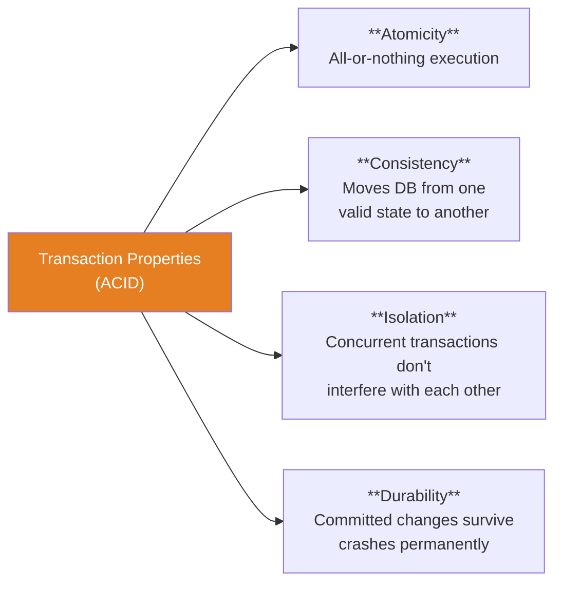

- **Recovery Manager** — ensures **atomicity** and **durability**; restores the database to a consistent state after a crash (**failure recovery**).
- **Concurrency-Control Manager** — controls interleaving of concurrent transactions to preserve **consistency** and **isolation**.

---

## 1.7 Database and Application Architecture

Modern computer-system structure heavily shapes database-application design. Applications are commonly split into **two-tier** or **three-tier** architectures.

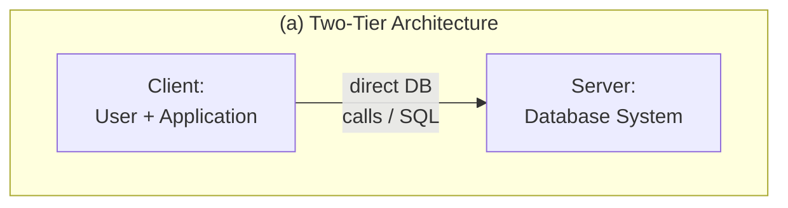

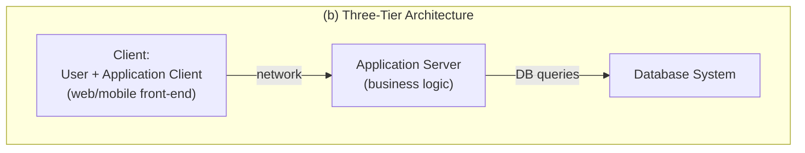

| Feature | Two-Tier | Three-Tier |
|---|---|---|
| Structure | Client ↔ Database Server | Client ↔ Application Server ↔ Database Server |
| Business logic location | Spread across many clients | Centralized in the application server |
| Security | Weaker — clients access DB directly | Stronger — DB hidden behind app server |
| Performance at scale | Degrades with many clients | Scales better for web-scale traffic |
| Typical use today | Legacy / thick-client desktop apps | Web apps, mobile apps (web browser or app is the thin client) |

**Why three-tier wins for the web:** centralizing business logic in an application server means client machines (browsers, mobile apps) stay simple and interchangeable, security is easier to enforce at one choke point, and the architecture scales to millions of concurrent users — something a direct client-to-database link cannot do safely or efficiently.

---

## 1.8 Database Users and Administrators

### Types of Database Users

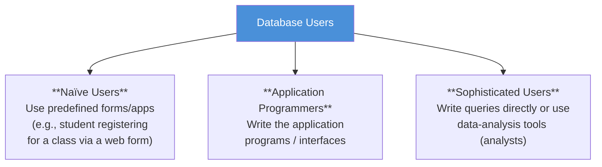

### Database Administrator (DBA)

The DBA is the person with **central control** over both the data and the programs accessing it. Core responsibilities:

| Responsibility | Description |
|---|---|
| **Schema definition** | Creates the original database schema via DDL statements |
| **Storage & access-method definition** | Chooses physical organization and indices |
| **Schema & physical-organization modification** | Adapts schema/design as enterprise needs change |
| **Granting authorization** | Controls which users can access which parts of the data |
| **Routine maintenance** | Backups, ensuring free disk space, monitoring job/query performance |

---

## Syllabus Connection

Concepts of database systems, schemas, instances, levels of data abstraction, and database architectures.

## Board Exam Pattern Mapping

- **Question 1(a) (2024 Exam):** Differentiating a DBMS from file-based systems and listing three advantages.
- **Question 1(b) (2024 Exam):** Differentiating **Data** (raw, uninterpreted facts), **Information** (processed, context-rich data), and a **Database** (structured, persistent, shared collection of related data).
- **Question 1(c) (2023 & 2024 Exams):** Comparing the **Hierarchical Model** (tree-structured, parent-child), **Network Model** (graph-structured, multiple parents), and **Relational Model** (table-structured using keys).
- **Question 3(a) (2024 Exam):** Distinguishing between a **Database Schema** (the overall design or blueprint of the database) and a **Database Instance** (the actual data stored at a particular moment in time).
- **Question 1(c) (2023 Exam):** Explaining the **Three Levels of Abstraction** (Physical, Logical, and View levels) and how they achieve physical data independence.
- **Question 1.12 & 1.18 (Practice Exercises / Exams):** Explaining why a **Three-Tier Architecture** (with an intermediate Application Server containing business logic) is superior for web-scale applications compared to a **Two-Tier Architecture** (where the client talks directly to the database server).
