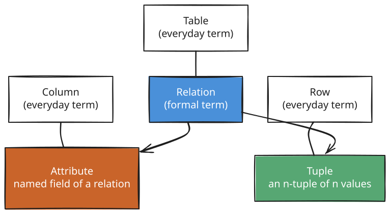
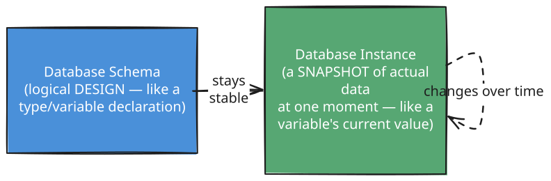
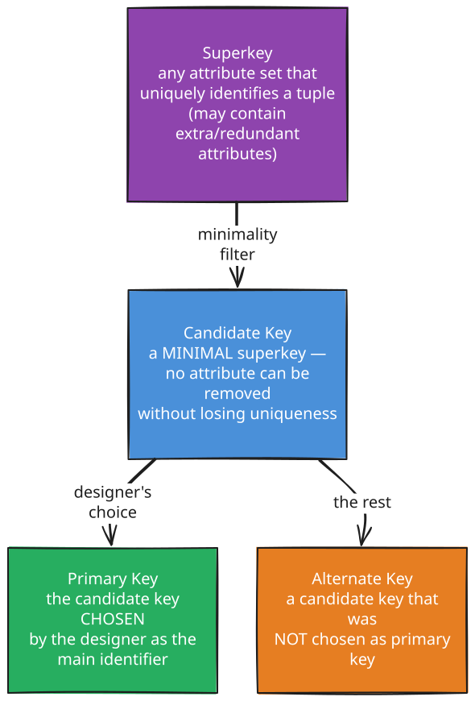
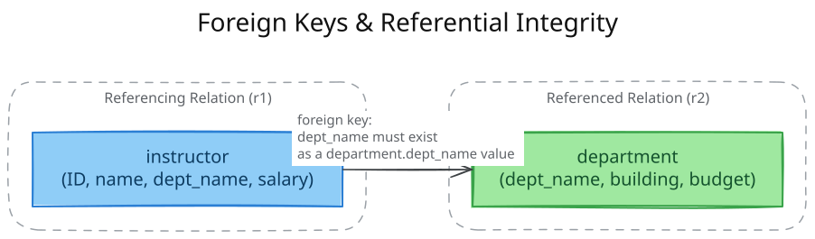
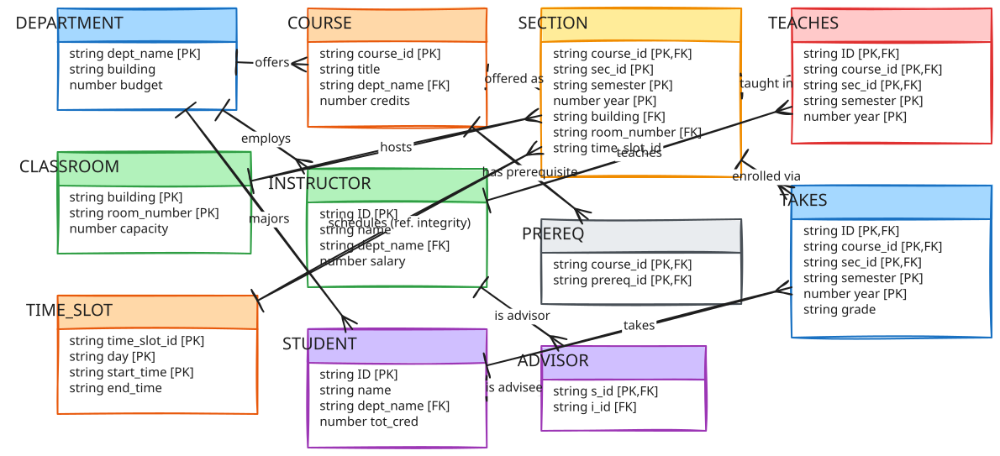
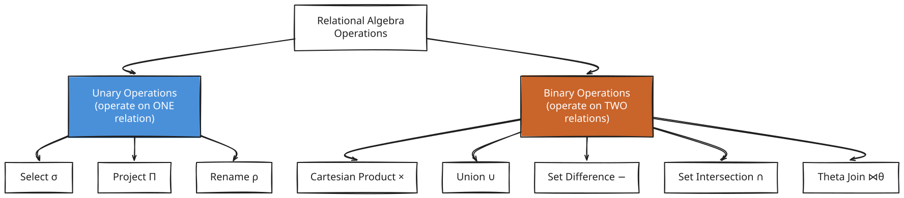
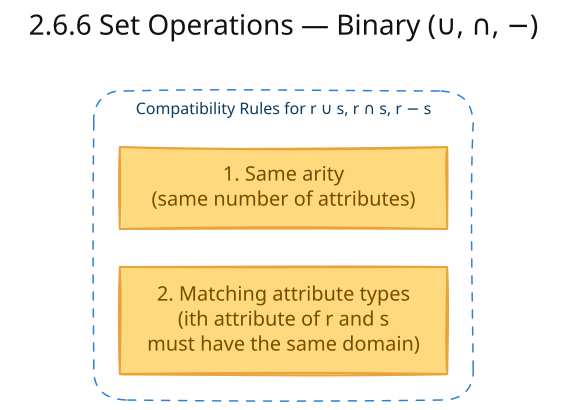
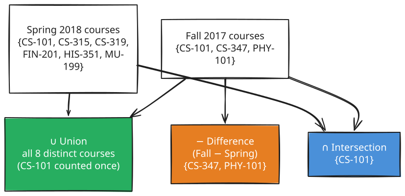

# Chapter 2: Introduction to the Relational Model

**Part:** [Part 1 — Database System Foundations & Conceptual Design](../README.md)
**Textbook:** *Database System Concepts*, 7th Edition — Silberschatz, Korth, Sudarshan

## Exact Subsections to Read

- **2.1** Structure of Relational Databases (Tuples, attributes, domains, atomic values)
- **2.2** Database Schema
- **2.3** Keys (Superkey, Candidate key, Primary key, Foreign key, Alternate key)
- **2.4** Schema Diagrams
- **2.6** The Relational Algebra (Unary operations: Select σ, Project Π, Rename ρ; Binary operations: Cartesian Product ×, Union ∪, Set Difference −, Set Intersection ∩, Theta Join ⋈θ)

> The **relational model** represents a database as a collection of **tables (relations)**. Its simplicity — hiding all low-level storage details behind rows and columns — is why it has remained the dominant data model for over 50 years.

---

## 2.1 Structure of Relational Databases

A relational database is a **collection of tables**, each assigned a unique name. Each row represents one record; each column represents one property of that record.

**Example — the `instructor` relation:**

| ID | name | dept_name | salary |
|---|---|---|---|
| 10101 | Srinivasan | Comp. Sci. | 65000 |
| 12121 | Wu | Finance | 90000 |
| 22222 | Einstein | Physics | 95000 |
| 76766 | Crick | Biology | 72000 |

### Core Terminology

<p align="center">
  
</p>

<sub><em>Editable diagram source: <a href="diagrams/d01-core-terminology.excalidraw">d01-core-terminology.excalidraw</a> — open in <a href="https://excalidraw.com">Excalidraw</a> to edit.</em></sub>

| Term | Meaning |
|---|---|
| **Relation** | A table — a mathematical *set* of tuples |
| **Tuple** | A row — an ordered list (n-tuple) of n values |
| **Attribute** | A column — a named property with an associated domain |
| **Relation Instance** | A specific set of tuples (rows) held by a relation at one moment |
| **Domain** | The set of all permitted values for an attribute |
| **Atomic Domain** | A domain whose elements are treated as *indivisible* units (cannot be split further, e.g. a single phone number, not a set of phone numbers) |
| **Null Value** | A special marker meaning the value is *unknown* or *does not exist* |

### Key Rules of a Relation

1. **Order of tuples is irrelevant** — a relation is a *set*; a sorted or unsorted listing of the same rows is the same relation.
2. **Every attribute domain must be atomic** — e.g., storing `phone_number` as a *set* of numbers violates atomicity; a single indivisible phone number does not.
3. **No two tuples may be identical** in a strict relation (though commercial DBMSs relax this and permit duplicate rows unless a constraint forbids it).
4. **Null** signifies "unknown/does not exist" and requires special handling in queries (covered later in SQL, Section 3.6).

---

## 2.2 Database Schema

<p align="center">
  
</p>

<sub><em>Editable diagram source: <a href="diagrams/d02-2-2-database-schema.excalidraw">d02-2-2-database-schema.excalidraw</a> — open in <a href="https://excalidraw.com">Excalidraw</a> to edit.</em></sub>

- **Relation schema** — the list of attributes (and their domains) that define a relation's structure, e.g.:

  ```text
  department (dept_name, building, budget)
  ```

- **Relation instance** — the actual current rows held by that relation.

Common attributes across relations are how tuples of *different* relations get related. For example, `dept_name` appears in both `instructor` and `department`, letting us connect an instructor to their department's building and budget.

### Sample University Schema (used throughout the course)

```text
classroom  (building, room_number, capacity)
department (dept_name, building, budget)
course     (course_id, title, dept_name, credits)
instructor (ID, name, dept_name, salary)
section    (course_id, sec_id, semester, year, building, room_number, time_slot_id)
teaches    (ID, course_id, sec_id, semester, year)
student    (ID, name, dept_name, tot_cred)
takes      (ID, course_id, sec_id, semester, year, grade)
advisor    (s_ID, i_ID)
time_slot  (time_slot_id, day, start_time, end_time)
prereq     (course_id, prereq_id)
```

*(Primary-key attributes are conventionally listed first and underlined — see Section 2.3.)*

---

## 2.3 Keys

> **Critical topic** — key identification and classification is heavily examined.

We need a way to uniquely distinguish every tuple in a relation using its attribute values.

<p align="center">
  
</p>

<sub><em>Editable diagram source: <a href="diagrams/d03-2-3-keys.excalidraw">d03-2-3-keys.excalidraw</a> — open in <a href="https://excalidraw.com">Excalidraw</a> to edit.</em></sub>

### Definitions

| Key Type | Definition | Example (`instructor`) |
|---|---|---|
| **Superkey** | A set of one or more attributes that, taken together, uniquely identify a tuple. May include extraneous attributes. | `{ID}`, `{ID, name}` are both superkeys |
| **Candidate Key** | A **minimal** superkey — removing any attribute destroys the uniqueness guarantee. | `{ID}` is a candidate key; `{ID, name}` is **not** (it isn't minimal) |
| **Primary Key** | The candidate key selected by the database designer as the principal means of identifying tuples. Written **underlined**. | `ID` |
| **Alternate Key** | Any candidate key that exists but was **not** picked as the primary key. | If `{name, dept_name}` also happens to be unique, it becomes an alternate key |
| **Composite Key** | A primary/candidate key made of **more than one** attribute. | `classroom(building, room_number)` — neither attribute alone is unique, but together they are |

> **Formal definition:** Let *R* be the attribute set of relation *r*. A subset *K ⊆ R* is a superkey if, for any two distinct tuples *t₁ ≠ t₂* in *r*, *t₁.K ≠ t₂.K*.

### Worked Example — `classroom` and `time_slot`

```text
classroom (building, room_number, capacity)
```
Neither `building` nor `room_number` alone is unique (many rooms share a building name; room numbers repeat across buildings) — but **together** they form a composite primary key.

```text
time_slot (time_slot_id, day, start_time, end_time)
```
A single `time_slot_id` can meet on multiple days and even multiple times per day, so the primary key must be the composite `{time_slot_id, day, start_time}` — `end_time` is **not** needed for uniqueness.

### Choosing a Good Primary Key

- Prefer values that **rarely or never change** (e.g., a national ID) over ones that can change (e.g., an address).
- For entities without a natural unique attribute, enterprises generate their **own unique identifiers**.

### Foreign Keys & Referential Integrity

<p align="center">
  
</p>

<sub><em>Editable diagram source: <a href="diagrams/d04-foreign-keys.excalidraw">d04-foreign-keys.excalidraw</a> — open in <a href="https://excalidraw.com">Excalidraw</a> to edit.</em></sub>

| Concept | Definition |
|---|---|
| **Foreign-Key Constraint** | Attribute(s) *A* of relation *r1* must, for every tuple, match the value of the **primary key** *B* of some tuple in relation *r2*. |
| **Referencing Relation** | *r1* — the relation that *contains* the foreign key. |
| **Referenced Relation** | *r2* — the relation whose **primary key** is being pointed to. |
| **Referential Integrity Constraint** | The *general* case: values in specified attribute(s) of the referencing relation must appear in specified attribute(s) of the referenced relation — but the referenced attribute(s) need **not** be a primary key (just needs to be some attribute). Foreign keys are a *special case* where the referenced attribute **is** the primary key. |

**Example:** `section.time_slot_id` must appear in `time_slot.time_slot_id`. Since `time_slot_id` alone is *not* the primary key of `time_slot` (recall the composite key above), this is a referential-integrity constraint, **not** a foreign-key constraint (most commercial DBMSs only enforce true foreign-key constraints).

---

## 2.4 Schema Diagrams

A **schema diagram** is a visual depiction of a database schema showing relations, their attributes, primary keys, and foreign-key/referential-integrity relationships.

**Diagram conventions:**
- Each relation = one box; relation name at top, attributes listed inside.
- **Primary-key** attributes are **underlined**.
- A **single-headed arrow** from the foreign-key attribute(s) → the referenced primary key = a **foreign-key constraint**.
- A **double-headed arrow** = a **referential-integrity constraint** that is *not* a foreign key (e.g., `section.time_slot_id → time_slot.time_slot_id`).

### University Database — Schema Diagram (Mermaid ER Diagram)

<p align="center">
  
</p>

<sub><em>Editable diagram source: <a href="diagrams/d05-university-database.excalidraw">d05-university-database.excalidraw</a> — open in <a href="https://excalidraw.com">Excalidraw</a> to edit.</em></sub>

> **Note:** This textbook uses a special "two-headed arrow" convention (not shown by the Mermaid `erDiagram` renderer above) to distinguish plain referential-integrity constraints from true foreign-key constraints — remember the *distinction*, even though the diagramming tool represents all relationships uniformly.

> **Do not confuse this with an E-R (Entity-Relationship) diagram** (Chapter 6) — schema diagrams show *already-designed relational tables*, while E-R diagrams are a *conceptual design tool* used **before** tables exist.

---

## 2.6 The Relational Algebra

The **relational algebra** is a *formal, functional query language*: a set of operations that take one or two relations as input and produce a **new relation** as output. Because outputs are themselves relations, operations can be **composed** into larger expressions — just like arithmetic expressions.

<p align="center">
  
</p>

<sub><em>Editable diagram source: <a href="diagrams/d06-2-6-the-relational.excalidraw">d06-2-6-the-relational.excalidraw</a> — open in <a href="https://excalidraw.com">Excalidraw</a> to edit.</em></sub>

### 2.6.1 Select (σ) — Unary

Picks **rows** (tuples) satisfying a predicate. Comparisons (`=, ≠, <, ≤, >, ≥`) can be combined with **and (∧)**, **or (∨)**, **not (¬)**.

```text
σ dept_name = "Physics" (instructor)
```
→ all instructor tuples where `dept_name` is Physics.

```text
σ dept_name = "Physics" ∧ salary > 90000 (instructor)
```
→ Physics instructors earning more than $90,000.

### 2.6.2 Project (Π) — Unary

Picks **columns** (attributes), discarding the rest, and **removes duplicate rows** (since a relation is a set).

```text
Π ID, name, salary (instructor)
```
→ just the `ID`, `name`, `salary` columns of every instructor.

A generalized form allows expressions in the attribute list, e.g. `Π ID, name, salary/12 (instructor)` for monthly salary.

### 2.6.3 Composing Operations

Because the *result* of any relational-algebra operation is itself a relation, operations **chain together** naturally:

<p align="center">
  
</p>

<sub><em>Editable diagram source: <a href="diagrams/d07-2-6-3-composing.excalidraw">d07-2-6-3-composing.excalidraw</a> — open in <a href="https://excalidraw.com">Excalidraw</a> to edit.</em></sub>

```text
Π name ( σ dept_name = "Physics" (instructor) )
```
→ "Find the names of all instructors in the Physics department."

### 2.6.4 Cartesian Product (×) — Binary

Combines **every** tuple of relation *r₁* with **every** tuple of relation *r₂* (concatenation, not the mathematical pair). If *r₁* has *n₁* tuples and *r₂* has *n₂* tuples, the result has **n₁ × n₂** tuples — usually far more rows than are meaningful.

```text
instructor × teaches
```

Since both relations may share an attribute name (e.g., `ID`), the result qualifies attributes as `instructor.ID` and `teaches.ID` to avoid ambiguity.

### 2.6.5 Theta Join (⋈θ) — Binary

The join operation combines **select + Cartesian product into one step**, keeping only the row-combinations that satisfy a join predicate θ:

$$ r \bowtie_{\theta} s \;=\; \sigma_{\theta}(r \times s) $$

<p align="center">
  
</p>

<sub><em>Editable diagram source: <a href="diagrams/d08-2-6-5-theta-join-binary.excalidraw">d08-2-6-5-theta-join-binary.excalidraw</a> — open in <a href="https://excalidraw.com">Excalidraw</a> to edit.</em></sub>

```text
instructor ⋈ instructor.ID = teaches.ID teaches
```
→ instructors paired **only** with the courses/sections **they actually taught** (instructors who never taught anything are excluded from the result).

### 2.6.6 Set Operations — Binary (∪, ∩, −)

Union, intersection, and set-difference operate on two **compatible relations**:

<p align="center">
  
</p>

<sub><em>Editable diagram source: <a href="diagrams/d09-2-6-6-set-operations.excalidraw">d09-2-6-6-set-operations.excalidraw</a> — open in <a href="https://excalidraw.com">Excalidraw</a> to edit.</em></sub>

| Operation | Symbol | Meaning | Example |
|---|---|---|---|
| **Union** | ∪ | Tuples in *r*, in *s*, or in both (duplicates removed) | Courses offered in Fall 2017 **or** Spring 2018 |
| **Intersection** | ∩ | Tuples in **both** *r* and *s* | Courses offered in **both** Fall 2017 **and** Spring 2018 |
| **Set Difference** | − | Tuples in *r* but **not** in *s* | Courses offered in Fall 2017 **but not** in Spring 2018 |

```text
Π course_id (σ semester="Fall" ∧ year=2017 (section))
  ∪
Π course_id (σ semester="Spring" ∧ year=2018 (section))
```

<p align="center">
  
</p>

<sub><em>Editable diagram source: <a href="diagrams/d10-2-6-6-set-operations.excalidraw">d10-2-6-6-set-operations.excalidraw</a> — open in <a href="https://excalidraw.com">Excalidraw</a> to edit.</em></sub>

### 2.6.7 Assignment (←)

A convenience operator (not part of the "pure" algebra's expressive power) that stores an intermediate result in a **temporary relation variable**, similar to variable assignment in programming:

```text
courses_fall_2017   ← Π course_id (σ semester="Fall" ∧ year=2017 (section))
courses_spring_2018 ← Π course_id (σ semester="Spring" ∧ year=2018 (section))
courses_fall_2017 ∩ courses_spring_2018
```

### 2.6.8 Rename (ρ) — Unary

Gives a **name** to the result of an expression (relations produced by algebra expressions have no name of their own), or renames a relation's attributes. Essential when a relation must be referenced **more than once** in the same query (e.g., self-comparisons).

```text
ρ x (E)                    -- rename the result of E to "x"
ρ x(A1, A2, ..., An) (E)   -- rename result to "x" AND rename its attributes
```

**Example — "Find instructors who earn more than instructor 12121":**

```text
Π i.ID, i.name ( σ i.salary > w.salary ( ρ i (instructor) × σ w.ID=12121 (ρ w (instructor)) ) )
```

Here `ρ i` and `ρ w` create two independently-named copies of `instructor` so the query can compare each instructor's salary (`i`) against instructor 12121's salary (`w`) within a single expression.

### Summary Table — All Relational Algebra Operations Covered

| Operation | Symbol | Type | Purpose |
|---|---|---|---|
| Select | σ | Unary | Filter rows by a predicate |
| Project | Π | Unary | Choose columns, drop duplicates |
| Rename | ρ | Unary | Name a result / its attributes |
| Cartesian Product | × | Binary | Combine every row of r with every row of s |
| Union | ∪ | Binary | Rows in r or s (compatible relations) |
| Set Difference | − | Binary | Rows in r but not in s |
| Set Intersection | ∩ | Binary | Rows in both r and s |
| Theta Join | ⋈θ | Binary | Select + Cartesian Product combined |
| Assignment | ← | — | Store intermediate result in a temp variable |

### Equivalent Queries

The **same** query result can often be written in multiple, logically equivalent relational-algebra expressions (e.g., filtering *before* vs. *after* a join). This flexibility is exactly what a **query optimizer** exploits — it evaluates the most *efficient* equivalent plan rather than blindly following the exact steps written (explored further in Chapter 16 — Query Optimization).

---

## Syllabus Connection

Relational model, relational algebra, and relational keys.

## Board Exam Pattern Mapping

- **Question 2(c) (2024 Exam):** Justifying the statement: *"All candidate keys are super keys, but not all super keys are candidate keys"* (A candidate key is a minimal superkey; adding any extra attribute to a candidate key still uniquely identifies a row and forms a superkey, but it is no longer minimal).
- **Question 2(d) (2024 Exam):** Finding super keys, candidate keys, alternate keys, and composite keys in a given table (e.g., matching IDs, names, and phone numbers where name is not unique but ID and Phone are unique).
- **Question 3(a) (2023 Exam):** Distinguishing between a **Relation** (the mathematical set of tuples) and a **Relation Schema** (the logical structure defining the attributes and their domains).
- **Question 4(d) (2023 & 2024 Exams):** Writing Relational Algebra Queries for selection, joins, and projections (e.g., retrieving employees in a department holding a specific position, or finding employees earning more than a certain salary threshold).
