# Chapter 6: Database Design Using the E-R Model

**Part:** [Part 1 — Database System Foundations & Conceptual Design](../README.md)
**Textbook:** *Database System Concepts*, 7th Edition — Silberschatz, Korth, Sudarshan

## Exact Subsections to Read

- **6.1** Overview of the Design Process (Avoiding Redundancy and Incompleteness)
- **6.2** The Entity-Relationship Model (Entity sets, Relationship sets, attributes)
- **6.3** Complex Attributes (Composite, Multivalued, and Derived attributes)
- **6.4** Mapping Cardinalities (1:1, 1:N, N:1, M:N and participation constraints like total vs. partial)
- **6.5** Primary Key for Weak Entity Sets
- **6.6** Removing Redundant Attributes in Entity Sets
- **6.7** Reducing E-R Diagrams to Relational Schemas (Rules for strong entities, weak entities, and binary/many-to-many relationship sets)
- **6.8** Extended E-R Features (Specialization, Generalization, Attribute Inheritance, and Completeness/Disjointness constraints)

> The **Entity-Relationship (E-R) model** is a high-level *conceptual* data model used to design a database schema **before** any tables are created. It captures real-world "things" (entities) and how they relate, and is later mechanically converted into relational schemas (tables).

---

## 6.1 Overview of the Design Process

Designing a database is more than picking table columns — it requires understanding user needs, modeling them conceptually, and only then translating that model into an implementation.

### The Four Design Phases

<p align="center">
  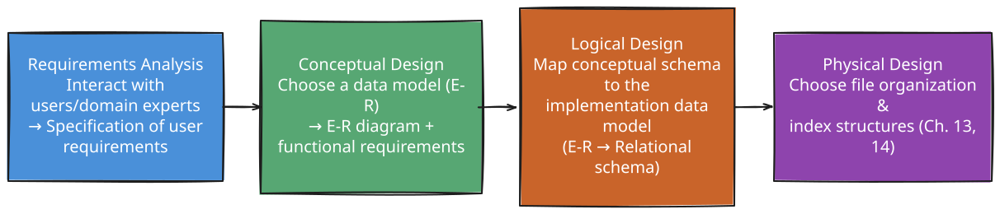
</p>

<sub><em>Editable diagram source: <a href="diagrams/d01-the-four-design-phases.excalidraw">d01-the-four-design-phases.excalidraw</a> — open in <a href="https://excalidraw.com">Excalidraw</a> to edit.</em></sub>

- The **conceptual-design** phase (this chapter) produces an **E-R diagram** — a graphical, high-level overview that both database designers and non-technical domain experts can review together.
- **Physical schema** changes are relatively easy to make later; **logical schema** changes are much harder, since application code depends on it — so careful conceptual design up front pays off.

### Two Pitfalls to Avoid in Database Design

<p align="center">
  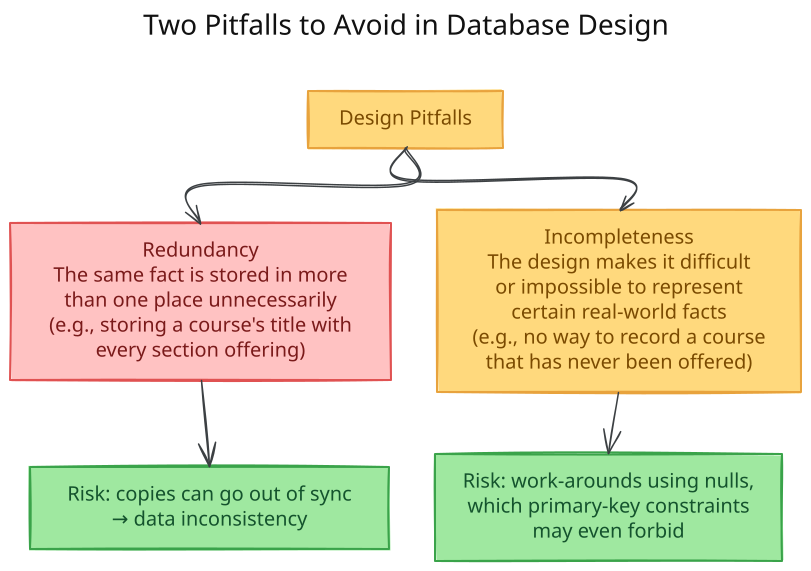
</p>

<sub><em>Editable diagram source: <a href="diagrams/d02-two-pitfalls-to-avoid.excalidraw">d02-two-pitfalls-to-avoid.excalidraw</a> — open in <a href="https://excalidraw.com">Excalidraw</a> to edit.</em></sub>

**Rule of thumb:** ideally, every piece of information should appear in **exactly one place** in the schema, while still being possible to represent **every** fact the enterprise needs to record. Beyond avoiding bad designs, the designer must also choose wisely among several *valid* designs (e.g., "is a sale a relationship, or an entity?") — good E-R design blends formal rules with judgment.

---

## 6.2 The Entity-Relationship Model

The E-R model uses **three basic building blocks**: entity sets, relationship sets, and attributes.

<p align="center">
  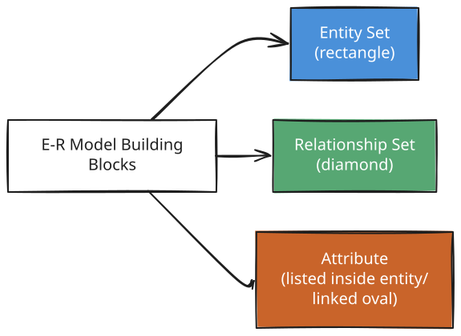
</p>

<sub><em>Editable diagram source: <a href="diagrams/d03-6-2-the-entity.excalidraw">d03-6-2-the-entity.excalidraw</a> — open in <a href="https://excalidraw.com">Excalidraw</a> to edit.</em></sub>

### Entity Sets

- An **entity** is a distinguishable "thing" or "object" in the real world (concrete like a person, or abstract like a course offering).
- An **entity set** is a collection of entities of the same type sharing the same attributes (e.g., `instructor`, `student`).
- The **extension** of an entity set is the actual current collection of entities belonging to it (parallel to a relation *instance*).
- Entity sets need **not** be disjoint — e.g., a `person` could also be an `instructor` and a `student` simultaneously.

**E-R diagram notation:** an entity set is a rectangle split into two parts — the (blue-shaded) name at top, and the attribute list below; primary-key attributes are **underlined**.

<p align="center">
  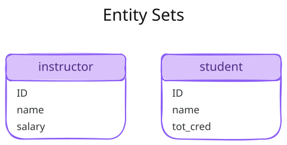
</p>

<sub><em>Editable diagram source: <a href="diagrams/d04-entity-sets.excalidraw">d04-entity-sets.excalidraw</a> — open in <a href="https://excalidraw.com">Excalidraw</a> to edit.</em></sub>

### Relationship Sets

- A **relationship** is an association among several entities (e.g., instructor Katz *advises* student Shankar).
- A **relationship set** is a collection of relationships of the same type — represented by a **diamond** connected via lines to the participating entity-set rectangles.
- Formally, a relationship set *R* on entity sets *E1, E2, …, En* is a subset of the Cartesian product *E1 × E2 × … × En*.
- **Participation:** the entity sets involved in a relationship are said to **participate** in it.
- **Degree:** the number of entity sets participating — a **binary** relationship has degree 2 (most common); a **ternary** relationship has degree 3.
- **Role:** the function an entity plays in a relationship; usually implicit, but made **explicit** in a **recursive relationship set**, where the *same* entity set participates more than once (e.g., `prereq` relates `course` to itself via roles `course_id` and `prereq_id`).
- **Descriptive attributes:** a relationship set may itself carry attributes (e.g., `takes` between `student` and `section` carries the descriptive attribute `grade`), shown as an undivided rectangle attached with a dashed line to the diamond.

<p align="center">
  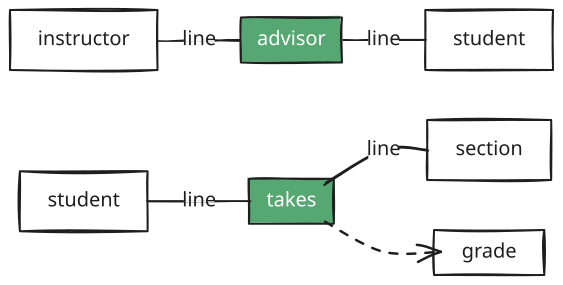
</p>

<sub><em>Editable diagram source: <a href="diagrams/d05-relationship-sets.excalidraw">d05-relationship-sets.excalidraw</a> — open in <a href="https://excalidraw.com">Excalidraw</a> to edit.</em></sub>

**Binary vs. Ternary example:** `proj_guide` relates `instructor`, `student`, and `project` — a **ternary** relationship, needed because a student may have *different* instructor-guides on *different* projects, something two separate binary relationships cannot capture.

---

## 6.3 Complex Attributes

Attributes are not always "simple" scalar values — the E-R model supports several attribute types:

<p align="center">
  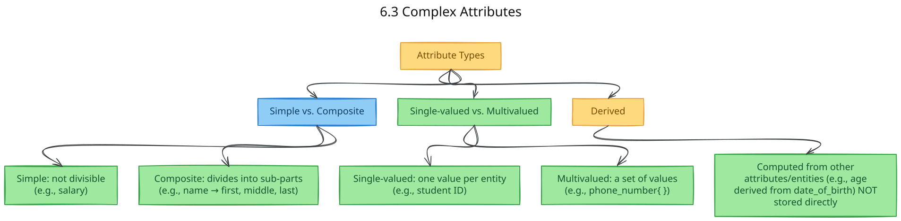
</p>

<sub><em>Editable diagram source: <a href="diagrams/d06-6-3-complex-attributes.excalidraw">d06-6-3-complex-attributes.excalidraw</a> — open in <a href="https://excalidraw.com">Excalidraw</a> to edit.</em></sub>

### Composite Attribute Hierarchy Example

A composite attribute can itself be composed of further composite attributes:

<p align="center">
  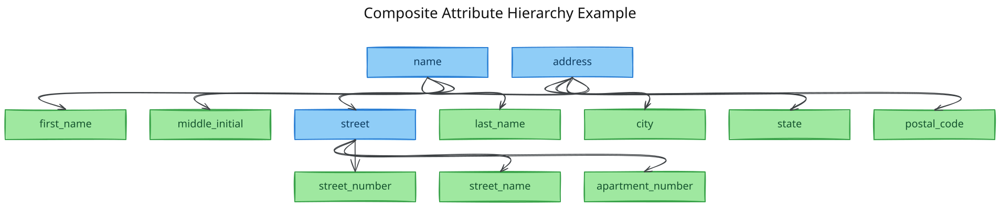
</p>

<sub><em>Editable diagram source: <a href="diagrams/d07-composite-attribute.excalidraw">d07-composite-attribute.excalidraw</a> — open in <a href="https://excalidraw.com">Excalidraw</a> to edit.</em></sub>

### Domain and Null Values

- **Domain (value set):** the set of permitted values for an attribute (e.g., `semester ∈ {Fall, Winter, Spring, Summer}`).
- **Null** indicates a value is either:
  - **not applicable** (e.g., no middle name → `middle_initial = null`), or
  - **unknown** — which can further be **missing** (value exists, just not recorded) or **not known** (unclear if it even exists).

### E-R Diagram Notation for Complex Attributes

| Attribute Type | Notation |
|---|---|
| Simple | plain name in attribute list |
| Composite | name with indented component attributes beneath |
| Multivalued | enclosed in **`{ }`**, e.g. `{phone_number}` |
| Derived | followed by **`( )`**, e.g. `age( )` |

---

## 6.4 Mapping Cardinalities

> **Critical topic** — cardinality/participation constraints are the backbone of most E-R exam questions.

**Mapping cardinality** (cardinality ratio) expresses how many entities of one set can be associated, via a relationship, with entities of another set. For a binary relationship *R* between entity sets *A* and *B*:

<p align="center">
  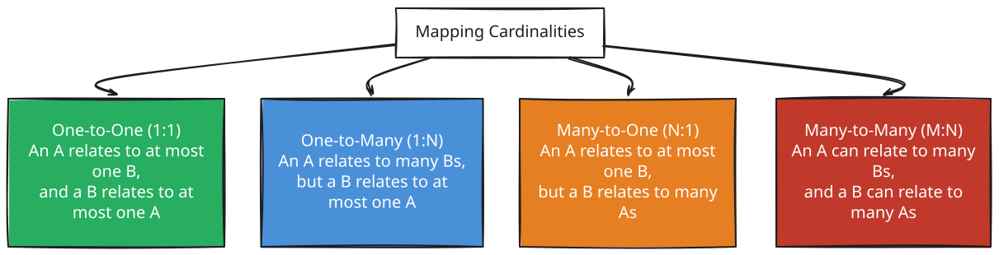
</p>

<sub><em>Editable diagram source: <a href="diagrams/d08-6-4-mapping.excalidraw">d08-6-4-mapping.excalidraw</a> — open in <a href="https://excalidraw.com">Excalidraw</a> to edit.</em></sub>

### Visualizing Cardinality with Bipartite Mappings

<p align="center">
  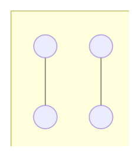
</p>

<sub><em>Editable diagram source: <a href="diagrams/d09-visualizing-cardinality.excalidraw">d09-visualizing-cardinality.excalidraw</a> — open in <a href="https://excalidraw.com">Excalidraw</a> to edit.</em></sub>

<p align="center">
  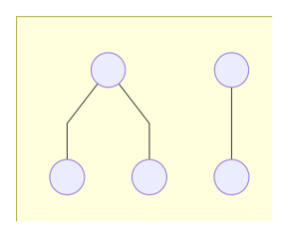
</p>

<sub><em>Editable diagram source: <a href="diagrams/d10-visualizing-cardinality.excalidraw">d10-visualizing-cardinality.excalidraw</a> — open in <a href="https://excalidraw.com">Excalidraw</a> to edit.</em></sub>

<p align="center">
  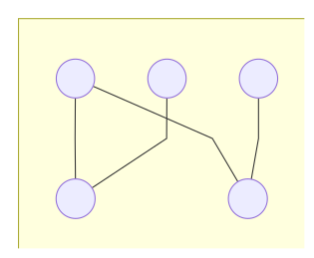
</p>

<sub><em>Editable diagram source: <a href="diagrams/d11-visualizing-cardinality.excalidraw">d11-visualizing-cardinality.excalidraw</a> — open in <a href="https://excalidraw.com">Excalidraw</a> to edit.</em></sub>

### E-R Diagram Arrow Notation

| Cardinality | Notation Rule |
|---|---|
| **One-to-one** | Directed line (→) from relationship to **both** entity sets |
| **One-to-many** (A → B) | Directed line to **A** (the "one" side), undirected line to **B** |
| **Many-to-one** (A → B) | Undirected line to **A**, directed line to **B** (the "one" side) |
| **Many-to-many** | Undirected line (—) to **both** entity sets |

### Participation Constraints

<p align="center">
  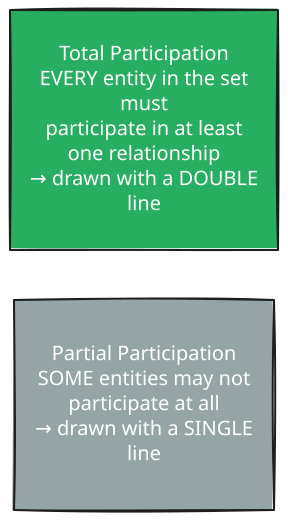
</p>

<sub><em>Editable diagram source: <a href="diagrams/d12-participation.excalidraw">d12-participation.excalidraw</a> — open in <a href="https://excalidraw.com">Excalidraw</a> to edit.</em></sub>

**Example:** every `student` must have an `advisor` → total participation of `student`. An `instructor` need not advise anyone → partial participation of `instructor`.

### Precise Cardinality Limits — the `l..h` Notation

E-R diagrams can specify exact **minimum (l)** and **maximum (h)** cardinality on each edge:

- `l = 1` → total participation (must occur at least once).
- `h = 1` → participates in **at most one** relationship.
- `h = *` → no upper limit.

**Example:** `instructor —0..*— advisor —1..1— student` means:
- Each **student** has **exactly one** advisor (min 1, max 1 → total participation).
- Each **instructor** can advise **zero or more** students (0..*).
- ⚠️ Common misinterpretation trap: the `0..*` next to `instructor` does **NOT** mean many-to-one from instructor to student — read it as: *this is the count of students per instructor*, so the relationship is **one-to-many from instructor to student**.

---

## 6.5 Primary Key for Weak Entity Sets

### Keys for Entity Sets and Relationship Sets

The familiar concepts of **superkey**, **candidate key**, and **primary key** (Chapter 2) apply directly to entity sets. For **relationship sets**, the primary key is built from the primary keys of the participating entity sets:

| Relationship Cardinality | Primary Key of the Relationship |
|---|---|
| Many-to-many | Union of primary keys of **both** participating entity sets |
| One-to-many / Many-to-one | Primary key of the entity set on the **"many"** side alone |
| One-to-one | Primary key of **either** participating entity set |

### Weak Entity Sets

Some entities cannot be uniquely identified by their own attributes alone — they depend on another entity for identification.

<p align="center">
  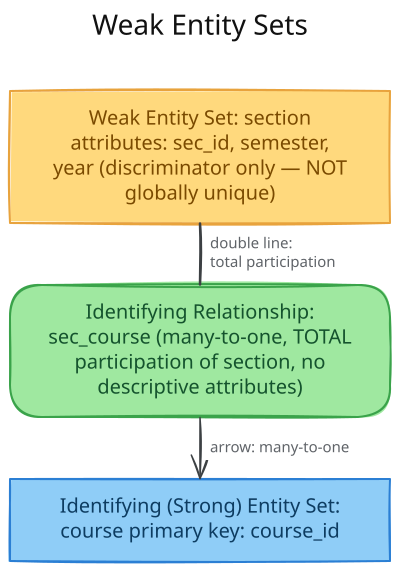
</p>

<sub><em>Editable diagram source: <a href="diagrams/d13-weak-entity-sets.excalidraw">d13-weak-entity-sets.excalidraw</a> — open in <a href="https://excalidraw.com">Excalidraw</a> to edit.</em></sub>

| Term | Definition |
|---|---|
| **Weak Entity Set** | An entity set with no primary key of its own; its existence depends on another entity set |
| **Discriminator** | The set of attributes that distinguishes weak entities that belong to the **same** identifying entity (not globally unique by itself) |
| **Identifying (Owner) Entity Set** | The strong entity set the weak set depends on |
| **Identifying Relationship** | The (many-to-one, total-participation, attribute-free) relationship connecting a weak entity set to its identifying entity set |
| **Strong Entity Set** | Any entity set that **does** have its own primary key (i.e., not weak) |

**Primary key of a weak entity set** = *(primary key of the identifying/owner entity set)* **∪** *(discriminator of the weak entity set)*.

**Worked Example:** `section` is weak, identified by `course`. Its primary key becomes:

```text
{course_id, sec_id, semester, year}
```

**Diagram notation:** a weak entity set is drawn as a **double rectangle**; its discriminator is **underlined with a dashed line**; the identifying relationship is drawn as a **double diamond**.

> A weak entity set must always have **total participation** in its identifying relationship, and that relationship must always be **many-to-one** toward the identifying entity set. A weak entity set may also participate in *other*, non-identifying relationships, and may even have more than one identifying entity set.

---

## 6.6 Removing Redundant Attributes in Entity Sets

Once entity sets and their attributes are chosen, defining relationship sets can reveal that some attributes are now **redundant** and should be dropped.

### The Core Rule

> If entity set **B**'s primary key already appears as an attribute inside entity set **A**, and a relationship set explicitly connects **A** to **B**, then that primary-key attribute is **redundant** in **A** and should be **removed** — the relationship captures the connection instead.

<p align="center">
  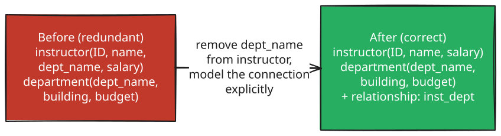
</p>

<sub><em>Editable diagram source: <a href="diagrams/d14-the-core-rule.excalidraw">d14-the-core-rule.excalidraw</a> — open in <a href="https://excalidraw.com">Excalidraw</a> to edit.</em></sub>

**Why this matters:** treating the connection as an explicit **relationship** (rather than a repeated foreign-key-like attribute) makes the design's logical structure clear and avoids **prematurely assuming** cardinality (e.g., assuming an instructor belongs to only one department).

### Final University E-R Design (redundancy removed)

**Entity sets** (primary keys underlined conceptually):

```text
classroom  (building, room_number, capacity)
department (dept_name, building, budget)
course     (course_id, title, credits)
instructor (ID, name, salary)
section    (course_id, sec_id, semester, year)   -- weak entity
student    (ID, name, tot_cred)
time_slot  (time_slot_id, {day, start_time, end_time})
```

**Relationship sets:**

```text
inst_dept, stud_dept, course_dept   -- entity ↔ department links
teaches, takes (+ grade), advisor   -- instructor/student ↔ section links
sec_course, sec_class, sec_time_slot -- section ↔ course/classroom/time_slot
prereq                              -- course ↔ course (recursive)
```

### Full E-R Diagram (Mermaid ER Diagram)

<p align="center">
  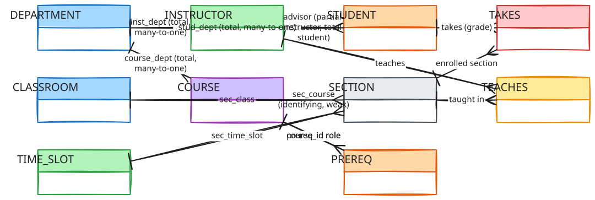
</p>

<sub><em>Editable diagram source: <a href="diagrams/d15-full-e-r-diagram.excalidraw">d15-full-e-r-diagram.excalidraw</a> — open in <a href="https://excalidraw.com">Excalidraw</a> to edit.</em></sub>

> This mirrors the textbook's Figure 6.15 — note that `section` is a **weak entity** owned by `course`, and `advisor` is drawn with **total participation on the student side** (every student has an advisor) but **partial on the instructor side** (not every instructor advises someone).

---

## 6.7 Reducing E-R Diagrams to Relational Schemas

Once an E-R diagram is finalized, it is mechanically converted into relational schemas (this is the **logical-design phase**). Both models are logical/abstract representations, which is what makes this direct translation possible.

<p align="center">
  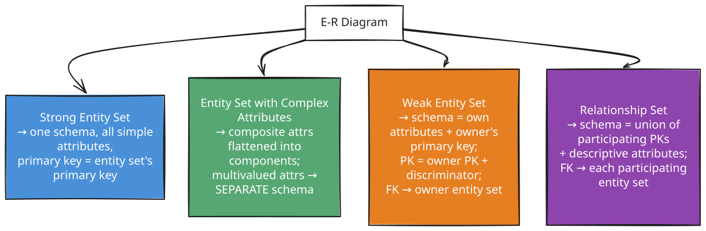
</p>

<sub><em>Editable diagram source: <a href="diagrams/d16-6-7-reducing-e-r.excalidraw">d16-6-7-reducing-e-r.excalidraw</a> — open in <a href="https://excalidraw.com">Excalidraw</a> to edit.</em></sub>

### 6.7.1 Strong Entity Sets

A strong entity set with only simple attributes becomes a schema with one attribute per descriptive attribute; the entity set's primary key becomes the schema's primary key.

```text
student (ID, name, tot_cred)
```

### 6.7.2 Entity Sets with Complex Attributes

- **Composite attributes** → replaced by their **component** attributes directly (no separate attribute/schema for the composite itself).
- **Multivalued attributes** → **new, separate relation schema** *R* is created, containing: (a) an attribute for the multivalued attribute, and (b) the primary key of the owning entity/relationship set. The schema's primary key is **all** of *R*'s attributes together, plus a **foreign key** back to the owning entity.
- **Derived attributes** → **not** represented in the relational model directly (can be implemented as stored procedures/functions).

```text
instructor       (ID, first_name, middle_initial, last_name, street_number,
                  street_name, apt_number, city, state, postal_code, date_of_birth)
instructor_phone (ID, phone_number)     -- from multivalued phone_number
```

### 6.7.3 Weak Entity Sets

<p align="center">
  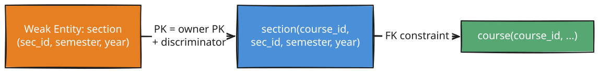
</p>

<sub><em>Editable diagram source: <a href="diagrams/d17-6-7-3-weak-entity-sets.excalidraw">d17-6-7-3-weak-entity-sets.excalidraw</a> — open in <a href="https://excalidraw.com">Excalidraw</a> to edit.</em></sub>

For weak entity set *A* owned by strong entity set *B*: schema *A* gets all of *A*'s own attributes **plus** *B*'s primary-key attributes; the combined primary key is *(B's PK, A's discriminator)*; a foreign key on *A* references *B*.

### 6.7.4 Relationship Sets

For relationship set *R* linking entity sets *E1...En* (plus descriptive attributes, if any):

```text
schema R = (primary keys of E1, ..., En) ∪ (descriptive attributes of R)
```

- The **primary key** of *R*'s schema follows the rule from Section 6.5 (many-to-many → union of both PKs; one-to-many → PK of the "many" side; one-to-one → either PK).
- A **foreign key** is created from *R* to **each** participating entity set's schema.

**Example — `advisor` (many-to-one, student → instructor):**

```text
advisor (s_ID, i_ID)     -- primary key: s_ID (the "many" side)
-- foreign keys: s_ID → student, i_ID → instructor
```

### 6.7.5 Redundancy of Schemas (Optimization #1)

The relationship schema linking a **weak entity set to its identifying entity set** is always **redundant** — its attributes are a strict subset of the weak entity's own schema — so it can be safely **dropped** entirely from the relational design.

### 6.7.6 Combination of Schemas (Optimization #2)

<p align="center">
  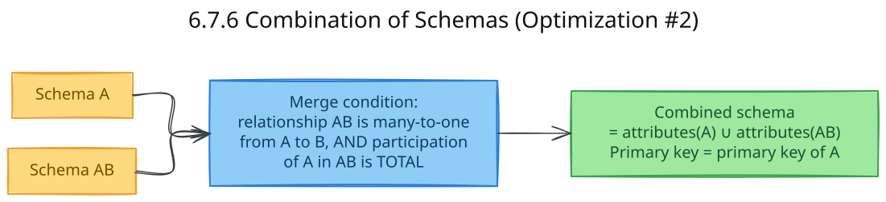
</p>

<sub><em>Editable diagram source: <a href="diagrams/d18-6-7-6-combination-of.excalidraw">d18-6-7-6-combination-of.excalidraw</a> — open in <a href="https://excalidraw.com">Excalidraw</a> to edit.</em></sub>

If relationship set *AB* is many-to-one from *A* to *B* **and** *A*'s participation in *AB* is **total**, the schemas for *A* and *AB* can be **merged** into a single schema — this is exactly why the familiar `instructor(ID, name, dept_name, salary)` table (with `dept_name` folded back in) is derived from merging `instructor` with `inst_dept`. If participation is only *partial*, merging is still possible but requires **null values** for entities without a relationship instance.

---

## 6.8 Extended E-R Features

Basic E-R concepts don't always capture every nuance of a real enterprise. The **extended E-R model** adds: specialization, generalization, attribute inheritance, and aggregation.

### Specialization vs. Generalization

<p align="center">
  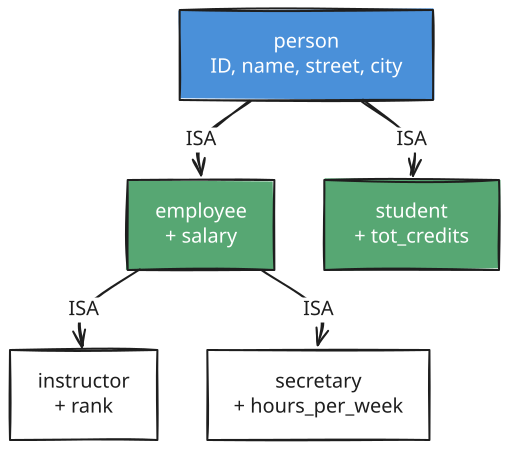
</p>

<sub><em>Editable diagram source: <a href="diagrams/d19-specialization-vs.excalidraw">d19-specialization-vs.excalidraw</a> — open in <a href="https://excalidraw.com">Excalidraw</a> to edit.</em></sub>

| Process | Direction | Description |
|---|---|---|
| **Specialization** | Top-down | Start from ONE entity set, carve out distinct **subgroups** with extra attributes/relationships (e.g., `person` → `employee`, `student`) |
| **Generalization** | Bottom-up | Start from MULTIPLE entity sets that share common features, and **synthesize** them into one higher-level entity set |

Both processes result in the same structure: a **higher-level entity set** (superclass) plus one or more **lower-level entity sets** (subclasses), linked via an **ISA relationship** — drawn as a **hollow arrowhead** pointing from the subclass to the superclass.

### Attribute Inheritance

> Lower-level entity sets **inherit** all attributes (and relationship participation) of their higher-level entity set — through **all** tiers. E.g., `instructor` inherits `ID, name, street, city` from `person` (via `employee`), plus `salary` from `employee`, plus its own `rank`.

### Constraints on Specialization

<p align="center">
  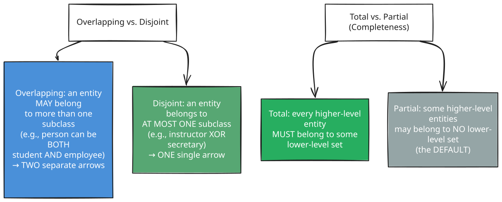
</p>

<sub><em>Editable diagram source: <a href="diagrams/d20-constraints-on.excalidraw">d20-constraints-on.excalidraw</a> — open in <a href="https://excalidraw.com">Excalidraw</a> to edit.</em></sub>

These two constraint types are **independent**, giving four combinations: partial-overlapping, partial-disjoint, total-overlapping, total-disjoint.

- **Insertion rule (total):** inserting into the higher-level set requires also inserting into at least one lower-level set.
- **Deletion rule:** deleting from the higher-level set requires deleting from all associated lower-level sets too.

### Aggregation

E-R's basic constructs cannot directly express a **relationship of a relationship**. **Aggregation** solves this by treating an entire relationship set (plus its participating entities) as a new **higher-level entity** that can itself participate in further relationships.

<p align="center">
  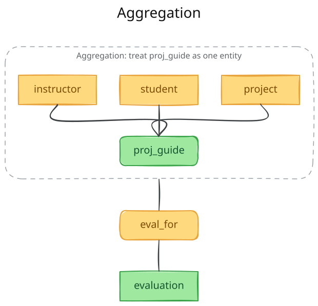
</p>

<sub><em>Editable diagram source: <a href="diagrams/d21-aggregation.excalidraw">d21-aggregation.excalidraw</a> — open in <a href="https://excalidraw.com">Excalidraw</a> to edit.</em></sub>

**Why not just add a 4-way relationship instead?** Because `eval_for` between `instructor`, `student`, `project`, and `evaluation` directly would create **redundant information** — every (instructor, student, project) combination in `eval_for` would have to duplicate what's already captured in `proj_guide`. Aggregation avoids this duplication.

### Reduction of Extended Features to Relational Schemas

| Feature | Relational Translation Rule |
|---|---|
| **Generalization (Method 1)** | Create a schema for the higher-level entity set **and** one for each lower-level set (containing the lower-level's own attributes + the higher-level PK); add FK from each lower-level schema to the higher-level schema. Works for **any** specialization. |
| **Generalization (Method 2)** | *Only if disjoint & total*: skip the higher-level schema; each lower-level schema includes **all** attributes of the higher-level set directly. Simpler, but complicates foreign-key references **to** the (now-missing) higher-level set. |
| **Aggregation** | The aggregated relationship becomes a schema like any other relationship set; the relationship built on top of the aggregation (e.g., `eval_for`) references the aggregation's own primary key (i.e., the primary key of its defining relationship, `proj_guide`) — no separate schema is needed purely for the aggregation itself. |

---

## Syllabus Connection

Entity-Relationship Model, cardinality constraints, and physical/logical conversion.

## Board Exam Pattern Mapping

- **Question 1(d) (2024 Exam):** Drawing an E-R diagram for a Library Management System with Book, Member, Loan, and Publisher as entities and defining their mapping cardinalities.
- **Question 3(c) (2024 Exam):** Designing an E-R diagram for a Hospital Management System with Doctors, Patients, and Log of Tests, ensuring proper cardinality.
- **Question 5(b) (2023 Exam):** Designing an E-R diagram for a University System with Student, Course, and Instructor entity sets and their relationships.
- **Question 5(c) (2023 Exam):** Analyzing an E-R diagram fragment to suggest normalization by removing redundant attributes (e.g., deleting a department location attribute from a Student entity when it is already represented via a relationship to the Department entity).
