# Chapter 3: Introduction to SQL

**Part:** [Part 2 — SQL & Application Design](../README.md)
**Textbook:** *Database System Concepts*, 7th Edition — Silberschatz, Korth, Sudarshan

## Exact Subsections to Read

- **3.2** SQL Data Definition (Creating tables, basic types)
- **3.3** Basic Structure of SQL Queries (Select, From, Where)
- **3.4** Additional Basic Operations (Rename as, Pattern matching like, Between)
- **3.5** Set Operations (union, intersect, except / minus)
- **3.6** Null Values
- **3.7** Aggregate Functions (avg, min, max, sum, count combined with group by and having)
- **3.8** Nested Subqueries (in, exists, unique, scalar subqueries)
- **3.9** Modification of the Database (insert, delete, update using case expressions)

> SQL is not just for asking questions ("queries"). It is a complete language that lets you build tables (DDL), add/change/remove data (DML), enforce rules on your data, control transactions, and manage who is allowed to do what. All of that lives inside one language: SQL.

<p align="center">
  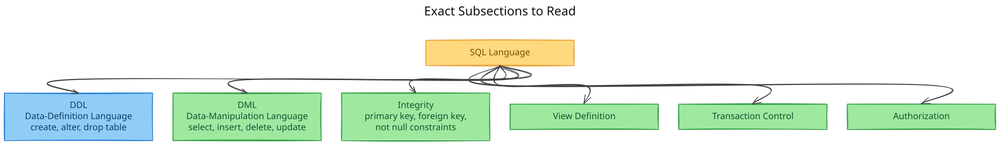
</p>

<sub><em>Editable diagram source: <a href="diagrams/d01-exact-subsections-to.excalidraw">d01-exact-subsections-to.excalidraw</a> — open in <a href="https://excalidraw.com">Excalidraw</a> to edit.</em></sub>

In this chapter we only focus on the **basics of DDL and DML** — these are the commands you will use the most, both in exams and in the lab.

---

## 3.2 SQL Data Definition

**DDL (Data-Definition Language)** is the part of SQL used to describe the *structure* of your data: what tables exist, what type of data each column holds, and what rules the data must follow. In this section we only look at the basics: simple data types and simple table creation.

### 3.2.1 Basic Built-in Types

Think of a "type" as a label that tells the database what kind of value a column is allowed to store (text, number, etc.).

| Type | Meaning |
|---|---|
| `char(n)` | Fixed-length character string of length *n* (padded with spaces) |
| `varchar(n)` | Variable-length character string, maximum length *n* (no padding) |
| `int` / `integer` | Machine-dependent integer |
| `smallint` | Smaller-range integer |
| `numeric(p, d)` | Fixed-point number: *p* total digits, *d* digits after the decimal point |
| `real`, `double precision` | Floating-point numbers |
| `float(n)` | Floating-point with precision of at least *n* digits |
| `nvarchar` | Variable-length Unicode string (for multilingual data) |

> **`char` vs `varchar` — an easy way to remember the difference:** If you store `'Avi'` in a `char(10)` column, the database silently adds spaces at the end until it becomes 10 characters long. A `varchar(10)` column, on the other hand, just keeps `'Avi'` exactly as it is. This matters because comparing a padded `char` value with an unpadded `varchar` value can wrongly come out as "not equal", even though the text looks the same. Because of this, **`varchar` is usually the safer choice**. (This small trap is a favorite exam question.)

Any column, no matter its type, can also store a special value called **`null`**. `null` simply means "this value is unknown or missing". We will look at `null` in detail in Section 3.6.

### 3.2.2 Basic Schema Definition — `create table`

Here is a simple example of creating a table:

```sql
create table department
   (dept_name  varchar(20),
    building   varchar(15),
    budget     numeric(12,2),
    primary key (dept_name));
```

**In general, any `create table` statement looks like this:**

```sql
create table r
   (A1 D1,
    A2 D2,
    ...,
    An Dn,
    ⟨integrity-constraint1⟩,
    ...,
    ⟨integrity-constraintk⟩);
```

In plain words: you name the table (`r`), then list each column with its type (`A1 D1`, `A2 D2`, ...), and finally add any rules ("constraints") the data must obey.

### Integrity Constraints Supported in `create table`

A **constraint** is just a rule that the database enforces automatically, so bad data never gets in. The three most common ones are:

<p align="center">
  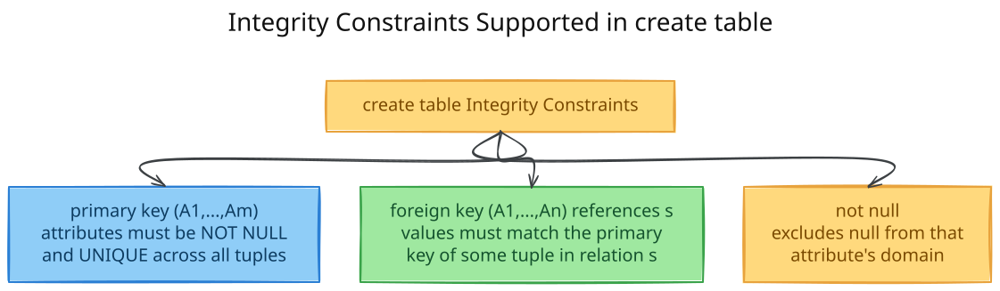
</p>

<sub><em>Editable diagram source: <a href="diagrams/d02-integrity-constraints.excalidraw">d02-integrity-constraints.excalidraw</a> — open in <a href="https://excalidraw.com">Excalidraw</a> to edit.</em></sub>

- **`primary key`** — picks the column(s) that uniquely identify a row. These columns can never be empty (`null`) and can never repeat.
- **`foreign key`** — says "the value in this column must already exist as a primary key value in another table". This is how tables stay linked and consistent with each other.
- **`not null`** — simply forbids a column from ever being left empty.

**A more complete example, showing how tables link to each other with foreign keys:**

```sql
create table course
   (course_id  varchar(7),
    title      varchar(50),
    dept_name  varchar(20),
    credits    numeric(2,0),
    primary key (course_id),
    foreign key (dept_name) references department);

create table instructor
   (ID         varchar(5),
    name       varchar(20) not null,
    dept_name  varchar(20),
    salary     numeric(8,2),
    primary key (ID),
    foreign key (dept_name) references department);
```

> ⚠️ **MySQL note:** some database systems ask you to name the referenced column explicitly, like this: `foreign key (dept_name) references department(dept_name)`.

**What happens if you break a rule?** SQL simply **refuses** the change. If you try to insert a duplicate or empty primary key, or a foreign-key value that doesn't exist in the other table, the insert/update is rejected.

### `drop table` vs `delete` vs `alter table` — a classic exam comparison

Students often confuse these three commands, so let's separate them clearly:

<p align="center">
  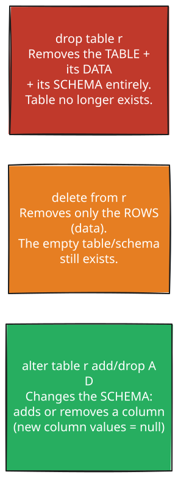
</p>

<sub><em>Editable diagram source: <a href="diagrams/d03-drop-table-vs-delete-vs.excalidraw">d03-drop-table-vs-delete-vs.excalidraw</a> — open in <a href="https://excalidraw.com">Excalidraw</a> to edit.</em></sub>

> **Easy way to remember for exams:** `DROP` deletes everything — both the data **and** the table itself. `DELETE` (and `TRUNCATE`) only clears out the data; the empty table stays behind, ready to be used again.

---

## 3.3 Basic Structure of SQL Queries

Almost every SQL query you write is built from just three clauses:

<p align="center">
  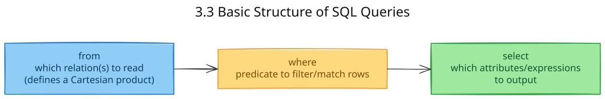
</p>

<sub><em>Editable diagram source: <a href="diagrams/d04-3-3-basic-structure-of.excalidraw">d04-3-3-basic-structure-of.excalidraw</a> — open in <a href="https://excalidraw.com">Excalidraw</a> to edit.</em></sub>

> **Tip for beginners:** even though you *type* the clauses in the order `select, from, where`, it helps to *think* about them in the order: **from → where → select**. First figure out which table(s) you're reading from, then which rows to keep, and only then which columns to show.

### 3.3.1 Queries on a Single Relation

A simple query that reads names from the `instructor` table:

```sql
select name
from instructor;
```

- **By default, SQL does NOT remove duplicate rows.** This is different from relational algebra, where a relation is a strict set. If you want to remove duplicates, add **`distinct`**. If you want to explicitly keep every duplicate (the default behavior anyway), you can add **`all`**.

```sql
select distinct dept_name
from instructor;
```

- You can also do simple math inside `select`: `select ID, name, salary * 1.1 from instructor;` shows what everyone's salary would look like with a 10% raise — without actually changing anything in the table.
- The `where` clause is how you filter rows. You can use comparisons like `<, <=, >, >=, =, <>`, and combine multiple conditions with `and`, `or`, `not`.

```sql
select name
from instructor
where dept_name = 'Comp. Sci.' and salary > 70000;
```

### 3.3.2 Queries on Multiple Relations (Implicit Join)

To combine data from two tables, list both tables in `from` and connect them with a matching condition in `where`:

```sql
select name, instructor.dept_name, building
from instructor, department
where instructor.dept_name = department.dept_name;
```

### How SQL Conceptually Evaluates a Multi-Relation Query

It helps to imagine SQL working through a query in three steps, one after another:

<p align="center">
  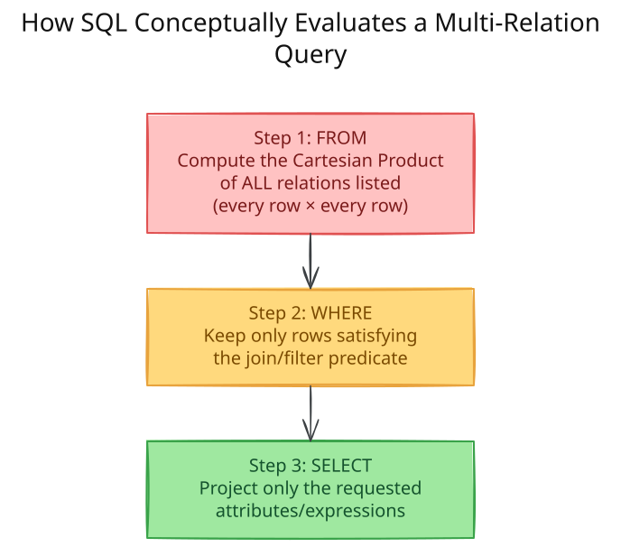
</p>

<sub><em>Editable diagram source: <a href="diagrams/d05-how-sql-conceptually.excalidraw">d05-how-sql-conceptually.excalidraw</a> — open in <a href="https://excalidraw.com">Excalidraw</a> to edit.</em></sub>

> ⚠️ **What goes wrong if you forget the join condition in `where`:** without a matching condition, `instructor × teaches` pairs up *every* instructor row with *every* teaches row — even ones that have nothing to do with each other. So 12 instructors × 13 teaches rows becomes **156 meaningless combinations**. With 200 instructors and 600 teaches rows, that balloons to **120,000 combinations**! Always remember to add the matching condition (`instructor.ID = teaches.ID`) inside `where`.

---

## 3.4 Additional Basic Operations

### 3.4.1 The Rename Operation (`as`)

`as` lets you give a temporary, shorter, or clearer name to a column or a table.

<p align="center">
  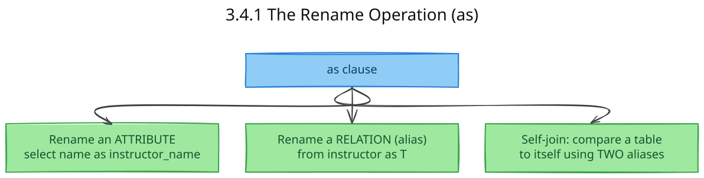
</p>

<sub><em>Editable diagram source: <a href="diagrams/d06-3-4-1-the-rename.excalidraw">d06-3-4-1-the-rename.excalidraw</a> — open in <a href="https://excalidraw.com">Excalidraw</a> to edit.</em></sub>

```sql
-- Renaming for a self-comparison ("correlation names" / table aliases)
select distinct T.name
from instructor as T, instructor as S
where T.salary > S.salary and S.dept_name = 'Biology';
```

Here, `T` and `S` are two different **nicknames** (also called correlation names, table aliases, or tuple variables) for the *same* `instructor` table. You need two different nicknames like this whenever you want to compare a table **against itself** — for example, comparing every instructor's salary to every Biology instructor's salary.

### 3.4.2 String Operations & Pattern Matching (`like`)

- Text values are written using single quotes: `'Computer'`. If your text itself contains a quote, double it: `'It''s right'`.
- Comparing text is **case-sensitive** by the SQL standard (though some systems like MySQL or SQL Server may ignore case by default).
- Some handy string functions: `upper(s)`, `lower(s)`, `trim(s)`, and `||` to join two strings together.

`like` lets you search for a *pattern* inside text, instead of an exact match. It uses two special wildcard symbols:

<p align="center">
  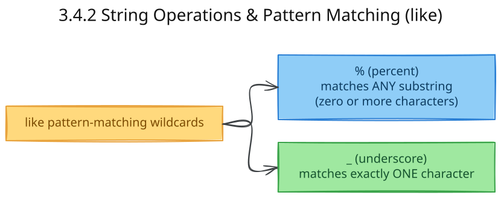
</p>

<sub><em>Editable diagram source: <a href="diagrams/d07-3-4-2-string-operations.excalidraw">d07-3-4-2-string-operations.excalidraw</a> — open in <a href="https://excalidraw.com">Excalidraw</a> to edit.</em></sub>

| Pattern | Matches |
|---|---|
| `'Intro%'` | Any string **starting** with "Intro" |
| `'%Comp%'` | Any string **containing** "Comp" anywhere |
| `'___'` | Any string of **exactly 3** characters |
| `'___%'` | Any string of **at least 3** characters |

```sql
select dept_name
from department
where building like '%Watson%';
```

- If you actually need to search for a literal `%` or `_` character (not as a wildcard), use **`escape`**: `like 'ab\%cd%' escape '\'` looks for strings starting with the literal text `"ab%cd"`.
- To find rows that *don't* match a pattern, use **`not like`**.

### 3.4.3 `*` — All Attributes

Use `select *` when you want every column from the tables in `from`. If you've joined multiple tables and only want the columns from one of them, write `select instructor.*` instead.

### 3.4.4 Ordering Results — `order by`

```sql
select * from instructor order by salary desc, name asc;
```

Results are sorted in **ascending** order by default; add `desc` to sort in descending order instead. If you list more than one column, SQL sorts by the first column, and uses the next column(s) only to break ties.

### 3.4.5 `between` and Row Constructors

`between` is a short, readable way to check whether a value falls inside a range:

```sql
select name from instructor where salary between 90000 and 100000;
-- equivalent to: where salary <= 100000 and salary >= 90000
```

SQL also lets you compare a whole group of values at once, using **row constructors** written as `(v1, v2, ...)`:

```sql
where (instructor.ID, dept_name) = (teaches.ID, 'Biology');
```

---

## 3.5 Set Operations

If you have taken any math course, you already know the set operations **union (∪), intersection (∩), and difference (−)**. SQL has equivalents: `union`, `intersect`, and `except`. The main thing to watch out for is how each one treats duplicate rows.

<p align="center">
  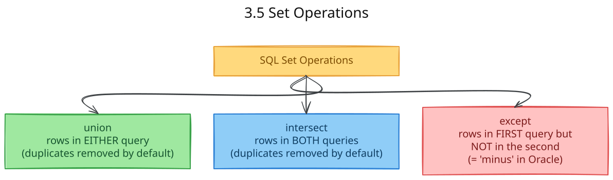
</p>

<sub><em>Editable diagram source: <a href="diagrams/d08-3-5-set-operations.excalidraw">d08-3-5-set-operations.excalidraw</a> — open in <a href="https://excalidraw.com">Excalidraw</a> to edit.</em></sub>

### Visualizing the Three Operations

Let's say `c1` = courses taught in Fall 2017 and `c2` = courses taught in Spring 2018:

<p align="center">
  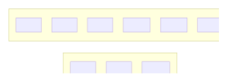
</p>

<sub><em>Editable diagram source: <a href="diagrams/d09-visualizing-the-three.excalidraw">d09-visualizing-the-three.excalidraw</a> — open in <a href="https://excalidraw.com">Excalidraw</a> to edit.</em></sub>

| Operation | SQL | Result (using c1, c2 above) |
|---|---|---|
| **Union** | `c1 union c2` | All 8 distinct courses (CS-101 appears once) |
| **Intersect** | `c1 intersect c2` | `{CS-101}` only |
| **Except** | `c1 except c2` | `{CS-347, PHY-101}` (Fall-only courses) |

```sql
(select course_id from section where semester = 'Fall' and year = 2017)
union
(select course_id from section where semester = 'Spring' and year = 2018);
```

### Duplicate-Retaining Variants: `union all`, `intersect all`, `except all`

Sometimes you *do* want to keep duplicate rows instead of removing them. For that, just add `all` after the operation:

| Variant | Duplicate count in result |
|---|---|
| `union all` | Total copies in **c1 + c2** |
| `intersect all` | **Minimum** of copies in c1 and c2 |
| `except all` | Copies in c1 **minus** copies in c2 (if positive) |

> ⚠️ Good to know: `intersect` is **not available in MySQL** — you'll need to use `in`/subqueries instead (covered in Section 3.8). Also, Oracle calls `except` by a different name: **`minus`**.

---

## 3.6 Null Values

`null` means "this value is unknown or doesn't exist". Because of `null`, SQL logic isn't simply true/false — it has a **third possible result: `unknown`**.

### Three-Valued Logic Truth Tables

<p align="center">
  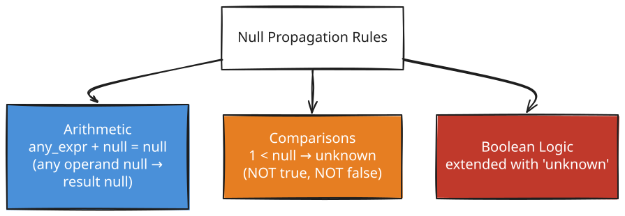
</p>

<sub><em>Editable diagram source: <a href="diagrams/d10-three-valued-logic.excalidraw">d10-three-valued-logic.excalidraw</a> — open in <a href="https://excalidraw.com">Excalidraw</a> to edit.</em></sub>

Here's how `and`/`or` behave once `unknown` is added to the mix:

| `AND` | true | false | unknown |
|---|---|---|---|
| **true** | true | false | unknown |
| **false** | false | false | false |
| **unknown** | unknown | false | unknown |

| `OR` | true | false | unknown |
|---|---|---|---|
| **true** | true | true | true |
| **false** | true | false | unknown |
| **unknown** | true | unknown | unknown |

And `not unknown` is still **unknown**.

> **The one rule to remember:** in a `where` clause, only rows where the condition comes out **true** are kept. Rows that come out **false** or **unknown** are both thrown away.

### Testing for Null

Because `null` doesn't behave like a normal value, you can't compare it with `=`. Instead, use `is null` / `is not null`:

```sql
select name from instructor where salary is null;      -- test for null
select name from instructor where salary is not null;   -- test for non-null
select name from instructor where salary > 10000 is unknown;  -- test the 3rd truth value
```

> **One exception worth remembering:** when comparing values with `=`, two `null`s are never considered equal (the result is `unknown`). But when SQL is removing duplicates — for `distinct`, `union`, `intersect`, or `except` — it treats two `null`s in the same position **as if they were equal**. This small inconsistency is a popular exam trap.

---

## 3.7 Aggregate Functions

An **aggregate function** takes many values and boils them down into just **one** summary value — for example, turning a whole column of salaries into a single average.

<p align="center">
  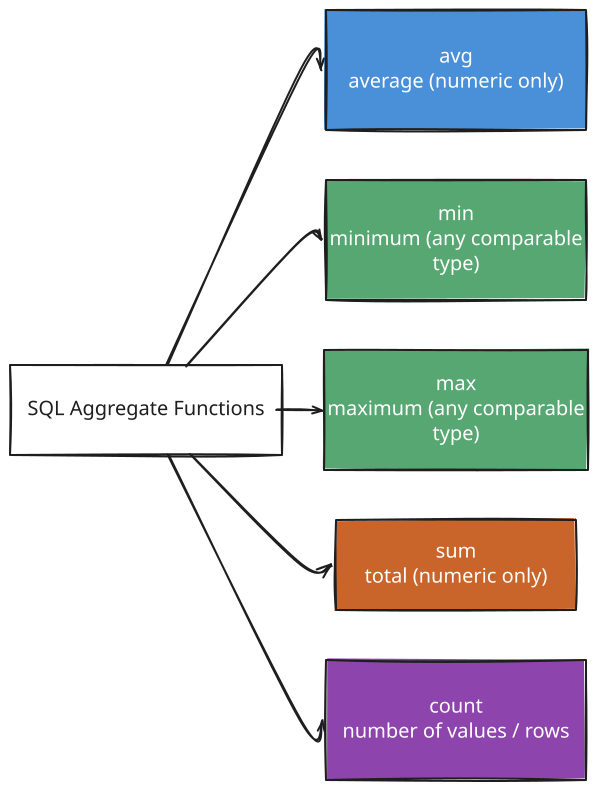
</p>

<sub><em>Editable diagram source: <a href="diagrams/d11-3-7-aggregate-functions.excalidraw">d11-3-7-aggregate-functions.excalidraw</a> — open in <a href="https://excalidraw.com">Excalidraw</a> to edit.</em></sub>

### 3.7.1 Basic Aggregation

```sql
select avg(salary) as avg_salary
from instructor
where dept_name = 'Comp. Sci.';
```

- **For `avg` and `sum`, duplicate values are kept by default** — they are not automatically removed, because throwing them away would give you the wrong average. If you specifically want each *unique* value counted only once, add `distinct` inside the aggregate:

```sql
select count(distinct ID)
from teaches
where semester = 'Spring' and year = 2018;   -- each instructor counted ONCE

select count(*) from course;                  -- counts rows; distinct NOT allowed with count(*)
```

### 3.7.2 Aggregation with Grouping — `group by`

`group by` lets you calculate an aggregate **separately for each group** of rows, instead of for the whole table at once. Here's the order in which SQL actually processes a grouped query:

<p align="center">
  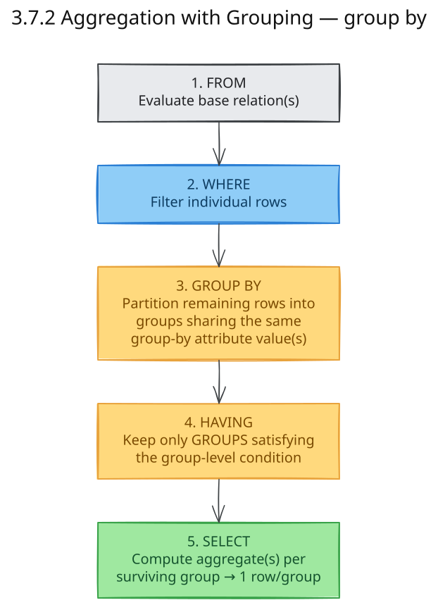
</p>

<sub><em>Editable diagram source: <a href="diagrams/d12-3-7-2-aggregation-with.excalidraw">d12-3-7-2-aggregation-with.excalidraw</a> — open in <a href="https://excalidraw.com">Excalidraw</a> to edit.</em></sub>

```sql
select dept_name, avg(salary) as avg_salary
from instructor
group by dept_name;
```

> **Golden rule (very commonly tested):** any column you write in `select` must either be (1) wrapped in an aggregate function, or (2) listed in `group by`. If you break this rule, SQL has no way of knowing which single value to display for that column per group, and it will report an error.

```sql
/* ERRONEOUS: ID is neither aggregated nor in group by */
select dept_name, ID, avg(salary)
from instructor
group by dept_name;
```

### 3.7.3 The `having` Clause — Filtering *Groups*

Think of it this way: `where` filters out individual rows *before* grouping happens, while `having` filters out entire *groups* *after* they've already been formed.

```sql
select dept_name, avg(salary) as avg_salary
from instructor
group by dept_name
having avg(salary) > 42000;
```

| Clause | Applies To | Can use aggregate functions? |
|---|---|---|
| `where` | Individual rows (before grouping) | ❌ No |
| `having` | Whole groups (after grouping) | ✅ Yes |

### 3.7.4 Aggregates and Nulls

> **Rule to remember:** every aggregate function, except `count(*)`, simply **skips over** `null` values — it pretends they aren't there. If a group has no values at all (an empty collection), `count` returns `0`, but every other aggregate function returns `null`. (As a side note, SQL:1999 also introduced a `boolean` type along with `some`/`every` aggregate functions, which work like OR/AND across a column of true/false values.)

---

## 3.8 Nested Subqueries

A **subquery** is simply a `select-from-where` query written *inside* another query. It's most often placed inside a `where` clause to check things like: "does this value exist in that other set?", "is this value bigger than all of those?", or "how many rows does this return?"

<p align="center">
  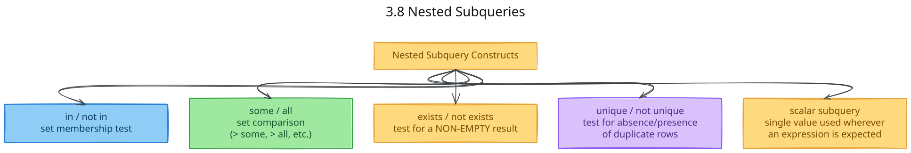
</p>

<sub><em>Editable diagram source: <a href="diagrams/d13-3-8-nested-subqueries.excalidraw">d13-3-8-nested-subqueries.excalidraw</a> — open in <a href="https://excalidraw.com">Excalidraw</a> to edit.</em></sub>

### 3.8.1 Set Membership — `in` / `not in`

`in` checks whether a value appears anywhere inside a list or a subquery's results. `not in` checks the opposite.

```sql
select distinct course_id
from section
where semester = 'Fall' and year = 2017 and
      course_id in (select course_id
                     from section
                     where semester = 'Spring' and year = 2018);

select distinct name
from instructor
where name not in ('Mozart', 'Einstein');   -- works on enumerated lists too
```

### 3.8.2 Set Comparison — `some` / `all`

`some` and `all` let you compare a value against a whole *set* of values, rather than against just one value.

| Construct | Meaning | Equivalent to |
|---|---|---|
| `= some` | equal to **at least one** member | `in` |
| `<> some` | not equal to at least one member | **NOT** the same as `not in` |
| `> some` | greater than **at least one** (i.e., greater than the *minimum*) | — |
| `> all` | greater than **every** member (i.e., greater than the *maximum*) | — |
| `<> all` | not equal to **any** member | equivalent to `not in` |
| `= all` | equal to every member | **NOT** the same as `in` |

```sql
select name
from instructor
where salary > some (select salary from instructor where dept_name = 'Biology');
-- i.e. earns more than the LOWEST-paid Biology instructor

select name
from instructor
where salary > all (select salary from instructor where dept_name = 'Biology');
-- i.e. earns more than the HIGHEST-paid Biology instructor
```

### 3.8.3 Test for Empty Relations — `exists` / `not exists`

`exists` just checks whether a subquery returns **any rows at all** — it doesn't care what the rows contain, only whether there are any.

<p align="center">
  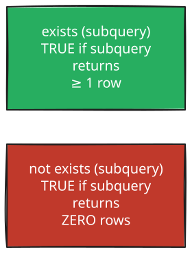
</p>

<sub><em>Editable diagram source: <a href="diagrams/d14-3-8-3-test-for-empty.excalidraw">d14-3-8-3-test-for-empty.excalidraw</a> — open in <a href="https://excalidraw.com">Excalidraw</a> to edit.</em></sub>

`exists` is usually used together with a **correlated subquery** — a subquery that reaches "outside" itself to refer to a table from the outer query:

```sql
select course_id
from section as S
where semester = 'Fall' and year = 2017 and
      exists (select * from section as T
              where semester = 'Spring' and year = 2018 and
                    S.course_id = T.course_id);
```

**A useful trick — finding "who has done ALL of something":** for example, "find every student who has taken **every** Biology course":

```sql
select S.ID, S.name
from student as S
where not exists (
    (select course_id from course where dept_name = 'Biology')
    except
    (select T.course_id from takes as T where S.ID = T.ID));
```

> **Pattern worth memorizing:** *"A contains B"* is the same as saying `not exists (B except A)`. Whenever you see a question that asks for something like "find X that has done ALL of Y", this is the pattern to reach for. It shows up often in labs and exams (e.g., "students who got Grade A in **all** courses").

### 3.8.4 Test for Duplicate Tuples — `unique` / `not unique`

`unique(subquery)` checks whether the subquery's result has **no repeated rows** at all. (An empty result automatically counts as unique.)

```sql
select T.course_id
from course as T
where unique (select R.course_id from section as R
              where T.course_id = R.course_id and R.year = 2017);
-- "courses offered AT MOST once in 2017"
```

### 3.8.5 Subqueries in the `from` Clause

Since any `select-from-where` query produces a table (a relation), you're allowed to use one **anywhere a table is expected** — including right inside the `from` clause of another query:

```sql
select dept_name, avg_salary
from (select dept_name, avg(salary) as avg_salary
      from instructor
      group by dept_name) as dept_avg
where avg_salary > 42000;
```

This does the same job as the earlier `having` example, just written a different way: first compute the per-department average inside the subquery, then filter on that average using an ordinary `where` in the outer query.

> **A more advanced option:** the **`lateral`** keyword (added in SQL:2003) allows a subquery in `from` to refer to tables listed *earlier* in the same `from` clause. Without `lateral`, this isn't normally allowed.

### 3.8.6 The `with` Clause — Named Temporary Relations

`with` lets you create one or more temporary, named results that you can reuse later in the same query. This is often much easier to read than nesting subqueries deeply inside each other.

```sql
with max_budget(value) as
     (select max(budget) from department)
select budget
from department, max_budget
where department.budget = max_budget.value;
```

You can even chain several `with` definitions together, where each one can use the ones defined before it. This is especially handy for multi-step comparisons, like "find departments whose total salary is above the average total salary across all departments".

### 3.8.7 & 3.8.8 Scalar Subqueries

A **scalar subquery** is a subquery that is guaranteed to return just **one row and one column** — in other words, a single value. Because it's just one value, you can drop it in anywhere a single value would normally go: inside `select`, `where`, or `having`.

```sql
select dept_name,
       (select count(*) from instructor
        where department.dept_name = instructor.dept_name) as num_instructors
from department;
```

> **Something to watch for:** if a scalar subquery ends up returning more than one row when it actually runs, SQL will throw an **error**. The database usually can't check this in advance — it only discovers the problem when the query actually executes.

---

## 3.9 Modification of the Database

Besides asking questions with `select`, SQL also gives you three commands to actually change the data:

<p align="center">
  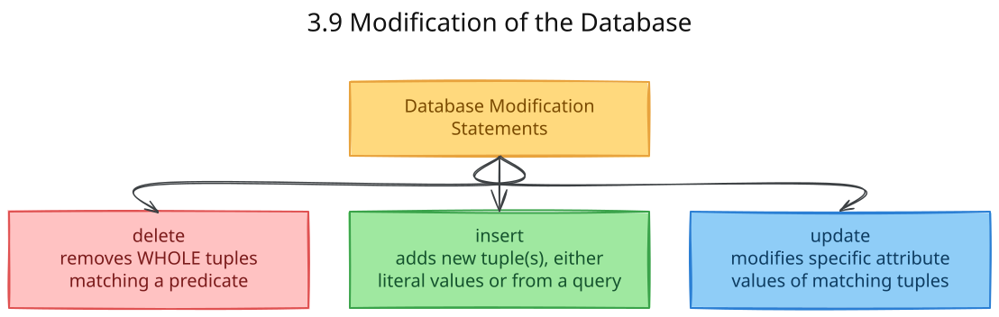
</p>

<sub><em>Editable diagram source: <a href="diagrams/d15-3-9-modification-of-the.excalidraw">d15-3-9-modification-of-the.excalidraw</a> — open in <a href="https://excalidraw.com">Excalidraw</a> to edit.</em></sub>

### 3.9.1 Deletion — `delete`

```sql
delete from r where P;      -- deletes matching rows; omitting "where" deletes ALL rows
```

```sql
delete from instructor where dept_name = 'Finance';

delete from instructor
where dept_name in (select dept_name from department where building = 'Watson');

-- Subquery referencing the SAME relation being deleted from — evaluated fully BEFORE any deletion:
delete from instructor
where salary < (select avg(salary) from instructor);
```

> **An important detail:** SQL first figures out **all** the rows that match the condition, and only *after* that does it delete them. This matters in the last example above — the average salary is calculated once, using the original data, before any row gets removed. Otherwise, the average would keep changing as rows are deleted, and the result would depend on the (unpredictable) order of deletion.

### 3.9.2 Insertion — `insert`

```sql
-- Single literal tuple
insert into course
values ('CS-437', 'Database Systems', 'Comp. Sci.', 4);

-- Explicit attribute list (order-independent, safer)
insert into course (title, course_id, credits, dept_name)
values ('Database Systems', 'CS-437', 4, 'Comp. Sci.');

-- Insert from a QUERY result (bulk insert)
insert into instructor
select ID, name, dept_name, 18000
from student
where dept_name = 'Music' and tot_cred > 144;
```

> ⚠️ When you use `insert ... select`, SQL runs the `select` part **completely first**, and only then inserts the resulting rows. This detail matters: it stops something like `insert into student select * from student;` from looping forever by repeatedly inserting the rows it just inserted.

If you leave any attribute out when inserting, SQL automatically fills it in with `null`.

### 3.9.3 Update — `update`, and the `case` Expression

```sql
update instructor
set salary = salary * 1.05
where salary < 70000;

-- Subquery-driven condition (average computed BEFORE any row is updated)
update instructor
set salary = salary * 1.05
where salary < (select avg(salary) from instructor);
```

**A common mistake:** if you try to give a tiered raise using two separate `update` statements, one after another, you can get **wrong results that depend on the order you ran them in** — an instructor's salary might cross the threshold partway through and accidentally get raised twice. **The fix** is to do it in a single `update`, using a `case` expression to choose the right formula per row:

```sql
update instructor
set salary = case
                when salary <= 100000 then salary * 1.05
                else salary * 1.03
             end;
```

**The general shape of a `case` expression** (you can use it anywhere SQL expects a value):

```sql
case
    when pred1 then result1
    when pred2 then result2
    ...
    else result0
end
```

**You can also use a scalar subquery inside `set`**, for example to recompute a summary column:

```sql
update student
set tot_cred = (
    select coalesce(sum(credits), 0)   -- coalesce replaces NULL with 0
    from takes, course
    where student.ID = takes.ID
      and takes.course_id = course.course_id
      and takes.grade <> 'F' and takes.grade is not null);
```

---

## Syllabus Connection

Relational query languages (SQL).

## Final Exam / Lab Test Mapping

- **Question 2(a) (2024 Exam):** Differentiating **DROP** (destroys both data and the table schema) and **TRUNCATE** (deletes all tuples but preserves the schema structure).
- **Question 3(b) (2023 & 2024 Exams):** Defining and providing SQL examples for **Data Manipulation Language (DML)** (SELECT, INSERT, UPDATE) and **Transaction Control Language (TCL)** (COMMIT, ROLLBACK).
- **Sessional CSE 2204 Lab Test:** Writing queries with WHERE, pattern matching, joins, grouping, and nested subqueries (e.g., retrieving records of employees with specific salary/position filters, or finding students who got 'Grade A' in all courses).
