# Chapter 3: Introduction to SQL

**Part:** [Part 2 — SQL & Application Design](../README.md)
**Textbook:** *Database System Concepts*, 7th Edition — Silberschatz, Korth, Sudarshan

## Exact Subsections to Read

- **3.2** SQL Data Definition (Creating tables, basic types)
- **3.3** Basic Structure of SQL Queries (Select, From, Where)
- **3.4** Additional Basic Operations (Rename as, Pattern matching like, Between)
- **3.5** Set Operations (union, intersect, except / minus)
- **3.6** Null Values
- **3.7** Aggregate Functions (avg, min, max, sum, count combined with group by and having)
- **3.8** Nested Subqueries (in, exists, unique, scalar subqueries)
- **3.9** Modification of the Database (insert, delete, update using case expressions)

> SQL is much more than a "query" language — it defines schemas (DDL), manipulates data (DML), enforces integrity, controls transactions, and manages authorization, all in one unified language.

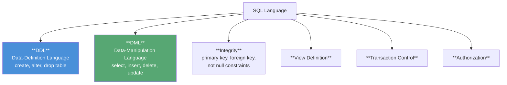

This chapter focuses on **basic DDL and DML** — the core of every SQL query and update you will write in the lab.

---

## 3.2 SQL Data Definition

The **Data-Definition Language (DDL)** specifies relation schemas, types, constraints, indices, and security/storage details. This chapter covers **basic schema definition and basic types**.

### 3.2.1 Basic Built-in Types

| Type | Meaning |
|---|---|
| `char(n)` | Fixed-length character string of length *n* (padded with spaces) |
| `varchar(n)` | Variable-length character string, maximum length *n* (no padding) |
| `int` / `integer` | Machine-dependent integer |
| `smallint` | Smaller-range integer |
| `numeric(p, d)` | Fixed-point number: *p* total digits, *d* digits after the decimal point |
| `real`, `double precision` | Floating-point numbers |
| `float(n)` | Floating-point with precision of at least *n* digits |
| `nvarchar` | Variable-length Unicode string (for multilingual data) |

> **`char` vs `varchar`:** `char(10)` storing `'Avi'` pads it to 10 characters with trailing spaces; `varchar(10)` stores just `'Avi'`. Comparing a padded `char` against an unpadded `varchar` can silently return `false` even for "equal" text — **prefer `varchar`** to avoid this pitfall (a classic exam trick question).

Every type may also hold a special **`null`** value — meaning the value is unknown or does not exist (explored fully in Section 3.6).

### 3.2.2 Basic Schema Definition — `create table`

```sql
create table department
   (dept_name  varchar(20),
    building   varchar(15),
    budget     numeric(12,2),
    primary key (dept_name));
```

**General form:**

```sql
create table r
   (A1 D1,
    A2 D2,
    ...,
    An Dn,
    ⟨integrity-constraint1⟩,
    ...,
    ⟨integrity-constraintk⟩);
```

### Integrity Constraints Supported in `create table`

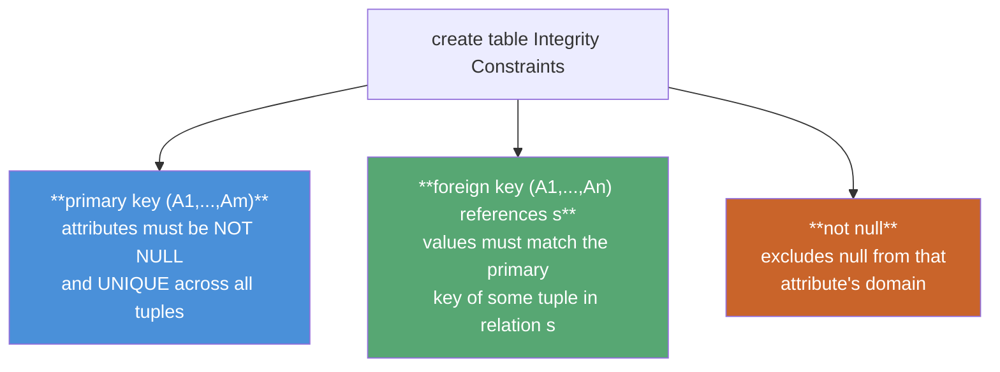

**Full university DDL example (with foreign keys):**

```sql
create table course
   (course_id  varchar(7),
    title      varchar(50),
    dept_name  varchar(20),
    credits    numeric(2,0),
    primary key (course_id),
    foreign key (dept_name) references department);

create table instructor
   (ID         varchar(5),
    name       varchar(20) not null,
    dept_name  varchar(20),
    salary     numeric(8,2),
    primary key (ID),
    foreign key (dept_name) references department);
```

> ⚠️ **MySQL note:** some systems require the referenced attribute to be listed explicitly: `foreign key (dept_name) references department(dept_name)`.

**Effect of constraints:** SQL **rejects** any insert/update that would leave a null (or duplicate) primary key, or a foreign-key value with no matching row in the referenced table.

### `drop table` vs `delete` vs `alter table` — a classic exam comparison

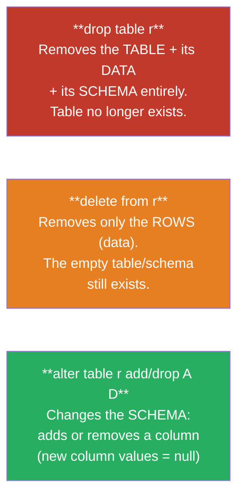

> **Board-exam favorite:** `DROP` destroys both data **and** schema; `TRUNCATE`/`DELETE` clears data but keeps the schema intact — this is exactly the `drop table` vs `delete from` distinction shown above.

---

## 3.3 Basic Structure of SQL Queries

Every SQL query is built from three core clauses:

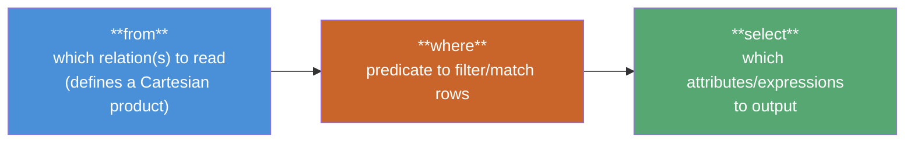

> Although written in the order `select, from, where`, SQL is best **understood** in the operational order: **from → where → select**.

### 3.3.1 Queries on a Single Relation

```sql
select name
from instructor;
```

- **Duplicates are NOT removed by default** in SQL (unlike pure relational algebra, since a relation is technically a *set*). Use **`distinct`** to force duplicate elimination, or **`all`** to explicitly retain duplicates (the default).

```sql
select distinct dept_name
from instructor;
```

- The `select` clause can include **arithmetic expressions**: `select ID, name, salary * 1.1 from instructor;` (simulates a 10% raise without changing the table).
- The `where` clause filters using comparison operators `<, <=, >, >=, =, <>` combined with `and`, `or`, `not`.

```sql
select name
from instructor
where dept_name = 'Comp. Sci.' and salary > 70000;
```

### 3.3.2 Queries on Multiple Relations (Implicit Join)

```sql
select name, instructor.dept_name, building
from instructor, department
where instructor.dept_name = department.dept_name;
```

### How SQL Conceptually Evaluates a Multi-Relation Query

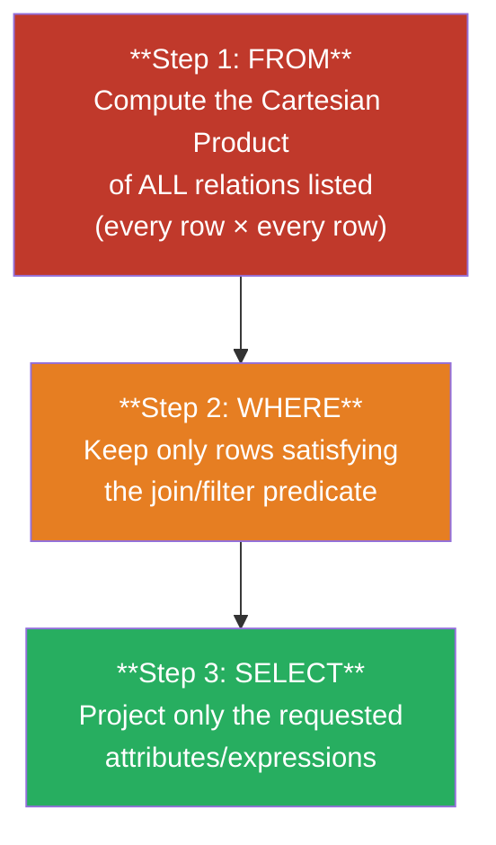

> ⚠️ **Danger of forgetting the `where` join condition:** `instructor × teaches` alone with no matching predicate produces the full Cartesian product — e.g., 12 instructors × 13 teaches rows = **156 meaningless combined tuples**. With 200 instructors × 600 teaches rows, that's **120,000 tuples**! Always include the join condition (`instructor.ID = teaches.ID`) in `where`.

---

## 3.4 Additional Basic Operations

### 3.4.1 The Rename Operation (`as`)

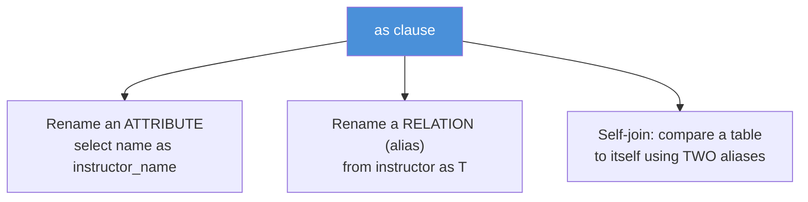

```sql
-- Renaming for a self-comparison ("correlation names" / table aliases)
select distinct T.name
from instructor as T, instructor as S
where T.salary > S.salary and S.dept_name = 'Biology';
```

`T` and `S` here are **correlation names** (also called table aliases or tuple variables) — essential whenever a relation must be compared **against itself**.

### 3.4.2 String Operations & Pattern Matching (`like`)

- Strings use single quotes: `'Computer'`; an embedded quote is doubled: `'It''s right'`.
- String equality is **case-sensitive** in the SQL standard (though MySQL/SQL Server may not distinguish case by default).
- Common string functions: `upper(s)`, `lower(s)`, `trim(s)`, concatenation `||`.

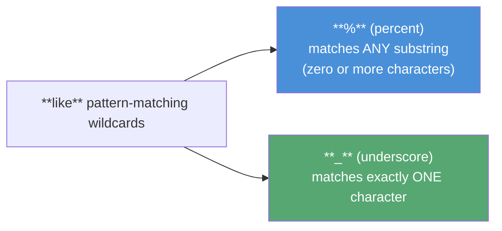

| Pattern | Matches |
|---|---|
| `'Intro%'` | Any string **starting** with "Intro" |
| `'%Comp%'` | Any string **containing** "Comp" anywhere |
| `'___'` | Any string of **exactly 3** characters |
| `'___%'` | Any string of **at least 3** characters |

```sql
select dept_name
from department
where building like '%Watson%';
```

- Use **`escape`** to match a literal `%` or `_`: `like 'ab\%cd%' escape '\'` matches strings starting with `"ab%cd"`.
- Use **`not like`** for mismatches.

### 3.4.3 `*` — All Attributes

`select *` returns all attributes of the `from` clause's result; `select instructor.*` returns all attributes of just the `instructor` relation (useful after a multi-table join).

### 3.4.4 Ordering Results — `order by`

```sql
select * from instructor order by salary desc, name asc;
```

Default order is **ascending**; use `desc` for descending. Multiple sort keys are applied left to right (tie-breaking).

### 3.4.5 `between` and Row Constructors

```sql
select name from instructor where salary between 90000 and 100000;
-- equivalent to: where salary <= 100000 and salary >= 90000
```

SQL also supports **row constructors** `(v1, v2, ...)` for lexicographic tuple comparison:

```sql
where (instructor.ID, dept_name) = (teaches.ID, 'Biology');
```

---

## 3.5 Set Operations

SQL's `union`, `intersect`, and `except` mirror the mathematical set operations **∪, ∩, −** — but with special rules for duplicates.

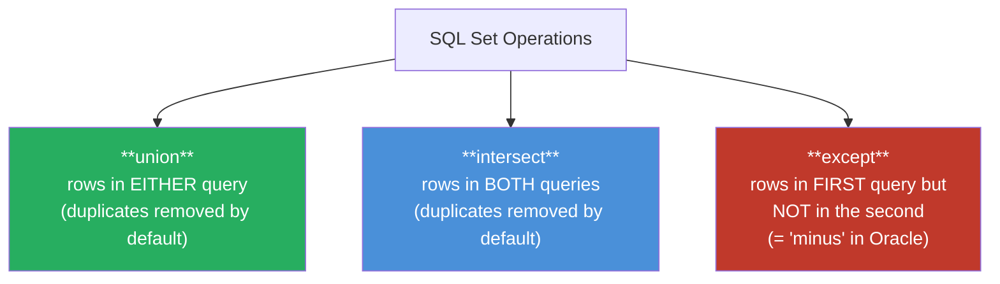

### Visualizing the Three Operations

Given `c1` = courses taught in Fall 2017 and `c2` = courses taught in Spring 2018:

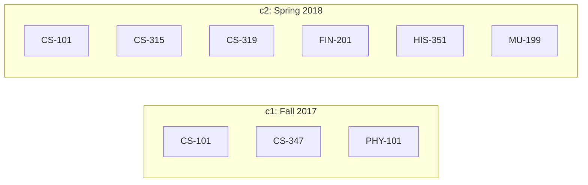

| Operation | SQL | Result (using c1, c2 above) |
|---|---|---|
| **Union** | `c1 union c2` | All 8 distinct courses (CS-101 appears once) |
| **Intersect** | `c1 intersect c2` | `{CS-101}` only |
| **Except** | `c1 except c2` | `{CS-347, PHY-101}` (Fall-only courses) |

```sql
(select course_id from section where semester = 'Fall' and year = 2017)
union
(select course_id from section where semester = 'Spring' and year = 2018);
```

### Duplicate-Retaining Variants: `union all`, `intersect all`, `except all`

| Variant | Duplicate count in result |
|---|---|
| `union all` | Total copies in **c1 + c2** |
| `intersect all` | **Minimum** of copies in c1 and c2 |
| `except all` | Copies in c1 **minus** copies in c2 (if positive) |

> ⚠️ `intersect` is **not implemented in MySQL** — use `in`/subqueries instead (see Section 3.8). `except` is called **`minus`** in Oracle.

---

## 3.6 Null Values

`null` represents an unknown or nonexistent value, and it introduces a **third truth value** into SQL's logic: `unknown`.

### Three-Valued Logic Truth Tables

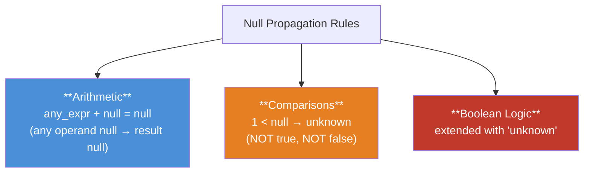

| `AND` | true | false | unknown |
|---|---|---|---|
| **true** | true | false | unknown |
| **false** | false | false | false |
| **unknown** | unknown | false | unknown |

| `OR` | true | false | unknown |
|---|---|---|---|
| **true** | true | true | true |
| **false** | true | false | unknown |
| **unknown** | true | unknown | unknown |

`not unknown` = **unknown**.

> **Key rule:** if the `where` predicate evaluates to **false or unknown**, the row is **excluded** from the result — only rows evaluating to **true** are kept.

### Testing for Null

```sql
select name from instructor where salary is null;      -- test for null
select name from instructor where salary is not null;   -- test for non-null
select name from instructor where salary > 10000 is unknown;  -- test the 3rd truth value
```

> **Note on `distinct`/set operations:** unlike in predicate comparisons (where `null = null` → `unknown`), when eliminating duplicates for `distinct`, `union`, `intersect`, or `except`, two nulls in the same position **are treated as equal** — a subtle but important exception often tested.

---

## 3.7 Aggregate Functions

Aggregate functions collapse a collection of values into a **single** summary value.

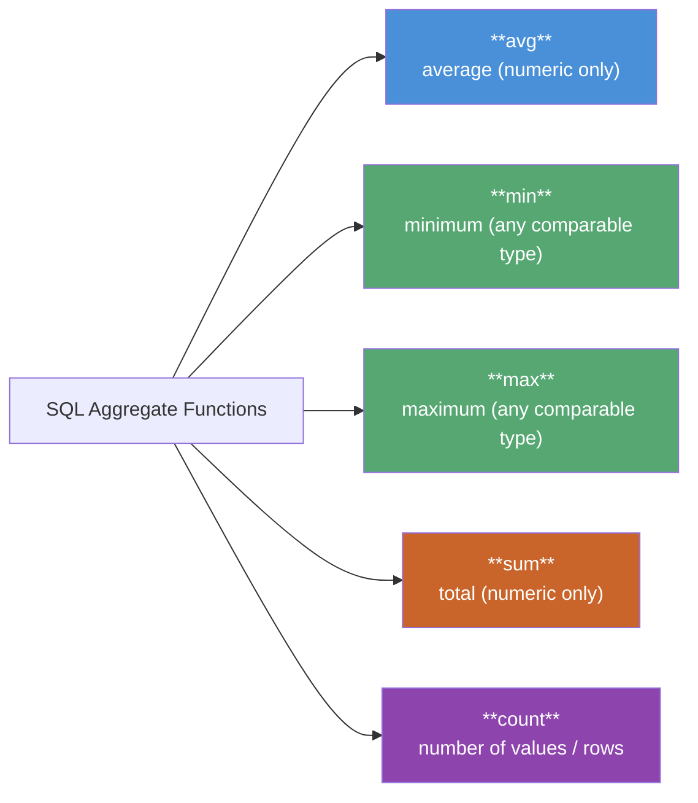

### 3.7.1 Basic Aggregation

```sql
select avg(salary) as avg_salary
from instructor
where dept_name = 'Comp. Sci.';
```

- **Duplicates matter for `avg`/`sum`** — they are **retained** by default (not eliminated), since eliminating them would skew the average. Use `distinct` inside the aggregate only when you deliberately want unique values counted once:

```sql
select count(distinct ID)
from teaches
where semester = 'Spring' and year = 2018;   -- each instructor counted ONCE

select count(*) from course;                  -- counts rows; distinct NOT allowed with count(*)
```

### 3.7.2 Aggregation with Grouping — `group by`

The **query pipeline** for grouped aggregation:

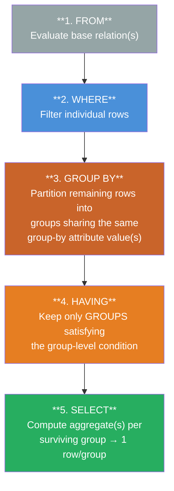

```sql
select dept_name, avg(salary) as avg_salary
from instructor
group by dept_name;
```

> **Golden rule:** every attribute in `select` that is **not** aggregated **must** appear in `group by` — otherwise SQL cannot decide which value to output per group (this produces an *erroneous query* error).

```sql
/* ERRONEOUS: ID is neither aggregated nor in group by */
select dept_name, ID, avg(salary)
from instructor
group by dept_name;
```

### 3.7.3 The `having` Clause — Filtering *Groups*

`having` applies conditions to **groups** (post-aggregation), whereas `where` applies to **individual rows** (pre-aggregation):

```sql
select dept_name, avg(salary) as avg_salary
from instructor
group by dept_name
having avg(salary) > 42000;
```

| Clause | Applies To | Can use aggregate functions? |
|---|---|---|
| `where` | Individual rows (before grouping) | ❌ No |
| `having` | Whole groups (after grouping) | ✅ Yes |

### 3.7.4 Aggregates and Nulls

> **Rule:** every aggregate function **except `count(*)`** simply **ignores** `null` values in its input. `count` of an empty collection is `0`; every other aggregate returns `null` for an empty collection. SQL:1999 also adds a `boolean` type with `some`/`every` aggregates (disjunction/conjunction over Boolean columns).

---

## 3.8 Nested Subqueries

A **subquery** is a `select-from-where` expression nested inside another query — most often inside the `where` clause to test **set membership**, **set comparison**, or **cardinality**.

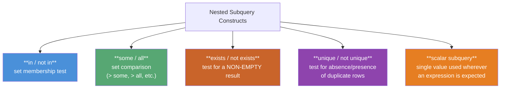

### 3.8.1 Set Membership — `in` / `not in`

```sql
select distinct course_id
from section
where semester = 'Fall' and year = 2017 and
      course_id in (select course_id
                     from section
                     where semester = 'Spring' and year = 2018);

select distinct name
from instructor
where name not in ('Mozart', 'Einstein');   -- works on enumerated lists too
```

### 3.8.2 Set Comparison — `some` / `all`

| Construct | Meaning | Equivalent to |
|---|---|---|
| `= some` | equal to **at least one** member | `in` |
| `<> some` | not equal to at least one member | **NOT** the same as `not in` |
| `> some` | greater than **at least one** (i.e., greater than the *minimum*) | — |
| `> all` | greater than **every** member (i.e., greater than the *maximum*) | — |
| `<> all` | not equal to **any** member | equivalent to `not in` |
| `= all` | equal to every member | **NOT** the same as `in` |

```sql
select name
from instructor
where salary > some (select salary from instructor where dept_name = 'Biology');
-- i.e. earns more than the LOWEST-paid Biology instructor

select name
from instructor
where salary > all (select salary from instructor where dept_name = 'Biology');
-- i.e. earns more than the HIGHEST-paid Biology instructor
```

### 3.8.3 Test for Empty Relations — `exists` / `not exists`

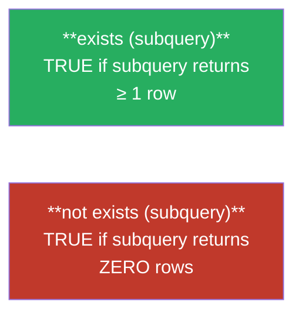

`exists` typically appears in a **correlated subquery** — one that references a correlation variable (table alias) from the *outer* query:

```sql
select course_id
from section as S
where semester = 'Fall' and year = 2017 and
      exists (select * from section as T
              where semester = 'Spring' and year = 2018 and
                    S.course_id = T.course_id);
```

**Simulating "contains" (division / universal quantification)** — "Find students who have taken **every** Biology course":

```sql
select S.ID, S.name
from student as S
where not exists (
    (select course_id from course where dept_name = 'Biology')
    except
    (select T.course_id from takes as T where S.ID = T.ID));
```

> **Pattern to memorize:** *"A contains B"* ⇔ `not exists (B except A)`. This is the standard technique for **"find X that has done ALL of Y"** queries — a very common lab/exam question type (e.g., "students who got Grade A in **all** courses").

### 3.8.4 Test for Duplicate Tuples — `unique` / `not unique`

`unique(subquery)` is `true` if the subquery's result contains **no duplicate rows** (an empty result is trivially unique).

```sql
select T.course_id
from course as T
where unique (select R.course_id from section as R
              where T.course_id = R.course_id and R.year = 2017);
-- "courses offered AT MOST once in 2017"
```

### 3.8.5 Subqueries in the `from` Clause

Any `select-from-where` produces a relation — so it can be used **anywhere** a relation is expected, including the `from` clause itself:

```sql
select dept_name, avg_salary
from (select dept_name, avg(salary) as avg_salary
      from instructor
      group by dept_name) as dept_avg
where avg_salary > 42000;
```

This is a `having`-free rewrite of the earlier grouped query — the subquery computes the aggregate first, then the outer `where` filters on it.

> The **`lateral`** keyword (SQL:2003+) lets a `from`-clause subquery reference correlation variables from *earlier* tables in the same `from` list — otherwise this is disallowed.

### 3.8.6 The `with` Clause — Named Temporary Relations

`with` defines one or more temporary, named result sets available only within the current query — much clearer than deeply nested subqueries:

```sql
with max_budget(value) as
     (select max(budget) from department)
select budget
from department, max_budget
where department.budget = max_budget.value;
```

Multiple `with` definitions can be chained (each may reference earlier ones), which is ideal for multi-step aggregate comparisons (e.g., "departments whose total salary exceeds the average total salary across all departments").

### 3.8.7 & 3.8.8 Scalar Subqueries

A **scalar subquery** returns exactly **one row, one column**, and can be used **anywhere a single value is expected** — in `select`, `where`, or `having`:

```sql
select dept_name,
       (select count(*) from instructor
        where department.dept_name = instructor.dept_name) as num_instructors
from department;
```

> If a scalar subquery unexpectedly returns more than one row at run time, SQL raises an **error** — the single-row guarantee is often only enforceable at run time, not compile time.

---

## 3.9 Modification of the Database

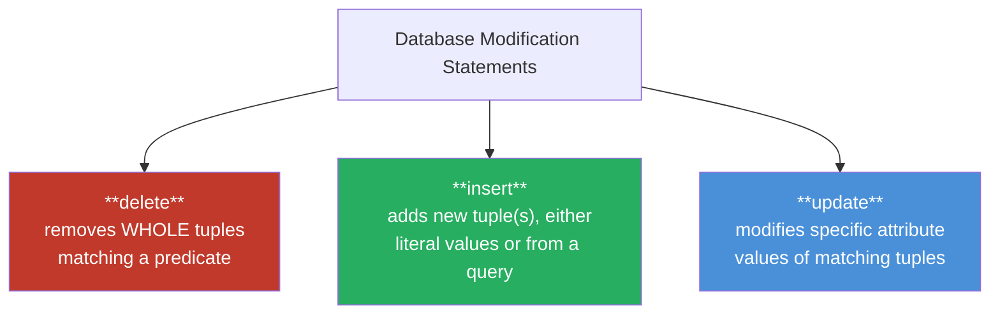

### 3.9.1 Deletion — `delete`

```sql
delete from r where P;      -- deletes matching rows; omitting "where" deletes ALL rows
```

```sql
delete from instructor where dept_name = 'Finance';

delete from instructor
where dept_name in (select dept_name from department where building = 'Watson');

-- Subquery referencing the SAME relation being deleted from — evaluated fully BEFORE any deletion:
delete from instructor
where salary < (select avg(salary) from instructor);
```

> **Critical evaluation rule:** SQL first identifies **all** tuples satisfying the predicate, **then** deletes them — this avoids the average shifting mid-deletion and producing order-dependent (non-deterministic) results.

### 3.9.2 Insertion — `insert`

```sql
-- Single literal tuple
insert into course
values ('CS-437', 'Database Systems', 'Comp. Sci.', 4);

-- Explicit attribute list (order-independent, safer)
insert into course (title, course_id, credits, dept_name)
values ('Database Systems', 'CS-437', 4, 'Comp. Sci.');

-- Insert from a QUERY result (bulk insert)
insert into instructor
select ID, name, dept_name, 18000
from student
where dept_name = 'Music' and tot_cred > 144;
```

> ⚠️ The `select` in an `insert ... select` is evaluated **completely first**, then all resulting rows are inserted — this prevents infinite self-insertion loops (e.g., `insert into student select * from student;` would otherwise recurse forever without a primary-key constraint).

Omitted attributes in an `insert` are automatically set to `null`.

### 3.9.3 Update — `update`, and the `case` Expression

```sql
update instructor
set salary = salary * 1.05
where salary < 70000;

-- Subquery-driven condition (average computed BEFORE any row is updated)
update instructor
set salary = salary * 1.05
where salary < (select avg(salary) from instructor);
```

**Problem:** applying two separate `update` statements in sequence for a tiered raise can produce **wrong, order-dependent results** (an instructor crossing the threshold mid-way could get double-raised). **Solution:** use a single `case` expression:

```sql
update instructor
set salary = case
                when salary <= 100000 then salary * 1.05
                else salary * 1.03
             end;
```

**General `case` syntax** (usable anywhere a value is expected):

```sql
case
    when pred1 then result1
    when pred2 then result2
    ...
    else result0
end
```

**Scalar subquery inside `set`** (updating a derived/summary attribute):

```sql
update student
set tot_cred = (
    select coalesce(sum(credits), 0)   -- coalesce replaces NULL with 0
    from takes, course
    where student.ID = takes.ID
      and takes.course_id = course.course_id
      and takes.grade <> 'F' and takes.grade is not null);
```

---

## Syllabus Connection

Relational query languages (SQL).

## Final Exam / Lab Test Mapping

- **Question 2(a) (2024 Exam):** Differentiating **DROP** (destroys both data and the table schema) and **TRUNCATE** (deletes all tuples but preserves the schema structure).
- **Question 3(b) (2023 & 2024 Exams):** Defining and providing SQL examples for **Data Manipulation Language (DML)** (SELECT, INSERT, UPDATE) and **Transaction Control Language (TCL)** (COMMIT, ROLLBACK).
- **Sessional CSE 2204 Lab Test:** Writing queries with WHERE, pattern matching, joins, grouping, and nested subqueries (e.g., retrieving records of employees with specific salary/position filters, or finding students who got 'Grade A' in all courses).
