# Chapter 4: Intermediate SQL

**Part:** [Part 2 — SQL & Application Design](../README.md)
**Textbook:** *Database System Concepts*, 7th Edition — Silberschatz, Korth, Sudarshan

## Exact Subsections to Read

- **4.1** Join Expressions (Natural Join, Join using On, Outer Joins: Left, Right, Full)
- **4.2** Views (View definition, materialized views, updatable views)
- **4.4** Integrity Constraints (Constraints on domain, Primary Key, Foreign Key, Unique, Check, Not Null, referential actions like on delete cascade)
- **4.7** Authorization (SQL privileges: Select, Insert, Update, Delete; Role-Based Access Control)

> In Chapter 3 we learned *basic* SQL. In this chapter, we build on that with more powerful tools: better ways to combine tables (joins), reusable saved queries (views), stronger rules to keep your data correct (constraints), and ways to control *who* is allowed to do *what* to your data (authorization).

---

## 4.1 Join Expressions

So far, whenever we combined two tables, we did it the "long way": list both tables in `from`, and write the matching condition in `where`. SQL's **join expressions** let us do the same thing, but more clearly and safely, directly inside the `from` clause.

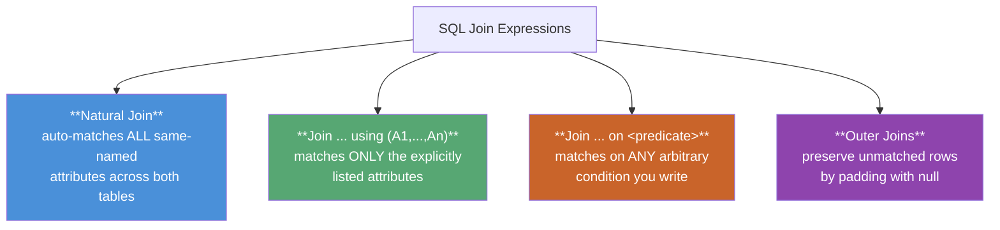

### 4.1.1 The Natural Join

`natural join` does the matching for you automatically: it looks at **every column that has the same name** in both tables, and matches rows where those columns are equal. Each shared column is then shown **only once** in the result (instead of twice).

```sql
select name, course_id
from student natural join takes;

-- equivalent, longhand form:
select name, course_id
from student, takes
where student.ID = takes.ID;
```

> ⚠️ **A trap to watch out for with natural join:** suppose you chain three natural joins together —
> `student natural join takes natural join course`. Because both `student` and `course` happen to have a column called `dept_name`, the join will *also* silently require `dept_name` to match between them. This quietly removes any student who is taking a course **outside their own department** — probably not what you wanted! This happens because natural join blindly matches *every* same-named column, whether you meant it to or not.

**How to fix it — `join ... using`:** this lets *you* choose exactly which shared column(s) must match, and ignores any other same-named columns:

```sql
select name, title
from (student natural join takes) join course using (course_id);
-- dept_name is NOT required to match here — only course_id is
```

### 4.1.2 Join Conditions — `on`

`join ... on <predicate>` lets you write **any condition you like** as the matching rule (similar to a `where` clause), but placed directly inside the `from` clause:

```sql
select *
from student join takes on student.ID = takes.ID;
```

This gives basically the same result as a Cartesian product with a `where` clause, with two small differences:
1. With `on`, both columns are kept in the result (e.g., you'll see both `student.ID` and `takes.ID`), instead of just one.
2. **`on` behaves differently from `where` when used with outer joins** — this is explained in detail below, and it's actually the main reason `on` exists as its own keyword.

### 4.1.3 Outer Joins — Preserving Unmatched Rows

A normal join (also called an **inner** join) only keeps rows that have a match on both sides — any row without a partner is simply dropped. An **outer join** is more forgiving: it keeps those unmatched rows too, and just fills in the missing side with `null`.

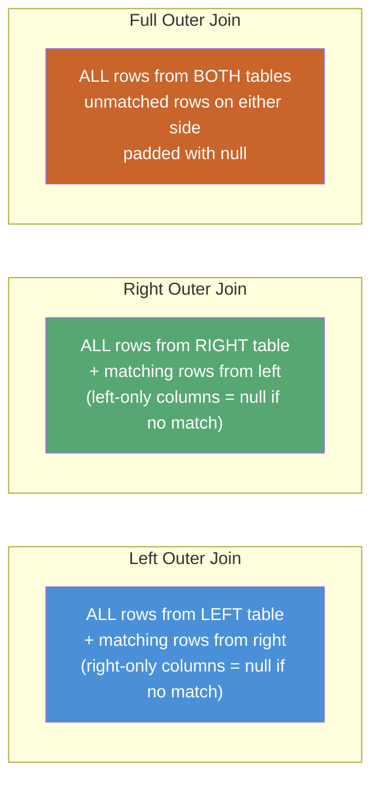

| Outer Join Type | Keeps unmatched rows from... | SQL Keyword |
|---|---|---|
| **Left Outer Join** | the **left** (first-named) relation only | `left outer join` |
| **Right Outer Join** | the **right** (second-named) relation only | `right outer join` |
| **Full Outer Join** | **both** relations | `full outer join` |
| *(Inner Join)* | *neither* — only truly matching rows | `join` / `inner join` (default) |

**Example — list every student, even the ones who haven't taken any course:**

```sql
select *
from student natural left outer join takes;
-- Student "Snow" (who has taken nothing) still appears,
-- with course_id, sec_id, semester, year, grade all = null
```

**A common trick — finding students who have taken NO course at all** (this is sometimes called an "anti-join"):

```sql
select ID
from student natural left outer join takes
where course_id is null;
```

### `on` vs. `where` with Outer Joins — the Critical Difference

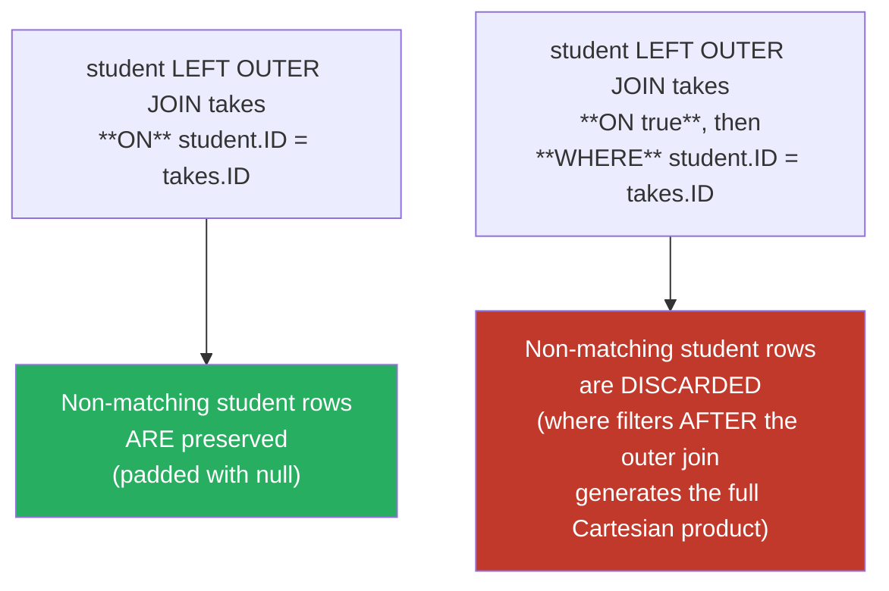

> **Why this matters:** the `on` condition is checked *while the outer join itself is happening* — it decides which rows get the `null`-padding treatment. A `where` clause, on the other hand, is checked *afterward*, once the join has already produced its result. So if you accidentally put your matching condition in `where` instead of `on`, it can throw away the very unmatched rows the outer join was supposed to keep. This is a small detail, but it's a favorite trick question in exams.

### Combining Join Types × Join Conditions

Here's something useful to know: any **join type** (inner, left outer, right outer, full outer) can be freely combined with any **join condition** (natural, `using`, `on`). They are independent choices.

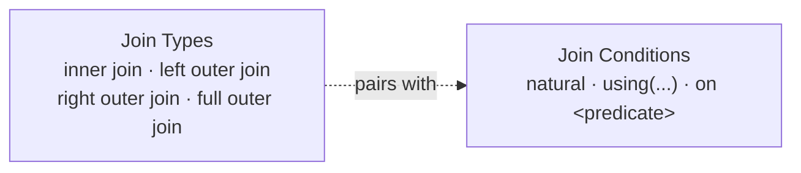

---

## 4.2 Views

A **view** is like a "saved query" that behaves as if it were a table. You can `select` from it just like a real table, but it doesn't actually store any rows itself — every time you use it, the database runs the underlying query again to compute the result fresh.

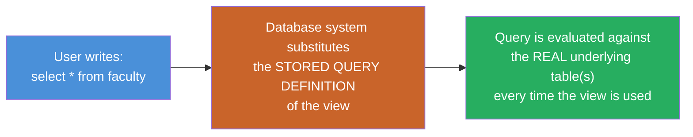

### 4.2.1 View Definition — `create view`

```sql
create view faculty as
    select ID, name, dept_name
    from instructor;
```

- Notice this view leaves out the `salary` column entirely. This is a simple but powerful way to add **security** — a clerk can be allowed to query `faculty`, but will never be able to see anyone's salary.
- You can also name the columns of a view explicitly. This is especially useful when your query produces a column without an obvious name, like an aggregate:

```sql
create view departments_total_salary(dept_name, total_salary) as
    select dept_name, sum(salary)
    from instructor
    group by dept_name;
```

- A view can even be built **on top of another view** — the database just keeps substituting definitions until it reaches the real tables.

> **View vs. `with` clause — what's the difference?** A `with`-defined relation only exists for the **single query** it's written in and disappears afterward. A `create view`, however, is saved permanently: it stays until someone explicitly `drop`s it, and it can be reused by many different queries and different users.

### 4.2.2 Materialized Views

By default, a view is **never stored** — every time you query it, the database recomputes it from scratch. A **materialized view** flips this around: its result is **physically saved** on disk, so reading it is much faster. The tradeoff is that the saved copy can go "stale" and needs to be refreshed (this is called **view maintenance**) whenever the underlying tables change.

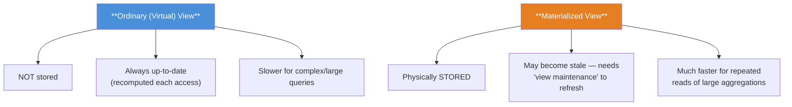

| Aspect | Virtual View | Materialized View |
|---|---|---|
| Storage | Not stored — recomputed | Physically stored |
| Freshness | Always current | May be stale until refreshed |
| Best for | Simple queries, security masking | Expensive aggregates over large tables |
| Refresh strategies | N/A | Immediate, lazy (on access), or periodic |
| SQL standard support | Yes (`create view`) | ❌ No standard syntax — vendor-specific extensions |

### 4.2.3 Updatable Views

You might expect to be able to `insert`, `update`, or `delete` through a view just like a normal table — but this gets tricky, because the database has to translate your change back onto the *real* underlying table(s), and that's not always possible to do without ambiguity.

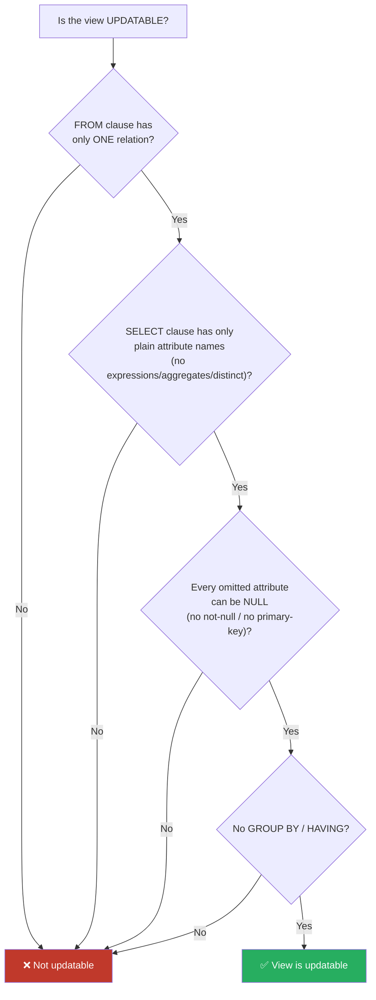

**For a view to be updatable, SQL requires all four of these conditions to hold:**
1. The `from` clause has **only one** database relation (table).
2. The `select` clause lists **only plain column names** — no expressions, aggregates, or `distinct`.
3. Any column that is **not** listed in `select` must be allowed to be `null` (that is, it isn't marked `not null` and isn't part of the primary key).
4. The query has **no `group by` or `having`** clause.

> Even a view that technically qualifies as "updatable" can behave oddly: if you insert a row through the view that doesn't satisfy the view's own `where` condition, the insert still succeeds on the real table — but the new row simply **won't show up** in the view. If you want SQL to actively **reject** such inserts/updates instead, add **`with check option`** to the view's definition.

---

## 4.4 Integrity Constraints

Integrity constraints exist to stop **accidental** mistakes from corrupting your data — even by users who are otherwise fully authorized to make changes. (This is different from *authorization*, covered in Section 4.7, which is about stopping **unauthorized** access.)

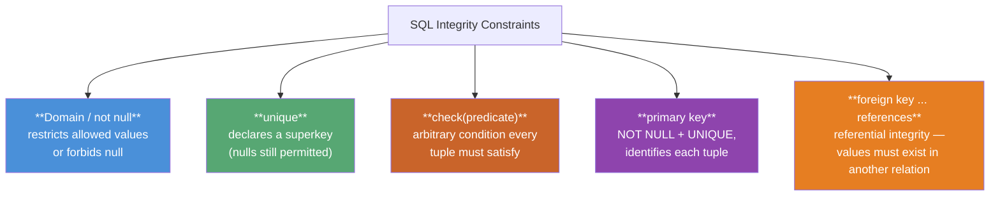

### 4.4.1–4.4.2 `not null` and Domain Constraints

```sql
name   varchar(20) not null,
budget numeric(12,2) not null
```

`not null` is what's called a **domain constraint** — it simply says "this column is never allowed to hold `null`". Also worth remembering: any column that is part of a primary key is **automatically** treated as `not null`, since SQL never allows a null primary key.

### 4.4.3 `unique` Constraint

```sql
unique (A1, A2, ..., Am)
```

This says that the listed columns, together, must be unique for every row — no two rows are allowed to have the exact same combination of values in all of them. The key difference from a primary key is that `unique` columns **are still allowed to hold `null`** (and since `null` is never considered equal to another `null`, having several nulls doesn't break the uniqueness rule) — unless you also mark the column `not null`.

### 4.4.4 The `check` Clause

`check(P)` makes sure that **every row** satisfies the condition *P* you write. You can think of it as a way to build your own custom validation rule:

```sql
budget numeric(12,2) check (budget > 0)

check (semester in ('Fall', 'Winter', 'Spring', 'Summer'))   -- simulates an ENUM
```

> A `check` is only considered violated if it works out to **`false`**. If it comes out `unknown` (which can happen when a `null` is involved in the comparison), that does **not** count as a violation. (The SQL standard technically allows subqueries inside `check`, but in practice, no major database system currently supports that.)

### 4.4.5 Referential Integrity — `foreign key`

```sql
foreign key (dept_name) references department
```

This makes sure that every `dept_name` value in this table **actually exists** as a primary key value over in the `department` table. By default, a foreign key points at the referenced table's primary key, but you can also name the exact target column yourself: `references department(dept_name)`.

### Referential Actions — What Happens on Violation?

What should happen if someone tries to delete or update a row that other rows still depend on through a foreign key? SQL lets you decide:

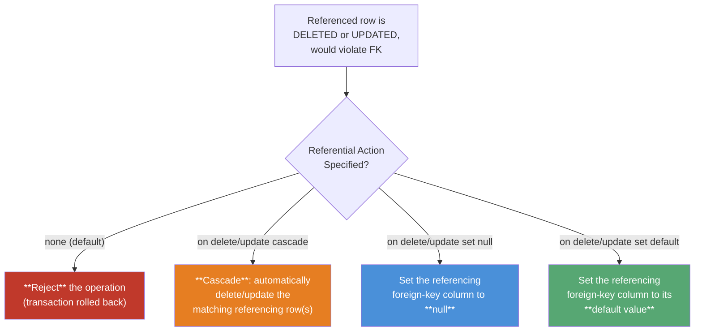

```sql
foreign key (dept_name) references department
    on delete cascade
    on update cascade
```

> **Cascades can chain together:** if table A's foreign key cascades into table B, and B's foreign key cascades into table C, then a single delete in A can end up rippling all the way down to C. If, at any point, a cascade runs into a rule it can't satisfy, the database gives up entirely — the **whole transaction is aborted and rolled back**, as if nothing happened.
>
> **What about nulls in a foreign key?** If the foreign-key column in a row is `null`, that row is treated as automatically satisfying the constraint — SQL doesn't even bother checking it — unless you've also marked that column `not null`.

### Naming & Deferring Constraints

```sql
salary numeric(8,2), constraint minsalary check (salary > 29000)
...
alter table instructor drop constraint minsalary;
```

Giving a constraint a name (like `minsalary` above) means you can remove it later with `alter table ... drop constraint`. You can also mark a constraint as `deferrable` / `initially deferred`, which tells SQL to wait until the **end of the whole transaction** before checking it. This is handy when a multi-step transaction is only valid once *all* its steps are done — for example, inserting two rows that each reference the other.

### Summary Table — All Constraint Types Covered

| Constraint | Scope | Enforces |
|---|---|---|
| `not null` | Single attribute | Value cannot be null |
| `unique(...)` | Attribute set | Values form a superkey (nulls allowed) |
| `check(P)` | Attribute / tuple / table | Arbitrary predicate P must hold |
| `primary key(...)` | Attribute set | Superkey + not null + minimal, exactly one per table |
| `foreign key(...) references` | Cross-table | Referential integrity |
| `create assertion` | Whole database | Arbitrary always-true predicate (not supported by mainstream DBs) |

---

## 4.7 Authorization

Authorization is about deciding **which users** are allowed to perform **which actions**. This is a *security* concern — different from integrity constraints, which protect data correctness rather than access.

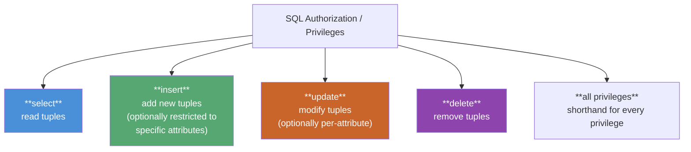

### 4.7.1 Granting and Revoking Privileges — Discretionary Access Control (DAC)

```sql
grant select on department to Amit, Satoshi;
grant update (budget) on department to Amit, Satoshi;   -- per-attribute update privilege

revoke select on department from Amit, Satoshi;
```

> The keyword `public` means **every current and future user**. Granting a privilege to `public` gives it to everybody.

This style — where the owner of a table decides, user by user, who gets access — is exactly what's called **Discretionary Access Control (DAC)**. The person granting access has full "discretion" to decide who else may use their objects.

### 4.7.2 Roles — Role-Based Access Control (RBAC)

Imagine you had to grant the same set of privileges to every single instructor, one by one — that would get tedious fast. Instead, you can define a **role** once, grant privileges to that role, and then simply give the role to each user who needs it.

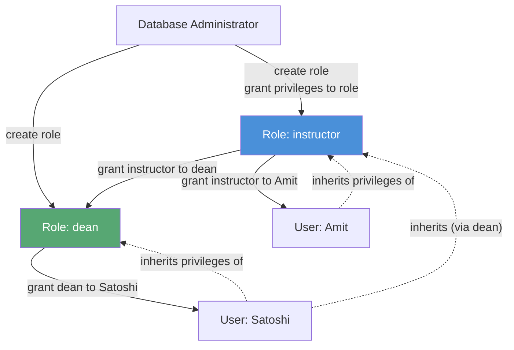

```sql
create role instructor;
grant select on takes to instructor;

create role dean;
grant instructor to dean;      -- roles can inherit from other roles!
grant dean to Satoshi;          -- Satoshi now has ALL privileges of dean + instructor
```

**In short: a user's total privileges = whatever was granted directly to them, plus everything granted to any role they hold (even indirectly, through another role).**

> **DAC vs. RBAC — a common exam comparison:**
>
> | | Discretionary Access Control (DAC) | Role-Based Access Control (RBAC) |
> |---|---|---|
> | Granularity | Per-user, via `grant`/`revoke` | Per-**role** (organizational function) |
> | Admin overhead | High — repeat grants for every new user | Low — just assign the role |
> | Scales to org changes | Poorly (re-grant everything on hire) | Well (grant/revoke a single role) |
> | SQL mechanism | `grant ... to <user>` | `create role`, `grant ... to <role>`, `grant <role> to <user>` |

### 4.7.3–4.7.4 Authorization on Views and Schema

- A user can only be given privileges on a **view** that don't go beyond what they already have on the **real tables** it's built from. (For example, they can't be granted `update` on a view if they don't already have `update` on its underlying table.)
- Before a user can create a **foreign key** pointing to someone else's table, they first need the `references` privilege on that table. This makes sense because a foreign key **restricts what the owner of the other table can later delete or update**.

### 4.7.5–4.7.6 Privilege Transfer and Cascading Revocation

```sql
grant select on department to Amit with grant option;   -- Amit may now re-grant this to others
revoke select on department from Amit, Satoshi restrict; -- fails if it would cascade
```

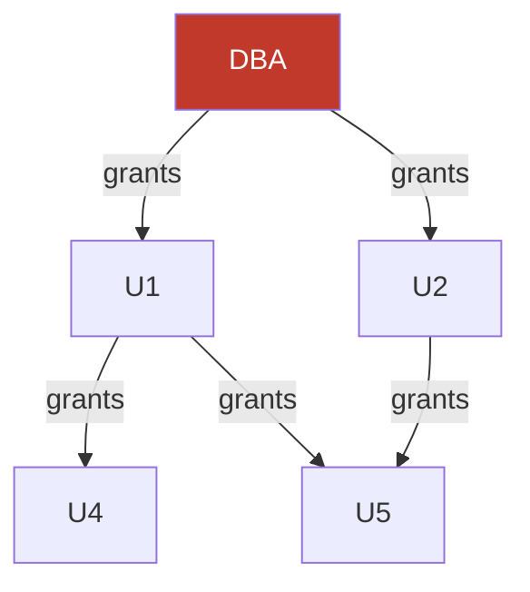

> **What is "cascading revocation"?** If you revoke a privilege from U1, that revocation also automatically cascades to anyone who only received the privilege *through* U1 (in the diagram above, that's U4). But notice U5 **keeps** the privilege — because U2 *also* independently granted it to U5. The rule is simple: a user keeps a privilege as long as **at least one valid path** still connects them back to the DBA (the root of the authorization graph).

### 4.7.7 Row-Level Authorization

Normal `grant`/`revoke` statements only control access at the level of an entire **table or view** — they can't restrict access to just some rows. Some database systems (like Oracle VPD, PostgreSQL, and SQL Server) go a step further and offer **row-level security**: they automatically attach a hidden condition (like `ID = current_user`) to every query, so, for example, a student can only see their *own* rows in `takes`, not everyone else's.

---

## Syllabus Connection

Intermediate SQL (Joins, Views), integrity constraints, and Access Control/Security (DAC and RBAC).

## Final Exam Pattern Mapping

- **Question 5(a) (2024 Exam):** Explaining database constraints and their role in maintaining data integrity with examples (PRIMARY KEY, FOREIGN KEY, UNIQUE, CHECK, NOT NULL).
- **Question 5(c) (2023 & 2024 Exams):** Defining a **View** in SQL, explaining its types (virtual vs. materialized), and demonstrating view definition syntax.
- **Question 8(c) (2024 Exam):** Discussing and contrasting **Discretionary Access Control (DAC)** (user-centric permissions managed via GRANT/REVOKE) and **Role-Based Access Control (RBAC)** (permissions assigned to structural organizational roles to simplify administrative overhead).
- **Question 3(a) (2023 Exam):** Distinguishing between a **Natural Join** (implicitly equating all attributes with matching names) and an **Inner Join** (requiring explicit mapping criteria).
