# Chapter 4: Intermediate SQL

**Part:** [Part 2 — SQL & Application Design](../README.md)
**Textbook:** *Database System Concepts*, 7th Edition — Silberschatz, Korth, Sudarshan

## Exact Subsections to Read

- **4.1** Join Expressions (Natural Join, Join using On, Outer Joins: Left, Right, Full)
- **4.2** Views (View definition, materialized views, updatable views)
- **4.4** Integrity Constraints (Constraints on domain, Primary Key, Foreign Key, Unique, Check, Not Null, referential actions like on delete cascade)
- **4.7** Authorization (SQL privileges: Select, Insert, Update, Delete; Role-Based Access Control)

> This chapter moves from *basic* SQL to *intermediate* SQL — richer ways to combine tables (joins), reusable virtual tables (views), stronger data-integrity guarantees (constraints), and controlling *who* can do *what* to the data (authorization).

---

## 4.1 Join Expressions

Until now, multiple tables were combined via a **Cartesian product + `where` predicate**. SQL's **join expressions** let us express the same combinations more naturally and safely, directly inside the `from` clause.

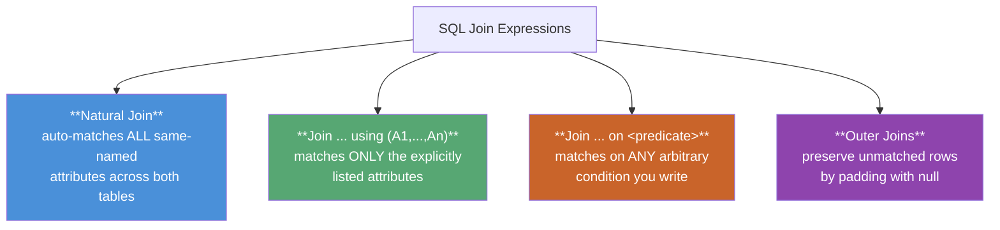

### 4.1.1 The Natural Join

`natural join` automatically matches tuples on **every attribute that shares the same name** in both relations, and lists each shared attribute **only once** in the output.

```sql
select name, course_id
from student natural join takes;

-- equivalent, longhand form:
select name, course_id
from student, takes
where student.ID = takes.ID;
```

> ⚠️ **The classic natural-join trap:** if you chain three natural joins —
> `student natural join takes natural join course` — the join silently requires **`dept_name`** to match too (since it exists in both `student` and `course`), incorrectly excluding students who take courses **outside their own department**. This happens because natural join blindly equates *every* shared column name, whether you intended it or not.

**Fix — `join ... using`:** lets you pick exactly *which* shared columns must match, ignoring any other same-named columns:

```sql
select name, title
from (student natural join takes) join course using (course_id);
-- dept_name is NOT required to match here — only course_id is
```

### 4.1.2 Join Conditions — `on`

`join ... on <predicate>` allows an **arbitrary** predicate (like a `where` clause) as the matching rule, placed directly in the `from` clause:

```sql
select *
from student join takes on student.ID = takes.ID;
```

This is functionally equivalent to a Cartesian product + `where`, **except**:
1. The `on` version keeps duplicate/qualified columns (e.g., both `student.ID` and `takes.ID` appear).
2. **`on` behaves differently from `where` for outer joins** (explained below) — this is the real reason `on` exists as a separate construct.

### 4.1.3 Outer Joins — Preserving Unmatched Rows

A plain (**inner**) join **drops** any row that has no matching partner. **Outer joins** keep such rows, filling the missing side with `null`.

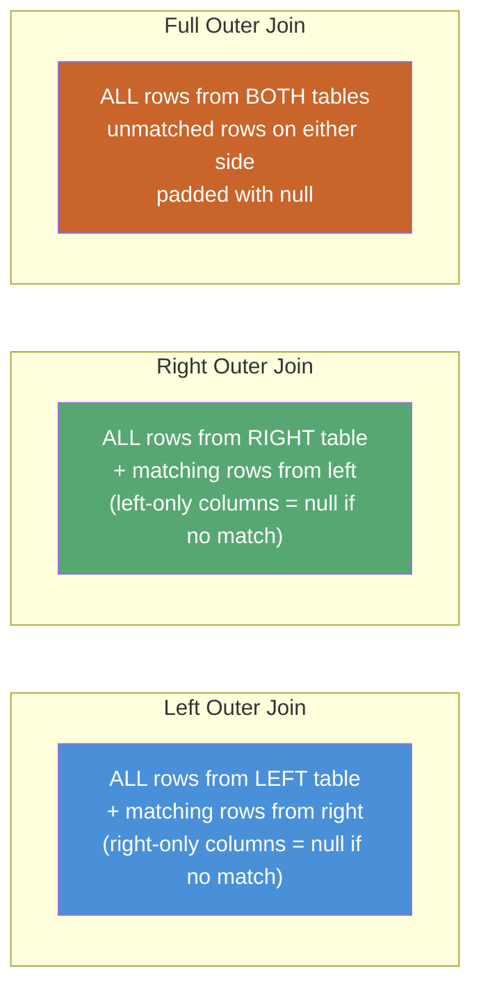

| Outer Join Type | Keeps unmatched rows from... | SQL Keyword |
|---|---|---|
| **Left Outer Join** | the **left** (first-named) relation only | `left outer join` |
| **Right Outer Join** | the **right** (second-named) relation only | `right outer join` |
| **Full Outer Join** | **both** relations | `full outer join` |
| *(Inner Join)* | *neither* — only truly matching rows | `join` / `inner join` (default) |

**Example — find every student, even those who've taken no courses:**

```sql
select *
from student natural left outer join takes;
-- Student "Snow" (who has taken nothing) still appears,
-- with course_id, sec_id, semester, year, grade all = null
```

**Finding students who have taken NO course** (a very common "anti-join" pattern):

```sql
select ID
from student natural left outer join takes
where course_id is null;
```

### `on` vs. `where` with Outer Joins — the Critical Difference

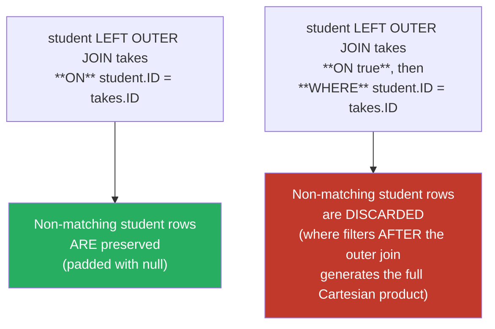

> **Why this matters:** the `on` condition is evaluated *as part of* the outer-join operation itself (deciding which rows get null-padded), while a `where` clause filters *after* the join has already produced its (possibly Cartesian) result — potentially throwing away the very null-padded rows the outer join was meant to preserve. This subtlety is a favorite theory exam trap.

### Combining Join Types × Join Conditions

Any **join type** (inner, left outer, right outer, full outer) can be paired with any **join condition** (natural, `using`, `on`):

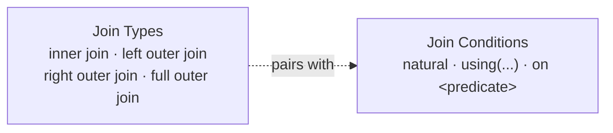

---

## 4.2 Views

A **view** is a **virtual relation** defined by a stored query — it looks and queries just like a table, but its rows are computed **on demand**, not stored.

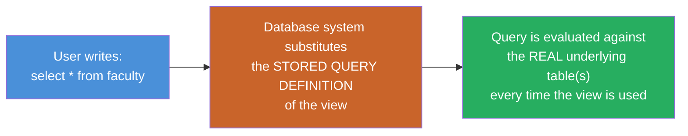

### 4.2.1 View Definition — `create view`

```sql
create view faculty as
    select ID, name, dept_name
    from instructor;
```

- Hides the `salary` column entirely — useful for **security** (a clerk can query `faculty` but never see salaries).
- Attribute names can be given explicitly, useful when the query uses unnamed expressions (e.g., aggregates):

```sql
create view departments_total_salary(dept_name, total_salary) as
    select dept_name, sum(salary)
    from instructor
    group by dept_name;
```

- A view can be built **on top of another view** — the system simply substitutes definitions recursively.

> **View vs. `with` clause:** a `with`-defined temporary relation only lives for **one query**; a `create view` persists until explicitly `drop`ped and can be reused across many queries by many users.

### 4.2.2 Materialized Views

By default, a view is **recomputed every time** it's queried (never stored). A **materialized view** is the opposite: its result is **physically stored**, giving much faster reads — at the cost of needing **view maintenance** to keep it in sync whenever the underlying tables change.

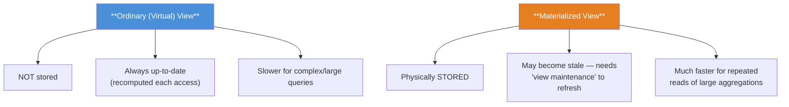

| Aspect | Virtual View | Materialized View |
|---|---|---|
| Storage | Not stored — recomputed | Physically stored |
| Freshness | Always current | May be stale until refreshed |
| Best for | Simple queries, security masking | Expensive aggregates over large tables |
| Refresh strategies | N/A | Immediate, lazy (on access), or periodic |
| SQL standard support | Yes (`create view`) | ❌ No standard syntax — vendor-specific extensions |

### 4.2.3 Updatable Views

Modifying data **through** a view is tricky — the update must be translated back onto the real underlying tables, and this is not always possible unambiguously.

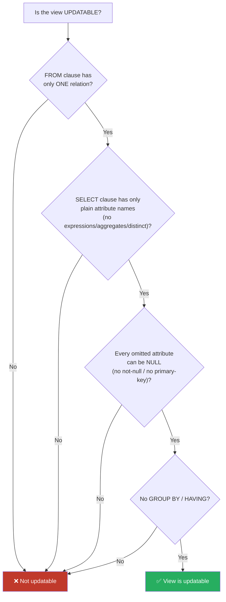

**SQL's four conditions for a view to be updatable:**
1. The `from` clause has **only one** database relation.
2. The `select` clause contains **only attribute names** — no expressions, aggregates, or `distinct`.
3. Any attribute **not** listed in `select` can be `null` (i.e., not `not null`, not part of the primary key).
4. The query has **no `group by` or `having`** clause.

> Even an "updatable" view can misbehave: inserting a row that doesn't satisfy the view's own `where` condition succeeds in the base table but **vanishes** from the view. Add **`with check option`** to the view definition to make SQL **reject** such inserts/updates automatically.

---

## 4.4 Integrity Constraints

Integrity constraints prevent **accidental** data-consistency violations by authorized users (as opposed to *authorization*, which guards against **unauthorized** access — Section 4.7).

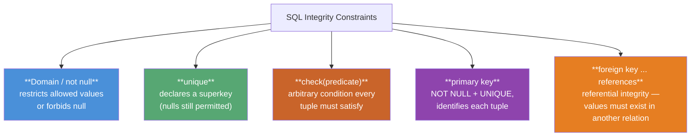

### 4.4.1–4.4.2 `not null` and Domain Constraints

```sql
name   varchar(20) not null,
budget numeric(12,2) not null
```

`not null` is a **domain constraint** — it excludes `null` from that attribute's set of legal values. Primary-key attributes are **automatically** `not null` (SQL forbids null primary keys).

### 4.4.3 `unique` Constraint

```sql
unique (A1, A2, ..., Am)
```

Declares that the listed attributes form a **superkey** — no two tuples may agree on **all** of them. Unlike a primary key, `unique` attributes **may still be `null`** (and null ≠ null, so multiple nulls don't violate uniqueness) unless separately declared `not null`.

### 4.4.4 The `check` Clause

`check(P)` enforces that **every tuple** satisfies predicate *P* — effectively creating a custom, richer type system:

```sql
budget numeric(12,2) check (budget > 0)

check (semester in ('Fall', 'Winter', 'Spring', 'Summer'))   -- simulates an ENUM
```

> A `check` clause is violated only if it evaluates to **`false`** — `unknown` (from a `null` comparison) is **not** treated as a violation. (The SQL standard technically allows subqueries inside `check`, but no major production database currently supports this.)

### 4.4.5 Referential Integrity — `foreign key`

```sql
foreign key (dept_name) references department
```

Ensures every `dept_name` in the referencing table **actually exists** as a primary key value in `department`. By default the foreign key targets the referenced table's **primary key**; you can also name the target column(s) explicitly: `references department(dept_name)`.

### Referential Actions — What Happens on Violation?

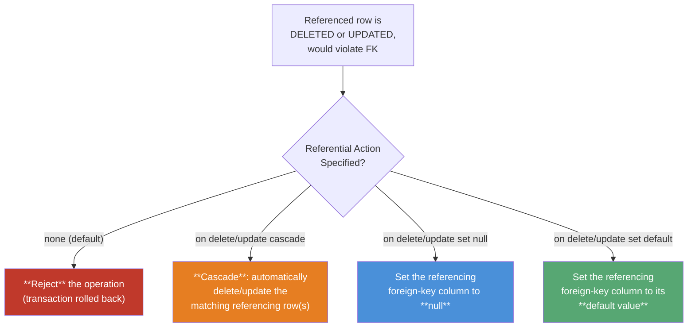

```sql
foreign key (dept_name) references department
    on delete cascade
    on update cascade
```

> **Cascading chains:** if relation A's FK cascades into B, and B's FK cascades into C, a single delete in A can ripple all the way to C. If a cascade ever hits a constraint it *cannot* resolve, the **entire transaction is aborted** and rolled back.
>
> **Nulls and foreign keys:** if a foreign-key attribute is `null` in a tuple, that tuple **automatically satisfies** the FK constraint (no matching check is performed) — unless the column is separately `not null`.

### Naming & Deferring Constraints

```sql
salary numeric(8,2), constraint minsalary check (salary > 29000)
...
alter table instructor drop constraint minsalary;
```

Named constraints can later be dropped via `alter table ... drop constraint`. Constraints can also be declared `deferrable` / `initially deferred`, delaying the check until the **end of the transaction** — useful when a multi-step transaction is only consistent once *all* its steps complete (e.g., inserting two mutually-referencing rows).

### Summary Table — All Constraint Types Covered

| Constraint | Scope | Enforces |
|---|---|---|
| `not null` | Single attribute | Value cannot be null |
| `unique(...)` | Attribute set | Values form a superkey (nulls allowed) |
| `check(P)` | Attribute / tuple / table | Arbitrary predicate P must hold |
| `primary key(...)` | Attribute set | Superkey + not null + minimal, exactly one per table |
| `foreign key(...) references` | Cross-table | Referential integrity |
| `create assertion` | Whole database | Arbitrary always-true predicate (not supported by mainstream DBs) |

---

## 4.7 Authorization

Authorization controls **which users** may perform **which operations** — a *security* concern, distinct from integrity constraints.

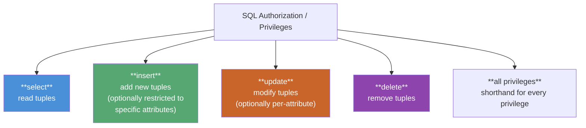

### 4.7.1 Granting and Revoking Privileges — Discretionary Access Control (DAC)

```sql
grant select on department to Amit, Satoshi;
grant update (budget) on department to Amit, Satoshi;   -- per-attribute update privilege

revoke select on department from Amit, Satoshi;
```

> `public` refers to **all current and future users** — granting to `public` grants to everyone.

This user-to-user, statement-by-statement model of granting/revoking privileges directly is the essence of **Discretionary Access Control (DAC)** — each user/owner discretionarily decides who else may access their objects.

### 4.7.2 Roles — Role-Based Access Control (RBAC)

Rather than granting the same set of privileges to every instructor individually, define a **role** once and grant privileges to the role — then simply grant the *role* to each qualifying user.

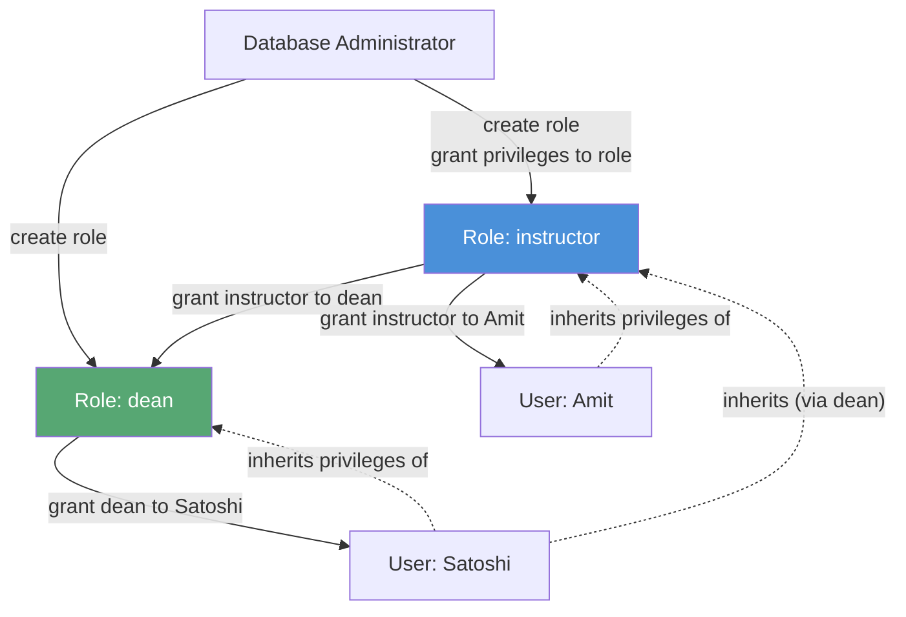

```sql
create role instructor;
grant select on takes to instructor;

create role dean;
grant instructor to dean;      -- roles can inherit from other roles!
grant dean to Satoshi;          -- Satoshi now has ALL privileges of dean + instructor
```

**A user's total privileges = privileges granted directly to the user + privileges of every role granted (directly or transitively) to that user.**

> **DAC vs. RBAC — the classic exam contrast:**
>
> | | Discretionary Access Control (DAC) | Role-Based Access Control (RBAC) |
> |---|---|---|
> | Granularity | Per-user, via `grant`/`revoke` | Per-**role** (organizational function) |
> | Admin overhead | High — repeat grants for every new user | Low — just assign the role |
> | Scales to org changes | Poorly (re-grant everything on hire) | Well (grant/revoke a single role) |
> | SQL mechanism | `grant ... to <user>` | `create role`, `grant ... to <role>`, `grant <role> to <user>` |

### 4.7.3–4.7.4 Authorization on Views and Schema

- A user can only be granted privileges on a **view** that don't exceed what they already hold on the **underlying relations** (e.g., no `update` on a view without `update` on its base table).
- The `references` privilege is required before a user can create a **foreign key** pointing at another user's table — because a foreign key **restricts future deletes/updates** on the referenced table.

### 4.7.5–4.7.6 Privilege Transfer and Cascading Revocation

```sql
grant select on department to Amit with grant option;   -- Amit may now re-grant this to others
revoke select on department from Amit, Satoshi restrict; -- fails if it would cascade
```

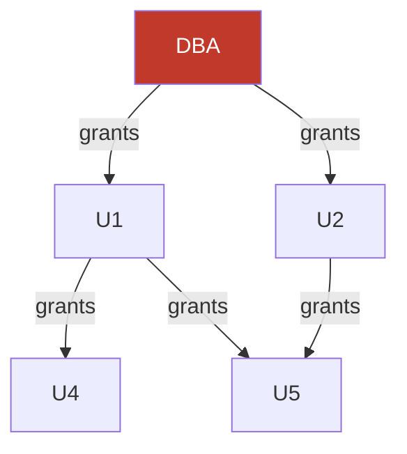

> **Cascading revocation:** revoking a privilege from U1 automatically revokes it from anyone who received it **only** via U1 (e.g., U4 above). U5, however, **keeps** the privilege because U2 *also* independently granted it — a user retains a privilege as long as **at least one path** from the DBA (root) still reaches them in the authorization graph.

### 4.7.7 Row-Level Authorization

Standard `grant`/`revoke` controls access at the level of a whole **relation or view** — never individual rows. Some systems (Oracle VPD, PostgreSQL, SQL Server) add **row-level security**, automatically appending a hidden predicate (e.g., `ID = current_user`) to every query so a student can see only *their own* `takes` rows.

---

## Syllabus Connection

Intermediate SQL (Joins, Views), integrity constraints, and Access Control/Security (DAC and RBAC).

## Final Exam Pattern Mapping

- **Question 5(a) (2024 Exam):** Explaining database constraints and their role in maintaining data integrity with examples (PRIMARY KEY, FOREIGN KEY, UNIQUE, CHECK, NOT NULL).
- **Question 5(c) (2023 & 2024 Exams):** Defining a **View** in SQL, explaining its types (virtual vs. materialized), and demonstrating view definition syntax.
- **Question 8(c) (2024 Exam):** Discussing and contrasting **Discretionary Access Control (DAC)** (user-centric permissions managed via GRANT/REVOKE) and **Role-Based Access Control (RBAC)** (permissions assigned to structural organizational roles to simplify administrative overhead).
- **Question 3(a) (2023 Exam):** Distinguishing between a **Natural Join** (implicitly equating all attributes with matching names) and an **Inner Join** (requiring explicit mapping criteria).
