# Chapter 5: Advanced SQL

**Part:** [Part 2 — SQL & Application Design](../README.md)
**Textbook:** *Database System Concepts*, 7th Edition — Silberschatz, Korth, Sudarshan

## Exact Subsections to Read

- **5.1** Accessing SQL from a Programming Language (FastAPI, Python Database API / psycopg2)
- **5.2** Functions and Procedures (Stored procedures to encapsulate business logic)
- **5.3** Triggers (Defining triggers: BEFORE, AFTER, INSTEAD OF, row-level vs. statement-level)

> Chapters 3 and 4 covered *pure* SQL. In practice, however, SQL never runs completely alone — real applications embed it inside general-purpose programs (Python, Java, C), extend it with procedural business logic (functions and stored procedures), and let the database react automatically to changes (triggers). This chapter covers exactly that: **connecting** SQL to application code, **encapsulating logic** inside the database, and **automating actions** on data-modification events.

---

## 5.1 Accessing SQL from a Programming Language

### Why SQL Alone Is Not Enough

SQL is a powerful **declarative** query language, but a real application needs a general-purpose programming language for two reasons:

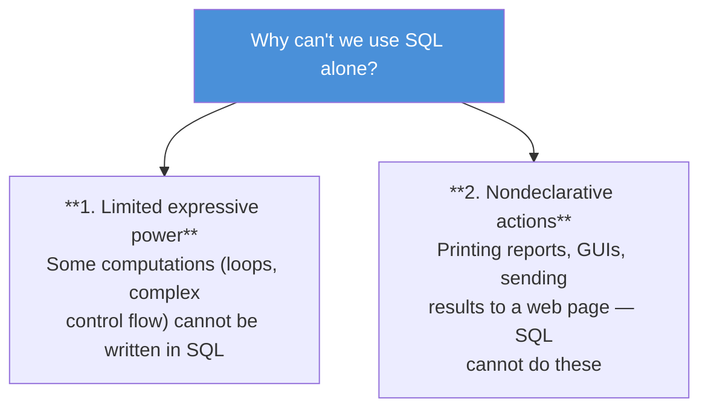

### Two Approaches to Connecting SQL and a Host Language

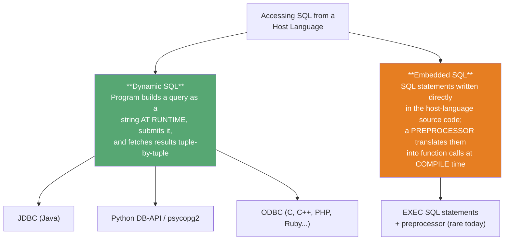

| Aspect | Dynamic SQL | Embedded SQL |
|---|---|---|
| When is SQL text fixed? | At **runtime** | At **compile time** (via preprocessor) |
| Error detection | Only when the query runs | Some errors caught while preprocessing |
| Flexibility | High — query string built on the fly | Lower — structure fixed in source |
| Used by | JDBC, ODBC, Python DB-API | C/COBOL/Fortran embeddings (legacy) |
| Modern usage | **Dominant** — almost all systems use this today | Largely superseded; kept for legacy code |

> A key underlying mismatch: SQL's native data type is the **relation** (a set of tuples), while a host language like Java or Python normally manipulates **one variable at a time**. Every API below exists to bridge this gap — fetching a relation's result **one tuple at a time** into host-language variables.

### 5.1.1 JDBC (Java Database Connectivity)

**JDBC** is the standard API that lets Java programs connect to, query, and update a database.

**Step-by-step life cycle of a JDBC interaction:**

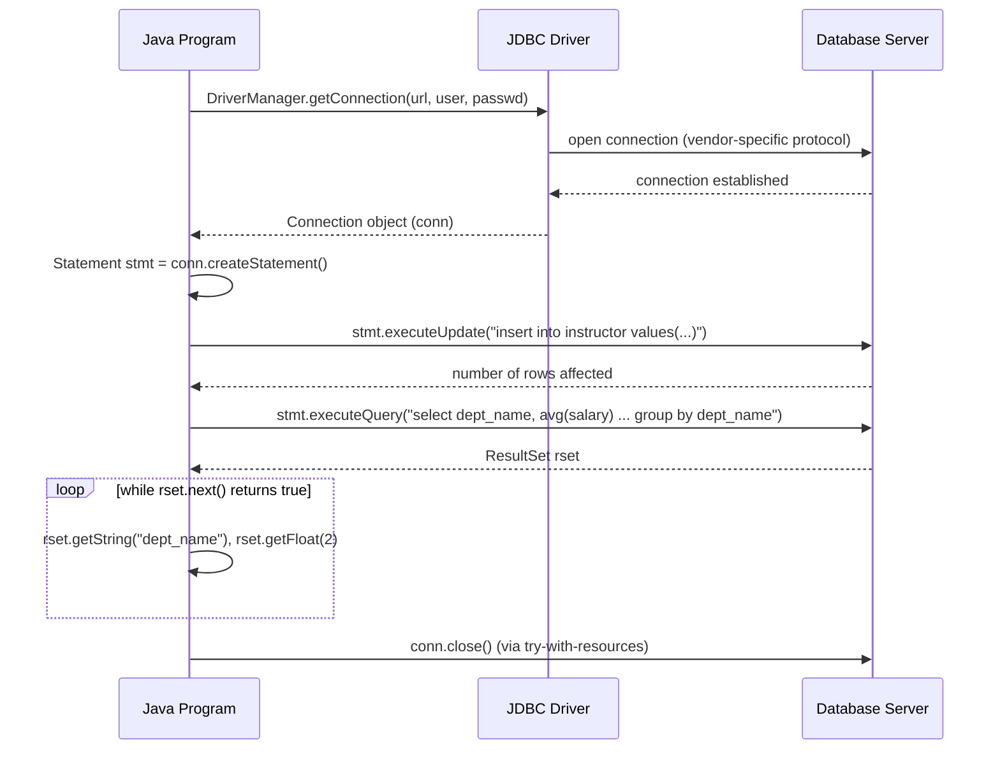

**Key JDBC building blocks:**

| Component | Purpose |
|---|---|
| `DriverManager.getConnection(url, user, password)` | Opens a `Connection`; the URL string encodes protocol, host, port, and database name (e.g., `jdbc:oracle:thin:@db.yale.edu:1521:univdb`) |
| `Statement` | Ships a plain SQL string to the server for execution |
| `stmt.executeUpdate(sql)` | Runs **insert/update/delete/DDL**; returns rows affected (0 for DDL) |
| `stmt.executeQuery(sql)` | Runs a **query**; returns a `ResultSet` |
| `ResultSet.next()` | Advances to the next tuple; returns `false` when exhausted |
| `rset.getString()/getFloat()/...` | Retrieves an attribute by **name** or **column position** |

```java
try (
    Connection conn = DriverManager.getConnection(
        "jdbc:oracle:thin:@db.yale.edu:1521:univdb", userid, passwd);
    Statement stmt = conn.createStatement();
) {
    stmt.executeUpdate("insert into instructor values('77987','Kim','Physics',98000)");

    ResultSet rset = stmt.executeQuery(
        "select dept_name, avg(salary) from instructor group by dept_name");
    while (rset.next()) {
        System.out.println(rset.getString("dept_name") + " " + rset.getFloat(2));
    }
} catch (Exception sqle) {
    System.out.println("Exception : " + sqle);
}
```

The `try (...)` **try-with-resources** block automatically closes the connection and statement at the end — even if an exception occurs — preventing the database's resource pool from being exhausted.

#### Prepared Statements — and Why They Matter for Security

A **prepared statement** contains `?` placeholders for values supplied later. The database **compiles the query once** and reuses the compiled plan every time it executes with new parameter values:

```java
PreparedStatement pStmt = conn.prepareStatement(
    "insert into instructor values(?,?,?,?)");
pStmt.setString(1, "88877");
pStmt.setString(2, "Perry");
pStmt.setString(3, "Finance");
pStmt.setInt(4, 125000);
pStmt.executeUpdate();
```

Beyond efficiency, prepared statements solve a **critical security problem**: **SQL injection**.

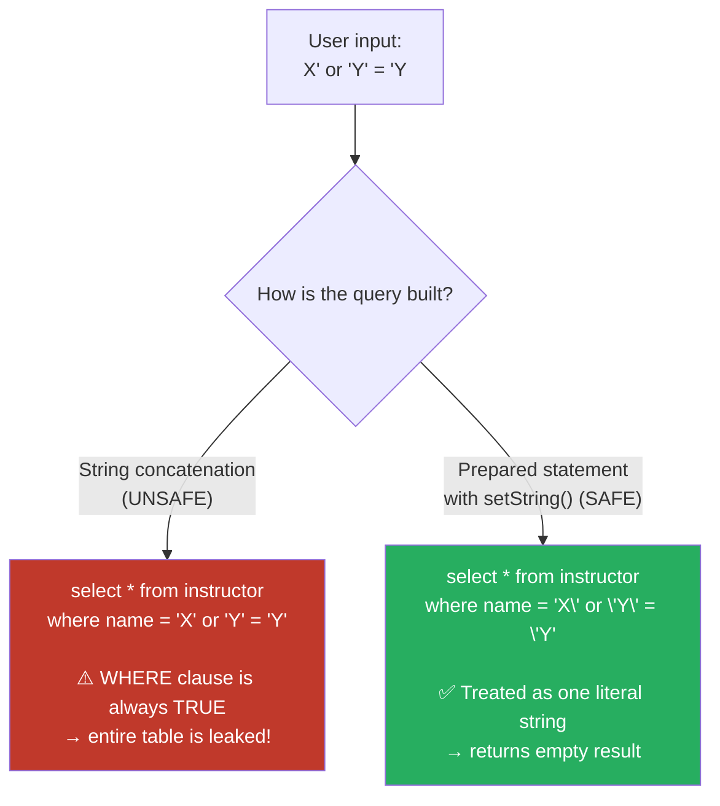

> **Security rule:** Programmer must **never** build SQL by concatenating raw user input into a string. Always pass user-supplied values as **parameters** of a prepared statement — the driver automatically escapes special characters (like `'`). Malicious input like `X'; drop table instructor; --` can otherwise let an attacker delete entire tables or steal data; several real-world financial breaches were caused exactly by this mistake.

#### Other JDBC Features (Brief)

| Feature | What it does |
|---|---|
| `CallableStatement` | Invokes stored procedures/functions (`{call some_procedure(?,?)}`) |
| `ResultSetMetaData` | Discovers column names/types of a result at runtime — no schema hard-coding needed |
| `DatabaseMetaData` | Discovers tables, columns, primary/foreign keys of the whole database |
| `conn.setAutoCommit(false)` | Turns off auto-commit so multiple statements form one transaction, committed via `conn.commit()` / rolled back via `conn.rollback()` |
| `getBlob()` / `getClob()` | Stream large objects (images, documents) without loading them fully into memory |

### 5.1.2 Database Access from Python (Python DB-API / `psycopg2`)

Python programs use a driver such as **`psycopg2`** (PostgreSQL), **`MySQLdb`** (MySQL), **`cx_Oracle`** (Oracle), or the ODBC-based **`pyodbc`**. The Python DB-API mirrors JDBC's ideas, but parameters use `%s` placeholders instead of `?`, and updates require an explicit `commit()`:

```python
import psycopg2

def PythonDatabaseExample(userid, passwd):
    try:
        conn = psycopg2.connect(host="db.yale.edu", port=5432,
                                 dbname="univdb", user=userid, password=passwd)
        cur = conn.cursor()
        try:
            cur.execute("insert into instructor values(%s, %s, %s, %s)",
                        ("77987", "Kim", "Physics", 98000))
            conn.commit()
        except Exception as sqle:
            print("Could not insert tuple. ", sqle)
            conn.rollback()

        cur.execute("select dept_name, avg(salary) from instructor group by dept_name")
        for dept in cur:
            print(dept[0], dept[1])
    except Exception as sqle:
        print("Exception : ", sqle)
```

Key differences from JDBC to remember:

- Parameters use **`%s`** placeholders (regardless of the actual SQL type), with values passed as a Python **tuple/list** — this is Python's equivalent of a JDBC prepared statement, and it protects against SQL injection in the same way.
- **Auto-commit is off by default** — an explicit `conn.commit()` is required, or changes are lost/rolled back.
- Looping `for dept in cur:` iterates directly over the cursor to fetch rows one at a time.

> **FastAPI note:** In a modern Python web application, a `psycopg2` (or an async driver) connection is typically opened once per request inside a FastAPI **route handler / dependency**, the SQL is executed via parameterized queries exactly as above, and the result rows are converted to JSON and returned to the client — mirroring the three-tier request flow introduced in Chapter 1.

### 5.1.3 ODBC (Open Database Connectivity)

**ODBC** is a C-language API (later extended to C++, C#, PHP, Ruby, Visual Basic) with the same conceptual steps as JDBC, but a lower-level, more verbose syntax:

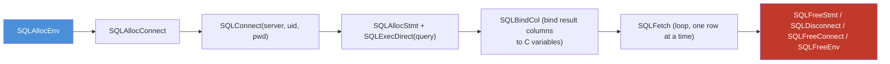

ODBC defines **conformance levels** (core, level 1, level 2) specifying which optional features (like catalog metadata queries) a driver must support. The SQL standard's **Call-Level Interface (CLI)** is essentially the standardized version of the same idea.

### 5.1.4 Embedded SQL (Brief)

In **embedded SQL**, `EXEC SQL <statement>;` lines are placed directly inside host-language source code (C, COBOL, Pascal, Fortran, ...). A **preprocessor** scans the source file *before* compilation, replacing each `EXEC SQL` block with calls to a dynamic-SQL-style library, and the resulting (pure host-language) code is compiled normally. Host-language variables referenced inside embedded SQL are prefixed with a colon (`:var`) to distinguish them from SQL identifiers. A **cursor** is declared to iterate row-by-row over a query result, similar to a `ResultSet` in JDBC.

Because each database vendor's preprocessor syntax differs and debugging preprocessor-generated code is awkward, **dynamic SQL (JDBC/ODBC/DB-API) is now the dominant approach**; embedded SQL is mostly found in legacy systems.

---

## 5.2 Functions and Procedures

### Why Put Logic Inside the Database?

Universities (and organizations generally) have **business rules** — e.g., "a student cannot register for a course section once it is full." Such logic can be written as **stored procedures/functions** inside the database itself, instead of scattered across every application program that touches the data.

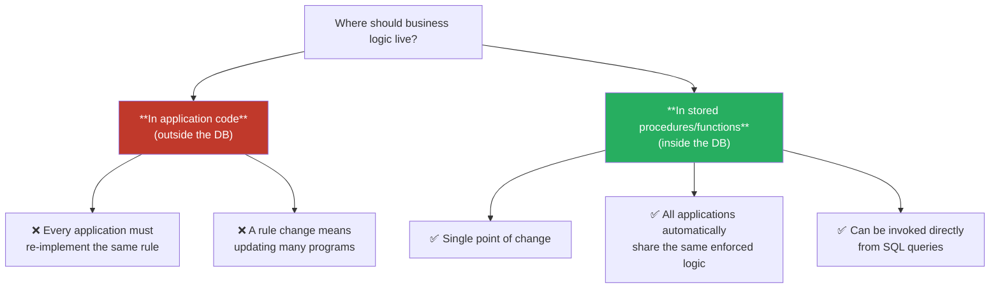

### 5.2.1 Declaring and Invoking SQL Functions and Procedures

A **function** returns a single value (or a table) and can be used inside a query wherever an expression is allowed:

```sql
create function dept_count(dept_name varchar(20))
returns integer
begin
    declare d_count integer;
    select count(*) into d_count
    from instructor
    where instructor.dept_name = dept_name;
    return d_count;
end
```

Used inside a query, exactly like a built-in function:

```sql
select dept_name, budget
from department
where dept_count(dept_name) > 12;
```

SQL also supports **table functions** — functions that return an entire table, effectively a *parameterized view*:

```sql
create function instructor_of(dept_name varchar(20))
returns table (ID varchar(5), name varchar(20), dept_name varchar(20), salary numeric(8,2))
return table
    (select ID, name, dept_name, salary
     from instructor
     where instructor.dept_name = instructor_of.dept_name);

-- used as:
select * from table(instructor_of('Finance'));
```

A **procedure** does not return a value directly through `returns`; instead it uses `in` (input) and `out` (output) parameters:

```sql
create procedure dept_count_proc(in dept_name varchar(20), out d_count integer)
begin
    select count(*) into d_count
    from instructor
    where instructor.dept_name = dept_count_proc.dept_name;
end

-- invoked with:
declare d_count integer;
call dept_count_proc('Physics', d_count);
```

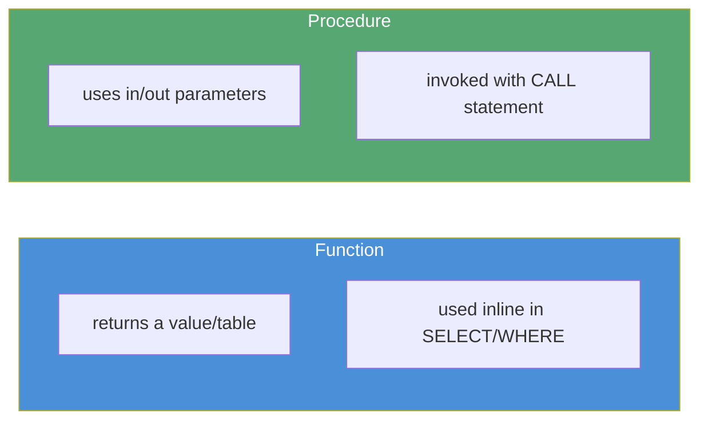

| | Function | Procedure |
|---|---|---|
| Returns a value? | Yes (`returns type` / `returns table`) | No — uses `out` parameters instead |
| Called from | Inside a query expression | `call procedure_name(...)` |
| Multiple same-name overloads? | Allowed if arg count/types differ | Allowed if arg count differs |

### 5.2.2 Language Constructs for Procedures and Functions (PSM)

The procedural part of the SQL standard is called the **Persistent Storage Module (PSM)**. It gives SQL near general-purpose-language power:

| Construct | Syntax | Purpose |
|---|---|---|
| Variable declaration | `declare v integer;` | Local variable |
| Assignment | `set v = expr;` | Assign a value |
| Compound statement | `begin ... end` (or `begin atomic ... end`) | Groups multiple statements; `atomic` runs them as one transaction |
| While loop | `while cond do ... end while` | Repeat while true |
| Repeat loop | `repeat ... until cond end repeat` | Repeat until true (post-test) |
| For loop | `for r as (select ...) do ... end for` | Iterate over query results one row at a time |
| Conditional | `if cond then ... elseif ... else ... end if` | Branching logic |
| Exception handling | `declare ... condition; declare exit handler for ...` | Catch and react to error conditions |

**Full worked example** — register a student only if the section has spare seats:

```sql
create function registerStudent(
    in s_id varchar(5), in s_courseid varchar(8), in s_secid varchar(8),
    in s_semester varchar(6), in s_year numeric(4,0),
    out errorMsg varchar(100))
returns integer
begin
    declare currEnrol int;
    select count(*) into currEnrol from takes
    where course_id = s_courseid and sec_id = s_secid
      and semester = s_semester and year = s_year;

    declare limit int;
    select capacity into limit from classroom natural join section
    where course_id = s_courseid and sec_id = s_secid
      and semester = s_semester and year = s_year;

    if (currEnrol < limit) then
        begin
            insert into takes values (s_id, s_courseid, s_secid, s_semester, s_year, null);
            return(0);
        end
    end if;
    set errorMsg = 'Enrollment limit reached for course ' || s_courseid || ' section ' || s_secid;
    return(-1);
end;
```

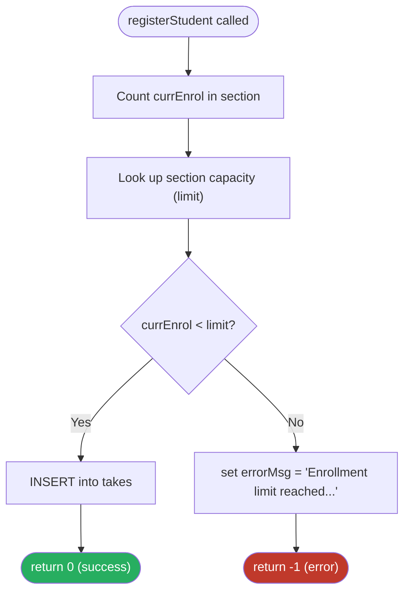

### 5.2.3 External Language Routines

Because PSM syntax differs across vendors (Oracle PL/SQL, SQL Server Transact-SQL, PostgreSQL PL/pgSQL), many databases also allow functions/procedures written in an **external programming language** (Java, C, C#, Python, Perl) to be registered and invoked from SQL:

```sql
create function dept_count(dept_name varchar(20))
returns integer
language C
external name '/usr/avi/bin/dept_count'
```

**Security trade-off:**

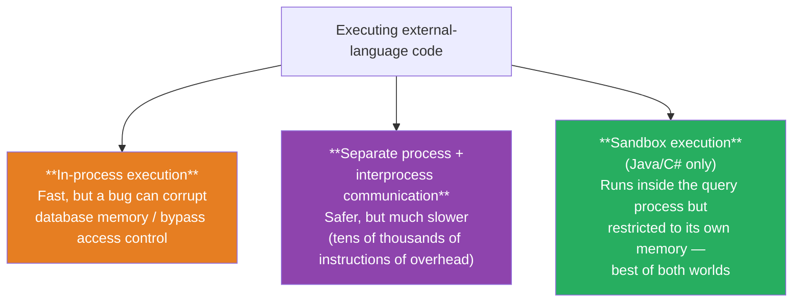

A sandbox is possible only for "safe" languages (Java, C#) that don't allow raw pointer access to memory — not for C.

---

## 5.3 Triggers

### What Is a Trigger?

> A **trigger** is a statement that the system executes **automatically** as a side effect of a modification to the database.

Defining a trigger requires specifying two things:

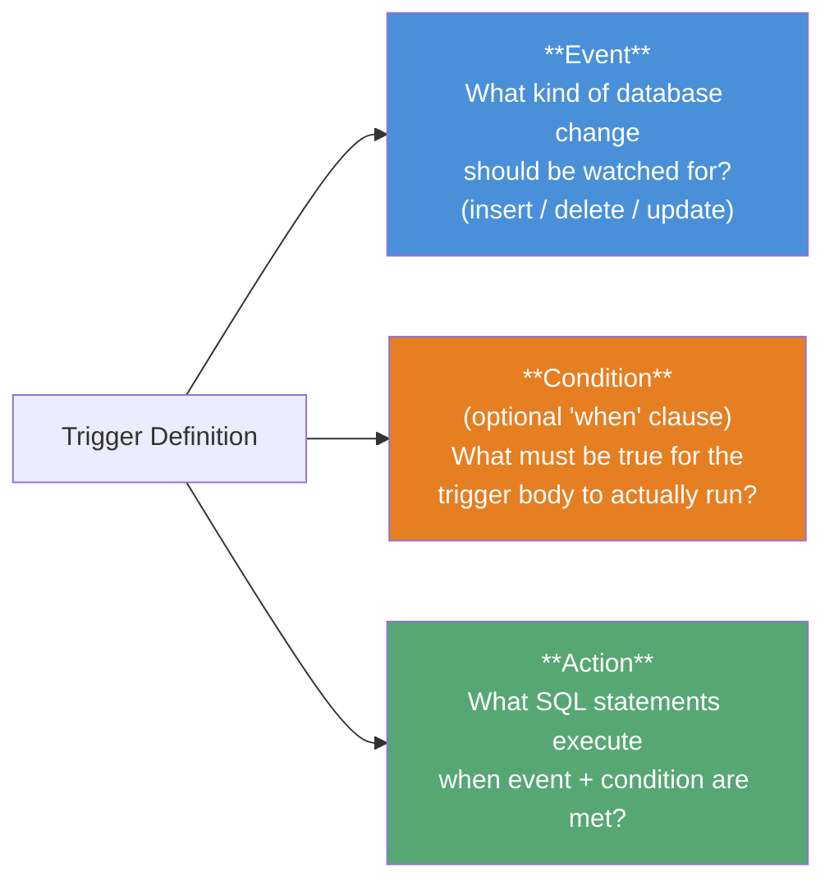

Once a trigger is created, the database system takes full responsibility for firing it automatically whenever the specified event occurs and its condition holds — no application code needs to remember to call it.

### Why Do We Need Triggers?

- Enforcing integrity constraints that plain SQL constraints **cannot express** (e.g., a cross-table consistency rule).
- Automatically keeping a **derived/summary value up to date** (e.g., updating a student's total credits whenever a passing grade is recorded).
- Alerting/automating a task when a condition is met (e.g., automatically creating a reorder record when warehouse inventory falls below a minimum level).

> **Limitation:** Triggers normally cannot reach *outside* the database (e.g., they cannot directly place a real-world purchase order). Instead, they insert a row into a "pending actions" table, and a separate external process periodically scans that table and performs the real-world action.

### Trigger Timing: BEFORE, AFTER, and INSTEAD OF

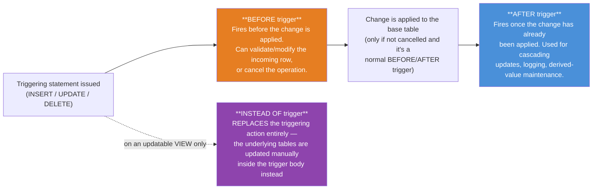

| Timing | When it fires | Typical use |
|---|---|---|
| **BEFORE** | Before the insert/update/delete is applied | Extra validation; auto-correcting/normalizing an incoming value (e.g., replacing a blank grade with `null`) |
| **AFTER** | After the insert/update/delete has been applied | Referential-integrity enforcement, maintaining derived values, cascading changes, audit logging |
| **INSTEAD OF** | In place of the triggering action (used on views) | Makes a non-updatable **view** effectively updatable — the trigger body decides how to translate the view-level change into changes on the real base tables |

### Row-Level vs. Statement-Level Triggers

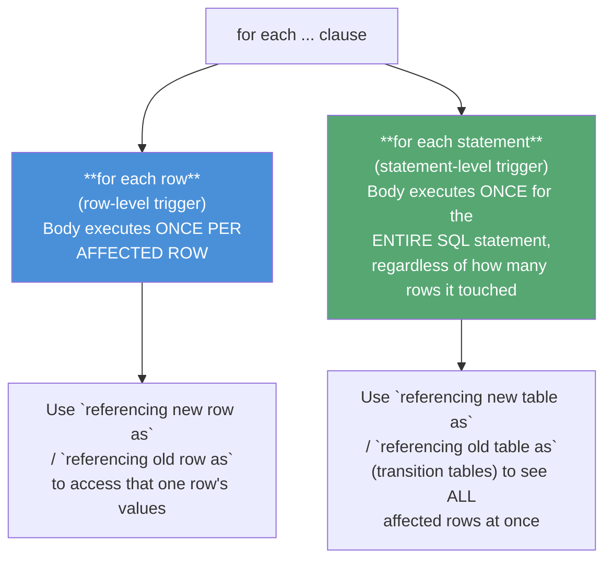

> Transition **tables** (`referencing old table as` / `new table as`) can only be used with **AFTER** triggers — not `BEFORE` triggers, since before a `BEFORE` trigger runs, the full set of changes may not yet be finalized.

### Worked Trigger Examples

**1. Enforcing referential integrity on insert (row-level, AFTER, with rollback):**

```sql
create trigger timeslot_check1 after insert on section
referencing new row as nrow
for each row
when (nrow.time_slot_id not in (select time_slot_id from time_slot))
begin
    rollback
end;
```

**2. Maintaining a derived value — updating a student's total credits (row-level, AFTER):**

```sql
create trigger credits_earned after update of takes on grade
referencing new row as nrow
referencing old row as orow
for each row
when nrow.grade <> 'F' and nrow.grade is not null
     and (orow.grade = 'F' or orow.grade is null)
begin atomic
    update student
    set tot_cred = tot_cred +
        (select credits from course where course.course_id = nrow.course_id)
    where student.id = nrow.id;
end;
```

**3. Auto-correcting an incoming value (row-level, BEFORE):**

```sql
create trigger setnull before update of takes
referencing new row as nrow
for each row
when (nrow.grade = ' ')
begin atomic
    set nrow.grade = null;
end;
```

**4. Automatic inventory reordering (row-level, AFTER):**

```sql
create trigger reorder after update of level on inventory
referencing old row as orow, new row as nrow
for each row
when nrow.level <= (select level from minlevel where minlevel.item = orow.item)
     and orow.level > (select level from minlevel where minlevel.item = orow.item)
begin atomic
    insert into orders
        (select item, amount from reorder where reorder.item = orow.item);
end;
```

Triggers can be temporarily disabled (`alter trigger trigger_name disable`), re-enabled, or permanently removed (`drop trigger trigger_name`).

### When *Not* to Use Triggers

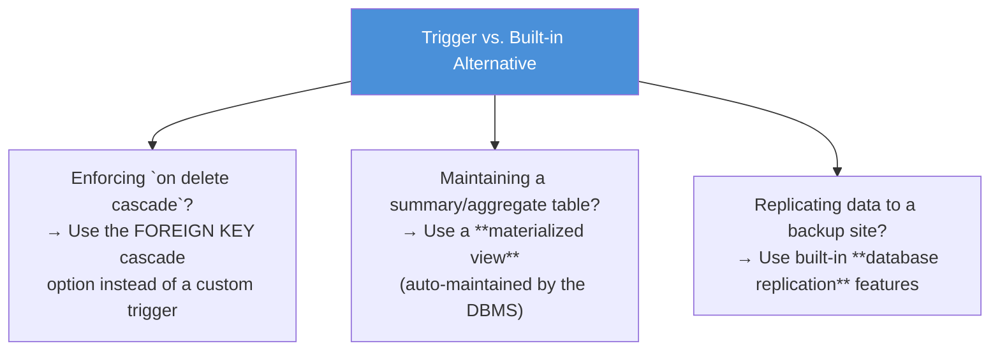

Using a trigger where a built-in feature already exists makes the schema harder for other developers to understand, since constraints end up hidden inside procedural trigger code instead of being visible as declarative schema features.

### Pitfalls: Cascading and Infinite Trigger Chains

Executing one trigger's action can itself fire **another** trigger — and in the worst case, a trigger could (directly or indirectly) re-trigger itself, causing an **infinite chain**. Because of this:

- Most database systems **limit the trigger-chain depth** (e.g., 16 or 32 levels) and raise an error if exceeded.
- Some systems disallow a trigger from referencing the very relation whose modification caused it to fire.
- Triggers must also be written carefully around **data reloads / replication**, since replaying already-applied changes should usually *not* re-fire the same trigger actions again — some systems support a `not for replication` trigger option to handle this.

---

## Syllabus Connection

Advanced SQL (Triggers, Stored Procedures, and API Database access).

## Board Exam Pattern Mapping

- **Question 5(b) (2024 Exam):** What is a trigger? Explain its types and write an SQL trigger that prevents inserting a record into an Employee table if the salary is less than 10,000.
- **Question 5(d) (2023 Exam):** Writing a trigger that automatically sets a Status column in an Orders table to 'Pending' whenever a new order record is inserted.
