# Chapter 5: Advanced SQL

**Part:** [Part 2 — SQL & Application Design](../README.md)
**Textbook:** *Database System Concepts*, 7th Edition — Silberschatz, Korth, Sudarshan

## Exact Subsections to Read

- **5.1** Accessing SQL from a Programming Language (FastAPI, Python Database API / psycopg2)
- **5.2** Functions and Procedures (Stored procedures to encapsulate business logic)
- **5.3** Triggers (Defining triggers: BEFORE, AFTER, INSTEAD OF, row-level vs. statement-level)

> Chapters 3 and 4 covered *pure* SQL. In practice, however, SQL never runs completely alone — real applications embed it inside general-purpose programs (Python, Java, C), extend it with procedural business logic (functions and stored procedures), and let the database react automatically to changes (triggers). This chapter covers exactly that: **connecting** SQL to application code, **encapsulating logic** inside the database, and **automating actions** on data-modification events.

---

## 5.1 Accessing SQL from a Programming Language

### Why SQL Alone Is Not Enough

SQL is a powerful **declarative** query language, but a real application needs a general-purpose programming language for two reasons:

<p align="center">
  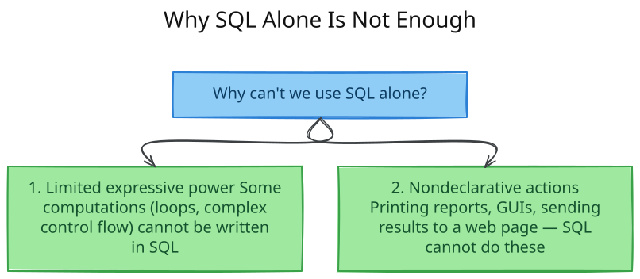
</p>

<sub><em>Editable diagram source: <a href="diagrams/d01-why-sql-alone-is-not.excalidraw">d01-why-sql-alone-is-not.excalidraw</a> — open in <a href="https://excalidraw.com">Excalidraw</a> to edit.</em></sub>

### Two Approaches to Connecting SQL and a Host Language

<p align="center">
  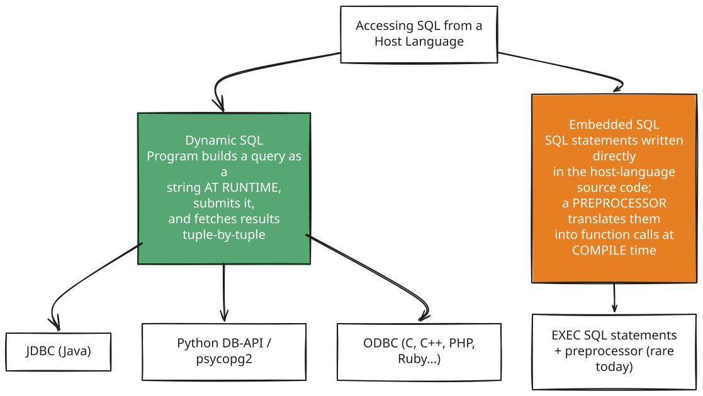
</p>

<sub><em>Editable diagram source: <a href="diagrams/d02-two-approaches-to.excalidraw">d02-two-approaches-to.excalidraw</a> — open in <a href="https://excalidraw.com">Excalidraw</a> to edit.</em></sub>

| Aspect | Dynamic SQL | Embedded SQL |
|---|---|---|
| When is SQL text fixed? | At **runtime** | At **compile time** (via preprocessor) |
| Error detection | Only when the query runs | Some errors caught while preprocessing |
| Flexibility | High — query string built on the fly | Lower — structure fixed in source |
| Used by | JDBC, ODBC, Python DB-API | C/COBOL/Fortran embeddings (legacy) |
| Modern usage | **Dominant** — almost all systems use this today | Largely superseded; kept for legacy code |

> A key underlying mismatch: SQL's native data type is the **relation** (a set of tuples), while a host language like Java or Python normally manipulates **one variable at a time**. Every API below exists to bridge this gap — fetching a relation's result **one tuple at a time** into host-language variables.

### 5.1.1 JDBC (Java Database Connectivity)

**JDBC** is the standard API that lets Java programs connect to, query, and update a database.

**Step-by-step life cycle of a JDBC interaction:**

<p align="center">
  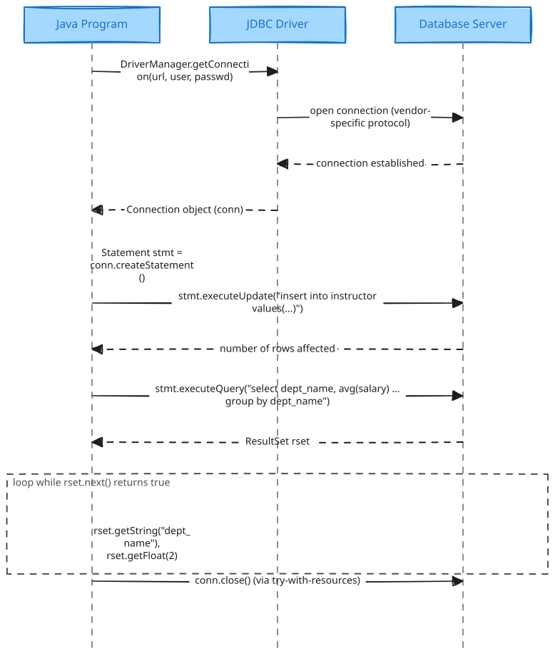
</p>

<sub><em>Editable diagram source: <a href="diagrams/d03-5-1-1-jdbc-java.excalidraw">d03-5-1-1-jdbc-java.excalidraw</a> — open in <a href="https://excalidraw.com">Excalidraw</a> to edit.</em></sub>

**Key JDBC building blocks:**

| Component | Purpose |
|---|---|
| `DriverManager.getConnection(url, user, password)` | Opens a `Connection`; the URL string encodes protocol, host, port, and database name (e.g., `jdbc:oracle:thin:@db.yale.edu:1521:univdb`) |
| `Statement` | Ships a plain SQL string to the server for execution |
| `stmt.executeUpdate(sql)` | Runs **insert/update/delete/DDL**; returns rows affected (0 for DDL) |
| `stmt.executeQuery(sql)` | Runs a **query**; returns a `ResultSet` |
| `ResultSet.next()` | Advances to the next tuple; returns `false` when exhausted |
| `rset.getString()/getFloat()/...` | Retrieves an attribute by **name** or **column position** |

```java
try (
    Connection conn = DriverManager.getConnection(
        "jdbc:oracle:thin:@db.yale.edu:1521:univdb", userid, passwd);
    Statement stmt = conn.createStatement();
) {
    stmt.executeUpdate("insert into instructor values('77987','Kim','Physics',98000)");

    ResultSet rset = stmt.executeQuery(
        "select dept_name, avg(salary) from instructor group by dept_name");
    while (rset.next()) {
        System.out.println(rset.getString("dept_name") + " " + rset.getFloat(2));
    }
} catch (Exception sqle) {
    System.out.println("Exception : " + sqle);
}
```

The `try (...)` **try-with-resources** block automatically closes the connection and statement at the end — even if an exception occurs — preventing the database's resource pool from being exhausted.

#### Prepared Statements — and Why They Matter for Security

A **prepared statement** contains `?` placeholders for values supplied later. The database **compiles the query once** and reuses the compiled plan every time it executes with new parameter values:

```java
PreparedStatement pStmt = conn.prepareStatement(
    "insert into instructor values(?,?,?,?)");
pStmt.setString(1, "88877");
pStmt.setString(2, "Perry");
pStmt.setString(3, "Finance");
pStmt.setInt(4, 125000);
pStmt.executeUpdate();
```

Beyond efficiency, prepared statements solve a **critical security problem**: **SQL injection**.

<p align="center">
  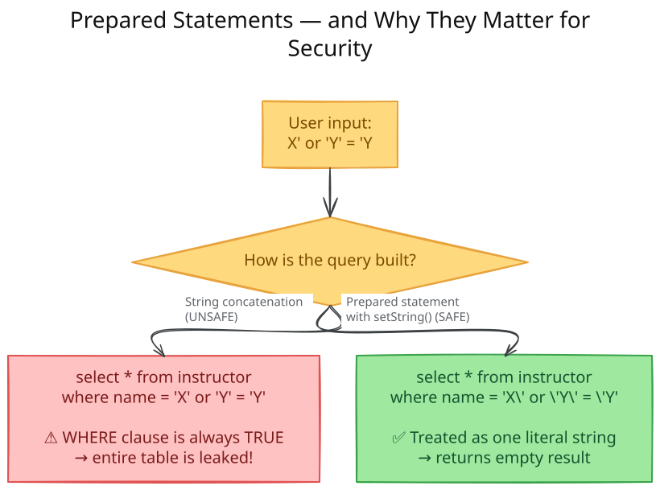
</p>

<sub><em>Editable diagram source: <a href="diagrams/d04-prepared-statements-and.excalidraw">d04-prepared-statements-and.excalidraw</a> — open in <a href="https://excalidraw.com">Excalidraw</a> to edit.</em></sub>

> **Security rule:** Programmer must **never** build SQL by concatenating raw user input into a string. Always pass user-supplied values as **parameters** of a prepared statement — the driver automatically escapes special characters (like `'`). Malicious input like `X'; drop table instructor; --` can otherwise let an attacker delete entire tables or steal data; several real-world financial breaches were caused exactly by this mistake.

#### Other JDBC Features (Brief)

| Feature | What it does |
|---|---|
| `CallableStatement` | Invokes stored procedures/functions (`{call some_procedure(?,?)}`) |
| `ResultSetMetaData` | Discovers column names/types of a result at runtime — no schema hard-coding needed |
| `DatabaseMetaData` | Discovers tables, columns, primary/foreign keys of the whole database |
| `conn.setAutoCommit(false)` | Turns off auto-commit so multiple statements form one transaction, committed via `conn.commit()` / rolled back via `conn.rollback()` |
| `getBlob()` / `getClob()` | Stream large objects (images, documents) without loading them fully into memory |

### 5.1.2 Database Access from Python (Python DB-API / `psycopg2`)

Python programs use a driver such as **`psycopg2`** (PostgreSQL), **`MySQLdb`** (MySQL), **`cx_Oracle`** (Oracle), or the ODBC-based **`pyodbc`**. The Python DB-API mirrors JDBC's ideas, but parameters use `%s` placeholders instead of `?`, and updates require an explicit `commit()`:

```python
import psycopg2

def PythonDatabaseExample(userid, passwd):
    try:
        conn = psycopg2.connect(host="db.yale.edu", port=5432,
                                 dbname="univdb", user=userid, password=passwd)
        cur = conn.cursor()
        try:
            cur.execute("insert into instructor values(%s, %s, %s, %s)",
                        ("77987", "Kim", "Physics", 98000))
            conn.commit()
        except Exception as sqle:
            print("Could not insert tuple. ", sqle)
            conn.rollback()

        cur.execute("select dept_name, avg(salary) from instructor group by dept_name")
        for dept in cur:
            print(dept[0], dept[1])
    except Exception as sqle:
        print("Exception : ", sqle)
```

Key differences from JDBC to remember:

- Parameters use **`%s`** placeholders (regardless of the actual SQL type), with values passed as a Python **tuple/list** — this is Python's equivalent of a JDBC prepared statement, and it protects against SQL injection in the same way.
- **Auto-commit is off by default** — an explicit `conn.commit()` is required, or changes are lost/rolled back.
- Looping `for dept in cur:` iterates directly over the cursor to fetch rows one at a time.

> **FastAPI note:** In a modern Python web application, a `psycopg2` (or an async driver) connection is typically opened once per request inside a FastAPI **route handler / dependency**, the SQL is executed via parameterized queries exactly as above, and the result rows are converted to JSON and returned to the client — mirroring the three-tier request flow introduced in Chapter 1.

### 5.1.3 ODBC (Open Database Connectivity)

**ODBC** is a C-language API (later extended to C++, C#, PHP, Ruby, Visual Basic) with the same conceptual steps as JDBC, but a lower-level, more verbose syntax:

<p align="center">
  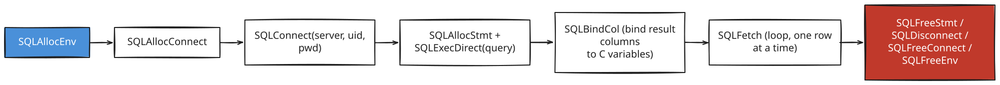
</p>

<sub><em>Editable diagram source: <a href="diagrams/d05-5-1-3-odbc-open.excalidraw">d05-5-1-3-odbc-open.excalidraw</a> — open in <a href="https://excalidraw.com">Excalidraw</a> to edit.</em></sub>

ODBC defines **conformance levels** (core, level 1, level 2) specifying which optional features (like catalog metadata queries) a driver must support. The SQL standard's **Call-Level Interface (CLI)** is essentially the standardized version of the same idea.

### 5.1.4 Embedded SQL (Brief)

In **embedded SQL**, `EXEC SQL <statement>;` lines are placed directly inside host-language source code (C, COBOL, Pascal, Fortran, ...). A **preprocessor** scans the source file *before* compilation, replacing each `EXEC SQL` block with calls to a dynamic-SQL-style library, and the resulting (pure host-language) code is compiled normally. Host-language variables referenced inside embedded SQL are prefixed with a colon (`:var`) to distinguish them from SQL identifiers. A **cursor** is declared to iterate row-by-row over a query result, similar to a `ResultSet` in JDBC.

Because each database vendor's preprocessor syntax differs and debugging preprocessor-generated code is awkward, **dynamic SQL (JDBC/ODBC/DB-API) is now the dominant approach**; embedded SQL is mostly found in legacy systems.

---

## 5.2 Functions and Procedures

### Why Put Logic Inside the Database?

Universities (and organizations generally) have **business rules** — e.g., "a student cannot register for a course section once it is full." Such logic can be written as **stored procedures/functions** inside the database itself, instead of scattered across every application program that touches the data.

<p align="center">
  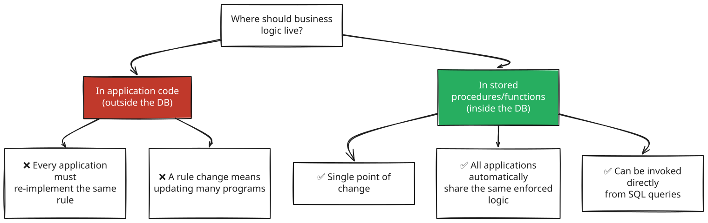
</p>

<sub><em>Editable diagram source: <a href="diagrams/d06-why-put-logic-inside.excalidraw">d06-why-put-logic-inside.excalidraw</a> — open in <a href="https://excalidraw.com">Excalidraw</a> to edit.</em></sub>

### 5.2.1 Declaring and Invoking SQL Functions and Procedures

A **function** returns a single value (or a table) and can be used inside a query wherever an expression is allowed:

```sql
create function dept_count(dept_name varchar(20))
returns integer
begin
    declare d_count integer;
    select count(*) into d_count
    from instructor
    where instructor.dept_name = dept_name;
    return d_count;
end
```

Used inside a query, exactly like a built-in function:

```sql
select dept_name, budget
from department
where dept_count(dept_name) > 12;
```

SQL also supports **table functions** — functions that return an entire table, effectively a *parameterized view*:

```sql
create function instructor_of(dept_name varchar(20))
returns table (ID varchar(5), name varchar(20), dept_name varchar(20), salary numeric(8,2))
return table
    (select ID, name, dept_name, salary
     from instructor
     where instructor.dept_name = instructor_of.dept_name);

-- used as:
select * from table(instructor_of('Finance'));
```

A **procedure** does not return a value directly through `returns`; instead it uses `in` (input) and `out` (output) parameters:

```sql
create procedure dept_count_proc(in dept_name varchar(20), out d_count integer)
begin
    select count(*) into d_count
    from instructor
    where instructor.dept_name = dept_count_proc.dept_name;
end

-- invoked with:
declare d_count integer;
call dept_count_proc('Physics', d_count);
```

<p align="center">
  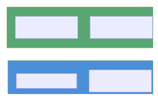
</p>

<sub><em>Editable diagram source: <a href="diagrams/d07-5-2-1-declaring-and.excalidraw">d07-5-2-1-declaring-and.excalidraw</a> — open in <a href="https://excalidraw.com">Excalidraw</a> to edit.</em></sub>

| | Function | Procedure |
|---|---|---|
| Returns a value? | Yes (`returns type` / `returns table`) | No — uses `out` parameters instead |
| Called from | Inside a query expression | `call procedure_name(...)` |
| Multiple same-name overloads? | Allowed if arg count/types differ | Allowed if arg count differs |

### 5.2.2 Language Constructs for Procedures and Functions (PSM)

The procedural part of the SQL standard is called the **Persistent Storage Module (PSM)**. It gives SQL near general-purpose-language power:

| Construct | Syntax | Purpose |
|---|---|---|
| Variable declaration | `declare v integer;` | Local variable |
| Assignment | `set v = expr;` | Assign a value |
| Compound statement | `begin ... end` (or `begin atomic ... end`) | Groups multiple statements; `atomic` runs them as one transaction |
| While loop | `while cond do ... end while` | Repeat while true |
| Repeat loop | `repeat ... until cond end repeat` | Repeat until true (post-test) |
| For loop | `for r as (select ...) do ... end for` | Iterate over query results one row at a time |
| Conditional | `if cond then ... elseif ... else ... end if` | Branching logic |
| Exception handling | `declare ... condition; declare exit handler for ...` | Catch and react to error conditions |

**Full worked example** — register a student only if the section has spare seats:

```sql
create function registerStudent(
    in s_id varchar(5), in s_courseid varchar(8), in s_secid varchar(8),
    in s_semester varchar(6), in s_year numeric(4,0),
    out errorMsg varchar(100))
returns integer
begin
    declare currEnrol int;
    select count(*) into currEnrol from takes
    where course_id = s_courseid and sec_id = s_secid
      and semester = s_semester and year = s_year;

    declare limit int;
    select capacity into limit from classroom natural join section
    where course_id = s_courseid and sec_id = s_secid
      and semester = s_semester and year = s_year;

    if (currEnrol < limit) then
        begin
            insert into takes values (s_id, s_courseid, s_secid, s_semester, s_year, null);
            return(0);
        end
    end if;
    set errorMsg = 'Enrollment limit reached for course ' || s_courseid || ' section ' || s_secid;
    return(-1);
end;
```

<p align="center">
  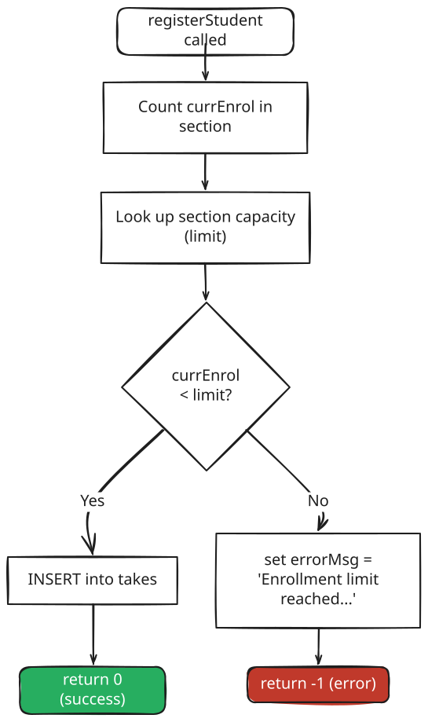
</p>

<sub><em>Editable diagram source: <a href="diagrams/d08-5-2-2-language.excalidraw">d08-5-2-2-language.excalidraw</a> — open in <a href="https://excalidraw.com">Excalidraw</a> to edit.</em></sub>

### 5.2.3 External Language Routines

Because PSM syntax differs across vendors (Oracle PL/SQL, SQL Server Transact-SQL, PostgreSQL PL/pgSQL), many databases also allow functions/procedures written in an **external programming language** (Java, C, C#, Python, Perl) to be registered and invoked from SQL:

```sql
create function dept_count(dept_name varchar(20))
returns integer
language C
external name '/usr/avi/bin/dept_count'
```

**Security trade-off:**

<p align="center">
  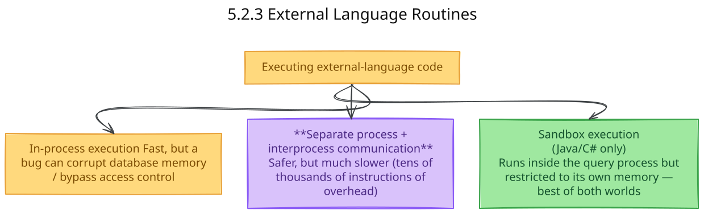
</p>

<sub><em>Editable diagram source: <a href="diagrams/d09-5-2-3-external-language.excalidraw">d09-5-2-3-external-language.excalidraw</a> — open in <a href="https://excalidraw.com">Excalidraw</a> to edit.</em></sub>

A sandbox is possible only for "safe" languages (Java, C#) that don't allow raw pointer access to memory — not for C.

---

## 5.3 Triggers

### What Is a Trigger?

> A **trigger** is a special database object that **automatically executes** when a specific event occurs on a table, such as `insert`, `update`, or `delete`.

A trigger is attached to **one specific table (or one specific view)**. Once it is created, the database system runs it automatically when the watched event happens.

In this section, we explain triggers using the same database objects used in the SQL examples:

| Table | Purpose | Important columns |
|---|---|---|
| `Products` | Stores product information | `ProductId`, `ProductName`, `BrandName`, `ReceiveDate`, `AvailableStock`, `Price`, `CreateDate`, `ModifyDate` |
| `AuditRecord` | Stores audit/log information about database actions | `RecordId`, `ActionName`, `TableName`, `ColumnName`, `PreviousValue`, `ModifedValue`, `CreateDate` |

So the main idea here is simple:
- data is inserted, updated, or deleted in `Products`
- the trigger reacts automatically
- the trigger can write a log into `AuditRecord`

### Basic Structure of a Trigger

The class-style structure is:

```sql
create trigger trigger_name
on table_name
[after | for | instead of] [insert | update | delete]
as
begin
    -- trigger body
end;
```

> **Easy note:** one trigger definition always points to **one specific table**.

A trigger definition usually has these parts:

<p align="center">
  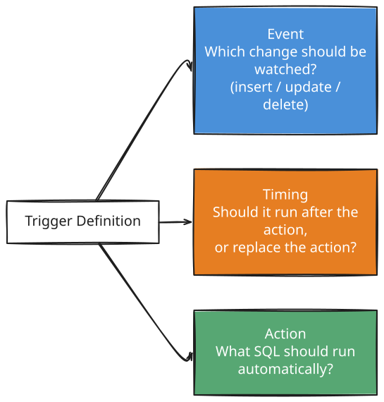
</p>

<sub><em>Editable diagram source: <a href="diagrams/d10-basic-structure-of-a.excalidraw">d10-basic-structure-of-a.excalidraw</a> — open in <a href="https://excalidraw.com">Excalidraw</a> to edit.</em></sub>

### Why Do We Need Triggers?

Triggers are useful when we want the database to do some work automatically.

In the `Products` / `AuditRecord` example, common reasons are:

- **Audit logging** — when someone inserts, updates, or deletes a product, automatically store a log row in `AuditRecord`
- **Business-rule checking** — stop an invalid action before it is accepted
- **Automatic follow-up work** — for example, logging old and new values after a product price changes

> **Practical idea:** a trigger is helpful when you do not want to depend on application code remembering to perform an extra step manually.

### Trigger Timing in the SQL Server Style Used Here

The SQL examples here follow **SQL Server-style** trigger syntax.

<p align="center">
  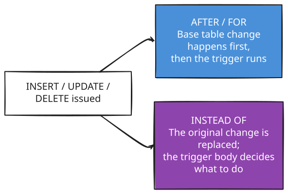
</p>

<sub><em>Editable diagram source: <a href="diagrams/d11-trigger-timing-in-the.excalidraw">d11-trigger-timing-in-the.excalidraw</a> — open in <a href="https://excalidraw.com">Excalidraw</a> to edit.</em></sub>

| Timing | Meaning in simple words | Use in this section |
|---|---|---|
| **`AFTER`** | Run the trigger after the insert/update/delete succeeds | Used for audit logging |
| **`FOR`** | In SQL Server DML triggers, `FOR` acts like `AFTER` | Used in the delete example |
| **`INSTEAD OF`** | Do not perform the original action automatically; run the trigger body instead | Used to show how a trigger can intercept an insert |
| **`BEFORE`** | Common in textbook discussion and in some DBMSs, but not the usual SQL Server DML trigger form used here | Keep as concept only |

> **Very important:** in SQL Server, `FOR DELETE` and `AFTER DELETE` mean the same thing for normal DML triggers.

### The Special `inserted` and `deleted` Tables

Textbooks often explain triggers using **old row** and **new row** ideas. In SQL Server, the same idea appears through two special temporary tables:

| Operation | Special table available | Meaning |
|---|---|---|
| `INSERT` | `inserted` | Contains the newly inserted rows |
| `DELETE` | `deleted` | Contains the rows that were deleted |
| `UPDATE` | `deleted` and `inserted` | `deleted` holds old values, `inserted` holds new values |

This is how SQL Server lets a trigger see what changed.

> **Important beginner warning:** a trigger usually fires **once per SQL statement**, not once per row. So `inserted` and `deleted` may contain **multiple rows**.

That means a trigger like this:

```sql
insert into AuditRecord (ActionName, TableName)
values ('Insert', 'Products');
```

adds **one audit row for the whole statement**, even if that statement inserted 5 product rows.

### Worked Trigger Examples Based on `Products` and `AuditRecord`

#### 1. `AFTER INSERT` trigger — log product insertion

```sql
create trigger TR_Products_Insert
on Products after insert
as
begin
    insert into AuditRecord (ActionName, TableName)
    values ('Insert', 'Products');

    print('This is a trigger!');
end;
```

### What this trigger does

Whenever a row is inserted into `Products`:
- the insert into `Products` happens first
- then the trigger runs automatically
- one log row is added to `AuditRecord`
- SQL Server prints the message `This is a trigger!`

Example insert:

```sql
insert into Products (ProductName, BrandName, ReceiveDate, AvailableStock, Price)
values ('Product 1', 'Brand 1', '2026-08-30', 100, 99.99);
```

After this, `Products` gets the new product, and `AuditRecord` gets a log saying an `Insert` happened on `Products`.

#### 2. `INSTEAD OF INSERT` trigger — replace the insert action

```sql
alter trigger TR_Products_Insert
on Products instead of insert
as
begin
    insert into AuditRecord (ActionName, TableName)
    values ('Insert', 'Products');

    print('This is a trigger!');
end;
```

### What changes here?

This trigger does **not** let the normal insert happen automatically.

So with this version:
- the trigger runs
- a log row is written into `AuditRecord`
- the message is printed
- but the new product row is **not inserted into `Products`**, because the trigger body never inserts it manually

> **This is the key difference:** `AFTER INSERT` = "do the insert first, then run the trigger." `INSTEAD OF INSERT` = "do not run the original insert unless the trigger body does it manually."

If the goal is to keep the product row **and** still intercept the action, the trigger body would need to insert from the `inserted` table into `Products` itself.

#### 3. `FOR DELETE` trigger — log product deletion

```sql
alter trigger TR_Products_Insert
on Products for delete
as
begin
    insert into AuditRecord (ActionName, TableName)
    values ('Delete', 'Products');

    print('This is a trigger!');
end;
```

Example delete:

```sql
delete from Products
where ProductId = 2;
```

### What this trigger does

When product `2` is deleted:
- the row is removed from `Products`
- the trigger runs automatically
- a `Delete` log is inserted into `AuditRecord`

> **Naming note:** the example above uses `alter trigger TR_Products_Insert ... for delete`, which means the same trigger name is being redefined for a different event. That is valid for learning purposes, but in real projects, clearer names such as `TR_Products_Delete` are easier to understand.

#### 4. `AFTER UPDATE` trigger — log old and new values

The tables in this section are also suitable for an update trigger, especially because `AuditRecord` already has `PreviousValue` and `ModifedValue` columns.

```sql
create trigger TR_Products_Update
on Products after update
as
begin
    insert into AuditRecord
        (ActionName, TableName, ColumnName, PreviousValue, ModifedValue)
    select 'Update',
           'Products',
           'Price',
           cast(d.Price as varchar(500)),
           cast(i.Price as varchar(500))
    from deleted d
    join inserted i on d.ProductId = i.ProductId
    where d.Price <> i.Price;
end;
```

### What this trigger does

If a product price changes:
- `deleted` gives the **old** row values
- `inserted` gives the **new** row values
- the trigger stores both values in `AuditRecord`

So this example matches the same `Products` / `AuditRecord` design and also connects nicely with the textbook idea of **old value vs new value**.

### One Short Summary of All Three Events

| Event | Meaning in `Products` table | Typical trigger use |
|---|---|---|
| `INSERT` | A new product is added | Write an audit log |
| `UPDATE` | A product value changes | Store old/new values in audit |
| `DELETE` | A product is removed | Log that the delete happened |

Triggers can be disabled, re-enabled, altered, or removed later using commands such as `alter trigger ...` and `drop trigger ...`.

### When *Not* to Use Triggers

Triggers are useful, but they are not always the best tool.

<p align="center">
  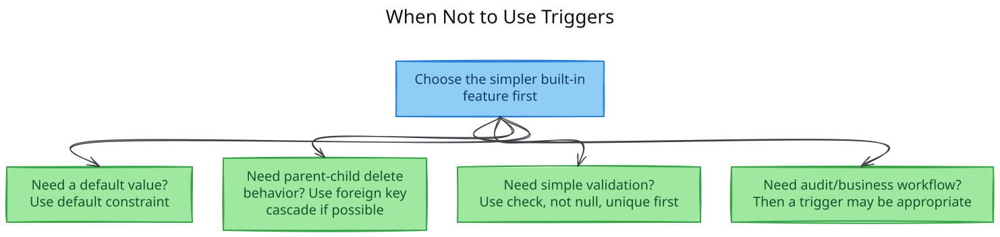
</p>

<sub><em>Editable diagram source: <a href="diagrams/d12-when-not-to-use-triggers.excalidraw">d12-when-not-to-use-triggers.excalidraw</a> — open in <a href="https://excalidraw.com">Excalidraw</a> to edit.</em></sub>

If a normal constraint already solves the problem clearly, prefer that. Triggers are best used when the task is more procedural, such as writing to an audit table or reacting to a change automatically.

### Pitfalls: Cascading, Hidden Behavior, and Multi-Row Effects

Triggers are powerful, but they can confuse beginners if used carelessly.

- A trigger runs **automatically**, so the behavior is somewhat hidden unless you know the trigger exists.
- One trigger can cause another trigger to fire, creating a **trigger chain**.
- `INSTEAD OF` triggers can silently block the original action if you forget to perform that action manually inside the trigger body.
- A single `insert`, `update`, or `delete` statement may affect **many rows**, so never assume there is only one row inside `inserted` or `deleted`.
- Updating the same table again inside its own trigger can create recursion or cascading effects in some systems.

> **Simple final warning:** triggers are useful, but they should be written carefully and read carefully.

---

## Syllabus Connection

Advanced SQL (Triggers, Stored Procedures, and API Database access).

## Board Exam Pattern Mapping

- **Question 5(b) (2024 Exam):** What is a trigger? Explain its types and write an SQL trigger that prevents inserting a record into an Employee table if the salary is less than 10,000.
- **Question 5(d) (2023 Exam):** Writing a trigger that automatically sets a Status column in an Orders table to 'Pending' whenever a new order record is inserted.
