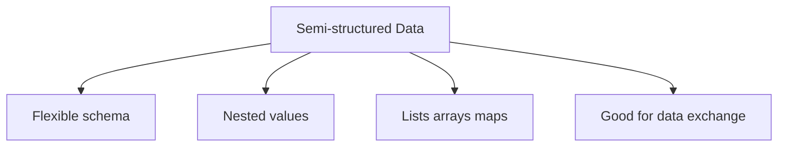
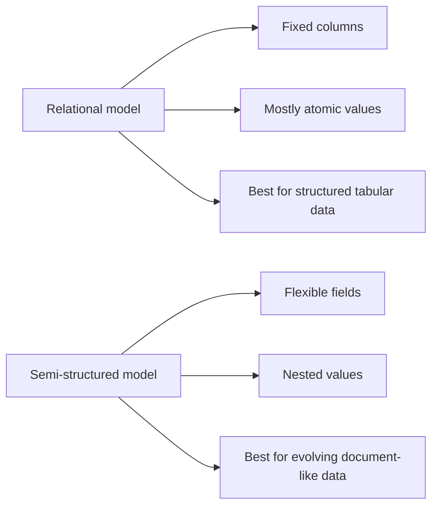
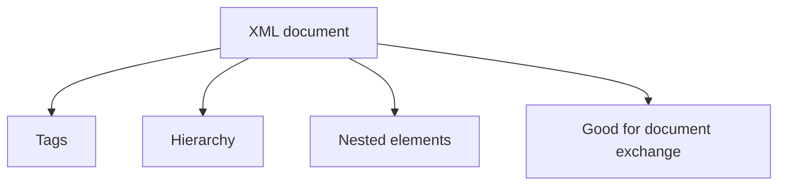

# Chapter 8: Complex Data Types

**Part:** [Part 2 — SQL & Application Design](../README.md)

> This chapter is paired with [Chapter 10: Big Data (NoSQL)](../Chapter-10-Big-Data-NoSQL/README.md) in the syllabus as a combined topic on non-relational and semi-structured data handling.
>
> **Book-based scope note:** In the attached textbook chapter, the syllabus-relevant part for this course note is the **semi-structured data** section, especially **8.1.1–8.1.3**. The full textbook chapter also goes on to discuss topics like RDF, object-based data, textual data, and spatial data, but those are not the focus of this Chapter 8 note.

## Exact Subsections to Read

- **8.1** Semi-structured Data
- **8.1.1** Overview of Semi-structured Data Models
- **8.1.2** JSON
- **8.1.3** XML
- **Course focus with XML:** basic **XPath** and **XQuery** syntax for querying XML

---

## 8.1 Semi-structured Data

In a normal relational database, data is stored in tables with a **fixed structure**. Every row follows the same column pattern, and each column usually stores a single atomic value.

That works very well for many business systems. But some applications need something more flexible:

- user profiles where new fields are added often
- web and mobile apps that exchange nested data
- documents where one record may have fields that another record does not have
- data that naturally contains lists, arrays, or sub-objects

This is where **semi-structured data** becomes useful.



### Why semi-structured data is needed

The textbook explains that in many modern applications, the schema changes often. A good example is a user profile used by several apps. One app may store name and email, another may later add interests, profile photo, social links, or notification settings.

If you force all of this into rigid relational tables, the design may become harder to change. Semi-structured models make it easier to store this kind of evolving data.

Another big reason is **data exchange**. Today, backend servers often send data to browsers, mobile apps, or other services. Formats like **JSON** and **XML** make it easier to package related data together and send it as one structured document.

### 8.1.1 Overview of Semi-structured Data Models

The book introduces a few important ideas behind semi-structured data.

#### 1. Flexible schema

In the relational model, all rows in a table follow the same set of columns. In semi-structured systems, this does not always have to be true.

Two common ideas are:

- **Wide-column style:** different records may contain different attributes.
- **Sparse-column style:** the system allows many possible attributes, but each record only uses the ones it needs.

**Simple idea:** not every object is forced to look exactly the same.

#### 2. Multivalued data types

Some attributes may need to hold more than one value.

| Type | Meaning | Example |
|---|---|---|
| **Set** | Unordered collection of values | `{basketball, cooking, anime}` |
| **Array** | Ordered list of values | `[72, 74, 73, 71]` |
| **Map** | Key-value pairs | `{brand: Apple, color: silver}` |

These types are useful because many real-world things are naturally stored as collections, not as one single atomic value.

#### 3. Nested data types

Sometimes one attribute contains another structure inside it.

For example, a `name` may contain:

- `firstname`
- `lastname`

A `student` object may contain:

- personal information
- a list of completed courses
- contact information

This kind of structure is called **nested data**. JSON and XML both support this very naturally.

### Relational data vs semi-structured data



---

## 8.1.2 JSON

**JSON** stands for **JavaScript Object Notation**. It is a text format used to represent structured data.

JSON is very popular because it is:

- easy for humans to read
- easy for programs to generate and parse
- very common in web and mobile applications
- good for sending complex data between client and server

JSON supports:

- numbers
- strings
- arrays
- objects made of `attribute : value` pairs

### Basic JSON example

The textbook gives a nested JSON example like this:

```json
{
  "ID": "22222",
  "name": {
    "firstname": "Albert",
    "lastname": "Einstein"
  },
  "deptname": "Physics",
  "children": [
    { "firstname": "Hans", "lastname": "Einstein" },
    { "firstname": "Eduard", "lastname": "Einstein" }
  ]
}
```

This example shows three important things at once:

- an object can contain simple values like `"Physics"`
- an object can contain another object like `"name"`
- an object can contain an array like `"children"`

### Why JSON became so popular

The book points out that modern applications often exchange data between:

- backend servers
- browsers
- mobile apps
- other services

JSON fits this perfectly. It maps very easily to data structures used in programming languages like JavaScript, Java, Python, and PHP.

### Strengths of JSON

| Strength | Meaning |
|---|---|
| **Flexible** | Different objects do not always need exactly the same fields |
| **Nested** | Easy to store objects inside objects |
| **Good for exchange** | Very common in APIs and web services |
| **Programming-friendly** | Easy to convert into language objects |

### Limitations of JSON

The book also notes a few downsides:

- JSON is **verbose**, so it may take more space than a compact relational form.
- Extracting fields from raw JSON text may cost extra CPU time.
- Because of this, some systems use compressed or binary forms such as **BSON**.

### JSON support inside SQL systems

Many modern SQL systems now support JSON in some form. The book mentions three main ideas:

1. **Store JSON as a data type**
2. **Generate JSON from relational query results**
3. **Extract values from JSON using path-like access**

For example, some systems let you fetch a field like `ID` from a JSON value using JSON path syntax or special operators.

> **Important note:** the textbook clearly says that the exact JSON syntax depends on the database system. So the main exam idea is the **concept**, not memorizing one vendor's special syntax.

---

## 8.1.3 XML

**XML** stands for **eXtensible Markup Language**. It represents data using tags inside angle brackets.

A tag usually comes in pairs:

- opening tag: `<title>`
- closing tag: `</title>`

Example:

```xml
<title>Database System Concepts</title>
```

### Simple XML example

The textbook shows that relational data can also be written in XML form:

```xml
<course>
  <course_id>CS-101</course_id>
  <title>Intro. to Computer Science</title>
  <dept_name>Comp. Sci.</dept_name>
  <credits>4</credits>
</course>
```

### Why XML is useful

XML is useful because:

- new tags can be added easily
- the tag names help explain the meaning of the data
- it can represent **hierarchical** structures very naturally
- it is useful when organizations exchange document-like data

The book gives a purchase-order example to show this idea. A purchase order can include:

- purchaser information
- supplier information
- a list of items
- total cost
- payment terms
- shipping mode

Instead of spreading these across many separate rows, XML can keep them together in one nested document.

### Why XML is called self-describing

XML is often called **self-describing** because the tag names tell you what the data means.

For example:

- `<title>` clearly means a title
- `<price>` clearly means a price
- `<supplier>` clearly means supplier information

So even without seeing the schema first, a human can often understand the structure.

### XML structure at a glance



### XML support inside SQL systems

The textbook mentions that SQL systems may support XML in these ways:

1. **Store XML as an XML data type**
2. **Generate XML from relational data**
3. **Extract parts of XML using XML query/path tools**

One example mentioned in the book is `XMLAGG`, which can combine multiple rows into one XML document.

---

## XPath Basics

The textbook says that SQL systems can extract parts of an XML document using **XPath** path expressions.

**XPath** is a small language used to **navigate** through an XML document and select specific nodes.

### Easy way to think about XPath

XPath works a bit like a file path:

- go to this element
- then go inside this child
- then select the part you want

### Example XML

```xml
<library>
  <book>
    <title>Database Systems</title>
    <price>50</price>
  </book>
  <book>
    <title>Operating Systems</title>
    <price>40</price>
  </book>
</library>
```

### Common XPath patterns

| XPath | Meaning |
|---|---|
| `/library` | Select the root `library` element |
| `/library/book` | Select all `book` elements under `library` |
| `/library/book/title` | Select the `title` elements of each book |
| `//title` | Select all `title` elements anywhere in the document |
| `/library/book[price > 45]/title` | Select titles of books whose price is more than 45 |

> **Simple summary:** XPath is mainly for **finding** or **navigating to** parts of an XML document.

---

## XQuery Basics

The textbook says that **XQuery** was developed to query XML data. It also notes that detailed XML and XQuery discussion is given elsewhere, but this course still expects the **basic idea and syntax style**.

**XQuery** is a fuller query language for XML. It can:

- navigate through XML
- filter results
- combine data
- transform data
- build new XML output

### A common XQuery pattern: FLWOR

A well-known XQuery style uses:

- `for`
- `let`
- `where`
- `order by`
- `return`

This is often called a **FLWOR expression**.

### Example XQuery

Using the same `library` XML example:

```xquery
for $b in doc("library.xml")/library/book
where $b/price > 45
return $b/title
```

**In simple words:**

- go through each `<book>`
- keep only books with price greater than `45`
- return only the `<title>`

So the result would be the title **Database Systems**.

### XPath vs XQuery

| | XPath | XQuery |
|---|---|---|
| **Purpose** | Navigate to parts of an XML document | Query, filter, transform, and return XML data |
| **Complexity** | Simple and path-based | More powerful and more expressive |
| **Output** | Matching nodes | Nodes, values, or newly constructed XML |
| **Use** | Best for locating data | Best for full XML queries |

> **Easy analogy:** XPath is like giving directions such as "go to `library`, then `book`, then `title`". XQuery is like asking a full question such as "find all books over 45 and return only their titles".

---

## Quick Comparison: JSON vs XML

| Feature | JSON | XML |
|---|---|---|
| Structure style | Objects and arrays | Tagged elements |
| Readability | Usually shorter and simpler | Usually more verbose |
| Best known use | Web/mobile data exchange | Document exchange and hierarchical markup |
| Nested data support | Yes | Yes |
| Query tools | JSON path / vendor-specific features | XPath and XQuery |

### One-line memory aid

- **JSON** is usually the first choice for modern web/app data exchange.
- **XML** is older, more tag-based, and strong for document-style structured data.

---

## Syllabus Connection

Semi-structured databases (XML, XPath, XQuery, JSON).

## Board Exam Pattern Mapping

- **Question 8(b) (2024 Exam):** Explaining **XQuery** with an example and detailing how it differs from **XPath** in querying XML documents.
- **Most likely short/theory focus from this chapter:** defining **semi-structured data**, explaining why **JSON** and **XML** are used, and comparing **XPath** with **XQuery** in simple terms.
