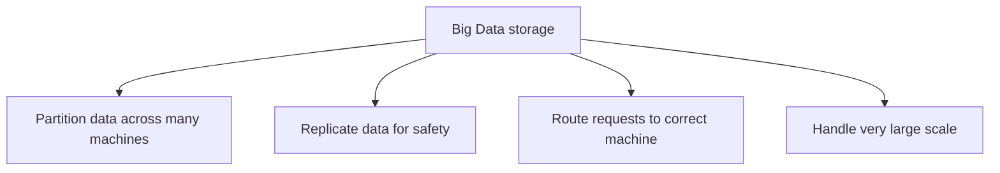
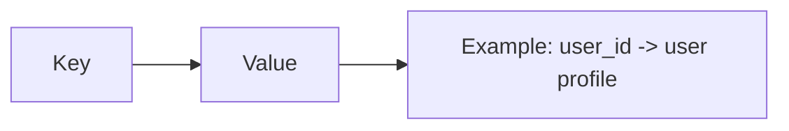
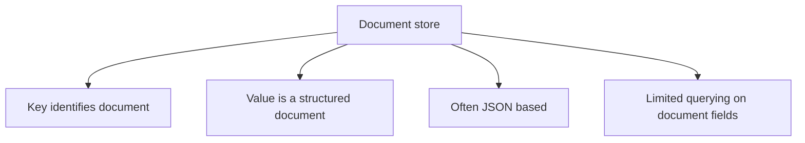
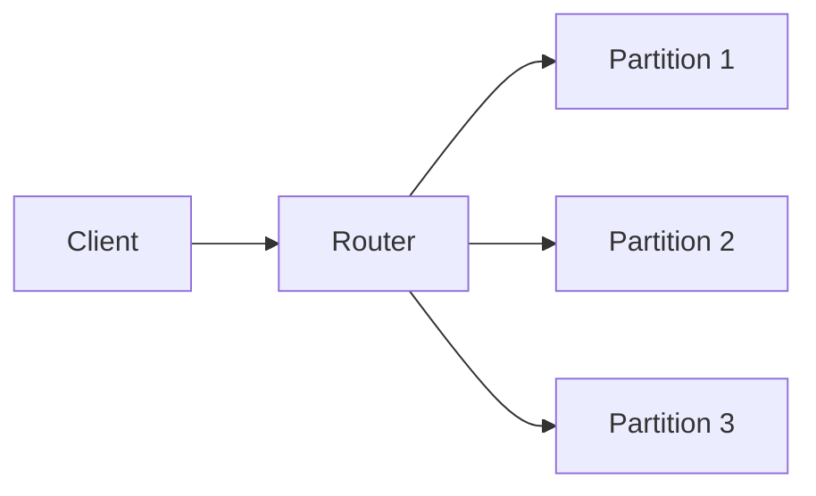

# Chapter 10: Big Data (NoSQL)

**Part:** [Part 2 — SQL & Application Design](../README.md)

> This chapter is paired with [Chapter 8: Complex Data Types](../Chapter-08-Complex-Data-Types/README.md) in the syllabus as a combined topic on non-relational and semi-structured data handling.
>
> **Book-based scope note:** In the attached textbook chapter, the course-relevant part for this note is **10.2 Big Data Storage Systems**, with the main focus on **10.2.3 Key-Value Storage Systems** and **document stores** such as MongoDB. Supporting ideas like **distributed file systems**, **sharding**, and **replication** are included only to help explain how NoSQL systems scale. The rest of the chapter goes on to topics like MapReduce, stream processing, and graph databases, but those are not the focus of this Chapter 10 note.

## Exact Subsections to Read

- **10.2** Big Data Storage Systems
- **10.2.1** Distributed File Systems *(background idea only)*
- **10.2.2** Sharding *(background idea only)*
- **10.2.3** Key-Value Storage Systems *(main focus)*
- **Document stores / MongoDB example** *(main focus within 10.2.3)*
- **10.2.5** Replication and Consistency *(basic idea only)*

---

## 10.2 Big Data Storage Systems

Modern applications often need to handle **huge amounts of data** and **huge numbers of users**. A single machine is often not enough. Because of this, Big Data systems usually store data across **many machines** working together.

A machine in such a cluster is often called a **node**.

### Main idea

Instead of keeping all data in one place, Big Data systems usually:

- **split** the data across many machines
- **copy** important data onto more than one machine
- **send requests** to the correct machine automatically



### Storage systems mentioned in this section

The textbook lists several types of Big Data storage systems:

| System Type | Simple meaning | Why it is used |
|---|---|---|
| **Distributed File System** | Stores large files across many machines | Good for logs, images, large files |
| **Sharding across databases** | Splits records across multiple databases | Helps scale when one database is not enough |
| **Key-Value Store** | Stores data as `key -> value` | Very fast and scalable for simple lookups |
| **Parallel / Distributed Database** | A database spread across multiple machines | Keeps more traditional database features |

For this course note, the main NoSQL idea is the **key-value store**, especially the **document-store version** of it.

---

## 10.2.1 Distributed File Systems

A **distributed file system** stores files across many machines but makes them look like they belong to one file system.

So, to the user or program:
- files still have names
- directories still exist
- the system hides where the actual blocks are stored

This is useful for **very large files**, such as:
- log files
- web pages
- images
- other unstructured data

### Basic idea

Large files are usually:
1. broken into **blocks**
2. stored on different machines
3. **replicated** on multiple machines so a failure does not lose the file

> **Easy summary:** a distributed file system is for storing large files safely across many machines.

---

## 10.2.2 Sharding

**Sharding** means splitting records across multiple database systems.

For example:
- one database may store users `1` to `100000`
- another may store users `100001` to `200000`

Or, instead of ranges, the system may use a **hash function** to decide where each record goes.

### Why sharding is useful

If one database becomes too busy or too large, sharding spreads the load.

### The problem with manual sharding

The textbook explains that if sharding is handled in application code, the application must:
- remember where each piece of data lives
- send each query to the correct database
- handle rebalancing when one database becomes overloaded
- deal with replication and failures

That makes application development harder.

> **Simple takeaway:** sharding helps scaling, but doing it manually is messy. Key-value stores were built to handle this more cleanly.

---

## 10.2.3 Key-Value Storage Systems

This is the main topic for Chapter 10.

A **key-value store** is a storage system where each piece of data is stored with a **key**.

- the **key** is used to identify the record
- the **value** is the data stored for that key

You can think of it like a dictionary or map in programming.



### Core operations

At the center of a key-value store are two simple operations:

```text
put(key, value)   -> store or update a value
get(key)          -> retrieve the value for that key
```

### Example

| Key | Value |
|---|---|
| `220101` | student profile data |
| `220102` | another student profile |
| `45565` | instructor profile |

If the key is `220101`, the system quickly finds the value stored for that key.

### Why key-value stores are used

The textbook gives an important reason: they can handle **very large amounts of data** and **very large numbers of requests** by spreading records across many machines.

Each machine stores only part of the data, and the system automatically sends the request to the correct machine.

### Why they became popular

Many web applications need to store:
- billions of small records
- rapidly changing user data
- simple read/write operations based on an ID

Examples:
- user profile by user ID
- shopping cart by user ID
- session information by session key
- cached data by key

These are exactly the kinds of tasks where key-value stores work very well.

### Examples of key-value stores

The textbook mentions systems such as:
- **Bigtable**
- **HBase**
- **Dynamo**
- **Cassandra**
- **MongoDB**
- **Azure cloud storage**
- **Sherpa / PNUTS**

---

## Why key-value stores are different from relational databases

Key-value stores are powerful for scale, but they are usually **simpler** than full relational databases.

### What they usually give you

- very fast access by key
- easy partitioning across many machines
- replication support
- high scalability

### What they often do **not** fully give you

- full SQL querying
- joins
- rich declarative queries
- full transaction support
- foreign-key constraints

The textbook explains that many systems gave up these features in order to get **better scalability**.

> **Important exam idea:** NoSQL systems often trade some traditional database features for speed and scalability on very large clusters.

### Why the name `NoSQL`?

Originally, these systems were called **NoSQL** because they did not support SQL.

But the book also points out something important: later, many of these systems started adding back features such as:
- better querying
- transaction support
- even SQL-like interfaces in some cases

So today, **NoSQL** usually means "non-traditional database systems designed for large scale," not simply "no SQL at all."

---

## Document Stores

A **document store** is a more structured kind of key-value store.

In a simple key-value store, the value may just be treated as raw bytes. But in a **document store**, the system understands that the value has internal structure.

That means the system can often query parts of the value too.

### Main idea

- each record is stored as a **document**
- the document may follow a format like **JSON**
- the system may allow limited queries on fields inside the document



### MongoDB as an example

The textbook uses **MongoDB** as a document store example.

In MongoDB:
- a database contains **collections**
- a collection stores **documents**
- a document is basically a **JSON object**

### Simple MongoDB example

```javascript
show dbs
use sampledb

db.createCollection("student")
db.createCollection("instructor")

db.student.insert({
  "id": "00128",
  "name": "Zhang",
  "dept_name": "Comp. Sci.",
  "tot_cred": 102,
  "advisors": ["45565"]
})

db.student.insert({
  "id": "12345",
  "name": "Shankar",
  "dept_name": "Comp. Sci.",
  "tot_cred": 32,
  "advisors": ["45565"]
})

db.instructor.insert({
  "id": "45565",
  "name": "Katz",
  "dept_name": "Comp. Sci.",
  "salary": 75000,
  "advisees": ["00128", "12345"]
})

db.student.find()
db.student.findOne({"id": "00128"})
db.student.remove({"dept_name": "Comp. Sci."})
db.student.drop()
```

### What these commands mean

| Command | Meaning |
|---|---|
| `use sampledb` | Open or create the database |
| `createCollection(...)` | Create a collection |
| `insert(...)` | Insert a document |
| `find()` | Show matching documents (or all documents) |
| `findOne(...)` | Return one matching document |
| `remove(...)` | Delete matching documents |
| `drop()` | Delete the whole collection |

### Why document stores are useful

Document stores are useful when data is naturally grouped into one object.

For example, instead of splitting a student's data into many relational tables, one document may store:
- student ID
- name
- department
- list of advisors
- maybe interests, contact info, preferences, etc.

This can reduce the need for joins and can make retrieval simple when the application usually wants the whole object at once.

> **Easy summary:** a document store is like a key-value store where the value is a structured JSON-style document.

---

## Sharding and scaling in MongoDB

The book also explains how MongoDB scales.

MongoDB can run on **multiple machines** as one cluster. The data is then **sharded**, meaning divided across machines.

This is usually done using a **shard key**.

### What is a shard key?

A **shard key** is the attribute used to decide where a document will be stored.

For example, if `dept_name` is the shard key:
- CSE students may go to one machine
- History students may go to another machine

### Why this helps

- storage load is shared
- query load is shared
- the system can keep growing by adding more machines

### Router idea

The textbook says client requests can go to a **router**, which then forwards each request to the right partition.



---

## Replication and Consistency

To make data safer, Big Data systems often keep **multiple copies** of the same data. This is called **replication**.

### Why replication is needed

If one machine fails, another machine may still have a copy of the data.

So replication improves **availability**.

### But replication creates a new problem

If the same data exists in many places, then when you update it:
- all copies should be updated
- all live copies should agree
- reads should ideally return the latest value

This leads to the idea of **consistency**.

### Simple meaning of consistency here

Consistency means:
- all live replicas should have the same value
- reads should see the newest value

### Majority idea

The textbook mentions a common rule: many systems need a **majority of replicas** to be available.

For example:
- with **3 replicas**, at least **2** should be available
- with **5 replicas**, at least **3** should be available

This helps the system keep data correct even when some machines fail.

### Availability vs consistency

A very important Big Data idea is that in the presence of network problems, a distributed system often has to make a **trade-off**:

- prioritize **availability**: keep the system running, even if some reads may be old
- prioritize **consistency**: always return the latest correct value, even if some operations must wait or fail

> **Important concept:** in large distributed systems, you often cannot get perfect availability and perfect consistency at the same time during network partitions. A system has to choose its trade-off.

---

## A practical view: when should you use NoSQL?

The book gives a very practical message: real applications often use a **mix** of systems.

### Use a key-value store when

- access is mostly by key
- the structure is simple or document-based
- very high scalability is needed
- joins are not the main requirement

### Use a relational database when

- you need SQL queries
- you need joins
- you need strong transaction support
- your relationships are important and complex

### Real-world pattern

A system may use:
- a **key-value store** for user profiles, sessions, cached objects
- a **relational database** for more complex queries and transactions

This hybrid approach is very common.

---

## Quick Comparison

| Feature | Relational Database | Key-Value Store | Document Store |
|---|---|---|---|
| Main structure | Tables | `key -> value` | `key -> structured document` |
| Query style | SQL | Mostly by key | By key + limited field queries |
| Joins | Yes | Usually no | Usually limited / no true relational joins |
| Transactions | Strong support | Often limited | Often limited compared to RDBMS |
| Best for | Structured data and complex queries | Very fast simple lookups at huge scale | Flexible JSON-like application data |

### One-line memory aid

- **Relational DB:** best for structured data and rich queries.
- **Key-value store:** best for massive scale and simple lookup by key.
- **Document store:** key-value idea plus structured JSON-like documents.

---

## Syllabus Connection

Introduction to NoSQL databases.

## Board Exam Pattern Mapping

- This chapter is mainly **conceptual**.
- The most likely questions are comparison-style questions such as:
  - **Relational database vs NoSQL database**
  - **Key-value store vs document store**
  - **Why NoSQL systems are used for Big Data applications**
  - **How MongoDB stores data as collections of JSON-like documents**
  - **Why sharding and replication are needed in large-scale systems**
