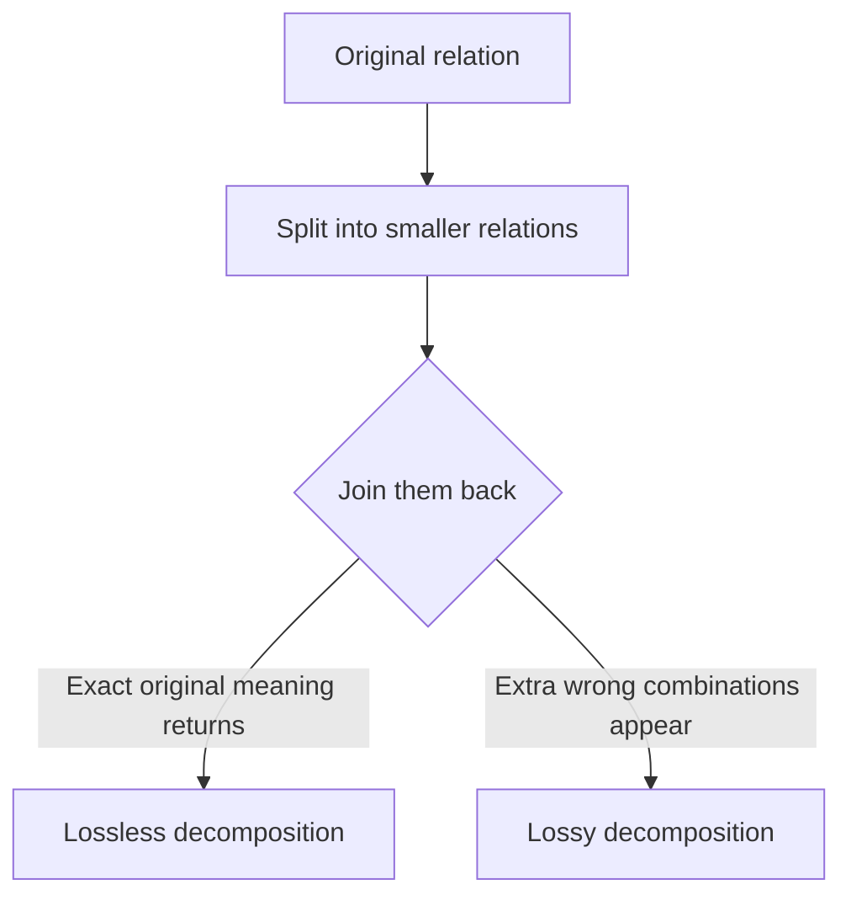
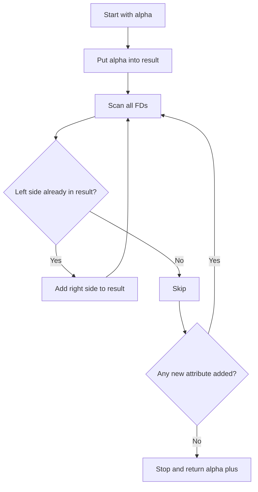
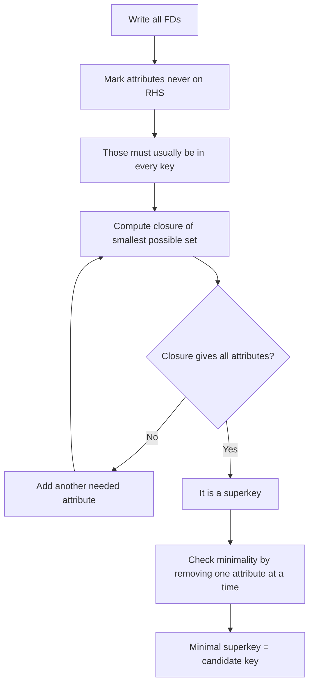
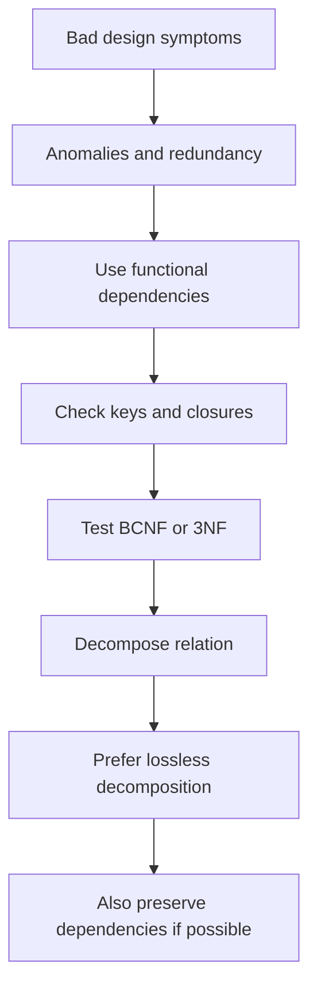

# Chapter 7: Relational Database Design (Normalization)

**Part:** [Part 3 — Schema Design & Normalization](../README.md)
**Textbook:** *Database System Concepts*, 7th Edition — Silberschatz, Korth, Sudarshan

> **Book-based scope note:** For this course note, the relevant part of the textbook chapter is mainly **7.1 to 7.5**.
>
> **Blended-source note:** The overall scope still follows the textbook, but the explanation of **functional dependency**, **Armstrong's rules**, **attribute closure**, and **candidate-key solving** in Sections **7.2** and **7.4** is now aligned **first with the class note**, then blended with textbook terminology.

## Exact Subsections to Read

- **7.1** Features of Good Relational Designs (Understanding insert/update/delete anomalies and lossy vs. lossless decomposition)
- **7.2** Decomposition Using Functional Dependencies (Definition of Functional Dependency)
- **7.3** Normal Forms (Boyce-Codd Normal Form, Third Normal Form, comparing 3NF and BCNF)
- **7.4** Functional-Dependency Theory (Armstrong's Axioms, Closure of FD sets `F+`, Closure of Attribute Sets `α+`, Canonical Cover `Fc`)
- **7.5** Algorithms for Decomposition (Lossless join test, dependency-preserving 3NF and BCNF decomposition)

---

## 7.1 Features of Good Relational Designs

A **good relational design** stores data in a way that:

- avoids unnecessary repetition
- avoids inconsistency
- allows data to be inserted, updated, and deleted safely
- still lets us recover all needed information

The main goal of normalization is simple:

> **Store each fact in the right place, only as many times as necessary.**

### Why bad designs cause problems

The textbook gives the example of combining instructor and department data into one relation:

```text
in_dep(ID, name, salary, dept_name, building, budget)
```

At first this may look convenient, because some queries need fewer joins. But it creates a problem: department information such as `building` and `budget` gets repeated once for every instructor in that department.

That repeated storage creates **anomalies**.

### The three classic anomalies

| Anomaly | Simple meaning | Example idea |
|---|---|---|
| **Update anomaly** | The same fact appears in many rows, so you must update it everywhere | If the CSE department budget changes, every CSE instructor row must be updated |
| **Insert anomaly** | You cannot insert one fact unless another unrelated fact is also available | You cannot insert a new department unless at least one instructor already exists for it |
| **Delete anomaly** | Deleting one row accidentally removes some other useful information | If the last instructor of a department is deleted, the department information may disappear too |

> **Root cause:** all three anomalies happen because different kinds of facts were forced into the same table.

### 7.1.1 Decomposition

The main fix is **decomposition**.

**Decomposition** means splitting one relation into two or more smaller relations.

For example, instead of keeping everything inside `in_dep`, we split it into:

```text
instructor(ID, name, dept_name, salary)
department(dept_name, building, budget)
```

Now:
- instructor facts stay in `instructor`
- department facts stay in `department`
- department details are stored once, not repeated many times

### 7.1.2 Lossless vs. lossy decomposition

Not every decomposition is good. Some decompositions lose information.

#### Lossless decomposition

A decomposition is **lossless** if we can join the smaller relations back together and get exactly the original information.

#### Lossy decomposition

A decomposition is **lossy** if joining the smaller relations creates extra, incorrect rows or loses the original meaning.

The textbook gives a bad decomposition example:

```text
employee(ID, name, street, city, salary)
```

badly decomposed into:

```text
employee1(ID, name)
employee2(name, street, city, salary)
```

This is dangerous because two different employees can have the same `name`. If both are named Kim, then joining on `name` can mix their data incorrectly.



> **Easy memory rule:** A decomposition is good only if it is **lossless**.

### 7.1.3 Normalization theory

Normalization is the step-by-step process of improving a relational design.

The overall idea is:

1. Check whether a relation is in a good normal form.
2. If not, decompose it into smaller relations.
3. Make sure the decomposition is **lossless**.
4. Prefer designs that also preserve important dependencies.

---

## 7.2 Decomposition Using Functional Dependencies

To normalize properly, we need some formal way to describe the rules of the real world.

That is what **functional dependencies (FDs)** are for.

> **Class-note priority:** The explanation below follows the class-note style first: definition, determinant/dependent, simple table checking, FD types, Armstrong's rules, and step-by-step closure solving.

### 7.2.1 What is a functional dependency?

When you see:

```text
X → Y
```

it means:

> **`Y` functionally depends on `X`.**
>
> Or in simple words: **if two rows have the same value of `X`, then they must also have the same value of `Y`.**

In this notation:

- `X` is called the **determinant**
- `Y` is called the **dependent**

### Formal definition in simple words

A functional dependency `X → Y` is true on a relation `R` if for any two tuples `t1` and `t2`:

```text
if t1[X] = t2[X], then t1[Y] = t2[Y]
```

That is the exact idea written in the class note, just in a cleaner form.

### The class-note style example: `Student`

In class, FD was explained using a small student-style relation. Below is a cleaned version of the same type of example so the logic becomes easier to see.

```text
Student(RNo, Name, Marks, Dept, Course)
```

| RNo | Name | Marks | Dept | Course |
|---|---|---:|---|---|
| 1 | a | 28 | CSE | C1 |
| 2 | b | 60 | EEE | C1 |
| 3 | a | 78 | IT | C2 |
| 4 | b | 65 | EEE | C2 |
| 5 | c | 80 | IT | C3 |
| 6 | d | 80 | EEE | C2 |

Now use this table to test whether an FD is true or false.

#### Example 1: `RNo → Name, Marks, Dept, Course`

This is **true**.

Why?
- `RNo` is unique in every row.
- So if two rows have the same `RNo`, they are really the same row.
- That means `RNo` fixes all the other attributes.

#### Example 2: `Name → Course`

This is **false** in the table above.

Why?
- `Name = a` appears in two rows.
- But the corresponding `Course` values are `C1` and `C2`.
- Same left side, different right side -> FD fails.

#### Example 3: `Marks → Dept`

This is **false**.

Why?
- `Marks = 80` appears twice.
- One row has `Dept = IT` and the other has `Dept = EEE`.
- So `Marks` does not determine `Dept`.

#### Example 4: `(Name, Marks, Dept) → RNo`

This is **true** in the sample table.

Why?
- No two rows share the same full combination of `(Name, Marks, Dept)`.
- So that full combination points to exactly one `RNo`.

### A very important class-note observation

The class note says:

> **If every value of `X` is unique, then `X → Y` must hold.**

This is correct as an **instance-level idea**.

In simple words:
- if the left side is unique in the table,
- then it automatically determines the right side in that table.

That is exactly why a **key** determines other attributes.

---

### 7.2.2 Types of functional dependency

The class note first divides FDs into **trivial** and **non-trivial**. We keep that style here, with one small textbook clarification.

#### 1. Trivial functional dependency

An FD `X → Y` is **trivial** if:

```text
Y ⊆ X
```

That means the right side is already contained in the left side.

Examples:

```text
A → A
AB → A
(RNo, Name) → Name
```

These are always true.

#### 2. Non-trivial functional dependency

An FD `X → Y` is **non-trivial** if the right side is **not already contained** in the left side.

Textbook form:

```text
Y ⊄ X
```

Examples:

```text
RNo → Name
Dept → Course
A → B
```

#### 3. Completely non-trivial functional dependency

The class note writes the strict no-overlap case as:

```text
X ∩ Y = ∅
```

This is usually called **completely non-trivial** in textbook language.

Example:

```text
RNo → Name
```

because `RNo` and `Name` do not overlap.

> **Easy exam-safe summary:**
>
> - **Trivial:** RHS is already inside LHS
> - **Non-trivial:** RHS is not inside LHS
> - **Completely non-trivial:** LHS and RHS have no common attribute at all

---

### 7.2.3 Keys and functional dependencies

A **superkey** identifies a whole row uniquely.
A **functional dependency** may identify only some attributes.

| Concept | Meaning |
|---|---|
| **Superkey** | A set of attributes that uniquely identifies each tuple |
| **Candidate key** | A minimal superkey |
| **Primary key** | One chosen candidate key |
| **Functional dependency** | A rule of the form `X → Y` meaning `X` determines `Y` |

### Superkey as a special case of FD

A superkey is really just a special kind of functional dependency.

If `K` is a superkey for relation `R`, then:

```text
K → all attributes of R
```

So you can think of a superkey as a very strong FD whose right side is the whole relation.

### The fastest beginner trick for candidate keys

In exam problems, this trick is very useful:

1. **Find attributes that never appear on the right-hand side** of any FD.
2. These attributes usually **must** be present in every candidate key.
3. Compute closure.
4. Remove extra attributes if possible.

We will use this trick in the worked closure examples below.

---

### 7.2.4 Lossless decomposition and functional dependencies

Functional dependencies help us test whether a decomposition is lossless.

Suppose a relation `R` is decomposed into `R1` and `R2`.
The decomposition is **lossless** if at least one of these is true:

```text
R1 ∩ R2 → R1
```
or
```text
R1 ∩ R2 → R2
```

### Simple meaning

The attributes common to both relations must be enough to identify all tuples of at least one side.

### Example

The decomposition:

```text
instructor(ID, name, dept_name, salary)
department(dept_name, building, budget)
```

has common attribute:

```text
dept_name
```

and because:

```text
dept_name → building, budget
```

`dept_name` acts like a key for `department`, so the decomposition is **lossless**.

> **Easy rule:** If the common part works like a key for one of the two pieces, the decomposition is lossless.

---

## 7.3 Normal Forms

A **normal form** is simply a standard that tells us whether a relation design is good enough or still has avoidable redundancy.

The textbook mainly focuses on **BCNF** and **3NF**.

### 7.3.1 Boyce-Codd Normal Form (BCNF)

BCNF is one of the strongest and cleanest normal forms based on functional dependencies.

A relation is in **BCNF** if for every nontrivial FD:

```text
X → Y
```

`X` must be a **superkey**.

### Simple meaning of BCNF

If some attribute set determines something else, then that determining set should be strong enough to identify the whole row.

If it is not, the relation has hidden redundancy.

### Example: not in BCNF

```text
in_dep(ID, name, salary, dept_name, building, budget)
```

Here:

```text
dept_name → building, budget
```

But `dept_name` is **not** a superkey of `in_dep`, because many instructors can belong to the same department.

So `in_dep` is **not in BCNF**.

### BCNF decomposition idea

When a relation is not in BCNF:

1. find a violating FD `X → Y`
2. split the relation using that dependency
3. repeat until every relation satisfies BCNF

### 7.3.1.2 BCNF and dependency preservation

BCNF removes more redundancy, but it has one important drawback:

> A BCNF decomposition may fail to preserve all functional dependencies in an easy-to-check way.

The textbook shows this with the `dept_advisor` example.

Suppose:

```text
dept_advisor(s_ID, i_ID, dept_name)
```

with FDs:

```text
i_ID → dept_name
s_ID, dept_name → i_ID
```

Because `i_ID` is not a superkey, this relation is not in BCNF.

A BCNF decomposition gives:

```text
(s_ID, i_ID)
(i_ID, dept_name)
```

This removes the BCNF violation, but now the dependency:

```text
s_ID, dept_name → i_ID
```

cannot be checked inside a single relation. To test it, you would need a join.

This means the BCNF decomposition is **not dependency-preserving**.

### 7.3.2 Third Normal Form (3NF)

3NF is slightly weaker than BCNF.

A relation is in **3NF** if for every nontrivial FD:

```text
X → Y
```

at least one of these is true:

1. `X` is a superkey, or
2. every attribute in `Y - X` is part of some candidate key

### Simple meaning of 3NF

3NF allows a small amount of dependency that BCNF does not allow, but only in a controlled way.

That small relaxation is useful because it helps us preserve dependencies.

### Example idea

The textbook's `dept_advisor` example is not in BCNF, but it **is in 3NF** because `dept_name` is part of a candidate key.

So 3NF accepts some designs that BCNF rejects.

### 7.3.3 BCNF vs. 3NF

| Point | BCNF | 3NF |
|---|---|---|
| Redundancy removal | Stronger | Slightly weaker |
| Dependency preservation | Not always preserved | Can always be preserved in decomposition |
| Lossless decomposition | Yes | Yes |
| Practical trade-off | Cleaner design | Easier constraint checking |

### Which one is better?

The answer is:

- If you can get **BCNF** without losing important dependency preservation, that is usually better.
- If BCNF breaks dependency preservation badly, then **3NF** may be the better practical choice.

> **Exam sentence:** BCNF is stronger, but 3NF is often preferred when dependency preservation matters.

### Quick exam bridge: 1NF and 2NF

The textbook discussion here mainly centers on BCNF and 3NF, but board exams may still ask about **1NF** and **2NF**.

| Normal Form | Easy meaning |
|---|---|
| **1NF** | All attribute values are atomic (no repeating groups inside one cell) |
| **2NF** | In a relation with a composite candidate key, no non-prime attribute should depend on only part of the key |
| **3NF** | No problematic transitive dependency on non-key data; formally, every FD must satisfy the 3NF condition |
| **BCNF** | Every determinant must be a superkey |

> **Simple ladder to remember:** `1NF -> 2NF -> 3NF -> BCNF`, where each step is stricter than the previous one.

---

## 7.4 Functional-Dependency Theory

This section is about how to **reason** with FDs.

> **Class-note priority:** The first focus here is the class-note pattern: Armstrong's rules, closure, candidate key finding, and step-by-step worked examples.

### 7.4.1 Closure of a set of functional dependencies: `F+`

If you are given some FDs, other FDs may be logically implied by them.

The set of **all** FDs implied by `F` is called **`F+`**.

For example, if:

```text
A → B
B → C
```

then we can infer:

```text
A → C
```

So `A → C` is in `F+`.

---

### Armstrong's Axioms / Inference Rules

These are the main rules used to derive new FDs.

#### 1. Reflexivity rule

If `Y ⊆ X`, then:

```text
X → Y
```

Examples:

```text
A → A
AB → A
(RNo, Name) → Name
```

#### 2. Transitivity rule

If:

```text
X → Y
Y → Z
```

then:

```text
X → Z
```

Example:

```text
A → B
B → C
therefore A → C
```

#### 3. Augmentation rule

If:

```text
X → Y
```

then for any `Z`:

```text
XZ → YZ
```

Class-note style example:

If:

```text
RNo → Marks
```

then adding `Name` to both sides gives:

```text
RNo, Name → Marks, Name
```

#### 4. Union rule

If:

```text
X → Y
X → Z
```

then:

```text
X → YZ
```

Example:

```text
RNo → Name
RNo → Marks
therefore RNo → Name, Marks
```

#### 5. Decomposition rule

If:

```text
X → YZ
```

then:

```text
X → Y
X → Z
```

Example:

```text
RNo → Name, Marks, Dept
```

can be split into:

```text
RNo → Name
RNo → Marks
RNo → Dept
```

#### 6. Pseudotransitivity rule

If:

```text
X → Y
YZ → A
```

then:

```text
XZ → A
```

A small symbolic example is usually the easiest way to remember this one.

> **Easy memory tip:**
>
> - **Reflexivity** = subset rule
> - **Transitivity** = chain rule
> - **Augmentation** = add same thing to both sides
> - **Union** = combine RHS values
> - **Decomposition** = split RHS values
> - **Pseudotransitivity** = mixed chain rule

---

### 7.4.2 Closure of an attribute set: `α+`

The **closure of an attribute set** `α`, written `α+`, means:

> all attributes that can be determined from `α` using the given FDs.

This is one of the most important tools in normalization.

### Why `α+` matters

We use attribute closure to:

- test whether a set is a **superkey**
- test whether an FD `X → Y` holds
- help find **candidate keys**
- help test BCNF/3NF conditions

### How to compute `α+`

A simple method:

1. start with `result = α`
2. look through the FDs
3. if the left side of an FD is already inside `result`, add the right side to `result`
4. repeat until nothing new can be added



---

## Worked Examples in the Class-Note Solving Style

### Example 1 — Find the closure and identify the key

Given:

```text
R(A, B, C, D, E)
F = {A → B, B → C, C → D, D → E}
```

#### Find `A+`

Start with:

```text
A+ = {A}
```

| Step | Reason | Closure so far |
|---|---|---|
| Start | Begin with `A` | `{A}` |
| 1 | `A → B` | `{A, B}` |
| 2 | `B → C` | `{A, B, C}` |
| 3 | `C → D` | `{A, B, C, D}` |
| 4 | `D → E` | `{A, B, C, D, E}` |

So:

```text
A+ = {A, B, C, D, E}
```

That is **all attributes of the relation**.
So:

- `A` is a **superkey**
- since `A` is already a single attribute, it is also a **candidate key**

#### Find `B+`

Start with:

```text
B+ = {B}
```

| Step | Reason | Closure so far |
|---|---|---|
| Start | Begin with `B` | `{B}` |
| 1 | `B → C` | `{B, C}` |
| 2 | `C → D` | `{B, C, D}` |
| 3 | `D → E` | `{B, C, D, E}` |

So:

```text
B+ = {B, C, D, E}
```

`A` is missing, so `B` is **not** a superkey.

#### What about `AD+`?

Yes, `AD+` also gives all attributes.
But it is **not** a candidate key, because `A` alone already works.
So `AD` is only a **superkey**, not a minimal one.

> **Important rule:**
>
> - **Superkey** = closure gives all attributes
> - **Candidate key** = closure gives all attributes **and** no proper subset can do that

---

### Example 2 — Find all candidate keys

Given:

```text
R(A, B, C, D)
F = {A → B, B → C, C → A}
```

### Step 1: Find attributes that never appear on the RHS

Right-hand sides are:

```text
{B, C, A}
```

So `D` never appears on the right-hand side.
That means:

> `D` must be part of **every** candidate key.

### Step 2: Compute small closures

#### `A+`

```text
A+ = {A}
A → B  => {A, B}
B → C  => {A, B, C}
```

So:

```text
A+ = {A, B, C}
```

Still missing `D`.
So `A` alone is not a superkey.

#### `B+`

```text
B+ = {B}
B → C  => {B, C}
C → A  => {B, C, A}
```

So:

```text
B+ = {A, B, C}
```

Still missing `D`.

#### `C+`

```text
C+ = {C}
C → A  => {C, A}
A → B  => {C, A, B}
```

So:

```text
C+ = {A, B, C}
```

Still missing `D`.

### Step 3: Add `D`

#### `AD+`

Start with `{A, D}`:

```text
A → B  => {A, D, B}
B → C  => {A, D, B, C}
```

So:

```text
AD+ = {A, B, C, D}
```

Hence `AD` is a superkey.

Check minimality:
- `A+` is not all attributes
- `D+ = {D}` only

So `AD` is a **candidate key**.

#### `BD+`

Start with `{B, D}`:

```text
B → C  => {B, D, C}
C → A  => {B, D, C, A}
```

So:

```text
BD+ = {A, B, C, D}
```

`BD` is also a **candidate key**.

#### `CD+`

Start with `{C, D}`:

```text
C → A  => {C, D, A}
A → B  => {C, D, A, B}
```

So:

```text
CD+ = {A, B, C, D}
```

`CD` is also a **candidate key**.

### Final answer for Example 2

Candidate keys are:

```text
AD, BD, CD
```

Since every attribute appears in at least one candidate key, all of them are **prime attributes**.

---

### Example 3 — Another candidate-key problem from the class-note style

Given:

```text
R(A, B, C, D)
F = {AB → CD, D → B, C → A}
```

We now check likely small combinations.

#### `AB+`

Start with `{A, B}`:

```text
AB → CD  => {A, B, C, D}
```

So:

```text
AB+ = {A, B, C, D}
```

Thus `AB` is a superkey.

Check minimality:
- `A+ = {A}`
- `B+ = {B}`

So `AB` is a **candidate key**.

#### `CD+`

Start with `{C, D}`:

```text
C → A   => {C, D, A}
D → B   => {C, D, A, B}
```

So:

```text
CD+ = {A, B, C, D}
```

Check subsets:
- `C+ = {C, A}`
- `D+ = {D, B}`

Neither is enough.
So `CD` is a **candidate key**.

#### `AD+`

Start with `{A, D}`:

```text
D → B    => {A, D, B}
AB → CD  => {A, D, B, C}
```

So:

```text
AD+ = {A, B, C, D}
```

Check subsets:
- `A+ = {A}`
- `D+ = {D, B}`

So `AD` is also a **candidate key**.

### Final answer for Example 3

Candidate keys are:

```text
AB, CD, AD
```

---

### A fast exam method for candidate-key questions

Use this whenever the question says **find the candidate key**.



### Short memory rules

- If `X+` gives all attributes -> `X` is a **superkey**
- If `X+` gives all attributes **and no smaller subset works** -> `X` is a **candidate key**
- Attributes that never appear on RHS are very important -> they usually must be in every key

---

### 7.4.3 Canonical cover: `Fc`

A **canonical cover** is a simplified version of the FD set that still means the same thing.

It is useful because checking a smaller clean FD set is easier than checking a messy one.

### Goal of canonical cover

We want a set of FDs that:

- has the same meaning as the original set
- has no unnecessary attributes
- has no unnecessary duplication

### Extraneous attribute

An attribute is **extraneous** if removing it does not change the meaning of the FD set.

Examples:
- extra attribute on the left side -> maybe not needed to determine the right side
- extra attribute on the right side -> maybe already implied by other dependencies

### Simple steps to build a canonical cover

1. **Combine** FDs that have the same left side
2. **Remove extraneous attributes**
3. **Remove redundant dependencies**
4. Repeat until nothing more can be simplified

### Easy way to understand it

A canonical cover is like cleaning a formula sheet:
- merge repeated lines
- remove useless symbols
- keep only what is truly necessary

> **Scope note:** The class note focused much more on FD definition, Armstrong's rules, closure, and candidate keys. So for canonical cover, the textbook summary is kept brief here.

---

### 7.4.4 Dependency preservation

After decomposition, we want to know:

> Can the original dependencies still be checked from the new relations without doing expensive joins?

If yes, the decomposition is **dependency-preserving**.

### Simple meaning

A decomposition is dependency-preserving if the important rules of the original relation are still enforceable using the decomposed relations.

### Why it matters

If a dependency is not preserved, then to test it you may need to join tables first.
That makes checking constraints more expensive and more complicated.

### Easy memory rule

- **Lossless** asks: *Did we lose information?*
- **Dependency-preserving** asks: *Did we lose easy enforceability of rules?*

These are related, but they are **not the same thing**.

---

## 7.5 Algorithms for Decomposition Using Functional Dependencies

The book finally gives algorithm-style ways to normalize relations.

### 7.5.1 BCNF decomposition

#### Testing for BCNF

To check whether a relation is in BCNF:

1. take each nontrivial FD `X → Y`
2. compute `X+`
3. if `X+` does not contain all attributes of the relation, then `X` is not a superkey
4. so BCNF is violated

### BCNF decomposition algorithm — plain-language version

If a relation `R` is not in BCNF:

1. find a violating FD `X → Y`
2. decompose `R` into:
   - `X ∪ Y`
   - `R - (Y - X)`
3. repeat on the new relations until every one is in BCNF

### What BCNF decomposition guarantees

- it gives a **lossless** decomposition
- but it may **not preserve all dependencies**

### Textbook-style example idea

The textbook uses a big `class(...)` relation and decomposes it into:

- `course(course_id, title, dept_name, credits)`
- `classroom(building, room_number, capacity)`
- `section(course_id, sec_id, semester, year, building, room_number, time_slot_id)`

This is a good example of repeatedly splitting one large relation into cleaner BCNF relations.

---

### 7.5.2 3NF decomposition

The 3NF decomposition algorithm is designed to solve a practical problem:

> get a decomposition that is both **lossless** and **dependency-preserving**.

### Plain-language version of the 3NF algorithm

1. Compute a **canonical cover** `Fc`
2. For each FD `X → Y` in `Fc`, create a relation containing `X ∪ Y`
3. If none of the created relations contains a **candidate key**, add one more relation containing a candidate key
4. If one relation is fully contained inside another, remove the smaller duplicate one

### What 3NF decomposition guarantees

- **lossless decomposition**
- **dependency preservation**
- not always BCNF, but often more practical

### BCNF vs 3NF algorithm in one line

| Algorithm | Guaranteed result |
|---|---|
| **BCNF decomposition** | Lossless + stronger normalization |
| **3NF decomposition** | Lossless + dependency-preserving |

> **Simple exam conclusion:** BCNF is cleaner, but 3NF is the safer choice when preserving dependencies is important.

---

## Quick Summary of the Whole Chapter



### Final memory checklist

- **FD:** `X → Y` means `X` determines `Y`
- **Determinant:** left side of an FD
- **Dependent:** right side of an FD
- **Trivial FD:** RHS already inside LHS
- **Superkey:** determines the whole tuple
- **Candidate key:** minimal superkey
- **Lossless decomposition:** no information loss
- **Dependency-preserving decomposition:** dependencies remain easy to enforce
- **BCNF:** every determinant is a superkey
- **3NF:** slightly weaker than BCNF, but preserves dependencies better
- **`α+`** helps test superkeys and FDs
- **Canonical cover** simplifies the FD set

---

## Syllabus Connection

Functional dependencies, normalization, normal forms (1NF, 2NF, 3NF, BCNF), and candidate key identification.

## Board Exam Pattern Mapping

- **Question 3(d) (2024 Exam):** Finding the Candidate Key of a relation schema `R(A,B,C,D,E,H)` with a functional dependency set by computing attribute closure.
- **Question 4(a) (2024 Exam):** Justifying whether **BCNF** is always preferable to **3NF**, using the trade-off between redundancy removal and dependency preservation.
- **Question 4(c) (2024 Exam):** Determining the normal form (`1NF`, `2NF`, `3NF`, or `BCNF`) of a relation under a given FD set.
- **Question 3(b) (2023 Exam):** Describing insert, update, and delete anomalies using a badly designed combined relation.
